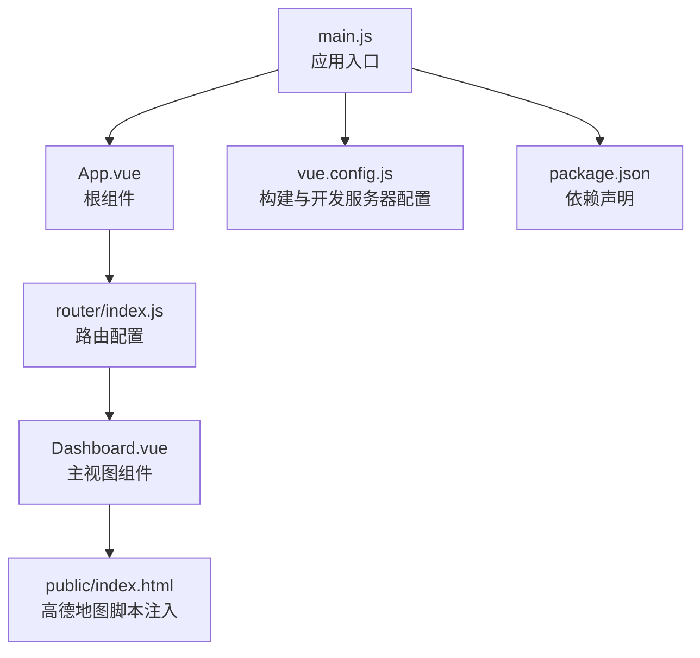
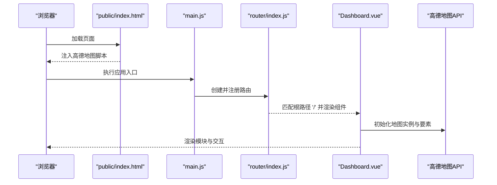
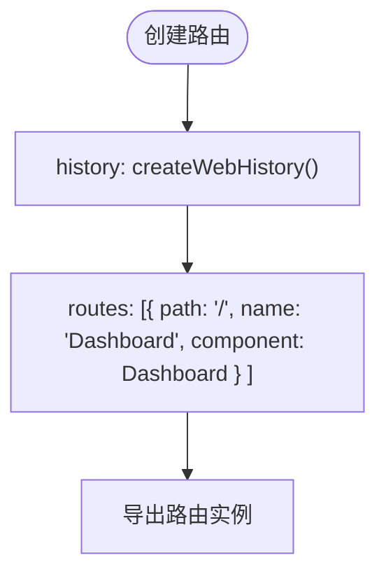
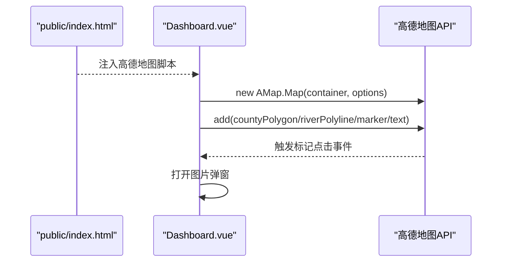
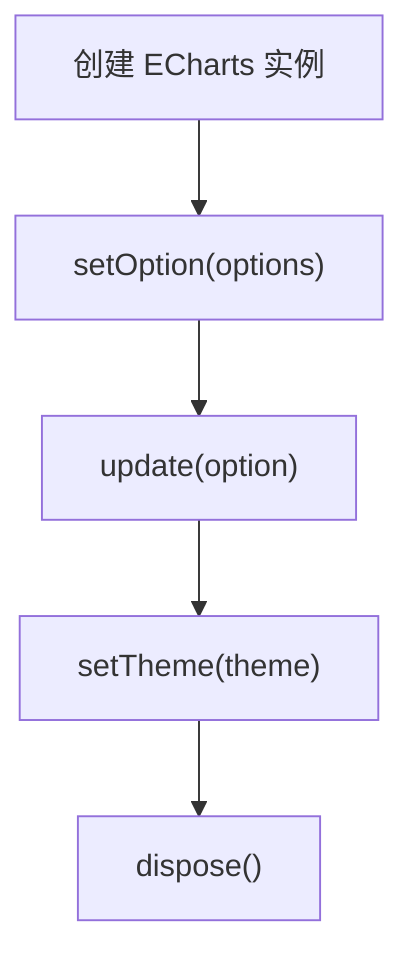
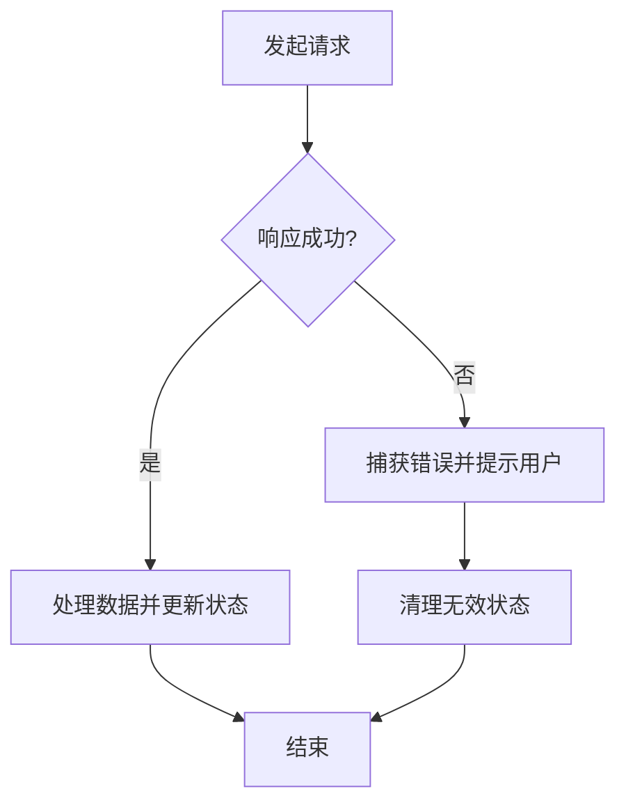
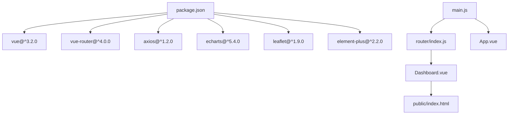

# API参考

<cite>
**本文引用的文件**
- [Dashboard.vue](file://dashboard-app/src/views/Dashboard.vue)
- [index.js](file://dashboard-app/src/router/index.js)
- [main.js](file://dashboard-app/src/main.js)
- [package.json](file://dashboard-app/package.json)
- [vue.config.js](file://dashboard-app/vue.config.js)
- [index.html](file://dashboard-app/public/index.html)
- [App.vue](file://dashboard-app/src/App.vue)
</cite>

## 目录
1. [简介](#简介)
2. [项目结构](#项目结构)
3. [核心组件](#核心组件)
4. [架构总览](#架构总览)
5. [详细组件分析](#详细组件分析)
6. [依赖关系分析](#依赖关系分析)
7. [性能考量](#性能考量)
8. [故障排查指南](#故障排查指南)
9. [结论](#结论)
10. [附录](#附录)

## 简介
本文件为“宜川县域监测体系整合平台”的API参考文档，聚焦以下方面：
- Dashboard.vue 组件的公共接口（props、methods、computed、events）
- Vue Router 路由配置的API与使用方法
- 高德地图API集成的接口与配置要点
- ECharts 图表组件的API参考与配置参数
- Axios 网络请求接口说明与错误处理机制
- 第三方集成的接口规范与使用示例

目标是帮助开发者准确理解并使用所有公开接口，快速完成二次开发与集成。

## 项目结构
该应用采用 Vue 3 + Vue Router 的前端单页应用（SPA），通过路由将根组件渲染到页面中。项目核心文件如下：
- 应用入口：main.js
- 根组件：App.vue
- 路由定义：router/index.js
- 主视图组件：views/Dashboard.vue
- 构建配置：vue.config.js
- 依赖声明：package.json
- 页面模板与高德地图脚本注入：public/index.html

**图表来源**
- [main.js](file://dashboard-app/src/main.js#L1-L5)
- [App.vue](file://dashboard-app/src/App.vue#L1-L40)
- [index.js](file://dashboard-app/src/router/index.js#L1-L17)
- [Dashboard.vue](file://dashboard-app/src/views/Dashboard.vue#L1-L175)
- [index.html](file://dashboard-app/public/index.html#L1-L27)
- [vue.config.js](file://dashboard-app/vue.config.js#L1-L19)
- [package.json](file://dashboard-app/package.json#L1-L23)

**章节来源**
- [main.js](file://dashboard-app/src/main.js#L1-L5)
- [App.vue](file://dashboard-app/src/App.vue#L1-L40)
- [index.js](file://dashboard-app/src/router/index.js#L1-L17)
- [Dashboard.vue](file://dashboard-app/src/views/Dashboard.vue#L1-L175)
- [index.html](file://dashboard-app/public/index.html#L1-L27)
- [vue.config.js](file://dashboard-app/vue.config.js#L1-L19)
- [package.json](file://dashboard-app/package.json#L1-L23)

## 核心组件
本节对 Dashboard.vue 的公共接口进行系统梳理，便于第三方集成与二次开发。

- 组件名称：Dashboard
- 作用域：全局单页应用的主视图，承载视频监控墙、视频会议、气象云图、土壤墒情监测等模块
- 依赖：高德地图API（通过 public/index.html 注入）、Element Plus（package.json 中声明）

**章节来源**
- [Dashboard.vue](file://dashboard-app/src/views/Dashboard.vue#L177-L496)
- [package.json](file://dashboard-app/package.json#L14-L22)
- [index.html](file://dashboard-app/public/index.html#L9-L10)

## 架构总览
下图展示了从浏览器加载到组件挂载的关键流程，以及与外部服务（高德地图）的交互路径。

**图表来源**
- [index.html](file://dashboard-app/public/index.html#L9-L10)
- [main.js](file://dashboard-app/src/main.js#L1-L5)
- [index.js](file://dashboard-app/src/router/index.js#L1-L17)
- [Dashboard.vue](file://dashboard-app/src/views/Dashboard.vue#L256-L266)

## 详细组件分析

### Dashboard.vue 公共接口

- 组件名：Dashboard
- 用途：承载多个监测模块的可视化与交互控制

#### Props 属性
- 无对外 props 属性。组件内部通过 data/computed/methods 完成状态管理与行为控制。

**章节来源**
- [Dashboard.vue](file://dashboard-app/src/views/Dashboard.vue#L177-L496)

#### data 数据字段
- videoList：视频监控点位列表（含 id、name、location、image、caption）
- allParticipants：视频会议参会单位列表（含 id、name、status）
- weatherData：气象数据项集合（含 type、label、value）
- selectedLocation：当前选中的地点（用于土壤墒情模块）
- soilData：土壤监测指标集合（含氮、磷、钾、pH、电导率、水分、温度及其单位）
- videoMap：高德地图实例
- showImageModal：是否显示图片弹窗
- modalImageSrc/modalImageCaption：弹窗图片资源与标题
- currentDate/currentTime：当前日期与时间
- isSettingsModalVisible：是否显示设置弹窗
- inputUrl：设置弹窗输入的URL
- weatherChartUrl：气象云图 iframe 的源URL

**章节来源**
- [Dashboard.vue](file://dashboard-app/src/views/Dashboard.vue#L180-L239)

#### computed 计算属性
- participantRows：将 allParticipants 转换为 3 行 × 2 列的二维数组，用于视频会议模块的滚动展示。

**章节来源**
- [Dashboard.vue](file://dashboard-app/src/views/Dashboard.vue#L240-L254)

#### methods 方法
- showVideoImage(video)：根据视频缩略图触发图片弹窗
- initModulesWidth()：初始化模块容器宽度，确保横向滚动
- initMaps()/initVideoMap()：初始化视频监控地图，添加县域边界、河流、水库、乡镇标注与监控点位标记；为标记绑定点击事件以打开图片弹窗
- addCountyBoundary(map)：绘制宜川县边界多边形、主要河流线与水库、乡镇标注
- showImageModalFunc(imageSrc, caption)/closeImageModal()：弹窗显示与关闭逻辑
- updateDateTime()：更新日期与时间显示
- showSettingsModal()/closeSettingsModal()/confirmUrl()：设置弹窗的显示、关闭与确认逻辑；校验输入URL有效性后写入 weatherChartUrl
- isValidUrl(string)：验证字符串是否为有效URL

**章节来源**
- [Dashboard.vue](file://dashboard-app/src/views/Dashboard.vue#L267-L482)

#### events 事件
- 组件未显式声明 emits。但内部通过高德地图事件（如 Marker 的 click）触发内部方法，从而间接产生“点击标记打开图片弹窗”的交互效果。

**章节来源**
- [Dashboard.vue](file://dashboard-app/src/views/Dashboard.vue#L334-L337)

#### 生命周期钩子
- mounted：初始化模块宽度、地图、时间显示；每秒更新一次时间
- beforeUnmount：清理定时器与地图实例，避免内存泄漏

**章节来源**
- [Dashboard.vue](file://dashboard-app/src/views/Dashboard.vue#L256-L266)
- [Dashboard.vue](file://dashboard-app/src/views/Dashboard.vue#L485-L494)

#### 模板与样式
- 模板包含四个模块区域：视频监控墙、视频会议、气象云图、土壤墒情监测
- 弹窗与设置弹窗用于增强交互体验
- 样式采用深色科技蓝主题，适配大屏与高分辨率显示

**章节来源**
- [Dashboard.vue](file://dashboard-app/src/views/Dashboard.vue#L1-L175)
- [Dashboard.vue](file://dashboard-app/src/views/Dashboard.vue#L498-L1309)

### Vue Router 路由配置 API

- 路由创建方式：createRouter + createWebHistory
- 路由表 routes：包含根路径 '/'，指向 Dashboard 组件
- 导出 router 实例供应用挂载使用

**图表来源**
- [index.js](file://dashboard-app/src/router/index.js#L1-L17)

**章节来源**
- [index.js](file://dashboard-app/src/router/index.js#L1-L17)
- [main.js](file://dashboard-app/src/main.js#L1-L5)

### 高德地图 API 集成

- 资源注入：在 public/index.html 中通过 script 标签引入高德地图 JSAPI
- 版本与密钥：v=1.4.15，key=02e64e2db0082778e636b8d9c95363e1
- 组件内调用：在 mounted 生命周期中初始化地图实例，添加边界、河流、水库、乡镇标注与监控点位标记，并为标记绑定点击事件

**图表来源**
- [index.html](file://dashboard-app/public/index.html#L9-L10)
- [Dashboard.vue](file://dashboard-app/src/views/Dashboard.vue#L283-L341)
- [Dashboard.vue](file://dashboard-app/src/views/Dashboard.vue#L334-L337)

**章节来源**
- [index.html](file://dashboard-app/public/index.html#L9-L10)
- [Dashboard.vue](file://dashboard-app/src/views/Dashboard.vue#L283-L341)
- [Dashboard.vue](file://dashboard-app/src/views/Dashboard.vue#L345-L420)

### ECharts 图表组件 API 参考

- 依赖声明：package.json 中包含 echarts
- 当前实现：Dashboard.vue 通过 iframe 方式嵌入外部气象云图，未直接在组件内使用 ECharts API
- 若需扩展：可按 ECharts 官方 API 进行实例化、配置项设置、数据更新与主题切换

**图表来源**
- [package.json](file://dashboard-app/package.json#L18-L18)
- [Dashboard.vue](file://dashboard-app/src/views/Dashboard.vue#L80-L85)

**章节来源**
- [package.json](file://dashboard-app/package.json#L18-L18)
- [Dashboard.vue](file://dashboard-app/src/views/Dashboard.vue#L80-L85)

### Axios 网络请求接口说明与错误处理

- 依赖声明：package.json 中包含 axios
- 当前实现：Dashboard.vue 未直接使用 axios 发起网络请求
- 错误处理建议：若后续接入后端接口，建议统一拦截器处理错误码与异常提示，并在组件内通过 try/catch 或 Promise.catch 处理失败场景

**图表来源**
- [package.json](file://dashboard-app/package.json#L20-L20)
- [Dashboard.vue](file://dashboard-app/src/views/Dashboard.vue#L1-L175)

**章节来源**
- [package.json](file://dashboard-app/package.json#L20-L20)
- [Dashboard.vue](file://dashboard-app/src/views/Dashboard.vue#L1-L175)

### 第三方集成接口规范与使用示例

- 高德地图集成
  - 资源注入：在页面头部引入高德地图脚本
  - 组件内初始化：在 mounted 中创建地图实例并添加要素
  - 事件绑定：为标记绑定点击事件以触发内部方法
  - 示例路径：[地图初始化与要素添加](file://dashboard-app/src/views/Dashboard.vue#L283-L420)

- 路由集成
  - 在 main.js 中挂载 router
  - 在路由配置中将根路径映射到 Dashboard 组件
  - 示例路径：[路由创建与导出](file://dashboard-app/src/router/index.js#L12-L15)

- ECharts 集成（扩展建议）
  - 安装依赖：npm install echarts
  - 在组件中引入并创建实例，使用 setOption 配置图表
  - 示例路径：[依赖声明](file://dashboard-app/package.json#L18-L18)

- Axios 集成（扩展建议）
  - 安装依赖：npm install axios
  - 在组件中封装请求方法，统一处理错误与加载状态
  - 示例路径：[依赖声明](file://dashboard-app/package.json#L20-L20)

**章节来源**
- [index.html](file://dashboard-app/public/index.html#L9-L10)
- [Dashboard.vue](file://dashboard-app/src/views/Dashboard.vue#L283-L420)
- [index.js](file://dashboard-app/src/router/index.js#L12-L15)
- [main.js](file://dashboard-app/src/main.js#L1-L5)
- [package.json](file://dashboard-app/package.json#L18-L20)

## 依赖关系分析

**图表来源**
- [package.json](file://dashboard-app/package.json#L14-L22)
- [main.js](file://dashboard-app/src/main.js#L1-L5)
- [index.js](file://dashboard-app/src/router/index.js#L1-L17)
- [Dashboard.vue](file://dashboard-app/src/views/Dashboard.vue#L1-L175)
- [index.html](file://dashboard-app/public/index.html#L1-L27)

**章节来源**
- [package.json](file://dashboard-app/package.json#L14-L22)
- [main.js](file://dashboard-app/src/main.js#L1-L5)
- [index.js](file://dashboard-app/src/router/index.js#L1-L17)
- [Dashboard.vue](file://dashboard-app/src/views/Dashboard.vue#L1-L175)
- [index.html](file://dashboard-app/public/index.html#L1-L27)

## 性能考量
- 地图初始化：在 mounted 中一次性初始化，避免重复创建实例
- 定时器管理：mounted 中启动定时器，beforeUnmount 中清理，防止内存泄漏
- 滚动性能：模块容器固定宽度并启用横向滚动，减少重排
- 样式优化：使用 CSS 变量与渐变背景，降低复杂动画对性能的影响

**章节来源**
- [Dashboard.vue](file://dashboard-app/src/views/Dashboard.vue#L256-L266)
- [Dashboard.vue](file://dashboard-app/src/views/Dashboard.vue#L485-L494)
- [Dashboard.vue](file://dashboard-app/src/views/Dashboard.vue#L709-L714)

## 故障排查指南
- 高德地图不显示或报错
  - 检查 public/index.html 是否正确引入高德地图脚本
  - 确认脚本版本与密钥有效
  - 示例路径：[脚本注入](file://dashboard-app/public/index.html#L9-L10)

- 地图标记点击无反应
  - 确认地图实例已创建且标记已添加
  - 检查事件绑定逻辑是否生效
  - 示例路径：[标记点击事件](file://dashboard-app/src/views/Dashboard.vue#L334-L337)

- 时间显示不更新
  - 确认 mounted 中定时器已启动
  - 检查 beforeUnmount 是否被提前调用
  - 示例路径：[时间更新与清理](file://dashboard-app/src/views/Dashboard.vue#L263-L265)

- 路由无法匹配
  - 确认根路径 '/' 已正确配置
  - 检查 main.js 中 router 是否正确挂载
  - 示例路径：[路由配置](file://dashboard-app/src/router/index.js#L4-L10)

**章节来源**
- [index.html](file://dashboard-app/public/index.html#L9-L10)
- [Dashboard.vue](file://dashboard-app/src/views/Dashboard.vue#L263-L265)
- [Dashboard.vue](file://dashboard-app/src/views/Dashboard.vue#L334-L337)
- [index.js](file://dashboard-app/src/router/index.js#L4-L10)
- [main.js](file://dashboard-app/src/main.js#L1-L5)

## 结论
本文件对 Dashboard.vue 组件的公共接口、Vue Router 路由配置、高德地图集成、ECharts 与 Axios 的使用建议进行了系统化整理。开发者可据此快速理解并扩展平台能力，同时遵循生命周期与性能最佳实践，确保稳定运行与良好用户体验。

## 附录

### 开发与构建配置
- 构建与开发服务器：vue.config.js 提供开发服务器端口、覆盖层与CSS提取策略
- 依赖管理：package.json 声明了 Vue、Vue Router、ECharts、Axios、Element Plus 等核心依赖

**章节来源**
- [vue.config.js](file://dashboard-app/vue.config.js#L1-L19)
- [package.json](file://dashboard-app/package.json#L1-L23)