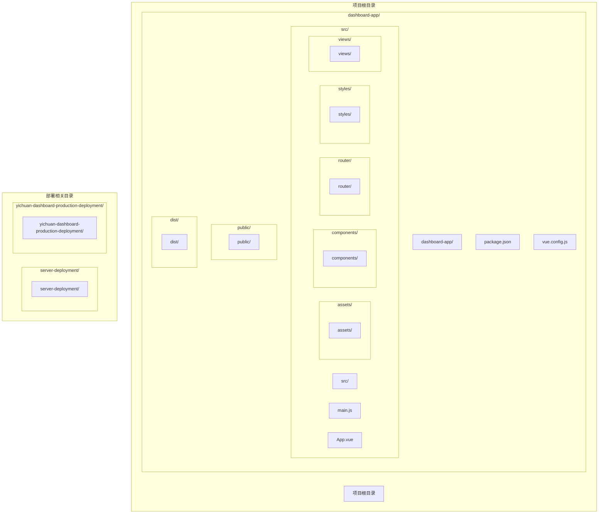
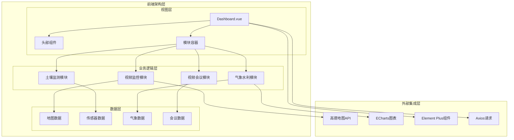
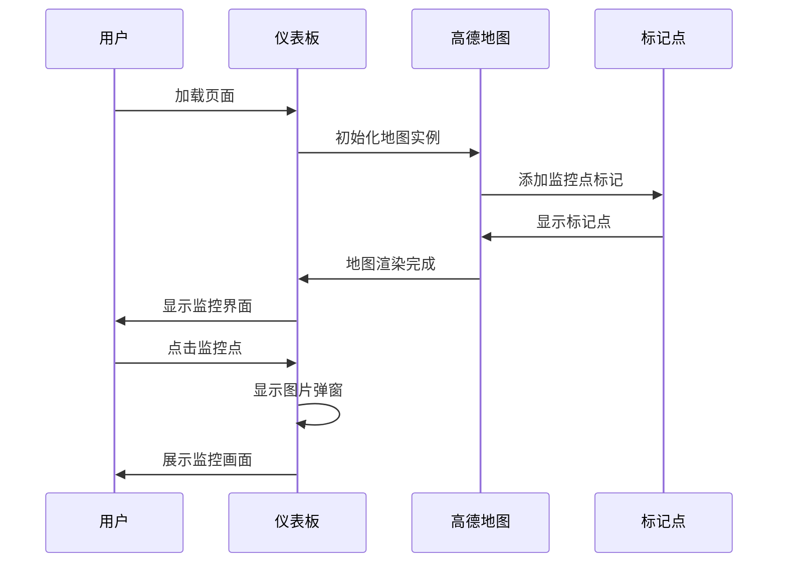
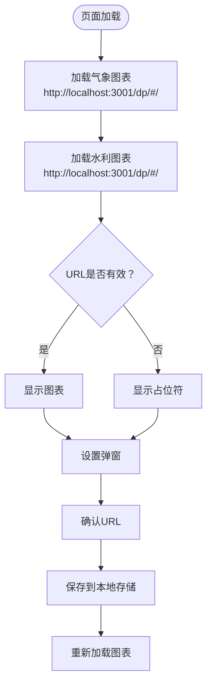
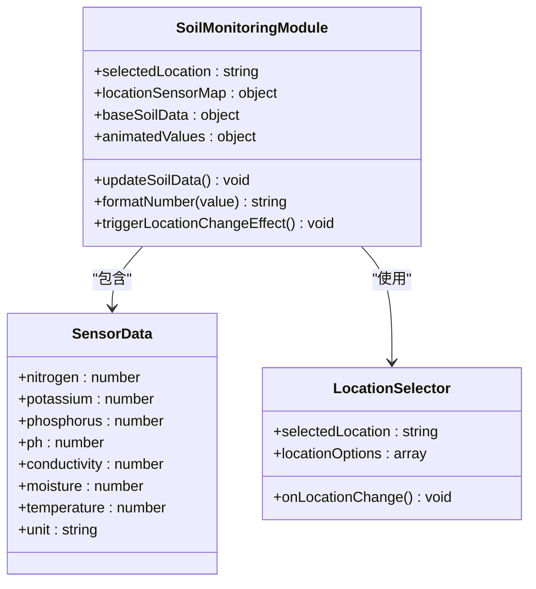
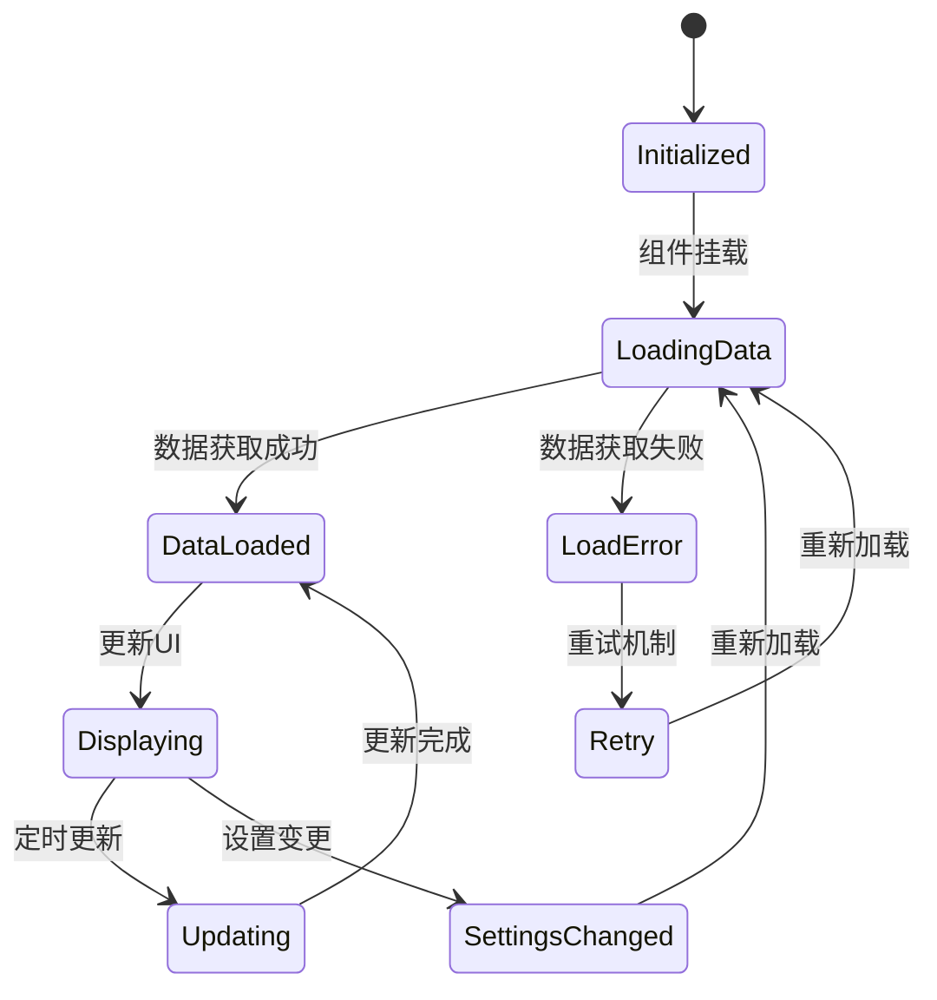
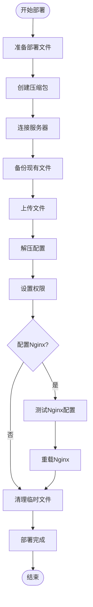

# Dashboard 应用

<cite>
**本文档引用的文件**
- [package.json](file://dashboard-app/package.json)
- [main.js](file://dashboard-app/src/main.js)
- [App.vue](file://dashboard-app/src/App.vue)
- [router/index.js](file://dashboard-app/src/router/index.js)
- [Dashboard.vue](file://dashboard-app/src/views/Dashboard.vue)
- [public/index.html](file://dashboard-app/public/index.html)
- [dist/index.html](file://dashboard-app/dist/index.html)
- [vue.config.js](file://dashboard-app/vue.config.js)
- [DEPLOYMENT.md](file://server-deployment/DEPLOYMENT.md)
- [deploy.sh](file://server-deployment/deploy.sh)
- [deployment-guide.txt](file://yichuan-dashboard-production-deployment/docs/deployment-guide.txt)
- [app-config.json](file://yichuan-dashboard-production-deployment/config/app-config.json)
- [start-server.bat](file://yichuan-dashboard-production-deployment/scripts/start-server.bat)
- [stop-server.bat](file://yichuan-dashboard-production-deployment/scripts/stop-server.bat)
- [nginx.conf](file://server-deployment/nginx.conf)
- [nginx-simple.conf](file://server-deployment/nginx-simple.conf)
</cite>

## 更新摘要
**所做更改**
- 新增部署文档章节，包含Vue.js应用的构建、部署和配置说明
- 添加生产环境部署指南和配置说明
- 更新构建配置和路径映射信息
- 新增Nginx部署和自动化部署脚本说明
- 完善了从开发环境到生产环境的完整部署流程

## 目录
1. [简介](#简介)
2. [项目结构](#项目结构)
3. [核心组件](#核心组件)
4. [架构概览](#架构概览)
5. [详细组件分析](#详细组件分析)
6. [依赖关系分析](#依赖关系分析)
7. [部署文档](#部署文档)
8. [性能考虑](#性能考虑)
9. [故障排除指南](#故障排除指南)
10. [结论](#结论)

## 简介

Dashboard App 是一个基于 Vue 3 的宜川县域监测体系整合平台，专为大屏幕展示设计。该应用集成了视频监控、视频会议、气象与水利监测、土壤墒情监测等多个功能模块，提供了一个全面的县域监测可视化界面。

该项目采用现代化的前端技术栈，包括 Vue 3、Element Plus、ECharts 和 Leaflet 等库，实现了高度交互性和可视化的监测数据展示。应用支持响应式设计，能够在不同分辨率的屏幕上完美运行。

**更新** 新增完整的部署文档，涵盖开发环境搭建、构建配置、生产环境部署和Nginx配置等详细说明，为项目的实施和维护提供了全面的技术指导。

## 项目结构

Dashboard App 采用标准的 Vue CLI 项目结构，主要分为以下层次：



**图表来源**
- [package.json:1-23](file://dashboard-app/package.json#L1-L23)
- [main.js:1-5](file://dashboard-app/src/main.js#L1-L5)
- [App.vue:1-40](file://dashboard-app/src/App.vue#L1-L40)

**章节来源**
- [package.json:1-23](file://dashboard-app/package.json#L1-L23)
- [vue.config.js:1-20](file://dashboard-app/vue.config.js#L1-L20)

## 核心组件

### 应用入口组件

应用的入口通过 `main.js` 文件进行配置，创建 Vue 应用实例并挂载路由系统。

### 路由系统

应用使用 Vue Router 实现单页应用的页面导航，目前配置了基础的仪表板路由。

### 主题样式系统

应用采用了科技蓝主题设计，通过 CSS 变量实现了统一的颜色管理，包括主色调、背景色、文字颜色等。

**章节来源**
- [main.js:1-5](file://dashboard-app/src/main.js#L1-L5)
- [router/index.js:1-17](file://dashboard-app/src/router/index.js#L1-L17)
- [App.vue:13-40](file://dashboard-app/src/App.vue#L13-L40)

## 架构概览

Dashboard App 采用模块化架构设计，各个功能模块相互独立又有机协作：



**图表来源**
- [Dashboard.vue:1-200](file://dashboard-app/src/views/Dashboard.vue#L1-L200)
- [public/index.html:9-10](file://dashboard-app/public/index.html#L9-L10)

## 详细组件分析

### 仪表板核心组件

Dashboard.vue 是整个应用的核心组件，包含了四大主要功能模块：

#### 视频监控墙模块

该模块集成了高德地图 API，实现了宜川县的视频监控点位展示：



**图表来源**
- [Dashboard.vue:434-519](file://dashboard-app/src/views/Dashboard.vue#L434-L519)

#### 气象与水利监测模块

该模块通过 iframe 集成了外部监测系统的图表展示：



**图表来源**
- [Dashboard.vue:93-122](file://dashboard-app/src/views/Dashboard.vue#L93-L122)
- [Dashboard.vue:200-244](file://dashboard-app/src/views/Dashboard.vue#L200-L244)

#### 土壤墒情监测模块

该模块提供了详细的土壤监测数据展示，包括多种传感器指标：



**图表来源**
- [Dashboard.vue:311-357](file://dashboard-app/src/views/Dashboard.vue#L311-L357)

#### 视频会议模块

该模块展示了参会单位的实时状态和滚动展示效果：

**章节来源**
- [Dashboard.vue:40-187](file://dashboard-app/src/views/Dashboard.vue#L40-L187)

### 数据流管理

应用采用了响应式数据管理机制，通过 Vue 3 的 Composition API 实现：



**图表来源**
- [Dashboard.vue:396-412](file://dashboard-app/src/views/Dashboard.vue#L396-L412)

**章节来源**
- [Dashboard.vue:273-358](file://dashboard-app/src/views/Dashboard.vue#L273-L358)

## 依赖关系分析

### 核心依赖库

应用使用了多个关键的第三方库来实现不同的功能：

```mermaid
graph LR
subgraph "Vue生态系统"
Vue[Vue 3.2.0]
Router[Vue Router 4.0.0]
CLI[Vue CLI Service 5.0.0]
end
subgraph "可视化库"
ECharts[ECharts 5.4.0]
Leaflet[Leaflet 1.9.0]
end
subgraph "UI框架"
ElementPlus[Element Plus 2.2.0]
end
subgraph "HTTP客户端"
Axios[Axios 1.2.0]
Vue --> Router
Vue --> ElementPlus
Vue --> ECharts
Vue --> Leaflet
Vue --> Axios
```

**图表来源**
- [package.json:14-22](file://dashboard-app/package.json#L14-L22)

### 构建配置

应用使用 Vue CLI 进行构建，配置了特定的开发服务器和公共路径：

**章节来源**
- [package.json:14-22](file://dashboard-app/package.json#L14-L22)
- [vue.config.js:3-20](file://dashboard-app/vue.config.js#L3-L20)

## 部署文档

### 开发环境部署

#### 环境要求

- **Node.js**: LTS版本 (建议18.x或20.x)
- **操作系统**: Windows 10/11 64位
- **浏览器**: Chrome 90+ 或 Edge 90+

#### 启动步骤

1. **克隆项目并安装依赖**
```bash
git clone https://github.com/your-repo/yichuan-new-wall.git
cd yichuan-new-wall/dashboard-app
npm install
```

2. **启动开发服务器**
```bash
npm run serve
```

3. **访问应用**
打开浏览器访问: http://localhost:8080

#### 构建配置

应用使用 Vue CLI 进行构建，配置了特定的开发服务器和公共路径：

**章节来源**
- [vue.config.js:3-20](file://dashboard-app/vue.config.js#L3-L20)
- [package.json:5-9](file://dashboard-app/package.json#L5-L9)

### 生产环境部署

#### 系统要求

**硬件要求**
- CPU: Intel i5 或同等性能以上
- 内存: 8GB RAM 或以上
- 显卡: 支持4K显示的显卡
- 存储: 至少2GB可用空间

**软件要求**
- 操作系统: Windows 10/11 64位
- Node.js: LTS版本 (建议18.x或20.x)
- 浏览器: Chrome 90+ 或 Edge 90+

#### 部署步骤

1. **构建静态文件**
```bash
npm run build
```

2. **启动本地服务器**
双击运行 `scripts/start-server.bat` 文件

3. **访问系统**
打开浏览器访问: http://localhost:8080

#### 目录结构

```
yichuan-dashboard-production-deployment/
├── dist/                 # 前端静态文件
│   ├── index.html       # 主页面
│   ├── js/             # JavaScript文件
│   └── images/         # 图片资源
├── config/              # 配置文件
│   └── app-config.json # 应用配置
├── scripts/             # 启动脚本
│   ├── start-server.bat # 启动脚本
│   └── stop-server.bat  # 停止脚本
└── docs/               # 文档目录
│   └── deployment-guide.txt # 部署说明
```

**章节来源**
- [deployment-guide.txt:21-52](file://yichuan-dashboard-production-deployment/docs/deployment-guide.txt#L21-L52)
- [start-server.bat:1-45](file://yichuan-dashboard-production-deployment/scripts/start-server.bat#L1-L45)
- [stop-server.bat:1-28](file://yichuan-dashboard-production-deployment/scripts/stop-server.bat#L1-L28)

### Nginx 服务器部署

#### 部署信息

- **版本**: v2.5.1
- **服务器IP**: 43.153.213.134
- **访问路径**: /ycjctx/
- **完整访问地址**: http://43.153.213.134/ycjctx/

#### 部署方式

**方式一：自动部署（推荐）**
```bash
cd server-deployment
./deploy.sh
```

**方式二：手动部署**
1. 将部署包上传到服务器：
```bash
scp -r server-deployment/* root@43.153.213.134:/var/www/html/ycjctx/
```

2. 在服务器上设置权限：
```bash
ssh root@43.153.213.134
cd /var/www/html/ycjctx
chown -R www-data:www-data .
chmod -R 755 .
```

3. 配置Nginx（如果需要）：
```bash
# 复制nginx配置
cp nginx.conf /etc/nginx/sites-available/ycjctx
ln -s /etc/nginx/sites-available/ycjctx /etc/nginx/sites-enabled/
nginx -t && systemctl reload nginx
```

#### 访问验证

部署完成后，可通过以下地址访问：
- **主访问地址**: http://43.153.213.134/ycjctx/
- **备用访问地址**: http://43.153.213.134/ycjctx/index.html

#### Nginx配置详解

应用提供了多种Nginx配置选项：

**完整配置 (nginx.conf)**
- 支持静态文件缓存
- 配置SPA路由回退
- 错误页面处理
- 子路径访问支持

**简化配置 (nginx-simple.conf)**
- 更简洁的静态文件服务
- 基础的子路径支持
- 适合简单部署场景

**章节来源**
- [DEPLOYMENT.md:19-48](file://server-deployment/DEPLOYMENT.md#L19-L48)
- [deploy.sh:14-80](file://server-deployment/deploy.sh#L14-L80)
- [nginx.conf:1-37](file://server-deployment/nginx.conf#L1-L37)
- [nginx-simple.conf:1-24](file://server-deployment/nginx-simple.conf#L1-L24)

### 应用配置

#### 分辨率配置

- 推荐分辨率: 6720 × 1260
- 支持自适应缩放

#### 数据刷新

- 自动刷新间隔: 10秒
- 数值变动范围: ±2%
- 动画过渡效果

#### 模块配置

应用配置文件详细定义了各功能模块的宽度比例和标题：

```json
{
  "display": {
    "modules": {
      "videoWall": {
        "widthPercent": 26,
        "title": "视频监控墙"
      },
      "resourceDistribution": {
        "widthPercent": 26,
        "title": "应急资源分布"
      },
      "weatherHydrology": {
        "widthPercent": 26,
        "title": "气象与水利监测"
      },
      "soilMoisture": {
        "widthPercent": 14,
        "title": "土壤墒情监测"
      }
    }
  }
}
```

**章节来源**
- [app-config.json:13-36](file://yichuan-dashboard-production-deployment/config/app-config.json#L13-L36)

### 自动化部署脚本

#### 部署脚本功能

部署脚本 `deploy.sh` 提供了完整的自动化部署流程：



**图表来源**
- [deploy.sh:14-80](file://server-deployment/deploy.sh#L14-L80)

**章节来源**
- [deploy.sh:1-87](file://server-deployment/deploy.sh#L1-L87)

## 性能考虑

### 大屏幕优化

应用针对大屏幕显示进行了专门优化，包括：

- **模块布局优化**：支持 6720px 宽度的模块布局
- **地图性能**：使用高德地图 API 的优化配置
- **资源加载**：采用按需加载和缓存策略

### 内存管理

应用实现了多项内存管理策略：

- **定时器清理**：及时清理定时器和事件监听器
- **DOM 元素管理**：合理管理动态创建的 DOM 元素
- **地图实例管理**：避免重复创建地图实例

## 故障排除指南

### 常见问题及解决方案

#### 地图加载失败

**问题描述**：高德地图无法正常加载
**可能原因**：
- API 密钥无效或过期
- 网络连接问题
- 跨域访问限制

**解决步骤**：
1. 检查高德地图 API 密钥的有效性
2. 验证网络连接状态
3. 确认域名配置正确

#### 数据加载超时

**问题描述**：气象或水利数据无法加载
**可能原因**：
- 外部服务不可用
- URL 配置错误
- 本地存储损坏

**解决步骤**：
1. 验证外部服务 URL 的可达性
2. 检查本地存储中的 URL 配置
3. 清除浏览器缓存后重试

#### 页面布局异常

**问题描述**：模块布局出现错位或溢出
**可能原因**：
- 分辨率不匹配
- CSS 样式冲突
- 模块宽度计算错误

**解决步骤**：
1. 检查浏览器控制台是否有 CSS 错误
2. 验证模块容器的宽度设置
3. 确认响应式样式的正确性

#### 服务器部署问题

**问题描述**：Nginx部署后页面无法访问
**可能原因**：
- Nginx配置文件错误
- 文件权限问题
- 端口被占用

**解决步骤**：
1. 检查Nginx配置文件语法
2. 验证文件权限设置
3. 确认端口80未被其他服务占用

#### 自动部署失败

**问题描述**：部署脚本执行失败
**可能原因**：
- SSH连接失败
- 密码错误
- 权限不足

**解决步骤**：
1. 验证SSH连接参数
2. 检查服务器密码
3. 确认sudo权限
4. 查看部署日志输出

**章节来源**
- [Dashboard.vue:496-511](file://dashboard-app/src/views/Dashboard.vue#L496-L511)
- [DEPLOYMENT.md:55-59](file://server-deployment/DEPLOYMENT.md#L55-L59)

## 结论

Dashboard App 是一个功能完整、架构清晰的县域监测平台。通过模块化的设计和现代化的技术栈，实现了高度交互性和可视化的监测数据展示。

### 主要优势

1. **模块化架构**：四大功能模块相互独立，便于维护和扩展
2. **响应式设计**：支持多种屏幕尺寸，特别是大屏幕展示
3. **丰富的可视化**：集成了地图、图表等多种可视化组件
4. **完善的部署方案**：提供开发环境、生产环境和服务器部署的完整解决方案
5. **良好的用户体验**：提供流畅的交互体验和直观的数据展示

### 技术特色

1. **Vue 3 生态系统**：充分利用 Vue 3 的 Composition API 和性能优化
2. **高德地图集成**：实现了完整的地图功能和自定义标记
3. **外部系统集成**：通过 iframe 无缝集成其他监测系统
4. **本地存储**：支持用户自定义配置的持久化存储
5. **多环境部署**：支持本地开发、生产环境和服务器部署的灵活配置

### 部署优势

1. **自动化部署**：提供完整的自动化部署脚本，简化部署流程
2. **多环境支持**：支持开发、测试、生产等多种环境部署
3. **Nginx配置**：提供多种Nginx配置选项，满足不同部署需求
4. **版本管理**：包含详细的版本历史和变更记录
5. **故障排除**：提供完整的故障排除指南和技术支持

该应用为宜川县的监测工作提供了一个强大而直观的数字化平台，能够有效提升监测工作的效率和质量。完整的部署文档确保了应用可以快速、稳定地部署到各种环境中，为项目的长期维护和发展奠定了坚实的基础。

**更新** 新增的部署文档涵盖了从开发环境到生产环境的完整部署流程，包括Vue.js应用的构建、配置和部署说明，以及Nginx服务器的详细配置指南，为项目的实施和维护提供了全面的技术指导。