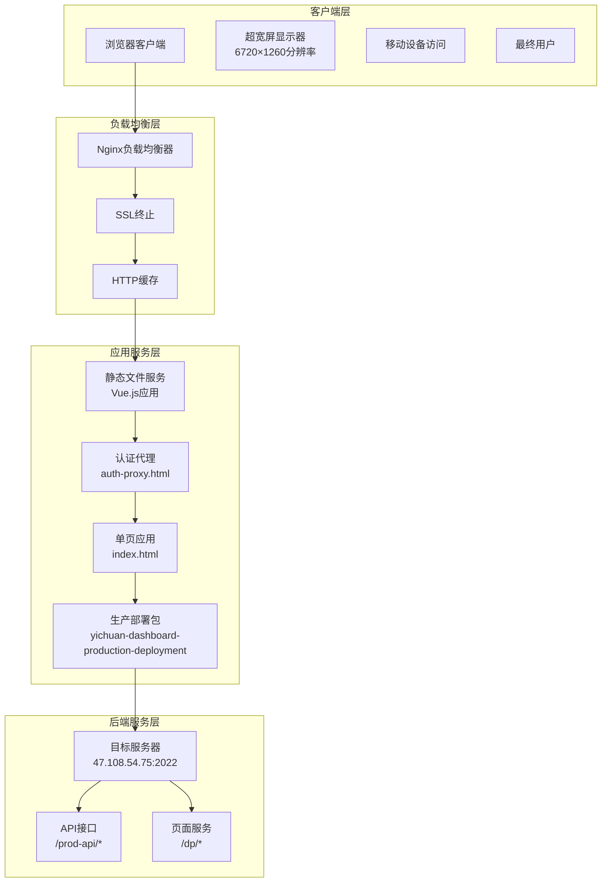
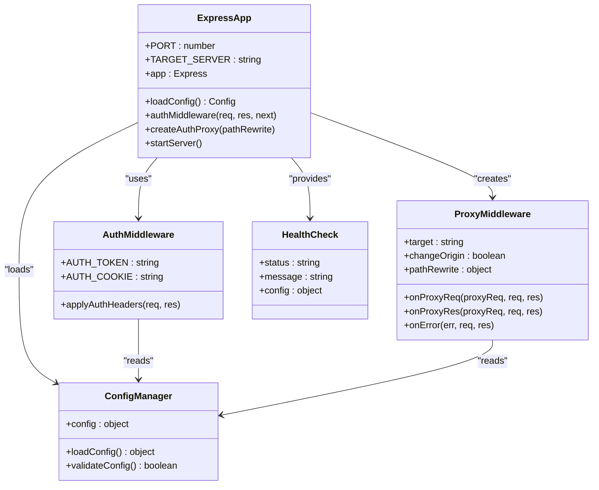
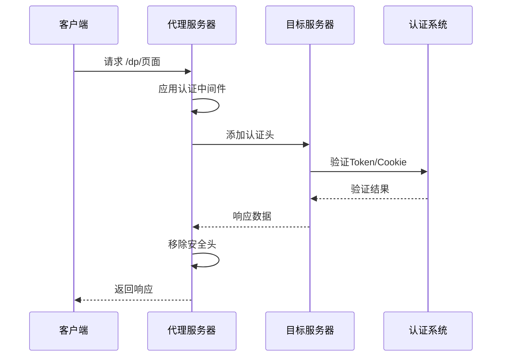
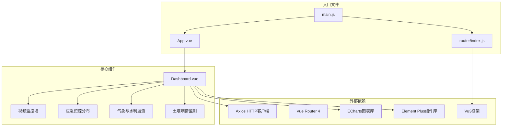
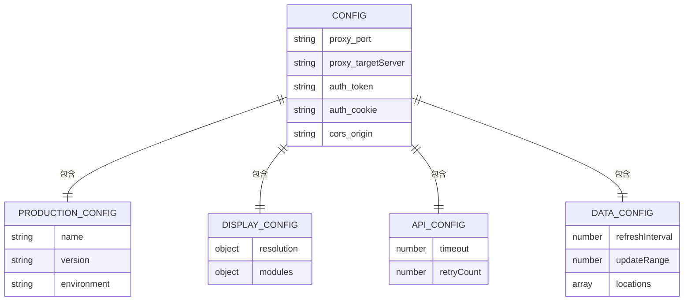
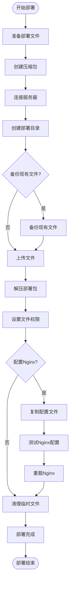
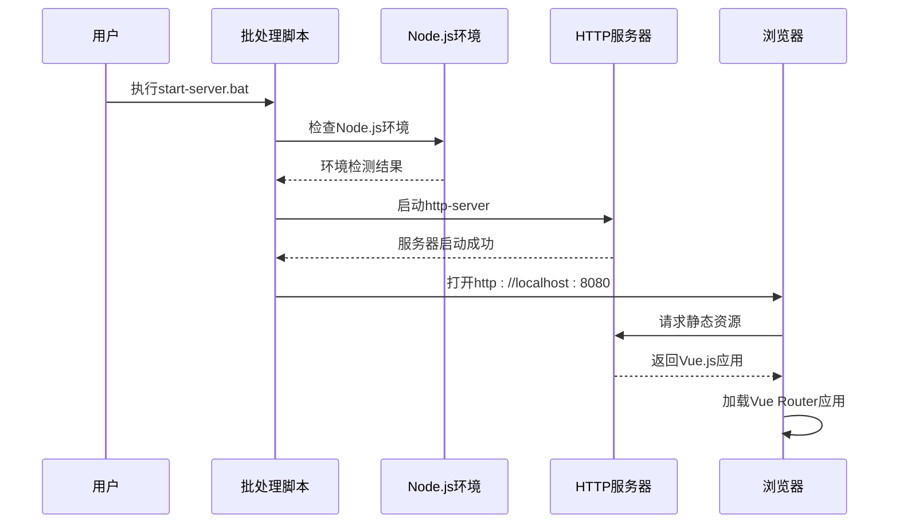
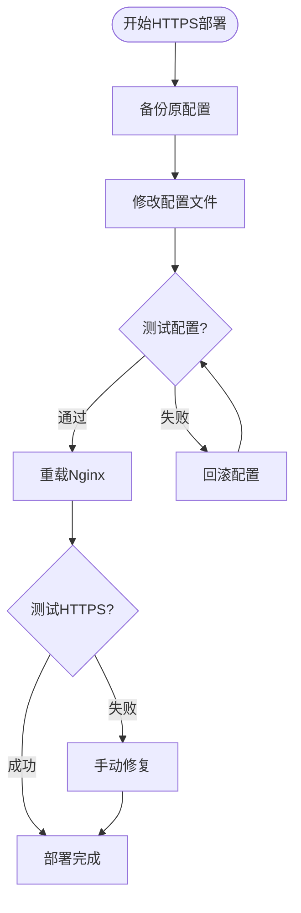

# 生产部署

<cite>
**本文档引用的文件**
- [DEPLOYMENT.md](file://server-deployment/DEPLOYMENT.md)
- [deploy.sh](file://server-deployment/deploy.sh)
- [nginx.conf](file://server-deployment/nginx.conf)
- [setup-https.sh](file://server-deployment/setup-https.sh)
- [nginx-ssl.conf](file://server-deployment/nginx-ssl.conf)
- [nginx-domain.conf](file://server-deployment/nginx-domain.conf)
- [nginx-simple.conf](file://server-deployment/nginx-simple.conf)
- [wisdomdance-complete.conf](file://server-deployment/wisdomdance-complete.conf)
- [auth-proxy.html](file://server-deployment/auth-proxy.html)
- [index.html](file://server-deployment/index.html)
- [deployment-guide.txt](file://yichuan-dashboard-production-deployment/docs/deployment-guide.txt)
- [start-server.bat](file://yichuan-dashboard-production-deployment/scripts/start-server.bat)
- [stop-server.bat](file://yichuan-dashboard-production-deployment/scripts/stop-server.bat)
- [app-config.json](file://yichuan-dashboard-production-deployment/config/app-config.json)
- [部署文档.md](file://部署包/部署文档.md)
- [proxy-server.js](file://部署包/proxy-server.js)
- [proxy-server.js](file://代理服务部署包/proxy-server.js)
- [proxy-server.js](file://proxy-server.js)
- [config.json](file://config.json)
- [vue.config.js](file://dashboard-app/vue.config.js)
- [package.json](file://dashboard-app/package.json)
- [main.js](file://dashboard-app/src/main.js)
- [router/index.js](file://dashboard-app/src/router/index.js)
</cite>

## 更新摘要
**所做更改**
- 新增生产部署包（yichuan-dashboard-production-deployment）的完整配置和部署指南
- 添加Windows生产环境部署脚本（start-server.bat、stop-server.bat）
- 新增生产环境配置文件（app-config.json）和部署文档
- 更新部署架构，包含两种独立的生产部署方案
- 新增生产环境配置管理和模块化架构说明
- 完善生产环境部署流程和故障排除指南

## 目录
1. [项目概述](#项目概述)
2. [部署架构总览](#部署架构总览)
3. [Windows生产部署](#windows生产部署)
4. [Linux服务器部署](#linux服务器部署)
5. [HTTPS部署配置](#https部署配置)
6. [Nginx配置详解](#nginx配置详解)
7. [代理服务架构](#代理服务架构)
8. [前端应用架构](#前端应用架构)
9. [配置管理](#配置管理)
10. [部署流程详解](#部署流程详解)
11. [故障排除指南](#故障排除指南)
12. [性能优化建议](#性能优化建议)
13. [总结](#总结)

## 项目概述

宜川县域监测体系整合平台是一个集成了多个监测功能的大屏展示系统，包含视频监控、应急资源分布、气象与水利监测、土壤墒情监测等多个功能模块。该系统采用前后端分离架构，通过代理服务实现跨域访问和认证。

### 系统特性

- **多模块集成**：视频监控墙、应急资源分布、气象与水利监测、土壤墒情监测
- **高分辨率适配**：支持6720×1260像素分辨率的超宽屏显示
- **实时数据更新**：10秒自动刷新机制
- **跨域解决方案**：通过代理服务器解决iframe嵌入限制
- **多种部署方式**：支持Windows本地部署和Linux服务器部署
- **HTTPS支持**：完整的SSL证书配置和HTTPS访问支持
- **生产环境优化**：专门的生产部署包，包含完整的配置管理

## 部署架构总览



**图表来源**
- [nginx-ssl.conf:1-63](file://server-deployment/nginx-ssl.conf#L1-L63)
- [auth-proxy.html:1-60](file://server-deployment/auth-proxy.html#L1-L60)
- [index.html:1-6](file://server-deployment/index.html#L1-L6)

## Windows生产部署

### 环境要求

- **操作系统**：Windows 10/11 64位
- **硬件要求**：
  - CPU：Intel i5或同等性能以上
  - 内存：8GB RAM或以上
  - 显卡：支持4K显示的显卡
  - 存储：至少2GB可用空间
- **软件要求**：
  - Node.js：LTS版本（建议18.x或20.x）
  - 浏览器：Chrome 90+或Edge 90+

### 部署步骤

#### 步骤1：环境准备
```cmd
# 检查Node.js版本
node --version

# 如果未安装Node.js，请从官网下载安装
# https://nodejs.org/
```

#### 步骤2：启动生产服务
```cmd
# 运行生产部署脚本
cd yichuan-dashboard-production-deployment/scripts
start-server.bat
```

#### 步骤3：访问系统
服务启动后，在浏览器中访问：
```
http://localhost:8080
```

### 生产部署包结构

```
yichuan-dashboard-production-deployment/
├── dist/                 # 前端静态文件
│   ├── index.html       # 主页面
│   ├── js/             # JavaScript文件
│   └── images/         # 图片资源
├── config/              # 配置文件
│   └── app-config.json # 应用配置
├── scripts/             # 启动脚本
│   ├── start-server.bat # 启动脚本
│   └── stop-server.bat  # 停止脚本
└── docs/               # 文档目录
    └── deployment-guide.txt # 部署说明
```

**章节来源**
- [deployment-guide.txt:1-108](file://yichuan-dashboard-production-deployment/docs/deployment-guide.txt#L1-L108)
- [start-server.bat:1-45](file://yichuan-dashboard-production-deployment/scripts/start-server.bat#L1-L45)
- [stop-server.bat:1-28](file://yichuan-dashboard-production-deployment/scripts/stop-server.bat#L1-L28)

## Linux服务器部署

### 服务器配置

- **服务器IP**：43.153.213.134
- **访问路径**：/ycjctx/
- **完整访问地址**：http://43.153.213.134/ycjctx/

### 自动部署方式（推荐）

```bash
# 在本地执行自动部署脚本
cd server-deployment
./deploy.sh
```

### 手动部署方式

#### 步骤1：上传部署包
```bash
scp -r server-deployment/* root@43.153.213.134:/var/www/html/ycjctx/
```

#### 步骤2：设置文件权限
```bash
ssh root@43.153.213.134
cd /var/www/html/ycjctx
chown -R www-data:www-data .
chmod -R 755 .
```

#### 步骤3：配置Nginx
```bash
# 复制nginx配置
cp nginx.conf /etc/nginx/sites-available/ycjctx
ln -s /etc/nginx/sites-available/ycjctx /etc/nginx/sites-enabled/
nginx -t && systemctl reload nginx
```

### 访问验证
部署完成后，可通过以下地址访问：
- **主访问地址**：http://43.153.213.134/ycjctx/
- **备用访问地址**：http://43.153.213.134/ycjctx/index.html

**章节来源**
- [DEPLOYMENT.md:1-65](file://server-deployment/DEPLOYMENT.md#L1-L65)
- [deploy.sh:1-87](file://server-deployment/deploy.sh#L1-L87)
- [nginx.conf:1-37](file://server-deployment/nginx.conf#L1-L37)

## HTTPS部署配置

### SSL证书配置

系统支持完整的HTTPS部署，包含以下配置选项：

#### 基础SSL配置
```nginx
server {
    listen 443 ssl http2;
    server_name wisdomdance.cn www.wisdomdance.cn;
    
    # SSL证书配置
    ssl_certificate /etc/ssl/certs/wisdomdance.cn.crt;
    ssl_certificate_key /etc/ssl/private/wisdomdance.cn.key;
    
    # SSL安全配置
    ssl_protocols TLSv1.2 TLSv1.3;
    ssl_ciphers ECDHE-RSA-AES128-GCM-SHA256:ECDHE-RSA-AES256-GCM-SHA384;
    ssl_prefer_server_ciphers off;
    
    # 安全头配置
    add_header X-Frame-Options SAMEORIGIN always;
    add_header X-Content-Type-Options nosniff always;
    add_header X-XSS-Protection "1; mode=block" always;
    add_header Strict-Transport-Security "max-age=31536000; includeSubDomains" always;
}
```

#### 自动HTTPS重定向
```nginx
server {
    listen 80;
    server_name wisdomdance.cn www.wisdomdance.cn;
    
    # 重定向到HTTPS
    return 301 https://$server_name$request_uri;
}
```

### HTTPS部署脚本

系统提供完整的HTTPS部署脚本，支持自动配置和回滚：

```bash
#!/bin/bash
# 宜川大屏HTTPS部署脚本

echo "开始配置HTTPS访问..."

# 备份原配置
sudo cp /etc/nginx/sites-enabled/wisdomdance.conf /etc/nginx/sites-enabled/wisdomdance.conf.backup

# 在现有配置中添加ycjctx路径
sudo sed -i '/location \/ {/i\
    # 宜川县域监测体系整合平台\
    location /ycjctx/ {\
        alias /var/www/html/ycjctx/;\
        index index.html;\
        try_files \$uri \$uri/ /ycjctx/index.html;\
        \
        # 静态资源配置\
        location ~* \.(js|css|png|jpg|jpeg|gif|ico|svg|woff|woff2|ttf|eot)\$ {\
            expires 1y;\
            add_header Cache-Control "public, immutable";\
            add_header Access-Control-Allow-Origin "*";\
        }\
    }\
    \
' /etc/nginx/sites-enabled/wisdomdance.conf

# 测试配置
sudo nginx -t

if [ $? -eq 0 ]; then
    echo "Nginx配置测试通过"
    sudo systemctl reload nginx
    echo "Nginx已重新加载"
    
    # 测试HTTPS访问
    curl -I https://www.wisdomdance.cn/ycjctx/ 2>/dev/null | head -1
    
    echo "部署完成！"
    echo "访问地址: https://www.wisdomdance.cn/ycjctx/"
else
    echo "Nginx配置测试失败，恢复原配置"
    sudo cp /etc/nginx/sites-enabled/wisdomdance.conf.backup /etc/nginx/sites-enabled/wisdomdance.conf
    sudo nginx -t && sudo systemctl reload nginx
fi
```

**章节来源**
- [setup-https.sh:1-45](file://server-deployment/setup-https.sh#L1-L45)
- [nginx-ssl.conf:1-63](file://server-deployment/nginx-ssl.conf#L1-L63)

## Nginx配置详解

### 配置文件集合

系统提供多种Nginx配置模板，适用于不同的部署场景：

#### 基础Nginx配置
```nginx
server {
    listen 80;
    server_name 43.153.213.134;
    
    # 主路径访问
    location / {
        root /var/www/html;
        index index.html;
        try_files $uri $uri/ =404;
    }
    
    # 宜川监测大屏子路径
    location /ycjctx/ {
        alias /var/www/html/ycjctx/;
        index index.html;
        try_files $uri $uri/ @ycjctx_fallback;
        
        # 静态资源配置
        location ~* \.(js|css|png|jpg|jpeg|gif|ico|svg)$ {
            expires 1y;
            add_header Cache-Control "public, immutable";
        }
        
        # SPA路由支持
        location @ycjctx_fallback {
            rewrite ^/ycjctx/(.*)$ /ycjctx/index.html last;
        }
    }
}
```

#### 域名绑定配置
```nginx
server {
    listen 80;
    server_name wisdomdance.cn www.wisdomdance.cn 43.153.213.134;
    
    # 临时HTTP访问配置
    location /ycjctx/ {
        alias /var/www/html/ycjctx/;
        index index.html;
        try_files $uri $uri/ /ycjctx/index.html;
        
        # 静态资源配置
        location ~* \.(js|css|png|jpg|jpeg|gif|ico|svg|woff|woff2|ttf|eot)$ {
            expires 1y;
            add_header Cache-Control "public, immutable";
            add_header Access-Control-Allow-Origin "*";
        }
    }
}
```

#### 完整站点配置
```nginx
server {
    server_name wisdomdance.cn www.wisdomdance.cn;
    root /var/www/wisdomdance/dist;
    index index.html;
    
    # 宜川县域监测体系整合平台
    location /ycjctx/ {
        alias /var/www/html/ycjctx/;
        index index.html;
        try_files $uri $uri/ /ycjctx/index.html;
        
        # 静态资源配置
        location ~* \.(js|css|png|jpg|jpeg|gif|ico|svg|woff|woff2|ttf|eot)$ {
            expires 1y;
            add_header Cache-Control "public, immutable";
            add_header Access-Control-Allow-Origin "*";
        }
    }
    
    # 天气API代理
    location /weather-api/ {
        proxy_pass http://d1.weather.com.cn/;
        proxy_set_header Referer http://www.weather.com.cn/;
        proxy_set_header Host d1.weather.com.cn;
        proxy_set_header Accept-Encoding "";
        add_header Access-Control-Allow-Origin *;
        add_header Cache-Control "max-age=600";
    }
    
    # 其他路径
    location / {
        try_files $uri $uri/ =404;
    }
}
```

### 配置特点

1. **静态文件优化**：启用1年缓存策略，提升加载速度
2. **SPA路由支持**：完美支持Vue.js单页应用的路由模式
3. **CORS支持**：为静态资源添加跨域访问头
4. **安全头配置**：包含X-Frame-Options、X-Content-Type-Options等安全头
5 **API代理**：可选的后端API代理配置

**章节来源**
- [nginx.conf:1-37](file://server-deployment/nginx.conf#L1-L37)
- [nginx-domain.conf:1-61](file://server-deployment/nginx-domain.conf#L1-L61)
- [nginx-simple.conf:1-24](file://server-deployment/nginx-simple.conf#L1-L24)
- [wisdomdance-complete.conf:1-58](file://server-deployment/wisdomdance-complete.conf#L1-L58)

## 代理服务架构

### 核心组件



**图表来源**
- [proxy-server.js:1-149](file://部署包/proxy-server.js#L1-L149)
- [proxy-server.js:1-149](file://代理服务部署包/proxy-server.js#L1-L149)

### 代理路由配置

| 路径模式 | 目标路径 | 功能描述 |
|---------|---------|----------|
| `/dp/*` | `/dp/*` | 页面请求代理，保持原路径结构 |
| `/api/*` | `/prod-api/*` | API请求代理，路径重写 |
| `/*` | `/*` | 默认代理，处理静态资源 |

### 认证机制



**图表来源**
- [proxy-server.js:46-61](file://部署包/proxy-server.js#L46-L61)

**章节来源**
- [proxy-server.js:1-149](file://部署包/proxy-server.js#L1-L149)
- [proxy-server.js:1-149](file://代理服务部署包/proxy-server.js#L1-L149)
- [config.json:1-14](file://config.json#L1-L14)

## 前端应用架构

### Vue.js应用结构



**图表来源**
- [main.js:1-5](file://dashboard-app/src/main.js#L1-L5)
- [router/index.js:1-17](file://dashboard-app/src/router/index.js#L1-L17)
- [package.json:1-23](file://dashboard-app/package.json#L1-L23)

### 构建配置

| 配置项 | 值 | 说明 |
|-------|-----|------|
| 开发服务器端口 | 8080 | 本地开发和测试使用 |
| 主机名 | localhost | 本地访问域名 |
| CSS提取 | false | 开发环境禁用CSS提取 |
| 警告覆盖 | 关闭 | 只显示错误信息 |
| 错误覆盖 | 开启 | 显示详细错误信息 |

### 组件模块划分

#### 视频监控墙（28%宽度）
- 实时视频监控展示
- 地图点位标注
- 视频缩略图预览

#### 应急资源分布（28%宽度）
- 应急物资储备情况
- 救援队伍分布
- 资源调配状态

#### 气象与水利监测（28%宽度）
- 实时气象数据
- 河流水库水位监测
- 左右分区配置功能

#### 土壤墒情监测（16%宽度）
- 土壤湿度数据
- 传感器状态监控
- 数值动态刷新

**章节来源**
- [vue.config.js:1-19](file://dashboard-app/vue.config.js#L1-L19)
- [package.json:1-23](file://dashboard-app/package.json#L1-L23)
- [deployment-guide.txt:54-75](file://yichuan-dashboard-production-deployment/docs/deployment-guide.txt#L54-L75)

## 配置管理

### 配置文件结构



**图表来源**
- [config.json:1-14](file://config.json#L1-L14)
- [app-config.json:1-53](file://yichuan-dashboard-production-deployment/config/app-config.json#L1-L53)

### 配置字段说明

| 字段 | 类型 | 说明 | 示例 |
|------|------|------|------|
| proxy.port | number | 代理服务器端口 | 3001 |
| proxy.targetServer | string | 目标服务器地址 | http://47.108.54.75:2022 |
| auth.token | string | Bearer Token认证 | Bearer eyJhbG... |
| auth.cookie | string | Cookie字符串 | username=xxx; ... |
| cors.origin | string | 允许跨域的来源 | http://localhost:8080 |
| app.name | string | 应用名称 | 宜川县域监测体系整合平台 |
| display.resolution.width | number | 显示器宽度像素 | 6720 |
| data.refreshInterval | number | 数据刷新间隔毫秒 | 10000 |

### 环境变量管理

系统支持通过环境变量进行配置管理，主要配置包括：

- **NODE_ENV**：运行环境（development/production）
- **PORT**：服务监听端口
- **TARGET_SERVER**：目标服务器地址
- **AUTH_TOKEN**：认证Token
- **AUTH_COOKIE**：认证Cookie

### 认证代理配置

系统提供专门的认证代理页面，用于模拟登录和设置认证信息：

```html
<!DOCTYPE html>
<html lang="zh-CN">
<head>
    <meta charset="UTF-8">
    <meta name="viewport" content="width=device-width, initial-scale=1.0">
    <title>认证代理页面</title>
</head>
<body>
    <div id="loading">正在设置认证信息...</div>
    <script>
        // 设置认证cookie和localStorage
        document.cookie = "Admin-Token=YOUR_TOKEN; path=/";
        localStorage.setItem('Admin-Token', 'YOUR_TOKEN');
        
        // 获取目标URL参数并跳转
        const urlParams = new URLSearchParams(window.location.search);
        const targetUrl = urlParams.get('target');
        if (targetUrl) {
            window.location.href = targetUrl;
        }
    </script>
</body>
</html>
```

**章节来源**
- [config.json:1-14](file://config.json#L1-L14)
- [app-config.json:1-53](file://yichuan-dashboard-production-deployment/config/app-config.json#L1-L53)
- [proxy-server.js:9-35](file://部署包/proxy-server.js#L9-L35)
- [auth-proxy.html:1-60](file://server-deployment/auth-proxy.html#L1-L60)

## 部署流程详解

### 自动部署流程



**图表来源**
- [deploy.sh:1-87](file://server-deployment/deploy.sh#L1-L87)

### 服务启动流程



**图表来源**
- [start-server.bat:1-45](file://yichuan-dashboard-production-deployment/scripts/start-server.bat#L1-L45)

### 代理服务启动流程


**图表来源**
- [proxy-server.js:9-35](file://部署包/proxy-server.js#L9-L35)

### HTTPS部署流程



**图表来源**
- [setup-https.sh:1-45](file://server-deployment/setup-https.sh#L1-L45)

**章节来源**
- [deploy.sh:1-87](file://server-deployment/deploy.sh#L1-L87)
- [start-server.bat:1-45](file://yichuan-dashboard-production-deployment/scripts/start-server.bat#L1-L45)

## 故障排除指南

### 常见问题及解决方案

#### 问题1：页面无法访问
**症状**：浏览器无法打开系统页面
**可能原因**：
- 服务器未正常启动
- 端口8080被占用
- 防火墙设置问题

**解决步骤**：
1. 检查服务器启动状态
2. 确认端口8080未被占用
3. 检查防火墙设置

#### 问题2：地图显示异常
**症状**：地图无法正常显示
**可能原因**：
- 网络连接问题
- 高德地图API不可用

**解决步骤**：
1. 检查网络连接状态
2. 确认高德地图API可用性

#### 问题3：数据不更新
**症状**：页面数据长时间不变
**可能原因**：
- 浏览器控制台出现错误
- JavaScript代码执行异常

**解决步骤**：
1. 检查浏览器控制台错误信息
2. 确认JavaScript代码正常运行

#### 问题4：Cookie过期
**症状**：iframe模块无数据显示
**解决步骤**：
1. 停止服务（运行stop-server.bat）
2. 编辑config.json，更新auth.token和auth.cookie
3. 重新启动服务

#### 问题5：HTTPS配置失败
**症状**：HTTPS页面无法访问
**可能原因**：
- SSL证书文件路径错误
- 权限设置问题
- 配置语法错误

**解决步骤**：
1. 检查SSL证书文件是否存在且路径正确
2. 确认文件权限设置（644证书，600私钥）
3. 使用 `nginx -t` 测试配置语法
4. 查看Nginx错误日志获取详细信息

### 端口占用排查

```cmd
# 检查端口占用情况
netstat -ano | findstr :3001
netstat -ano | findstr :8080

# 结束Node.js进程
taskkill /F /IM node.exe
```

### 日志查看

代理服务器启动时会在控制台输出详细日志信息，包括：
- 配置文件加载状态
- 代理服务器运行信息
- 认证状态信息
- CORS配置信息

Nginx错误日志位置：
- **错误日志**：`/var/log/nginx/error.log`
- **访问日志**：`/var/log/nginx/access.log`

**章节来源**
- [部署文档.md:219-255](file://部署包/部署文档.md#L219-L255)
- [deployment-guide.txt:87-103](file://yichuan-dashboard-production-deployment/docs/deployment-guide.txt#L87-L103)

## 性能优化建议

### 前端性能优化

1. **资源缓存策略**
   - 静态资源设置长期缓存
   - CSS/JS文件启用压缩
   - 图片资源优化压缩

2. **按需加载**
   - Vue组件懒加载
   - 图表库按需引入
   - 第三方库CDN加速

3. **渲染优化**
   - 使用虚拟滚动处理大量数据
   - 图表组件性能调优
   - 避免不必要的重渲染

### 代理服务优化

1. **连接池管理**
   - 合理设置代理连接数
   - 连接超时时间配置
   - 错误重试机制

2. **内存管理**
   - 定期清理缓存数据
   - 监控内存使用情况
   - 长连接管理

3. **并发处理**
   - 异步请求处理
   - 并发数量限制
   - 请求队列管理

### 服务器优化

1. **Nginx配置优化**
   - Gzip压缩启用
   - 静态文件缓存
   - 并发连接数调整

2. **系统资源优化**
   - CPU使用率监控
   - 内存使用优化
   - 磁盘I/O优化

3. **HTTPS优化**
   - SSL会话缓存
   - HTTP/2协议启用
   - 证书链优化

### 安全优化

1. **SSL证书管理**
   - 定期更新证书
   - 自动续期配置
   - 证书监控告警

2. **访问控制**
   - IP白名单配置
   - 请求频率限制
   - DDoS防护

3. **日志监控**
   - 访问日志分析
   - 错误日志监控
   - 安全事件告警

## 总结

宜川县域监测体系整合平台提供了完整的生产部署解决方案，具有以下特点：

### 核心优势

1. **灵活的部署方式**：支持Windows本地部署和Linux服务器部署
2. **完善的代理机制**：解决跨域和认证问题，支持iframe嵌入
3. **高性能架构**：前后端分离设计，支持高并发访问
4. **易于维护**：配置文件化管理，自动化部署脚本
5. **完整的HTTPS支持**：内置SSL证书配置和HTTPS访问支持
6. **多场景Nginx配置**：提供多种配置模板适应不同需求
7. **生产环境优化**：专门的生产部署包，包含完整的配置管理

### 技术特色

- **多模块集成**：统一的大屏展示界面
- **实时数据更新**：10秒自动刷新机制
- **高分辨率适配**：完美支持超宽屏显示
- **跨平台兼容**：支持Windows和Linux环境
- **安全防护**：完整的HTTPS和安全头配置
- **灵活配置**：多种Nginx配置模板可选
- **生产配置管理**：专门的应用配置文件管理

### 最佳实践

1. **定期备份**：重要配置文件和数据定期备份
2. **监控告警**：建立系统运行监控和告警机制
3. **性能监控**：持续监控系统性能指标
4. **安全加固**：定期更新认证信息和安全配置
5. **证书管理**：建立SSL证书的自动续期机制
6. **配置标准化**：使用标准的Nginx配置模板

该部署方案为宜川县域监测体系提供了稳定可靠的技术支撑，能够满足大规模数据展示和实时监控的需求。新增的生产部署包进一步简化了部署流程，提供了完整的HTTPS配置和多种Nginx配置选项，使系统部署更加灵活和安全。同时，专门的生产部署包包含了完整的配置管理和启动脚本，为生产环境的稳定运行提供了有力保障。