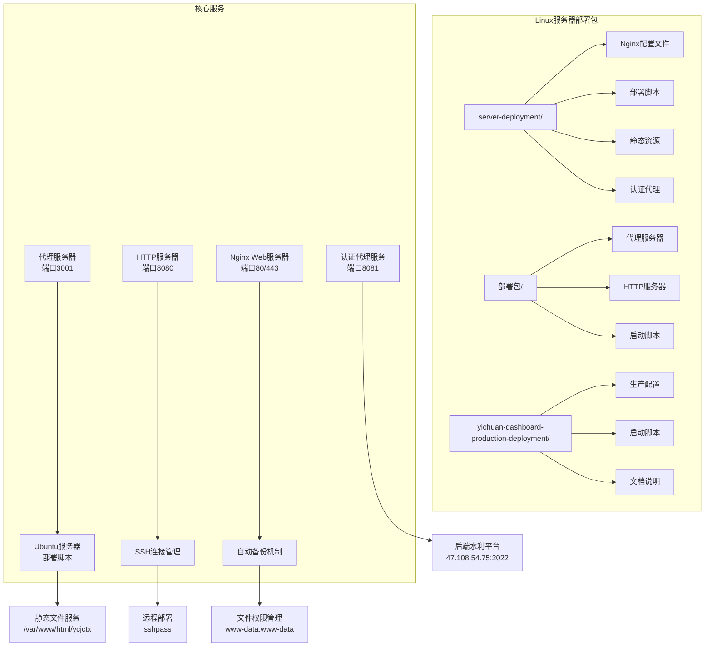
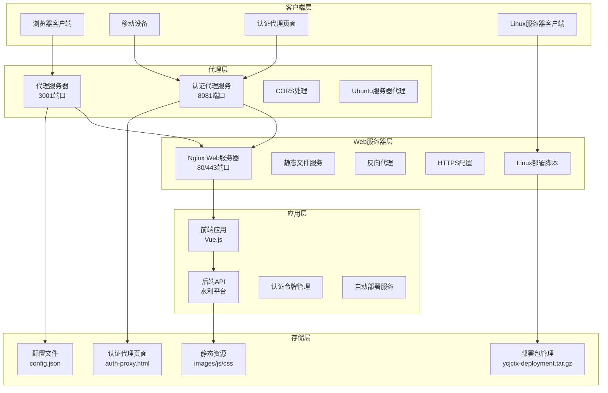
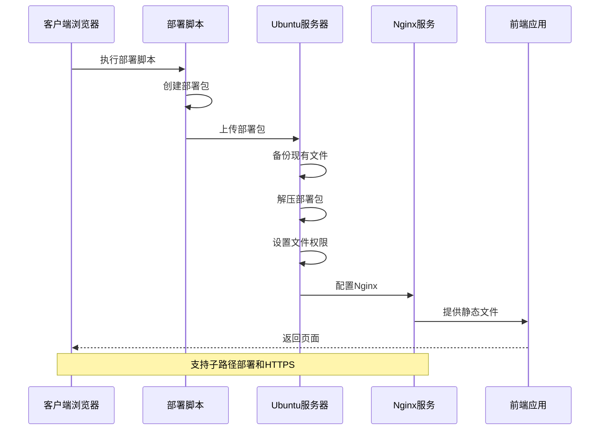
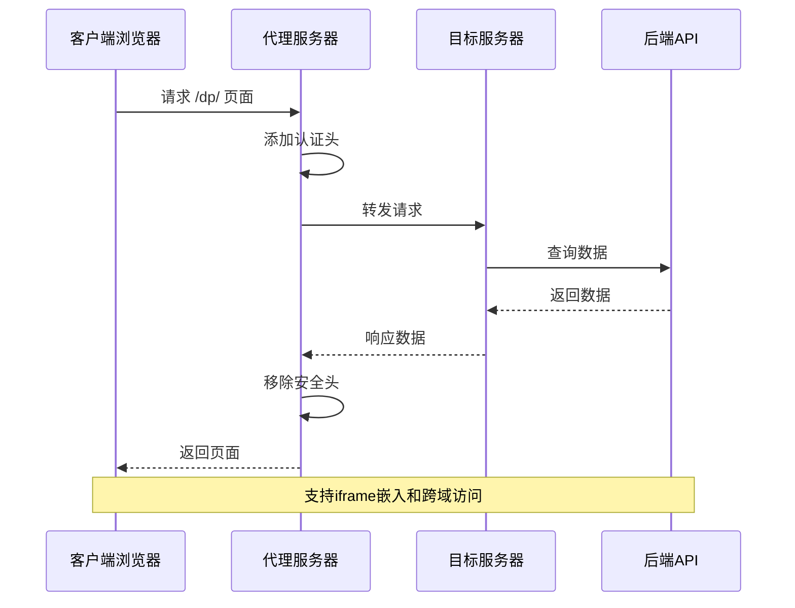
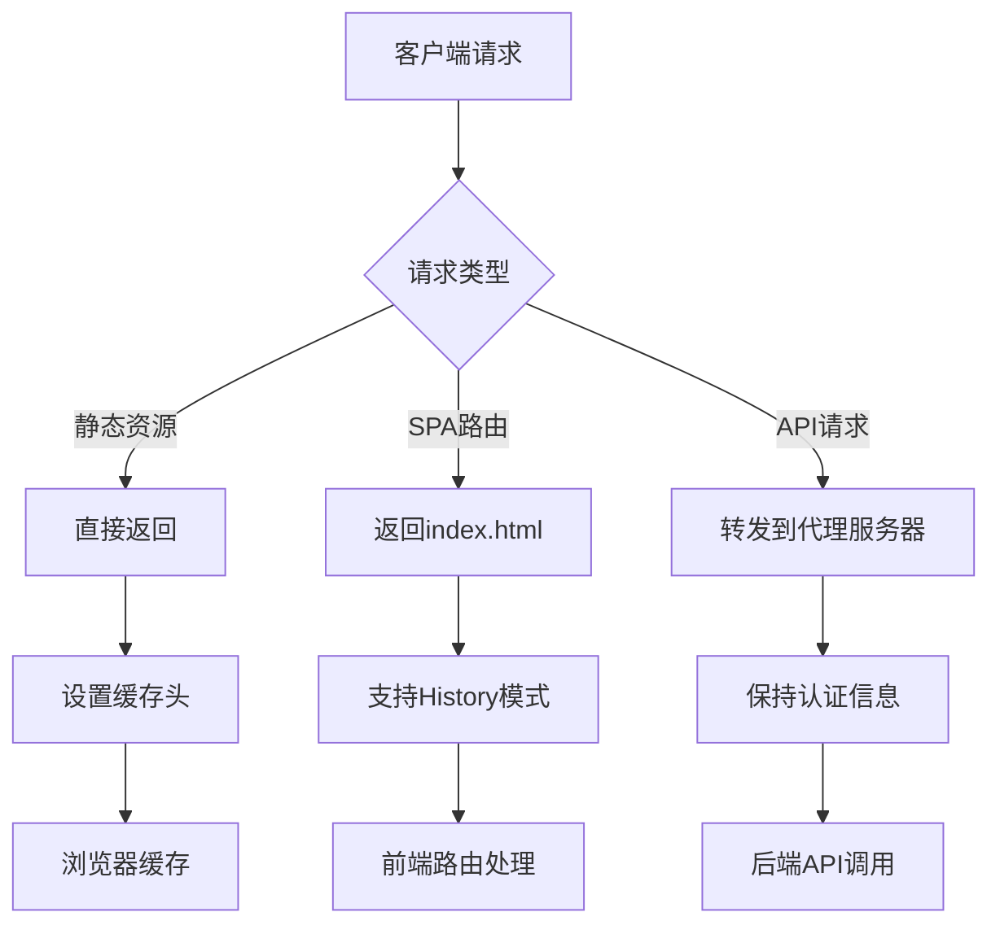
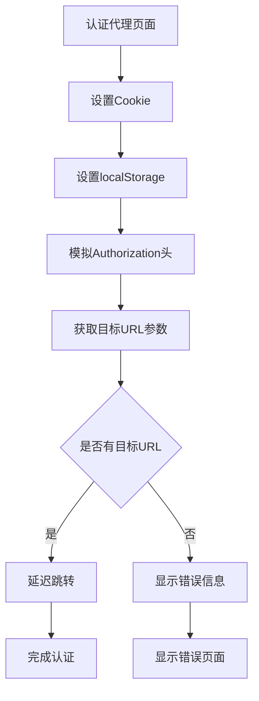
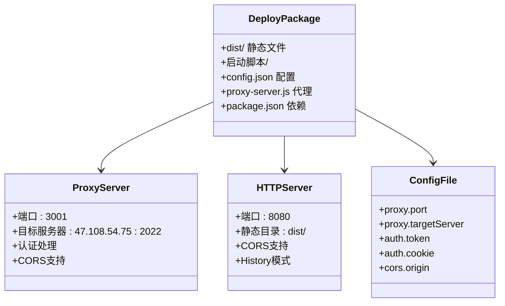
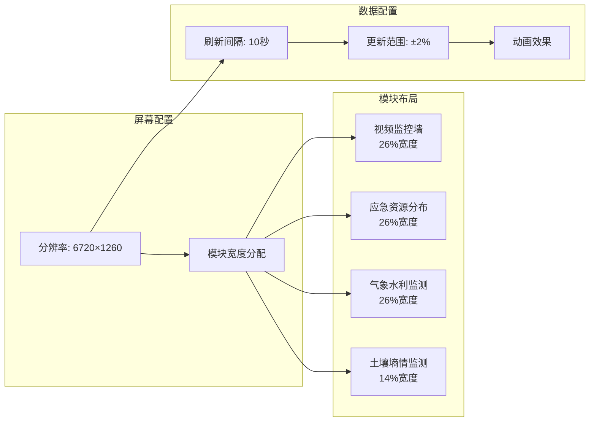
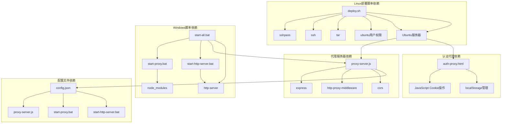

# 服务器部署

<cite>
**本文档引用的文件**
- [DEPLOYMENT.md](file://server-deployment/DEPLOYMENT.md)
- [deploy.sh](file://server-deployment/deploy.sh)
- [setup-https.sh](file://server-deployment/setup-https.sh)
- [nginx.conf](file://server-deployment/nginx.conf)
- [nginx-ssl.conf](file://server-deployment/nginx-ssl.conf)
- [nginx-domain.conf](file://server-deployment/nginx-domain.conf)
- [nginx-simple.conf](file://server-deployment/nginx-simple.conf)
- [wisdomdance-complete.conf](file://server-deployment/wisdomdance-complete.conf)
- [index.html](file://server-deployment/index.html)
- [auth-proxy.html](file://server-deployment/auth-proxy.html)
- [部署文档.md](file://部署包/部署文档.md)
- [config.json](file://部署包/config.json)
- [start-all.bat](file://部署包/启动脚本/start-all.bat)
- [start-proxy.bat](file://部署包/启动脚本/start-proxy.bat)
- [start-http-server.bat](file://部署包/启动脚本/start-http-server.bat)
- [proxy-server.js](file://proxy-server.js)
- [deployment-guide.txt](file://yichuan-dashboard-production-deployment/docs/deployment-guide.txt)
- [app-config.json](file://yichuan-dashboard-production-deployment/config/app-config.json)
- [start-server.bat](file://yichuan-dashboard-production-deployment/scripts/start-server.bat)
- [stop-server.bat](file://yichuan-dashboard-production-deployment/scripts/stop-server.bat)
</cite>

## 更新摘要
**所做更改**
- 新增完整的Linux服务器部署包章节，包含Nginx配置、自动部署脚本、SSL配置
- 更新架构概览图，反映新增的Linux部署组件
- 增强性能考虑部分，涵盖Linux部署的缓存策略和网络优化
- 扩展故障排除指南，包含Linux部署特有的问题诊断
- 更新项目结构图，展示完整的多环境部署架构

## 目录
1. [简介](#简介)
2. [项目结构](#项目结构)
3. [核心组件](#核心组件)
4. [架构概览](#架构概览)
5. [详细组件分析](#详细组件分析)
6. [依赖关系分析](#依赖关系分析)
7. [性能考虑](#性能考虑)
8. [故障排除指南](#故障排除指南)
9. [结论](#结论)

## 简介

这是一个完整的宜川县域监测体系整合平台部署文档，涵盖了多种部署场景和部署方式。该系统包含五个主要部署包：

1. **Linux服务器部署包** - 基于Nginx的静态文件部署，支持Ubuntu服务器环境，提供完整的自动化部署解决方案
2. **Web服务器部署包** - 基于Nginx的静态文件部署，支持Linux服务器环境
3. **Windows生产环境部署包** - 包含代理服务器和HTTP服务器的完整解决方案
4. **生产环境部署包** - 针对Windows系统的独立部署方案
5. **认证代理服务包** - 专门的认证代理和HTTPS配置解决方案

该平台支持多种部署方式，包括自动部署脚本、手动部署、以及不同环境下的配置选项。特别新增的Linux服务器部署包提供了完整的服务器端解决方案，包含完整的Nginx配置、自动部署脚本、SSL配置等，专门针对Ubuntu服务器环境优化。

## 项目结构

项目采用多层部署架构，包含以下主要组件：



**图表来源**
- [DEPLOYMENT.md:1-65](file://server-deployment/DEPLOYMENT.md#L1-L65)
- [deploy.sh:1-87](file://server-deployment/deploy.sh#L1-L87)
- [nginx.conf:1-37](file://server-deployment/nginx.conf#L1-L37)

**章节来源**
- [DEPLOYMENT.md:1-65](file://server-deployment/DEPLOYMENT.md#L1-L65)
- [deploy.sh:1-87](file://server-deployment/deploy.sh#L1-L87)
- [nginx.conf:1-37](file://server-deployment/nginx.conf#L1-L37)

## 核心组件

### Linux服务器部署组件

Linux服务器部署包提供了完整的服务器端解决方案：

- **部署脚本** (`deploy.sh`): 自动化部署脚本，支持远程部署和备份功能，专为Ubuntu服务器设计，包含SSH连接管理和文件权限设置
- **Nginx配置** (`nginx.conf`): 主要的Web服务器配置，支持子路径部署(/ycjctx/)和SPA路由，包含静态资源缓存和错误页面配置
- **HTTPS配置** (`nginx-ssl.conf`): SSL/TLS加密传输配置，支持Let's Encrypt证书，包含安全头配置和API代理设置
- **域名配置** (`nginx-domain.conf`): 支持多域名和重定向配置，包含HTTP到HTTPS的重定向规则
- **简化配置** (`nginx-simple.conf`): 最简化的Nginx配置模板，适用于基础部署需求
- **完整配置** (`wisdomdance-complete.conf`): 包含多个子项目的完整Nginx配置，支持多域名和多路径部署

### Web服务器部署组件

Web服务器部署包提供了基于Nginx的静态文件托管解决方案：

- **部署脚本** (`deploy.sh`): 自动化部署脚本，支持远程部署和备份功能
- **Nginx配置** (`nginx.conf`): 主要的Web服务器配置，支持SPA路由和静态资源缓存
- **HTTPS配置** (`nginx-ssl.conf`): SSL/TLS加密传输配置
- **域名配置** (`nginx-domain.conf`): 支持多域名和重定向配置

### Windows生产环境组件

Windows生产环境提供了完整的本地开发和测试解决方案：

- **代理服务器** (`proxy-server.js`): 基于Express的认证代理服务
- **HTTP服务器** (`start-http-server.bat`): 基于http-server的静态文件服务
- **一键启动** (`start-all.bat`): 自动启动所有服务的批处理脚本
- **配置管理** (`config.json`): 认证和代理配置文件

### 生产环境部署组件

生产环境部署包针对大规模显示设备优化：

- **应用配置** (`app-config.json`): 屏幕分辨率和模块配置
- **启动管理** (`start-server.bat`): 服务器启动和停止脚本
- **模块化设计**: 支持视频监控、应急资源、气象水利、土壤墒情四大模块

**章节来源**
- [deploy.sh:1-87](file://server-deployment/deploy.sh#L1-L87)
- [nginx.conf:1-37](file://server-deployment/nginx.conf#L1-L37)
- [nginx-ssl.conf:1-63](file://server-deployment/nginx-ssl.conf#L1-L63)
- [nginx-domain.conf:1-61](file://server-deployment/nginx-domain.conf#L1-L61)
- [nginx-simple.conf:1-24](file://server-deployment/nginx-simple.conf#L1-L24)
- [wisdomdance-complete.conf:1-58](file://server-deployment/wisdomdance-complete.conf#L1-L58)
- [proxy-server.js:1-128](file://proxy-server.js#L1-L128)
- [app-config.json:1-53](file://yichuan-dashboard-production-deployment/config/app-config.json#L1-L53)

## 架构概览

系统采用分层架构设计，支持多种部署场景，新增的Linux服务器部署包提供了完整的服务器端解决方案：



**图表来源**
- [proxy-server.js:1-128](file://proxy-server.js#L1-L128)
- [nginx.conf:1-37](file://server-deployment/nginx.conf#L1-L37)
- [auth-proxy.html:1-60](file://server-deployment/auth-proxy.html#L1-L60)
- [deploy.sh:1-87](file://server-deployment/deploy.sh#L1-L87)

## 详细组件分析

### Linux服务器部署组件

Linux服务器部署包提供了完整的服务器端解决方案，专为Ubuntu服务器环境优化：



**图表来源**
- [deploy.sh:22-80](file://server-deployment/deploy.sh#L22-L80)

Linux服务器部署的关键特性：

- **自动化部署**: 一键部署，包含备份和权限设置，使用sshpass进行安全连接
- **子路径支持**: 支持在/ycjctx/子路径下运行，适配现有网站架构
- **静态资源缓存**: 1年缓存策略，提升加载速度和减少带宽消耗
- **SPA路由支持**: 支持Vue Router的history模式，通过@ycjctx_fallback处理
- **安全配置**: 包含完整的SSL/TLS配置和安全头设置
- **错误处理**: 自动备份现有文件，防止部署失败影响生产环境

**章节来源**
- [deploy.sh:1-87](file://server-deployment/deploy.sh#L1-L87)
- [DEPLOYMENT.md:1-65](file://server-deployment/DEPLOYMENT.md#L1-L65)

### 代理服务器组件

代理服务器是整个系统的核心组件，负责处理认证和跨域问题：



**图表来源**
- [proxy-server.js:24-62](file://proxy-server.js#L24-L62)

代理服务器的主要功能包括：

1. **认证处理**: 自动添加Authorization头和Cookie
2. **CORS支持**: 允许跨域访问和iframe嵌入
3. **路径重写**: 将API请求重写到正确的后端路径
4. **安全头管理**: 移除阻止iframe嵌入的安全头

**章节来源**
- [proxy-server.js:1-128](file://proxy-server.js#L1-L128)

### Nginx Web服务器组件

Nginx作为反向代理和静态文件服务器，支持多种部署场景：



**图表来源**
- [nginx.conf:13-28](file://server-deployment/nginx.conf#L13-L28)

Nginx配置的关键特性：

- **静态资源缓存**: JS/CSS/图片文件1年缓存，减少带宽消耗
- **SPA路由支持**: 支持Vue Router的history模式，通过try_files处理
- **CORS配置**: 允许跨域访问，支持Access-Control-Allow-Origin
- **HTTPS支持**: 可选的SSL/TLS加密，包含安全头配置
- **子路径部署**: 支持/ycjctx/子路径运行，适配现有网站架构
- **API代理**: 可选的API请求代理配置

**章节来源**
- [nginx.conf:1-37](file://server-deployment/nginx.conf#L1-L37)
- [nginx-ssl.conf:1-63](file://server-deployment/nginx-ssl.conf#L1-L63)
- [nginx-domain.conf:1-61](file://server-deployment/nginx-domain.conf#L1-L61)

### 认证代理服务组件

认证代理服务提供了专门的认证处理解决方案：



**图表来源**
- [auth-proxy.html:10-57](file://server-deployment/auth-proxy.html#L10-L57)

认证代理服务的主要功能：

- **Cookie设置**: 自动设置认证相关的Cookie
- **Token管理**: 处理JWT令牌的设置和传递
- **URL跳转**: 支持目标URL参数的处理和跳转
- **错误处理**: 提供友好的错误显示和处理

**章节来源**
- [auth-proxy.html:1-60](file://server-deployment/auth-proxy.html#L1-L60)

### Windows部署组件

Windows部署包提供了完整的本地开发环境：



**图表来源**
- [部署文档.md:10-40](file://部署包/部署文档.md#L10-L40)
- [config.json:1-14](file://部署包/config.json#L1-L14)

**章节来源**
- [部署文档.md:1-300](file://部署包/部署文档.md#L1-L300)
- [config.json:1-14](file://部署包/config.json#L1-L14)

### 生产环境配置组件

生产环境针对大屏幕显示进行了专门优化：



**图表来源**
- [app-config.json:14-35](file://yichuan-dashboard-production-deployment/config/app-config.json#L14-L35)

**章节来源**
- [app-config.json:1-53](file://yichuan-dashboard-production-deployment/config/app-config.json#L1-L53)
- [deployment-guide.txt:76-86](file://yichuan-dashboard-production-deployment/docs/deployment-guide.txt#L76-L86)

## 依赖关系分析

系统各组件之间的依赖关系如下：



**图表来源**
- [deploy.sh:30-80](file://server-deployment/deploy.sh#L30-L80)
- [proxy-server.js:1-5](file://proxy-server.js#L1-L5)
- [auth-proxy.html:10-30](file://server-deployment/auth-proxy.html#L10-L30)
- [start-all.bat:40-49](file://部署包/启动脚本/start-all.bat#L40-L49)

**章节来源**
- [deploy.sh:1-87](file://server-deployment/deploy.sh#L1-L87)
- [proxy-server.js:1-128](file://proxy-server.js#L1-L128)
- [auth-proxy.html:1-60](file://server-deployment/auth-proxy.html#L1-L60)
- [start-all.bat:1-65](file://部署包/启动脚本/start-all.bat#L1-L65)

## 性能考虑

### 缓存策略

系统采用了多层次的缓存策略来提升性能：

1. **静态资源缓存**: Nginx配置了1年的缓存策略，减少带宽消耗
2. **浏览器缓存**: 通过Cache-Control头实现智能缓存
3. **API数据缓存**: 前端应用实现了数据更新范围控制
4. **子路径缓存**: 支持子路径的独立缓存配置
5. **Linux部署优化**: 自动部署脚本包含缓存清理和优化步骤

### 并发处理

- **代理服务器并发**: 支持多个客户端同时访问后端API
- **静态文件服务**: Nginx高效处理静态资源请求
- **内存使用**: 代理服务器内存占用较小，适合长期运行
- **认证代理并发**: 支持多个认证请求的并发处理
- **Linux部署并发**: 支持多服务器同时部署和配置

### 网络优化

- **CORS配置**: 避免了预检请求的开销
- **安全头优化**: 移除了不必要的安全头，减少响应头大小
- **HTTPS加速**: SSL配置优化了加密传输性能
- **子路径优化**: 支持子路径的独立网络配置
- **SSH连接优化**: 使用sshpass进行安全高效的远程连接

## 故障排除指南

### 常见部署问题

#### 1. 端口占用问题

**症状**: 服务启动失败，提示端口已被占用

**解决方案**:
```cmd
# 检查端口占用
netstat -ano | findstr :3001
netstat -ano | findstr :8080
netstat -ano | findstr :8081

# 结束占用进程
taskkill /F /IM node.exe
```

#### 2. 认证失败问题

**症状**: 代理服务器返回401未授权错误

**解决方案**:
1. 更新config.json中的认证信息
2. 重新登录目标系统获取新的Cookie
3. 重启代理服务器服务

#### 3. 静态资源加载失败

**症状**: 页面显示空白或资源404错误

**解决方案**:
1. 检查dist目录结构是否完整
2. 验证Nginx配置文件语法
3. 确认文件权限设置正确

#### 4. HTTPS配置问题

**症状**: HTTPS访问失败或证书错误

**解决方案**:
1. 检查SSL证书文件路径
2. 验证私钥文件权限
3. 确认防火墙开放443端口
4. 使用setup-https.sh脚本进行配置

#### 5. Linux部署问题

**症状**: 部署脚本执行失败

**解决方案**:
1. 检查sshpass安装状态
2. 验证Ubuntu服务器密码
3. 确认服务器具有sudo权限
4. 检查/var/www/html/ycjctx目录权限
5. 验证Nginx配置文件语法

#### 6. Ubuntu服务器连接问题

**症状**: SSH连接失败或部署中断

**解决方案**:
1. 检查Ubuntu服务器SSH服务状态
2. 验证ubuntu用户权限和密码
3. 确认防火墙允许SSH连接
4. 检查sshpass配置和版本
5. 验证远程服务器磁盘空间

### 性能问题诊断

#### 1. 页面加载缓慢

**检查项目**:
- 静态资源缓存是否生效
- 代理服务器响应时间
- 网络带宽使用情况
- 子路径配置是否正确
- Linux部署包压缩和传输效率

#### 2. 内存泄漏问题

**监控方法**:
```cmd
# 查看进程内存使用
tasklist /FI "IMAGENAME eq node.exe"

# 监控代理服务器日志
node proxy-server.js
```

#### 3. Linux部署性能问题

**诊断步骤**:
1. 检查部署包创建和传输时间
2. 验证服务器磁盘I/O性能
3. 监控Nginx配置加载时间
4. 检查文件权限设置效率
5. 验证自动备份过程的性能影响

**章节来源**
- [部署文档.md:219-254](file://部署包/部署文档.md#L219-L254)
- [start-all.bat:200-204](file://部署包/启动脚本/start-all.bat#L200-L204)
- [setup-https.sh:42-45](file://server-deployment/setup-https.sh#L42-L45)
- [deploy.sh:30-80](file://server-deployment/deploy.sh#L30-L80)

## 结论

该部署文档涵盖了宜川县域监测体系整合平台的完整部署方案，包括：

1. **多环境支持**: 同时支持Linux Web服务器部署、Windows本地开发部署和认证代理服务
2. **自动化程度高**: 提供完整的自动化部署脚本和配置管理，特别是新增的Linux服务器部署包
3. **安全性考虑**: 包含HTTPS配置和安全头管理，Linux部署包提供完整的SSL/TLS支持
4. **性能优化**: 采用缓存策略和并发处理机制，Linux部署包包含专门的性能优化
5. **故障排除**: 提供详细的故障诊断和解决方案，Linux部署包包含特定的问题排查指南
6. **认证代理**: 新增专门的认证代理服务，支持复杂的认证流程
7. **Linux专用优化**: 新增完整的Linux服务器部署包，提供Ubuntu服务器环境的专业解决方案

系统的设计充分考虑了实际部署需求，既适合生产环境的大规模部署，也适合开发环境的快速迭代。通过合理的架构设计和配置管理，能够确保系统的稳定性和可维护性。新增的Linux服务器部署包和认证代理服务进一步扩展了系统的适用场景，为不同的部署需求提供了灵活的解决方案。特别是Linux部署包，提供了从自动化部署到SSL配置的完整解决方案，大大简化了服务器端的部署和维护工作。