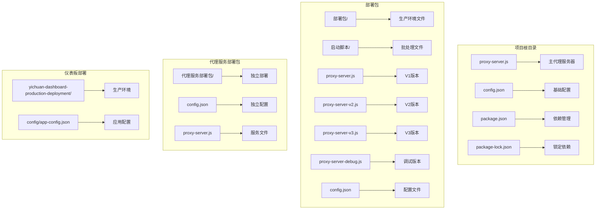
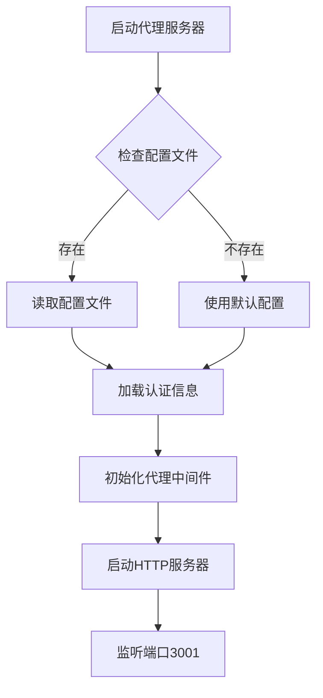
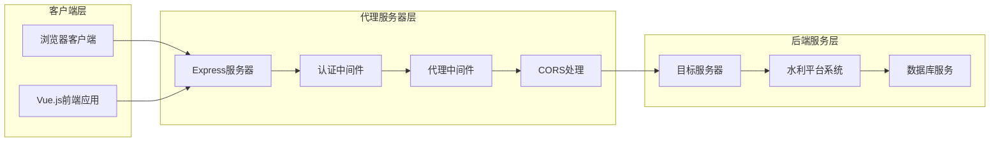
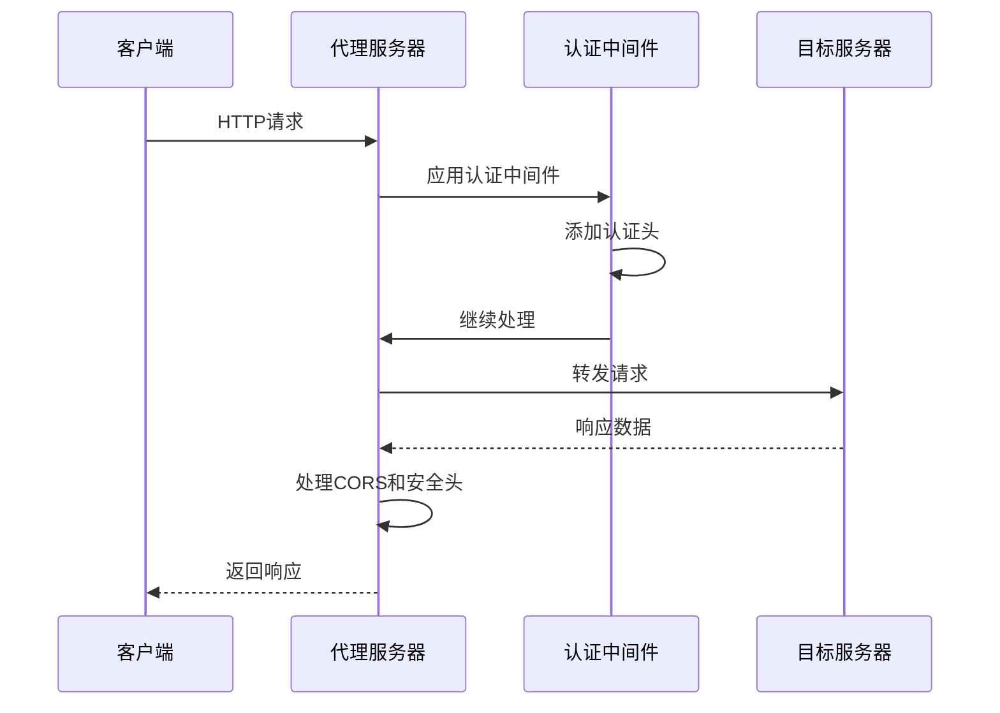
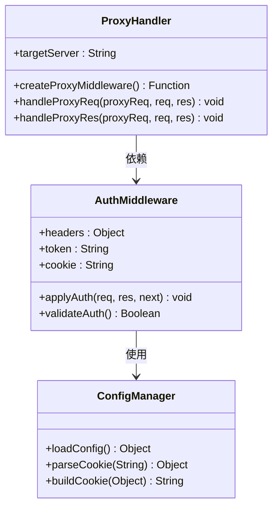
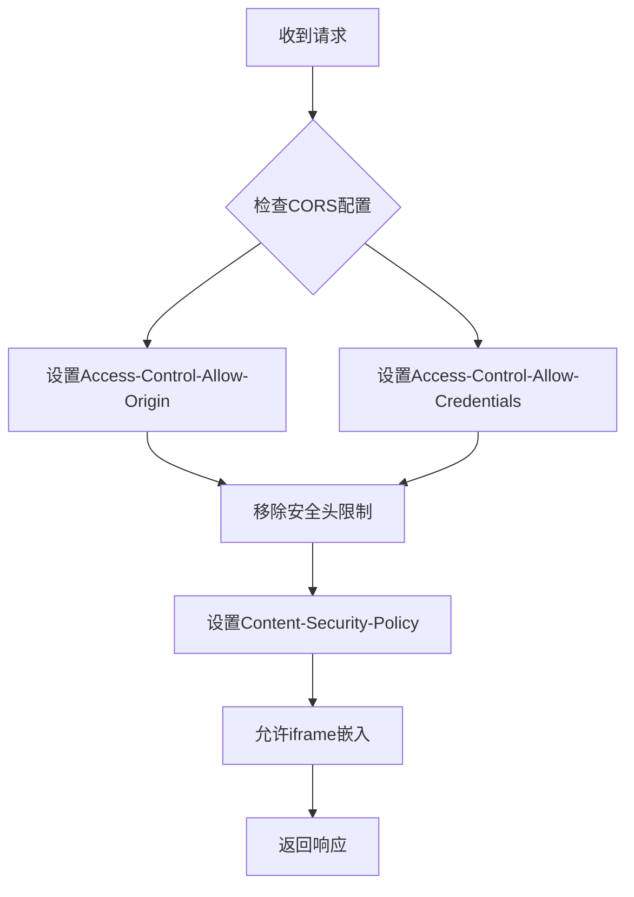
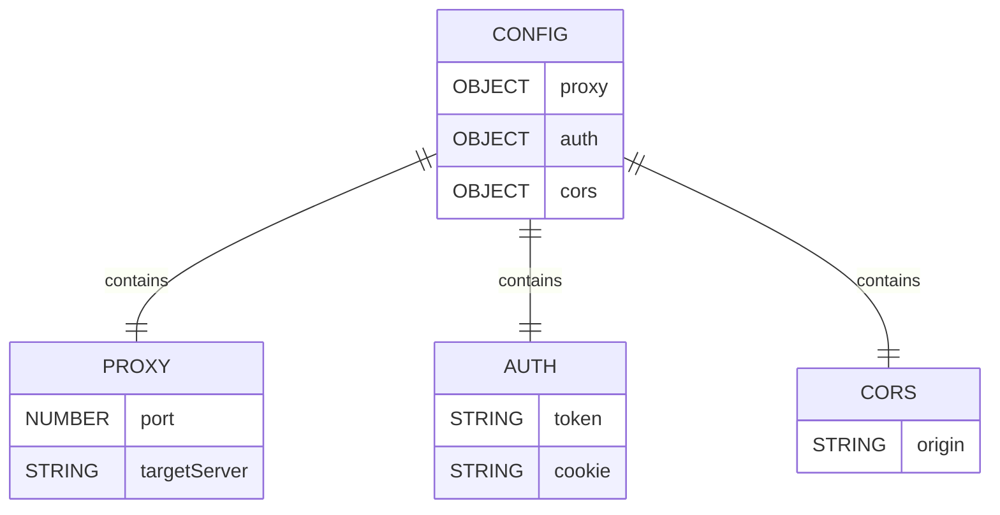
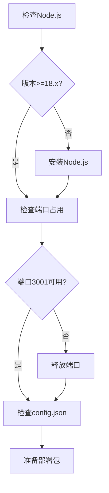
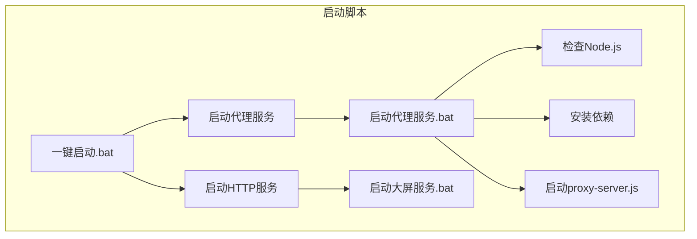

# 代理服务器配置

<cite>
**本文档引用的文件**
- [proxy-server.js](file://proxy-server.js)
- [config.json](file://config.json)
- [package.json](file://package.json)
- [部署包/proxy-server.js](file://部署包/proxy-server.js)
- [部署包/proxy-server-v2.js](file://部署包/proxy-server-v2.js)
- [部署包/proxy-server-v3.js](file://部署包/proxy-server-v3.js)
- [部署包/proxy-server-debug.js](file://部署包/proxy-server-debug.js)
- [部署包/部署文档.md](file://部署包/部署文档.md)
- [部署包/一键启动.bat](file://部署包/一键启动.bat)
- [部署包/启动代理服务.bat](file://部署包/启动代理服务.bat)
- [部署包/启动代理服务-V2.bat](file://部署包/启动代理服务-V2.bat)
- [部署包/启动代理服务-V3.bat](file://部署包/启动代理服务-V3.bat)
- [代理服务部署包/config.json](file://代理服务部署包/config.json)
- [部署包/config.json](file://部署包/config.json)
- [yichuan-dashboard-production-deployment/config/app-config.json](file://yichuan-dashboard-production-deployment/config/app-config.json)
</cite>

## 目录
1. [简介](#简介)
2. [项目结构](#项目结构)
3. [核心组件](#核心组件)
4. [架构概览](#架构概览)
5. [详细组件分析](#详细组件分析)
6. [配置文件详解](#配置文件详解)
7. [部署流程](#部署流程)
8. [版本演进](#版本演进)
9. [故障排除指南](#故障排除指南)
10. [性能考虑](#性能考虑)
11. [结论](#结论)

## 简介

这是一个为宜川县域监测体系整合平台设计的代理服务器配置项目。该项目通过Node.js和Express框架实现了一个智能代理服务器，用于解决前端大屏系统与后端水利平台之间的跨域访问和认证问题。

项目主要特点：
- 支持多种代理服务器版本（V1、V2、V3）
- 动态配置认证信息（Token和Cookie）
- 解决iframe嵌入和跨域访问限制
- 提供完整的部署脚本和监控功能

## 项目结构

**图表来源**
- [部署包/部署文档.md:10-40](file://部署包/部署文档.md#L10-L40)
- [代理服务部署包/config.json:1-14](file://代理服务部署包/config.json#L1-L14)
- [yichuan-dashboard-production-deployment/config/app-config.json:1-53](file://yichuan-dashboard-production-deployment/config/app-config.json#L1-L53)

**章节来源**
- [部署包/部署文档.md:10-40](file://部署包/部署文档.md#L10-L40)
- [项目结构](file://.)

## 核心组件

### 代理服务器核心功能

项目提供了三个主要版本的代理服务器，每个版本都有其特定的功能和优化：

1. **基础版本 (V1)** - 简单直接的代理实现
2. **增强版本 (V2)** - 支持动态Cookie处理和详细日志
3. **完整版本 (V3)** - 最优化的代理实现，完全模拟浏览器行为

### 配置管理系统

**图表来源**
- [部署包/proxy-server.js:9-29](file://部署包/proxy-server.js#L9-L29)
- [部署包/proxy-server-v2.js:9-21](file://部署包/proxy-server-v2.js#L9-L21)
- [部署包/proxy-server-v3.js:9-21](file://部署包/proxy-server-v3.js#L9-L21)

**章节来源**
- [部署包/proxy-server.js:31-35](file://部署包/proxy-server.js#L31-L35)
- [部署包/proxy-server-v2.js:23-26](file://部署包/proxy-server-v2.js#L23-L26)
- [部署包/proxy-server-v3.js:23-26](file://部署包/proxy-server-v3.js#L23-L26)

## 架构概览

**图表来源**
- [proxy-server.js:1-128](file://proxy-server.js#L1-L128)
- [部署包/proxy-server.js:107-134](file://部署包/proxy-server.js#L107-L134)

### 请求处理流程

**图表来源**
- [proxy-server.js:24-62](file://proxy-server.js#L24-L62)
- [部署包/proxy-server.js:46-92](file://部署包/proxy-server.js#L46-L92)

**章节来源**
- [proxy-server.js:24-62](file://proxy-server.js#L24-L62)
- [部署包/proxy-server.js:46-92](file://部署包/proxy-server.js#L46-L92)

## 详细组件分析

### 认证中间件组件

认证中间件是代理服务器的核心组件，负责处理所有请求的认证信息。

**图表来源**
- [部署包/proxy-server-v2.js:27-46](file://部署包/proxy-server-v2.js#L27-L46)
- [部署包/proxy-server-v3.js:31-52](file://部署包/proxy-server-v3.js#L31-L52)

#### 认证中间件实现

认证中间件的主要职责包括：
- 动态设置Authorization头
- 处理和合并Cookie信息
- 添加必要的请求头信息
- 处理响应头的安全策略

**章节来源**
- [部署包/proxy-server-v2.js:47-112](file://部署包/proxy-server-v2.js#L47-L112)
- [部署包/proxy-server-v3.js:75-101](file://部署包/proxy-server-v3.js#L75-L101)

### CORS处理机制

代理服务器实现了完整的CORS处理机制，确保前端应用能够正常访问后端资源。

**图表来源**
- [proxy-server.js:15-19](file://proxy-server.js#L15-L19)
- [部署包/proxy-server.js:77-87](file://部署包/proxy-server.js#L77-L87)

**章节来源**
- [proxy-server.js:47-57](file://proxy-server.js#L47-L57)
- [部署包/proxy-server.js:127-133](file://部署包/proxy-server.js#L127-L133)

### 代理路由配置

代理服务器支持多种路由配置，以满足不同类型的请求处理需求。

| 路由模式 | 匹配规则 | 用途 | 重写规则 |
|---------|---------|------|---------|
| `/dp` | 页面请求 | 代理水利平台页面 | 无 |
| `/api` | API请求 | 重写为`/prod-api` | `^/api` → `/prod-api` |
| `/prod-api` | 直接API请求 | 直接转发 | 无 |
| `/` | 其他请求 | 静态资源 | 无 |

**章节来源**
- [proxy-server.js:64-77](file://proxy-server.js#L64-L77)
- [部署包/proxy-server.js:107-134](file://部署包/proxy-server.js#L107-L134)

## 配置文件详解

### 基础配置结构

配置文件采用JSON格式，包含三个主要部分：

**图表来源**
- [config.json:1-14](file://config.json#L1-L14)
- [部署包/config.json:1-14](file://部署包/config.json#L1-L14)

### 配置参数说明

| 参数名称 | 类型 | 必需 | 默认值 | 描述 |
|---------|------|------|--------|------|
| `proxy.port` | Number | 是 | 3001 | 代理服务器监听端口 |
| `proxy.targetServer` | String | 是 | `http://47.108.54.75:2022` | 目标服务器地址 |
| `auth.token` | String | 是 | 空字符串 | Bearer Token认证 |
| `auth.cookie` | String | 是 | 空字符串 | Cookie字符串 |
| `cors.origin` | String | 是 | `http://localhost:8080` | 允许跨域的来源 |

**章节来源**
- [config.json:2-12](file://config.json#L2-L12)
- [部署包/config.json:2-12](file://部署包/config.json#L2-L12)

### Cookie配置最佳实践

为了确保代理服务器正常工作，Cookie配置需要特别注意以下几点：

1. **完整性**：包含所有必要的认证Cookie字段
2. **时效性**：确保Cookie未过期
3. **格式正确**：严格按照服务器期望的格式
4. **安全性**：避免泄露敏感信息

## 部署流程

### 环境准备

部署前需要确保以下环境要求：

**图表来源**
- [部署包/部署文档.md:44-54](file://部署包/部署文档.md#L44-L54)
- [部署包/一键启动.bat:9-18](file://部署包/一键启动.bat#L9-L18)

### 部署步骤

1. **复制部署包**到目标服务器目录
2. **配置认证信息**在`config.json`中
3. **启动服务**使用一键启动脚本
4. **验证部署**检查服务状态

### 启动脚本分析

**图表来源**
- [部署包/一键启动.bat:39-48](file://部署包/一键启动.bat#L39-L48)
- [部署包/启动代理服务.bat:24-35](file://部署包/启动代理服务.bat#L24-L35)

**章节来源**
- [部署包/一键启动.bat:1-64](file://部署包/一键启动.bat#L1-L64)
- [部署包/启动代理服务.bat:1-46](file://部署包/启动代理服务.bat#L1-L46)

## 版本演进

### V1版本特性

V1版本是最基础的代理实现，具有以下特点：
- 简单直接的配置方式
- 固定的认证信息
- 基础的CORS处理
- 适用于简单的代理需求

### V2版本增强

V2版本在V1基础上增加了：
- 动态Cookie解析和构建
- 详细的日志记录
- 更好的错误处理
- 支持多种认证场景

### V3版本优化

V3版本是最终优化版本：
- 完全模拟浏览器行为
- 支持WebSocket
- 最优化的请求头设置
- 增强的重定向处理

**章节来源**
- [部署包/proxy-server-v2.js:27-56](file://部署包/proxy-server-v2.js#L27-L56)
- [部署包/proxy-server-v3.js:75-99](file://部署包/proxy-server-v3.js#L75-L99)

## 故障排除指南

### 常见问题及解决方案

| 问题类型 | 症状 | 可能原因 | 解决方案 |
|---------|------|---------|---------|
| 启动失败 | 无法启动代理服务 | Node.js版本不兼容 | 升级到Node.js 18.x |
| 端口冲突 | 端口被占用 | 端口3001被其他程序使用 | 结束占用进程或更改端口 |
| 认证失败 | 401未授权错误 | Cookie过期或无效 | 更新config.json中的认证信息 |
| 跨域错误 | CORS相关错误 | CORS配置不正确 | 检查cors.origin设置 |
| iframe加载失败 | 页面无法嵌入 | 安全头限制 | 检查Content-Security-Policy设置 |

### 调试技巧

1. **查看日志输出**：启动时会显示详细的配置信息
2. **使用健康检查端点**：访问`/health`端点检查服务状态
3. **启用调试模式**：使用`proxy-server-debug.js`进行详细调试
4. **检查网络连接**：确保能够访问目标服务器

**章节来源**
- [部署包/部署文档.md:219-249](file://部署包/部署文档.md#L219-L249)
- [部署包/proxy-server-debug.js:45-54](file://部署包/proxy-server-debug.js#L45-L54)

## 性能考虑

### 优化建议

1. **连接池管理**：合理配置代理连接池大小
2. **缓存策略**：对于静态资源考虑适当的缓存策略
3. **超时设置**：根据网络环境调整请求超时时间
4. **并发处理**：合理设置最大并发连接数

### 监控指标

- **响应时间**：监控代理请求的平均响应时间
- **错误率**：跟踪代理请求的失败率
- **内存使用**：监控服务器内存使用情况
- **并发连接**：跟踪当前活跃的连接数

## 结论

这个代理服务器配置项目为宜川县域监测体系提供了一个完整、可靠的解决方案。通过多个版本的演进和优化，项目能够满足不同复杂度的代理需求。

### 主要优势

1. **灵活配置**：支持动态配置认证信息
2. **多版本支持**：提供不同复杂度的代理实现
3. **完整部署**：包含完整的部署脚本和文档
4. **易于维护**：清晰的代码结构和详细的注释

### 发展建议

1. **容器化部署**：考虑使用Docker进行容器化部署
2. **负载均衡**：在高并发场景下考虑负载均衡
3. **安全加固**：增加更多的安全防护措施
4. **监控告警**：集成更完善的监控和告警系统