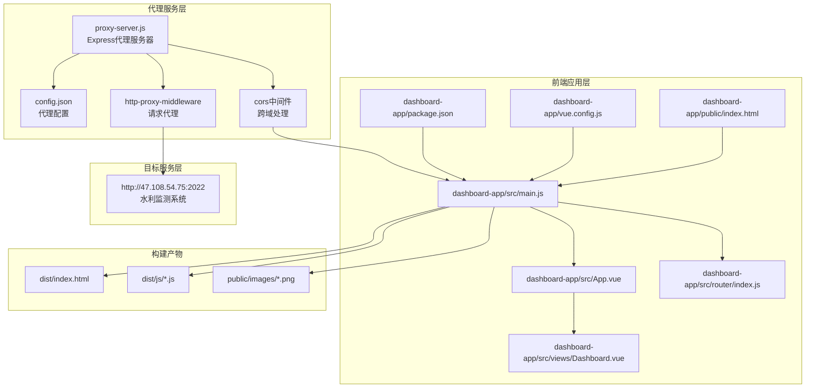
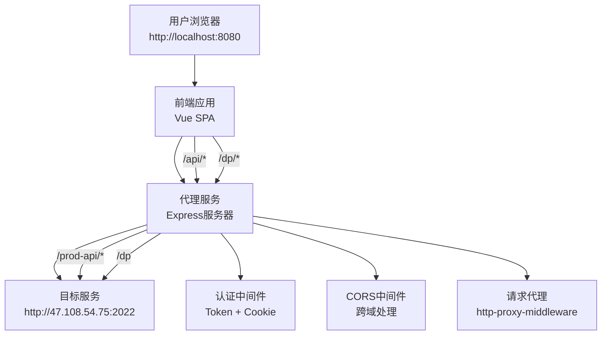
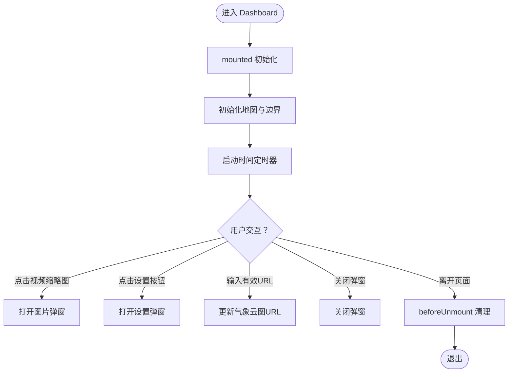
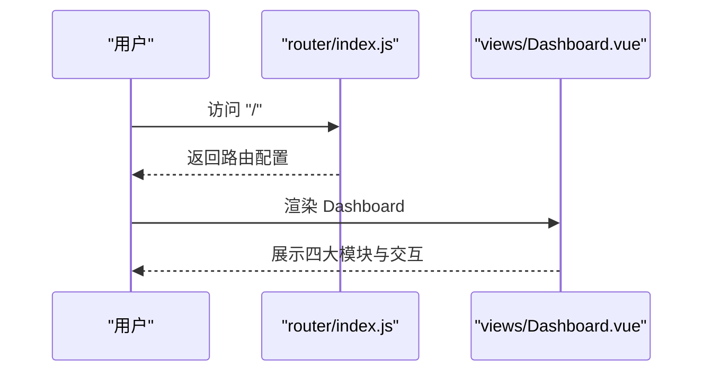
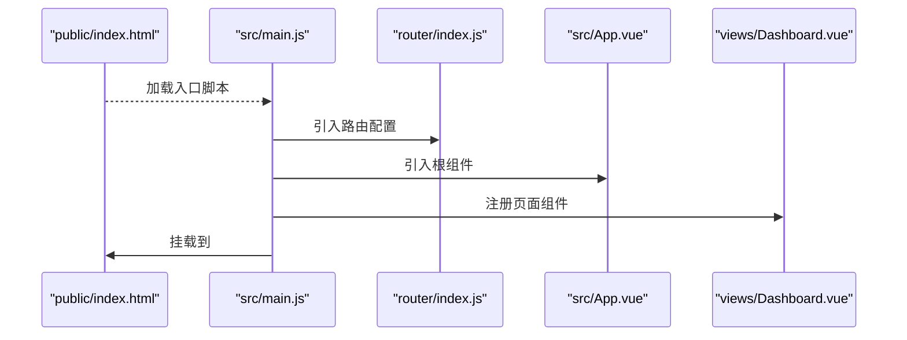
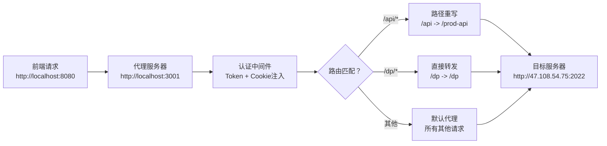
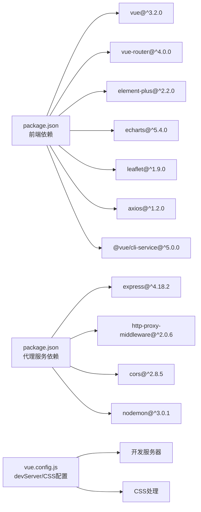

# 开发指南

<cite>
**本文引用的文件**
- [package.json](file://dashboard-app/package.json)
- [vue.config.js](file://dashboard-app/vue.config.js)
- [main.js](file://dashboard-app/src/main.js)
- [App.vue](file://dashboard-app/src/App.vue)
- [router/index.js](file://dashboard-app/src/router/index.js)
- [views/Dashboard.vue](file://dashboard-app/src/views/Dashboard.vue)
- [public/index.html](file://dashboard-app/public/index.html)
- [proxy-server.js](file://proxy-server.js)
- [config.json](file://config.json)
- [部署包/config.json](file://部署包/config.json)
- [代理服务部署包/config.json](file://代理服务部署包/config.json)
- [部署包/启动脚本/start-all.bat](file://部署包/启动脚本/start-all.bat)
- [部署包/启动脚本/start-proxy.bat](file://部署包/启动脚本/start-proxy.bat)
- [部署包/启动脚本/start-http-server.bat](file://部署包/启动脚本/start-http-server.bat)
- [部署包/一键启动.bat](file://部署包/一键启动.bat)
- [部署包说明.txt](file://部署包说明.txt)
- [启动服务器.bat](file://启动服务器.bat)
</cite>

## 目录
1. [简介](#简介)
2. [项目结构](#项目结构)
3. [核心组件](#核心组件)
4. [架构总览](#架构总览)
5. [详细组件分析](#详细组件分析)
6. [代理服务架构](#代理服务架构)
7. [依赖分析](#依赖分析)
8. [性能考虑](#性能考虑)
9. [故障排查指南](#故障排查指南)
10. [结论](#结论)
11. [附录](#附录)

## 简介
本开发指南面向"宜川县域监测体系整合平台"的前端团队，聚焦 Vue.js 3.x 的开发模式与组件规范，结合现有工程结构，提供从环境搭建、编码规范、调试工具、测试策略、构建优化到版本控制与协作流程的完整工作手册。该平台采用 Vue 3 + Vue Router + Element Plus + ECharts + Leaflet/Amap 的技术栈，目标是在 4K 超宽屏大屏环境下实现高可用、可扩展、易维护的可视化监控界面。**新增**代理服务架构支持，实现多服务协同的现代化部署模式。

## 项目结构
项目采用典型的 Vue CLI 3+ 单页应用（SPA）结构，结合独立的代理服务，形成"前端应用 + 认证代理 + 目标服务"的多服务架构。核心目录与职责如下：

- dashboard-app
  - public：静态资源与入口 HTML
  - src：源代码
    - views：页面级组件（当前为 Dashboard）
    - router：路由定义
    - App.vue、main.js：应用入口与根组件
  - 构建配置：vue.config.js
  - 依赖与脚本：package.json
- 代理服务
  - proxy-server.js：Express 代理服务器，处理认证与跨域
  - config.json：代理服务配置文件
- 部署包：包含 dist、public/images 与启动脚本，用于生产环境部署
- 代理服务部署包：独立的代理服务部署包

**图表来源**
- [main.js:1-5](file://dashboard-app/src/main.js#L1-L5)
- [App.vue:1-40](file://dashboard-app/src/App.vue#L1-L40)
- [router/index.js:1-17](file://dashboard-app/src/router/index.js#L1-L17)
- [views/Dashboard.vue:1-175](file://dashboard-app/src/views/Dashboard.vue#L1-L175)
- [public/index.html:1-27](file://dashboard-app/public/index.html#L1-L27)
- [vue.config.js:1-19](file://dashboard-app/vue.config.js#L1-L19)
- [package.json:1-23](file://dashboard-app/package.json#L1-L23)
- [proxy-server.js:1-128](file://proxy-server.js#L1-L128)
- [config.json:1-14](file://config.json#L1-L14)

**章节来源**
- [package.json:1-23](file://dashboard-app/package.json#L1-L23)
- [vue.config.js:1-19](file://dashboard-app/vue.config.js#L1-L19)
- [main.js:1-5](file://dashboard-app/src/main.js#L1-L5)
- [App.vue:1-40](file://dashboard-app/src/App.vue#L1-L40)
- [router/index.js:1-17](file://dashboard-app/src/router/index.js#L1-L17)
- [views/Dashboard.vue:1-175](file://dashboard-app/src/views/Dashboard.vue#L1-L175)
- [public/index.html:1-27](file://dashboard-app/public/index.html#L1-L27)
- [proxy-server.js:1-128](file://proxy-server.js#L1-L128)
- [config.json:1-14](file://config.json#L1-L14)

## 核心组件
- 应用入口与挂载
  - main.js 负责创建 Vue 应用实例、注册路由并挂载到 DOM
- 根组件
  - App.vue 提供全局样式变量与基础布局占位
- 路由
  - router/index.js 定义首页路由与页面组件映射
- 页面组件
  - views/Dashboard.vue 实现四大模块（视频监控墙、视频会议、气象云图、土壤墒情监测），并集成高德地图、弹窗、设置等交互逻辑
- **新增**代理服务
  - proxy-server.js 提供 Express 代理服务器，处理认证头注入、CORS 配置和请求转发

**章节来源**
- [main.js:1-5](file://dashboard-app/src/main.js#L1-L5)
- [App.vue:1-40](file://dashboard-app/src/App.vue#L1-L40)
- [router/index.js:1-17](file://dashboard-app/src/router/index.js#L1-L17)
- [views/Dashboard.vue:1-175](file://dashboard-app/src/views/Dashboard.vue#L1-L175)
- [proxy-server.js:1-128](file://proxy-server.js#L1-L128)

## 架构总览
整体采用"前端应用 -> 代理服务 -> 目标服务"的三层架构。前端应用通过代理服务访问外部水利监测系统，代理服务负责处理认证、跨域和请求转发。

**图表来源**
- [proxy-server.js:24-62](file://proxy-server.js#L24-L62)
- [proxy-server.js:37-62](file://proxy-server.js#L37-L62)
- [proxy-server.js:74-77](file://proxy-server.js#L74-L77)
- [proxy-server.js:64-72](file://proxy-server.js#L64-L72)

## 详细组件分析

### 页面组件：Dashboard
- 结构与职责
  - 顶部标题栏：日期天气、平台标题、系统控制按钮
  - 四大模块容器：视频监控墙、视频会议、气象云图、土壤墒情监测
  - 弹窗：图片预览与气象云图 URL 设置
- 数据与状态
  - 视频列表、参会单位、天气数据、土壤监测指标、当前时间等
- 交互与生命周期
  - mounted 初始化模块宽度、地图、时间；beforeUnmount 清理定时器与地图实例
  - methods 包含地图初始化、边界绘制、弹窗控制、URL 校验等
- 样式与主题
  - 使用 CSS 变量定义科技蓝主题，配合深色背景与渐变效果

**图表来源**
- [views/Dashboard.vue:256-494](file://dashboard-app/src/views/Dashboard.vue#L256-L494)

**章节来源**
- [views/Dashboard.vue:1-1309](file://dashboard-app/src/views/Dashboard.vue#L1-L1309)

### 路由与导航
- 路由定义
  - 首页路径 '/' 对应 Dashboard 页面
- 导航方式
  - 通过 router-view 呈现当前路由组件

**图表来源**
- [router/index.js:1-17](file://dashboard-app/src/router/index.js#L1-L17)
- [views/Dashboard.vue:1-175](file://dashboard-app/src/views/Dashboard.vue#L1-L175)

**章节来源**
- [router/index.js:1-17](file://dashboard-app/src/router/index.js#L1-L17)

### 入口与挂载
- main.js
  - 创建应用实例、注册路由、挂载到 #app
- public/index.html
  - 引入高德地图 API，设置基础样式与 noscript 提示
- App.vue
  - 定义全局 CSS 变量与基础样式

**图表来源**
- [public/index.html:1-27](file://dashboard-app/public/index.html#L1-L27)
- [main.js:1-5](file://dashboard-app/src/main.js#L1-L5)
- [router/index.js:1-17](file://dashboard-app/src/router/index.js#L1-L17)
- [App.vue:1-40](file://dashboard-app/src/App.vue#L1-L40)
- [views/Dashboard.vue:1-175](file://dashboard-app/src/views/Dashboard.vue#L1-L175)

**章节来源**
- [public/index.html:1-27](file://dashboard-app/public/index.html#L1-L27)
- [main.js:1-5](file://dashboard-app/src/main.js#L1-L5)
- [App.vue:1-40](file://dashboard-app/src/App.vue#L1-L40)

## 代理服务架构

### 代理服务器设计
代理服务采用 Express.js 构建，提供多路由处理和认证中间件，实现与目标系统的安全连接。

- **核心功能**
  - 认证中间件：自动注入 Authorization Token 和 Cookie
  - CORS 配置：允许前端域名访问
  - 请求代理：转发 API 请求并修改路径
  - 健康检查：提供 /health 端点

- **路由配置**
  - `/api/*` → 目标服务器 `/prod-api/*`
  - `/dp/*` → 目标服务器 `/dp/*`
  - `/dp-modified` → 重定向到 `/dp`（修改页面中的 API 地址）

**图表来源**
- [proxy-server.js:37-62](file://proxy-server.js#L37-L62)
- [proxy-server.js:74-77](file://proxy-server.js#L74-L77)
- [proxy-server.js:64-72](file://proxy-server.js#L64-L72)

### 配置管理
代理服务通过 JSON 配置文件管理连接参数：

- **proxy 配置**
  - port：代理服务器端口（默认 3001）
  - targetServer：目标服务器地址

- **auth 配置**
  - token：Bearer 认证 Token
  - cookie：用户认证 Cookie

- **cors 配置**
  - origin：允许访问的前端域名

**章节来源**
- [proxy-server.js:1-128](file://proxy-server.js#L1-L128)
- [config.json:1-14](file://config.json#L1-L14)
- [部署包/config.json:1-14](file://部署包/config.json#L1-L14)
- [代理服务部署包/config.json:1-14](file://代理服务部署包/config.json#L1-L14)

## 依赖分析
- 运行时依赖
  - Vue 3、Vue Router 4、Element Plus、ECharts、Leaflet、Axios
  - **新增** Express、http-proxy-middleware、cors
- 构建与开发依赖
  - @vue/cli-service、开发服务器、CSS 提取策略
  - **新增** nodemon（开发模式）
- 构建与运行特性
  - devServer 配置了主机、端口、错误覆盖提示
  - CSS 默认不提取，便于开发调试
  - **新增** 代理服务支持多服务开发模式

**图表来源**
- [package.json:14-22](file://dashboard-app/package.json#L14-L22)
- [package.json:10-17](file://package.json#L10-L17)
- [vue.config.js:3-19](file://dashboard-app/vue.config.js#L3-L19)

**章节来源**
- [package.json:1-23](file://dashboard-app/package.json#L1-L23)
- [package.json:1-20](file://package.json#L1-L20)
- [vue.config.js:1-19](file://dashboard-app/vue.config.js#L1-L19)

## 性能考虑
- 构建与打包
  - 当前 CSS 默认不提取，有利于开发阶段热更新；生产构建建议开启 CSS 提取以减少请求与提升首屏渲染
  - 可按需引入 Element Plus 组件与样式，避免全量引入导致体积膨胀
- 运行时性能
  - 地图实例在组件销毁时进行清理，避免内存泄漏
  - 定时器在组件卸载时清理，防止后台任务持续执行
  - **新增** 代理服务使用连接池复用，减少重复连接开销
- 资源加载
  - 高德地图 API 通过公共 HTML 引入，确保网络连通性
  - 图片资源位于 public/images，保证静态资源稳定访问
  - **新增** 代理服务缓存认证信息，避免重复认证

**章节来源**
- [vue.config.js:16-18](file://dashboard-app/vue.config.js#L16-L18)
- [views/Dashboard.vue:485-494](file://dashboard-app/src/views/Dashboard.vue#L485-L494)
- [public/index.html:9-10](file://dashboard-app/public/index.html#L9-L10)
- [proxy-server.js:24-34](file://proxy-server.js#L24-L34)

## 故障排查指南
- 开发服务器无法启动或端口占用
  - 检查 devServer 端口与主机配置，确认端口未被占用
  - **新增** 检查代理服务端口 3001 是否被占用
- 地图无法加载
  - 确认网络连通性与高德地图 API Key 有效
  - 检查 public/index.html 中地图脚本是否正确加载
- 弹窗与设置无效
  - 确认弹窗触发逻辑与 v-if 条件
  - URL 设置需满足有效性校验
- **新增** 代理服务相关问题
  - 检查 config.json 配置是否正确
  - 验证认证 Token 和 Cookie 是否有效
  - 使用 /test-auth 端点测试认证状态
  - 查看代理服务器日志输出
- **新增** 多服务部署问题
  - 确保 dist 与 public/images 同级放置
  - 使用一键启动脚本启动所有服务
  - 检查服务启动顺序：代理服务先于 HTTP 服务启动
  - 验证端口占用情况：3001 和 8080

**章节来源**
- [vue.config.js:5-15](file://dashboard-app/vue.config.js#L5-L15)
- [public/index.html:9-10](file://dashboard-app/public/index.html#L9-L10)
- [views/Dashboard.vue:452-482](file://dashboard-app/src/views/Dashboard.vue#L452-L482)
- [proxy-server.js:98-123](file://proxy-server.js#L98-L123)
- [部署包说明.txt:27-61](file://部署包说明.txt#L27-L61)
- [启动服务器.bat:20-82](file://启动服务器.bat#L20-L82)
- [部署包/启动脚本/start-all.bat:40-49](file://部署包/启动脚本/start-all.bat#L40-L49)
- [部署包/启动脚本/start-proxy.bat:22-27](file://部署包/启动脚本/start-proxy.bat#L22-L27)
- [部署包/启动脚本/start-http-server.bat:40-46](file://部署包/启动脚本/start-http-server.bat#L40-L46)

## 结论
本指南基于现有工程提供了从环境配置、组件开发、调试与测试、构建优化到部署与运维的全流程实践建议。**新增**的代理服务架构实现了前后端分离的现代化部署模式，提高了系统的安全性与可维护性。建议团队在保持现有主题风格与模块划分的基础上，逐步完善单元测试、集成测试与自动化部署流程，持续优化性能与可维护性。

## 附录

### 开发环境配置与最佳实践
- Node.js 与包管理
  - 使用 Node.js LTS 版本，推荐使用 npm 或 pnpm
  - 通过 package.json 的 scripts 执行开发、构建与代码检查
  - **新增** 代理服务使用 nodemon 实现热重载
- IDE 与插件
  - VSCode 推荐插件：ESLint、Prettier、Vetur/Volar、Vue Language Features
- 本地开发
  - 使用 npm run serve 启动开发服务器，默认端口 8080
  - **新增** 同时启动代理服务：npm run dev（在代理服务目录）
  - 打开浏览器访问 http://localhost:8080 查看页面

**章节来源**
- [package.json:5-8](file://dashboard-app/package.json#L5-L8)
- [package.json:6-8](file://package.json#L6-L8)
- [vue.config.js:5-15](file://dashboard-app/vue.config.js#L5-L15)

### Vue.js 3.x 开发模式与组件开发规范
- 组件组织
  - 页面组件集中于 views，按功能拆分子模块，避免单文件过长
  - 使用 Composition API（setup、ref、reactive、computed、watch）组织逻辑
- 命名约定
  - 组件文件使用帕斯卡命名（如 Dashboard.vue）
  - 路由与页面组件名称语义清晰，与业务一致
- 样式组织
  - 使用 scoped 样式隔离模块样式
  - 全局变量统一在根组件定义，主题色与尺寸通过 CSS 变量管理
- 交互与状态
  - 将副作用（定时器、地图实例）集中在生命周期钩子中初始化与清理
  - 表单与输入校验在组件内部完成，必要时通过 props 与 emits 与父组件通信

**章节来源**
- [views/Dashboard.vue:177-494](file://dashboard-app/src/views/Dashboard.vue#L177-L494)
- [App.vue:13-40](file://dashboard-app/src/App.vue#L13-L40)

### 代码规范与命名约定
- 文件与目录
  - views、components、router、styles、assets 分类明确
  - 静态资源放入 public，动态资源放入 src/assets
- 命名
  - 组件文件：PascalCase
  - 变量与函数：camelCase
  - 常量：UPPER_SNAKE_CASE
- 注释与文档
  - 关键函数与复杂逻辑添加注释说明
  - 组件导出的 props、emits、slots 明确类型与用途

**章节来源**
- [views/Dashboard.vue:177-494](file://dashboard-app/src/views/Dashboard.vue#L177-L494)

### 调试技巧与常用开发工具
- 浏览器开发者工具
  - 使用 Elements/Console/Network 定位样式、脚本与资源问题
  - **新增** 检查代理服务器的网络请求和响应头
- Vue DevTools
  - 安装 Vue DevTools 插件，查看组件树、状态与事件流
- ESLint/Prettier
  - 通过 npm run lint 执行代码检查，统一格式与风格
- 日志与断点
  - 在关键生命周期与交互回调中添加日志，定位异常
  - **新增** 代理服务添加详细的请求日志输出

**章节来源**
- [package.json:8-8](file://dashboard-app/package.json#L8-L8)
- [vue.config.js:9-14](file://dashboard-app/vue.config.js#L9-L14)
- [proxy-server.js:30-31](file://proxy-server.js#L30-L31)

### 单元测试与集成测试编写指南
- 单元测试（建议）
  - 针对纯函数与计算属性编写测试，使用 Vitest 或 Jest
  - 示例场景：URL 校验、时间格式化、数据聚合
- 集成测试（建议）
  - 使用 Cypress 或 Playwright 编写端到端测试
  - 覆盖关键用户路径：地图加载、弹窗交互、设置保存
  - **新增** 测试代理服务的认证和请求转发功能
- 测试文件组织
  - 在 src 下新增 __tests__ 或 tests 目录，按模块划分
  - 使用 describe/it/test 命名清晰的用例

**章节来源**
- [views/Dashboard.vue:474-482](file://dashboard-app/src/views/Dashboard.vue#L474-L482)
- [proxy-server.js:98-123](file://proxy-server.js#L98-L123)

### 构建优化与性能调优
- 代码分割与懒加载
  - 对非首屏模块使用异步组件与路由懒加载
- 资源优化
  - 图片压缩与 WebP 转换，按需引入第三方库
  - CSS 提取与 Tree Shaking，移除未使用代码
- 运行时优化
  - 地图与图表实例在组件销毁时清理
  - 避免在模板中进行复杂计算，使用 computed 与缓存
  - **新增** 代理服务连接池优化，减少重复连接

**章节来源**
- [vue.config.js:16-18](file://dashboard-app/vue.config.js#L16-L18)
- [views/Dashboard.vue:485-494](file://dashboard-app/src/views/Dashboard.vue#L485-L494)
- [proxy-server.js:24-34](file://proxy-server.js#L24-L34)

### 版本控制与协作开发最佳实践
- 分支策略
  - develop/main 主干分支，feature/* 新功能分支，hotfix/* 紧急修复分支
- 提交规范
  - 使用 Conventional Commits：feat、fix、docs、style、refactor、test、chore
- 代码评审
  - PR 必须通过至少一次评审，合并前执行 lint 与测试
- 依赖管理
  - 锁定版本号，定期更新安全补丁
- 发布流程
  - 本地构建验证 -> CI 自动化测试 -> 生成 dist -> 部署包打包 -> 部署验证
  - **新增** 代理服务配置文件版本管理

**章节来源**
- [package.json:1-23](file://dashboard-app/package.json#L1-L23)
- [package.json:1-20](file://package.json#L1-L20)
- [部署包说明.txt:27-61](file://部署包说明.txt#L27-L61)

### 标准化工作流程
- 开发流程
  - 新需求 -> 设计组件与接口 -> 编码 -> 单测 -> 集成测试 -> 代码评审 -> 合并
  - **新增** 代理服务配置与认证信息同步更新
- 部署流程
  - 本地构建 -> 生成 dist 与 public/images -> 打包部署包 -> 一键启动所有服务 -> 访问验证
  - **新增** 多服务启动顺序和健康检查
- 回滚与监控
  - 记录每次发布版本与变更日志，出现问题及时回滚
  - **新增** 代理服务健康检查和日志监控

**章节来源**
- [部署包说明.txt:27-61](file://部署包说明.txt#L27-L61)
- [启动服务器.bat:43-82](file://启动服务器.bat#L43-L82)
- [部署包/启动脚本/start-all.bat:37-59](file://部署包/启动脚本/start-all.bat#L37-L59)
- [部署包/启动脚本/start-proxy.bat:44-51](file://部署包/启动脚本/start-proxy.bat#L44-L51)
- [部署包/启动脚本/start-http-server.bat:48-57](file://部署包/启动脚本/start-http-server.bat#L48-L57)

### 多服务架构部署指南
- **一键启动脚本**
  - start-all.bat：同时启动代理服务和 HTTP 服务
  - start-proxy.bat：单独启动代理服务
  - start-http-server.bat：单独启动 HTTP 服务
- **服务配置**
  - 代理服务：端口 3001，目标服务器 http://47.108.54.75:2022
  - 前端服务：端口 8080，静态资源 dist/
- **启动顺序**
  1. 启动代理服务（3001端口）
  2. 等待2秒
  3. 启动 HTTP 服务（8080端口）
- **健康检查**
  - 代理服务：http://localhost:3001/health
  - 前端应用：http://localhost:8080/

**章节来源**
- [部署包/启动脚本/start-all.bat:1-65](file://部署包/启动脚本/start-all.bat#L1-L65)
- [部署包/启动脚本/start-proxy.bat:1-54](file://部署包/启动脚本/start-proxy.bat#L1-L54)
- [部署包/启动脚本/start-http-server.bat:1-60](file://部署包/启动脚本/start-http-server.bat#L1-L60)
- [proxy-server.js:97-100](file://proxy-server.js#L97-L100)