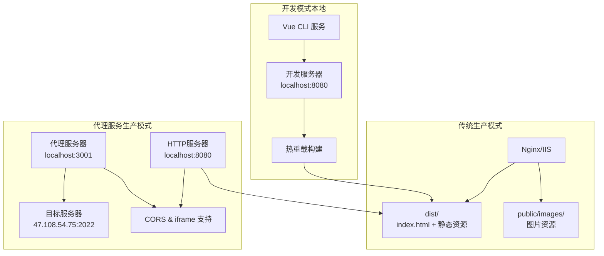
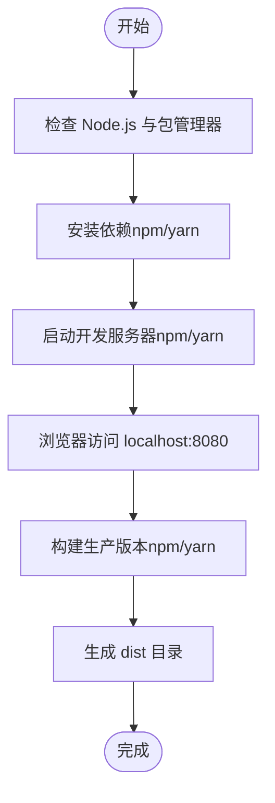
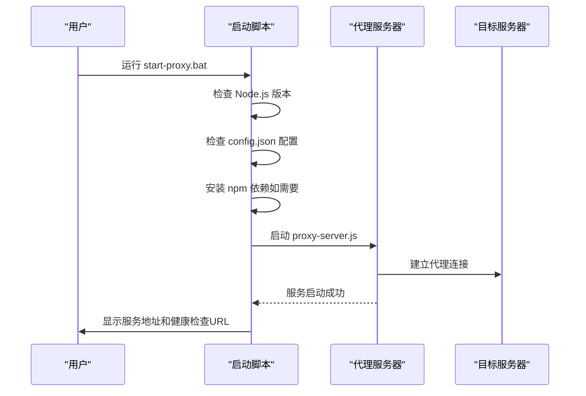
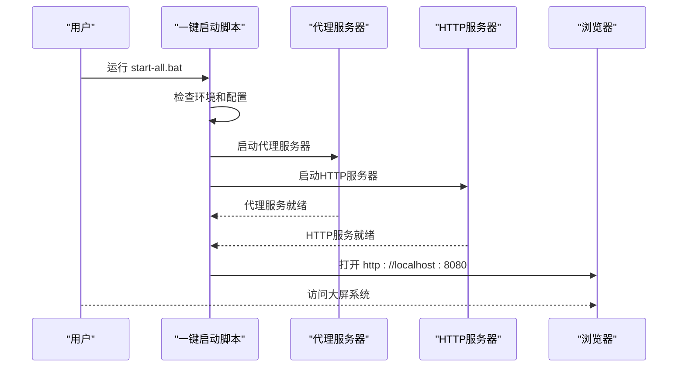
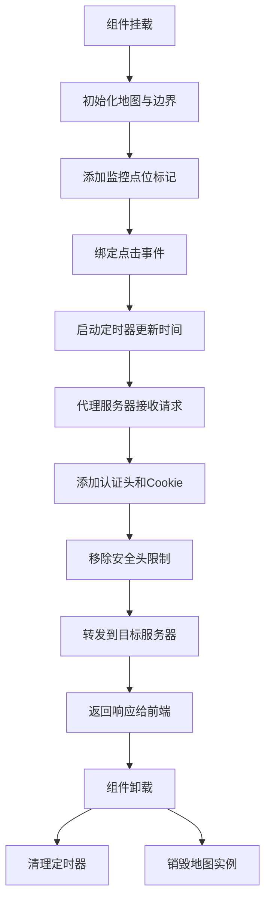
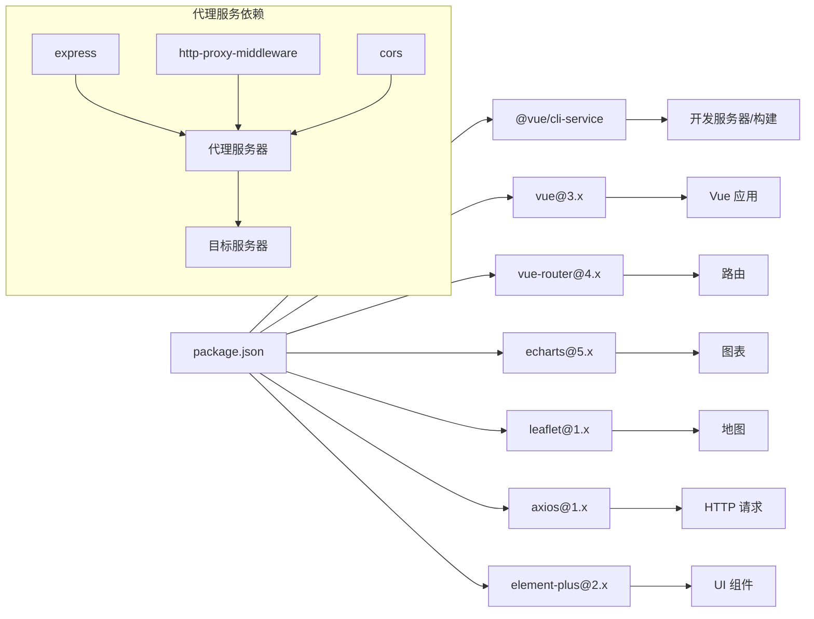

# 快速开始

<cite>
**本文引用的文件**
- [dashboard-app/package.json](file://dashboard-app/package.json)
- [dashboard-app/vue.config.js](file://dashboard-app/vue.config.js)
- [dashboard-app/src/main.js](file://dashboard-app/src/main.js)
- [dashboard-app/src/App.vue](file://dashboard-app/src/App.vue)
- [dashboard-app/src/router/index.js](file://dashboard-app/src/router/index.js)
- [dashboard-app/src/views/Dashboard.vue](file://dashboard-app/src/views/Dashboard.vue)
- [代理服务部署包/部署说明.txt](file://代理服务部署包/部署说明.txt)
- [代理服务部署包/config.json](file://代理服务部署包/config.json)
- [代理服务部署包/proxy-server.js](file://代理服务部署包/proxy-server.js)
- [代理服务部署包/启动脚本/start-proxy.bat](file://代理服务部署包/启动脚本/start-proxy.bat)
- [代理服务部署包/启动脚本/stop-proxy.bat](file://代理服务部署包/启动脚本/stop-proxy.bat)
- [部署包/部署包说明.txt](file://部署包/部署包说明.txt)
- [部署包/启动脚本/启动服务器.bat](file://部署包/启动脚本/启动服务器.bat)
- [部署包/启动脚本/停止服务器.bat](file://部署包/启动脚本/停止服务器.bat)
- [启动服务器.bat](file://启动服务器.bat)
- [停止服务器.bat](file://停止服务器.bat)
- [package.json](file://package.json)
</cite>

## 更新摘要
**变更内容**
- 新增代理服务部署包相关内容和启动指导
- 更新部署步骤，增加独立代理服务器的配置和启动流程
- 新增代理服务器的技术规格、配置说明和故障排除指南
- 完善多服务协同部署的架构说明

## 目录
1. [简介](#简介)
2. [项目结构](#项目结构)
3. [核心组件](#核心组件)
4. [架构概览](#架构概览)
5. [详细组件分析](#详细组件分析)
6. [依赖关系分析](#依赖关系分析)
7. [性能考虑](#性能考虑)
8. [故障排除指南](#故障排除指南)
9. [结论](#结论)
10. [附录](#附录)

## 简介
本指南面向首次接触"宜川县域监测体系整合平台"的用户，帮助您在最短时间内完成开发环境搭建、项目运行与部署。该平台包含三种运行方式：
- 开发模式：基于 Vue CLI 的前端应用，支持热重载与源码调试。
- 生产模式（传统部署）：静态部署包，通过 Nginx/IIS 提供服务。
- 生产模式（代理服务部署）：包含独立代理服务器的完整部署包，支持认证代理和多服务协同。

无论选择哪种方式，本指南都将提供清晰的步骤、常见问题排查与解决方案，确保您顺利启动系统。

## 项目结构
项目采用前后端分离的结构，核心由以下部分组成：
- dashboard-app：Vue 3 前端工程，包含路由、视图组件与构建配置。
- 代理服务部署包：独立的 Node.js 代理服务器，支持认证代理、CORS 解决和 iframe 嵌入。
- 部署包：已构建的静态资源包，包含 dist、public/images 以及可选的启动脚本。
- Windows 批处理脚本：用于一键启动/停止各服务并打开浏览器。

```mermaid
graph TB
subgraph "开发模式"
DAPP["dashboard-app<br/>Vue 3 应用"]
PKG["package.json<br/>脚本与依赖"]
VCFG["vue.config.js<br/>开发服务器配置"]
MAIN["src/main.js<br/>入口"]
APP["src/App.vue<br/>根组件"]
ROUTER["src/router/index.js<br/>路由"]
VIEW["src/views/Dashboard.vue<br/>主视图"]
end
subgraph "代理服务部署包"
PROXY["proxy-server.js<br/>代理服务器"]
CONFIG["config.json<br/>配置文件"]
START["start-proxy.bat<br/>启动脚本"]
STOP["stop-proxy.bat<br/>停止脚本"]
END
subgraph "生产模式传统部署"
DIST["dist/<br/>构建产物"]
PUBIMG["public/images/<br/>静态图片"]
START2["启动服务器.bat<br/>启动脚本"]
STOP2["停止服务器.bat<br/>停止脚本"]
DOC["部署包说明.txt<br/>部署说明"]
end
subgraph "生产模式代理服务部署"
HTTP["http-server<br/>静态服务器"]
ALLSTART["start-all.bat<br/>一键启动"]
ALLSTOP["stop-all.bat<br/>一键停止"]
end
DAPP --> PKG
DAPP --> VCFG
DAPP --> MAIN
MAIN --> APP
MAIN --> ROUTER
ROUTER --> VIEW
VIEW --> PROXY
PROXY --> CONFIG
PROXY --> START
PROXY --> STOP
PROXY --> HTTP
HTTP --> DIST
DIST --> START2
PUBIMG --> START2
START2 --> STOP2
START --> STOP
START2 --> STOP2
ALLSTART --> START
ALLSTART --> START2
ALLSTOP --> STOP
ALLSTOP --> STOP2
DOC --> START2
```

**图表来源**
- [dashboard-app/package.json:1-23](file://dashboard-app/package.json#L1-L23)
- [dashboard-app/vue.config.js:1-19](file://dashboard-app/vue.config.js#L1-L19)
- [dashboard-app/src/main.js:1-5](file://dashboard-app/src/main.js#L1-L5)
- [dashboard-app/src/App.vue:1-40](file://dashboard-app/src/App.vue#L1-L40)
- [dashboard-app/src/router/index.js:1-17](file://dashboard-app/src/router/index.js#L1-L17)
- [dashboard-app/src/views/Dashboard.vue:1-1309](file://dashboard-app/src/views/Dashboard.vue#L1-L1309)
- [代理服务部署包/proxy-server.js:1-149](file://代理服务部署包/proxy-server.js#L1-L149)
- [代理服务部署包/config.json:1-14](file://代理服务部署包/config.json#L1-L14)
- [代理服务部署包/启动脚本/start-proxy.bat:1-55](file://代理服务部署包/启动脚本/start-proxy.bat#L1-L55)
- [代理服务部署包/启动脚本/stop-proxy.bat:1-28](file://代理服务部署包/启动脚本/stop-proxy.bat#L1-L28)
- [部署包/部署包说明.txt:1-120](file://部署包/部署包说明.txt#L1-L120)
- [部署包/启动脚本/启动服务器.bat:1-82](file://部署包/启动脚本/启动服务器.bat#L1-L82)
- [部署包/启动脚本/停止服务器.bat:1-52](file://部署包/启动脚本/停止服务器.bat#L1-L52)

**章节来源**
- [dashboard-app/package.json:1-23](file://dashboard-app/package.json#L1-L23)
- [dashboard-app/vue.config.js:1-19](file://dashboard-app/vue.config.js#L1-L19)
- [代理服务部署包/部署说明.txt:1-112](file://代理服务部署包/部署说明.txt#L1-L112)
- [部署包/部署包说明.txt:1-120](file://部署包/部署包说明.txt#L1-L120)

## 核心组件
- Vue 应用入口与路由
  - 入口文件负责挂载根组件与注册路由。
  - 路由定义了首页路径与对应的视图组件。
- 主题与样式
  - 根组件定义了科技蓝主题变量与全局样式，确保深色背景与统一视觉风格。
- 主视图组件
  - Dashboard.vue 包含视频监控墙、视频会议、气象云图与土壤墒情监测四大模块，具备地图集成、图片弹窗与设置面板等功能。
- 代理服务器
  - 独立的 Node.js 代理服务，支持认证代理、CORS 解决和 iframe 嵌入，监听端口 3001。
- HTTP 静态服务器
  - 基于 http-server 的静态资源服务，监听端口 8080，提供大屏前端文件。

**章节来源**
- [dashboard-app/src/main.js:1-5](file://dashboard-app/src/main.js#L1-L5)
- [dashboard-app/src/router/index.js:1-17](file://dashboard-app/src/router/index.js#L1-L17)
- [dashboard-app/src/App.vue:1-40](file://dashboard-app/src/App.vue#L1-L40)
- [dashboard-app/src/views/Dashboard.vue:1-1309](file://dashboard-app/src/views/Dashboard.vue#L1-L1309)
- [代理服务部署包/proxy-server.js:1-149](file://代理服务部署包/proxy-server.js#L1-L149)
- [package.json:1-20](file://package.json#L1-L20)

## 架构概览
开发、传统生产和代理服务部署三种运行模式的架构对比：



**图表来源**
- [dashboard-app/vue.config.js:5-15](file://dashboard-app/vue.config.js#L5-L15)
- [代理服务部署包/proxy-server.js:64-92](file://代理服务部署包/proxy-server.js#L64-L92)
- [部署包/部署包说明.txt:38-44](file://部署包/部署包说明.txt#L38-L44)

## 详细组件分析

### 开发环境准备与安装
- 前置条件
  - Node.js：建议使用长期支持版本（LTS），确保 npm/yarn 可用。
  - 包管理器：推荐使用 npm 或 yarn。
- 克隆与安装
  - 进入 dashboard-app 目录，执行安装命令以下载依赖。
- 启动开发服务器
  - 执行开发脚本后，浏览器将自动打开 localhost:8080。
- 构建生产版本
  - 执行构建脚本生成 dist 目录，包含生产环境所需的静态文件。



**图表来源**
- [dashboard-app/package.json:5-9](file://dashboard-app/package.json#L5-L9)
- [dashboard-app/vue.config.js:5-15](file://dashboard-app/vue.config.js#L5-L15)

**章节来源**
- [dashboard-app/package.json:1-23](file://dashboard-app/package.json#L1-L23)
- [dashboard-app/vue.config.js:1-19](file://dashboard-app/vue.config.js#L1-L19)

### 代理服务部署与启动
**新增** 代理服务部署包提供了独立的认证代理服务器，支持以下功能：
- 代理访问后端水利平台
- 自动添加认证 Cookie 和 Token
- 解决跨域和 iframe 嵌入限制
- 移除 X-Frame-Options 安全头

- 部署包内容
  - proxy-server.js：代理服务器主程序，基于 Express 和 http-proxy-middleware。
  - config.json：配置文件，包含代理端口、目标服务器、认证信息和 CORS 设置。
  - 启动脚本：start-proxy.bat 和 stop-proxy.bat，支持自动依赖安装和进程管理。
- 启动流程
  - 确认已安装 Node.js v18.x LTS 或更高版本。
  - 配置 config.json 中的目标服务器地址和认证信息。
  - 执行启动脚本，自动安装依赖并启动代理服务器。
  - 访问 http://localhost:3001/health 验证服务状态。
- 停止服务
  - 执行停止脚本，自动查找并终止 3001 端口进程。



**图表来源**
- [代理服务部署包/部署说明.txt:24-64](file://代理服务部署包/部署说明.txt#L24-L64)
- [代理服务部署包/启动脚本/start-proxy.bat:9-52](file://代理服务部署包/启动脚本/start-proxy.bat#L9-L52)
- [代理服务部署包/proxy-server.js:136-148](file://代理服务部署包/proxy-server.js#L136-L148)

**章节来源**
- [代理服务部署包/部署说明.txt:1-112](file://代理服务部署包/部署说明.txt#L1-L112)
- [代理服务部署包/config.json:1-14](file://代理服务部署包/config.json#L1-L14)
- [代理服务部署包/proxy-server.js:1-149](file://代理服务部署包/proxy-server.js#L1-L149)
- [代理服务部署包/启动脚本/start-proxy.bat:1-55](file://代理服务部署包/启动脚本/start-proxy.bat#L1-L55)
- [代理服务部署包/启动脚本/stop-proxy.bat:1-28](file://代理服务部署包/启动脚本/stop-proxy.bat#L1-L28)

### 生产环境部署与启动脚本
**更新** 生产环境现在支持两种部署方式：

#### 传统部署方式
- 部署包内容
  - dist：已构建的生产文件（index.html、css、js、favicon.ico）。
  - public/images：图片资源文件。
  - 启动脚本：包含 Nginx 启动与停止脚本及可选的 Nginx 配置文件。
- 启动流程
  - 确认已安装 Nginx 并位于默认路径。
  - 确认 dist 目录存在 index.html。
  - 执行启动脚本，自动复制配置文件并启动服务，随后打开浏览器访问 http://localhost。
- 停止服务
  - 执行停止脚本，尝试优雅停止 Nginx，若仍有残留进程则强制结束。

#### 代理服务部署方式
- 部署包内容
  - 包含传统部署包的所有内容，外加代理服务器和启动脚本。
  - 支持一键启动所有服务或分别启动代理服务器和 HTTP 服务器。
- 启动流程
  - 配置代理服务器的认证信息（Cookie 和 Token）。
  - 启动代理服务器（端口 3001）和 HTTP 服务器（端口 8080）。
  - 访问 http://localhost:8080 访问大屏系统，http://localhost:3001 访问代理服务。
- 停止服务
  - 执行停止脚本，停止所有相关服务进程。



**图表来源**
- [部署包/部署包说明.txt:41-67](file://部署包/部署包说明.txt#L41-L67)
- [部署包/启动脚本/启动服务器.bat:20-57](file://部署包/启动脚本/启动服务器.bat#L20-L57)
- [部署包/启动脚本/启动服务器.bat:59-77](file://部署包/启动脚本/启动服务器.bat#L59-L77)

**章节来源**
- [部署包/部署包说明.txt:1-120](file://部署包/部署包说明.txt#L1-L120)
- [部署包/启动脚本/启动服务器.bat:1-82](file://部署包/启动脚本/启动服务器.bat#L1-L82)
- [部署包/启动脚本/停止服务器.bat:1-52](file://部署包/启动脚本/停止服务器.bat#L1-L52)
- [启动服务器.bat:1-82](file://启动服务器.bat#L1-L82)
- [停止服务器.bat:1-52](file://停止服务器.bat#L1-L52)

### 组件交互与数据流
- 路由与视图
  - 路由将根路径映射至 Dashboard 视图，视图内包含多个模块区域与交互控件。
- 地图与事件
  - 视图初始化时创建地图实例，添加边界、河流、水库与乡镇标签，并为监控点位绑定点击事件以打开图片弹窗。
- 实时信息
  - 页面定时更新日期与时间，组件卸载时清理定时器与地图实例，避免内存泄漏。
- 代理服务交互
  - 代理服务器接收来自前端的请求，自动添加认证头和 Cookie。
  - 解决跨域问题，移除 iframe 嵌入限制，支持后端水利平台的嵌入。



**图表来源**
- [dashboard-app/src/views/Dashboard.vue:256-266](file://dashboard-app/src/views/Dashboard.vue#L256-L266)
- [dashboard-app/src/views/Dashboard.vue:278-341](file://dashboard-app/src/views/Dashboard.vue#L278-L341)
- [dashboard-app/src/views/Dashboard.vue:485-494](file://dashboard-app/src/views/Dashboard.vue#L485-L494)
- [代理服务部署包/proxy-server.js:46-92](file://代理服务部署包/proxy-server.js#L46-L92)

**章节来源**
- [dashboard-app/src/router/index.js:1-17](file://dashboard-app/src/router/index.js#L1-L17)
- [dashboard-app/src/views/Dashboard.vue:1-1309](file://dashboard-app/src/views/Dashboard.vue#L1-L1309)
- [代理服务部署包/proxy-server.js:1-149](file://代理服务部署包/proxy-server.js#L1-L149)

## 依赖关系分析
- 开发依赖
  - Vue 3、Vue Router 4、@vue/cli-service、ECharts、Leaflet、Axios、Element Plus 等。
- 构建与开发服务器
  - 通过 Vue CLI 服务提供开发服务器、热重载与构建能力。
- 生产部署
  - 依赖静态 Web 服务器（如 Nginx/IIS）提供 dist 与 public/images 资源。
- 代理服务依赖
  - Express、http-proxy-middleware、cors 等 Node.js 依赖，提供代理和认证功能。



**图表来源**
- [dashboard-app/package.json:14-22](file://dashboard-app/package.json#L14-L22)
- [package.json:10-17](file://package.json#L10-L17)

**章节来源**
- [dashboard-app/package.json:1-23](file://dashboard-app/package.json#L1-L23)
- [package.json:1-20](file://package.json#L1-L20)

## 性能考虑
- 开发模式
  - 使用 Vue CLI 的开发服务器，默认启用热重载，适合快速迭代。
  - CSS 默认不单独提取，有利于开发阶段的快速构建。
- 生产模式
  - 传统部署：部署包已构建完成，建议配合 CDN 与缓存策略提升加载速度。
  - 代理服务部署：代理服务器支持连接复用和请求缓存，减少重复请求。
  - 地图与图片资源较多，建议优化图片尺寸与格式，减少首屏加载时间。
- 代理服务性能
  - 代理服务器监听端口 3001，支持并发请求处理。
  - 自动移除安全头限制，提高 iframe 嵌入性能。
  - 支持路径重写，优化 API 请求路由。

## 故障排除指南
- 开发服务器无法启动
  - 端口占用：开发服务器默认监听 8080 端口，若被占用请修改配置或释放端口。
  - 依赖缺失：重新执行安装命令，确保 node_modules 完整。
- 构建失败
  - 检查 Node.js 版本是否满足要求；升级到 LTS 版本通常可解决兼容性问题。
- 传统生产环境无法访问
  - 确认 dist 目录存在且包含 index.html。
  - 确认 Nginx 已正确安装并可访问默认路径。
  - 若启动脚本提示配置错误，请检查 nginx.conf 是否存在且语法正确。
- 代理服务启动失败
  - 端口占用：代理服务器默认监听 3001 端口，使用 `netstat -ano | findstr :3001` 检查并释放端口。
  - Node.js 版本：确保安装了 v18.x LTS 或更高版本。
  - 依赖安装：首次运行会自动安装 npm 依赖，如失败请手动执行 `npm install`。
  - 配置错误：检查 config.json 中的目标服务器地址和认证信息是否正确。
- 代理服务无法访问后端
  - 网络连接：确认目标服务器地址可达，防火墙未阻断连接。
  - 认证失效：重新登录目标系统获取新的 Cookie 和 Token。
  - CORS 问题：检查 config.json 中的 CORS.origin 设置是否正确。
- 浏览器显示空白或资源加载失败
  - 确保 public/images 与 dist 同级放置，且静态资源路径正确。
  - 建议使用 Chrome 90+/Edge 90+/Firefox 88+ 以获得最佳兼容性。
  - 代理服务健康检查：访问 http://localhost:3001/health 验证代理服务器状态。

**章节来源**
- [dashboard-app/vue.config.js:5-15](file://dashboard-app/vue.config.js#L5-L15)
- [代理服务部署包/部署说明.txt:90-106](file://代理服务部署包/部署说明.txt#L90-L106)
- [代理服务部署包/启动脚本/start-proxy.bat:9-16](file://代理服务部署包/启动脚本/start-proxy.bat#L9-L16)
- [代理服务部署包/启动脚本/stop-proxy.bat:12-21](file://代理服务部署包/启动脚本/stop-proxy.bat#L12-L21)
- [部署包/部署包说明.txt:46-61](file://部署包/部署包说明.txt#L46-L61)
- [部署包/启动脚本/启动服务器.bat:20-30](file://部署包/启动脚本/启动服务器.bat#L20-L30)
- [部署包/启动脚本/启动服务器.bat:32-41](file://部署包/启动脚本/启动服务器.bat#L32-L41)

## 结论
通过本指南，您可以：
- 在本地快速启动开发服务器进行调试与修改。
- 使用传统方式构建生产版本并使用 Nginx/IIS 部署。
- 使用代理服务部署包实现认证代理、CORS 解决和多服务协同部署。
- 利用提供的 Windows 批处理脚本实现一键启动与停止。
- 面对常见问题时能够快速定位并解决。

## 附录
- 快速操作清单
  - 开发模式：进入 dashboard-app，安装依赖，启动开发服务器，访问 localhost:8080。
  - 传统生产模式：复制部署包到目标服务器，安装 Nginx，运行启动脚本，访问 http://localhost。
  - 代理服务模式：配置代理服务器，启动代理服务器和 HTTP 服务器，访问 http://localhost:3001 和 http://localhost:8080。
- 推荐工具
  - 包管理器：npm 或 yarn。
  - 浏览器：Chrome（推荐）。
  - 编辑器：支持 Vue 3 语法高亮的编辑器（如 VS Code）。
- 代理服务配置示例
  - 目标服务器：http://47.108.54.75:2022
  - 监听端口：3001
  - CORS 来源：http://localhost:8080
  - 认证方式：支持 Bearer Token 和 Cookie 认证