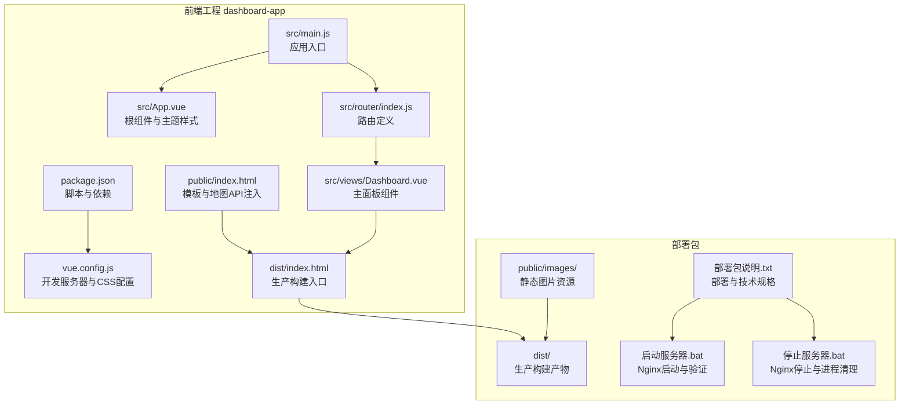
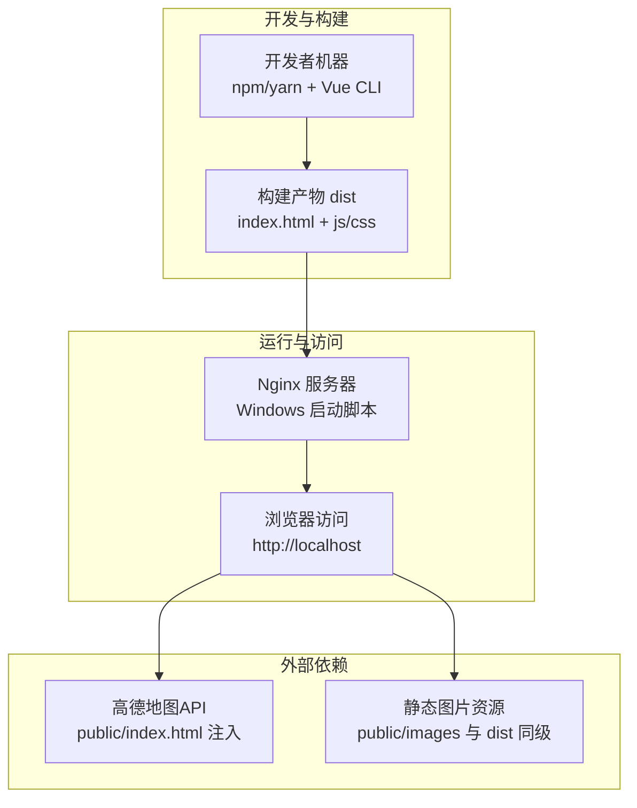
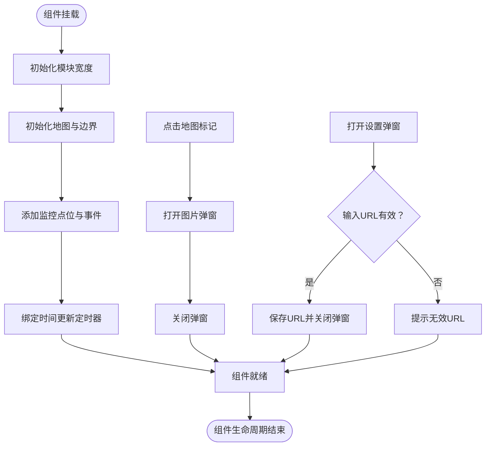
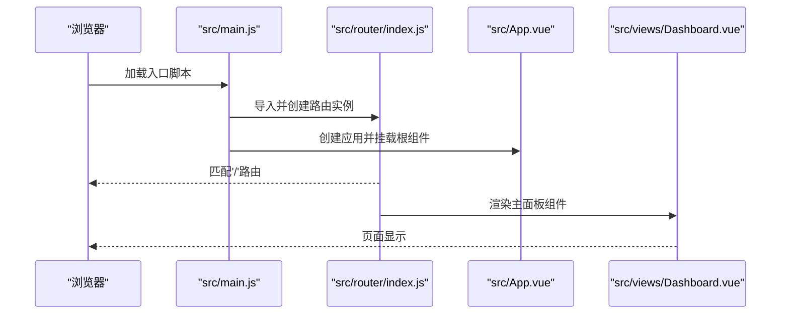
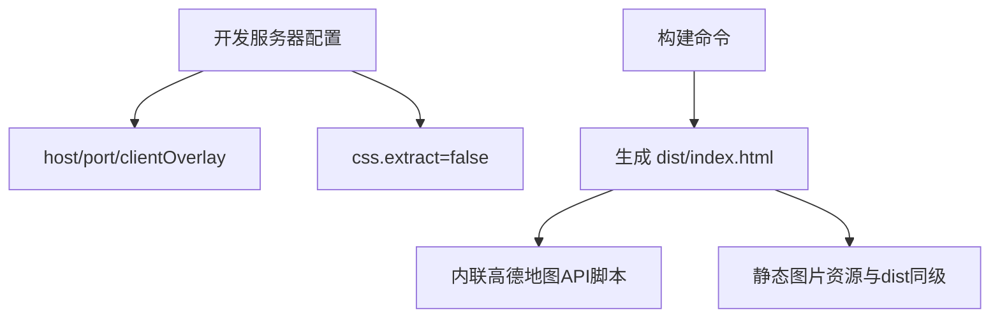
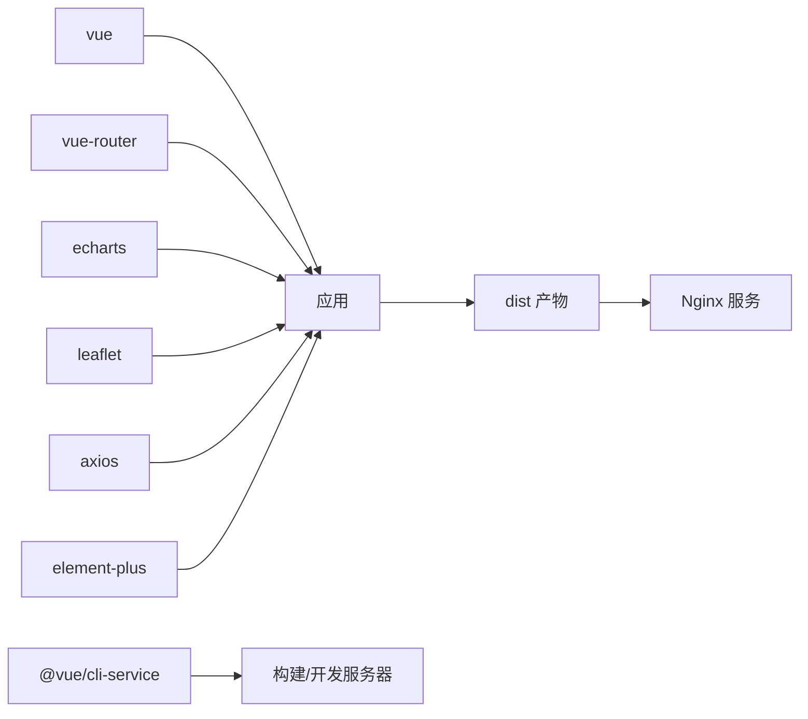

# 故障排除

<cite>
**本文引用的文件**
- [dashboard-app/package.json](file://dashboard-app/package.json)
- [dashboard-app/vue.config.js](file://dashboard-app/vue.config.js)
- [dashboard-app/src/main.js](file://dashboard-app/src/main.js)
- [dashboard-app/src/App.vue](file://dashboard-app/src/App.vue)
- [dashboard-app/src/router/index.js](file://dashboard-app/src/router/index.js)
- [dashboard-app/src/views/Dashboard.vue](file://dashboard-app/src/views/Dashboard.vue)
- [dashboard-app/public/index.html](file://dashboard-app/public/index.html)
- [dashboard-app/dist/index.html](file://dashboard-app/dist/index.html)
- [部署包说明.txt](file://部署包说明.txt)
- [启动服务器.bat](file://启动服务器.bat)
- [停止服务器.bat](file://停止服务器.bat)
</cite>

## 目录
1. [简介](#简介)
2. [项目结构](#项目结构)
3. [核心组件](#核心组件)
4. [架构总览](#架构总览)
5. [详细组件分析](#详细组件分析)
6. [依赖关系分析](#依赖关系分析)
7. [性能考虑](#性能考虑)
8. [故障排除指南](#故障排除指南)
9. [结论](#结论)
10. [附录](#附录)

## 简介
本指南面向技术支持与运维人员，围绕“宜川县域监测体系整合平台”的开发、构建与运行阶段，提供系统化的故障排除方法与实践建议。内容覆盖开发环境问题、构建失败、运行时错误、网络连接与API调用失败、组件渲染异常、性能问题以及不同操作系统下的特殊注意事项。文档同时给出日志分析与错误定位技巧，帮助快速定位并解决问题。

## 项目结构
该仓库包含前端工程与部署包两大部分：
- 前端工程位于 dashboard-app，采用 Vue 3 + Vue Router 构建，使用 Vue CLI 进行开发与打包。
- 部署包位于 部署包，包含生产构建产物 dist、静态资源 public/images，以及启动/停止脚本与部署说明。

图表来源
- [dashboard-app/package.json](file://dashboard-app/package.json#L1-L23)
- [dashboard-app/vue.config.js](file://dashboard-app/vue.config.js#L1-L19)
- [dashboard-app/src/main.js](file://dashboard-app/src/main.js#L1-L5)
- [dashboard-app/src/App.vue](file://dashboard-app/src/App.vue#L1-L40)
- [dashboard-app/src/router/index.js](file://dashboard-app/src/router/index.js#L1-L17)
- [dashboard-app/src/views/Dashboard.vue](file://dashboard-app/src/views/Dashboard.vue#L1-L1315)
- [dashboard-app/public/index.html](file://dashboard-app/public/index.html#L1-L27)
- [dashboard-app/dist/index.html](file://dashboard-app/dist/index.html#L1-L6)
- [部署包说明.txt](file://部署包说明.txt#L1-L61)
- [启动服务器.bat](file://启动服务器.bat#L1-L82)
- [停止服务器.bat](file://停止服务器.bat#L1-L52)

章节来源
- [dashboard-app/package.json](file://dashboard-app/package.json#L1-L23)
- [dashboard-app/vue.config.js](file://dashboard-app/vue.config.js#L1-L19)
- [dashboard-app/src/main.js](file://dashboard-app/src/main.js#L1-L5)
- [dashboard-app/src/App.vue](file://dashboard-app/src/App.vue#L1-L40)
- [dashboard-app/src/router/index.js](file://dashboard-app/src/router/index.js#L1-L17)
- [dashboard-app/src/views/Dashboard.vue](file://dashboard-app/src/views/Dashboard.vue#L1-L1315)
- [dashboard-app/public/index.html](file://dashboard-app/public/index.html#L1-L27)
- [dashboard-app/dist/index.html](file://dashboard-app/dist/index.html#L1-L6)
- [部署包说明.txt](file://部署包说明.txt#L1-L61)
- [启动服务器.bat](file://启动服务器.bat#L1-L82)
- [停止服务器.bat](file://停止服务器.bat#L1-L52)

## 核心组件
- 应用入口与挂载：应用通过入口文件创建并挂载根组件，注册路由后启动。
- 根组件：定义科技蓝主题变量与全局样式，确保深色背景与高对比度视觉效果。
- 路由：单一入口路由指向主面板视图组件。
- 主面板组件：负责地图初始化、视频监控墙、视频会议、气象云图与土壤墒情监测等模块的数据与交互逻辑。
- 开发服务器配置：指定本地开发服务器主机、端口、错误遮罩与CSS提取策略。
- 构建产物：生产构建入口页内联地图API脚本，确保地图功能可用；静态图片资源需与 dist 同级放置。

章节来源
- [dashboard-app/src/main.js](file://dashboard-app/src/main.js#L1-L5)
- [dashboard-app/src/App.vue](file://dashboard-app/src/App.vue#L1-L40)
- [dashboard-app/src/router/index.js](file://dashboard-app/src/router/index.js#L1-L17)
- [dashboard-app/src/views/Dashboard.vue](file://dashboard-app/src/views/Dashboard.vue#L1-L1315)
- [dashboard-app/vue.config.js](file://dashboard-app/vue.config.js#L1-L19)
- [dashboard-app/public/index.html](file://dashboard-app/public/index.html#L1-L27)
- [dashboard-app/dist/index.html](file://dashboard-app/dist/index.html#L1-L6)

## 架构总览
系统从前端工程构建到部署包发布，再由 Windows 启动脚本驱动 Nginx 提供静态资源服务。地图功能依赖外部高德地图API，静态图片资源与入口页需正确组织。

图表来源
- [dashboard-app/package.json](file://dashboard-app/package.json#L5-L8)
- [dashboard-app/vue.config.js](file://dashboard-app/vue.config.js#L5-L15)
- [dashboard-app/public/index.html](file://dashboard-app/public/index.html#L9-L10)
- [dashboard-app/dist/index.html](file://dashboard-app/dist/index.html#L1-L6)
- [部署包说明.txt](file://部署包说明.txt#L31-L48)
- [启动服务器.bat](file://启动服务器.bat#L20-L30)

## 详细组件分析

### 组件A：主面板组件（Dashboard）
- 功能职责：承载地图、视频监控墙、视频会议、气象云图与土壤墒情监测模块；维护时间显示、设置弹窗与图片弹窗。
- 关键流程：组件挂载时初始化模块宽度、地图与时间显示；地图加载县域边界、监控点位与标注；提供设置弹窗以配置气象云图URL；提供图片弹窗展示监控画面。
- 典型问题：地图不显示、点击无响应、弹窗无法关闭、时间更新异常、设置URL无效。
- 诊断要点：检查地图API是否加载、高德Key是否有效、容器尺寸与事件绑定、弹窗状态管理、URL校验逻辑。

图表来源
- [dashboard-app/src/views/Dashboard.vue](file://dashboard-app/src/views/Dashboard.vue#L256-L494)

章节来源
- [dashboard-app/src/views/Dashboard.vue](file://dashboard-app/src/views/Dashboard.vue#L1-L1315)

### 组件B：应用入口与路由
- 入口文件：创建应用实例，注册路由并挂载根组件。
- 路由：单一入口路由指向主面板视图组件。
- 问题排查：路由未生效、页面空白、刷新后404。

图表来源
- [dashboard-app/src/main.js](file://dashboard-app/src/main.js#L1-L5)
- [dashboard-app/src/router/index.js](file://dashboard-app/src/router/index.js#L1-L17)
- [dashboard-app/src/App.vue](file://dashboard-app/src/App.vue#L1-L40)
- [dashboard-app/src/views/Dashboard.vue](file://dashboard-app/src/views/Dashboard.vue#L1-L1315)

章节来源
- [dashboard-app/src/main.js](file://dashboard-app/src/main.js#L1-L5)
- [dashboard-app/src/router/index.js](file://dashboard-app/src/router/index.js#L1-L17)

### 组件C：开发服务器与构建配置
- 开发服务器：本地主机、端口、错误遮罩与CSS提取策略。
- 构建产物：生产入口页内联地图API脚本，静态图片资源需与 dist 同级。

图表来源
- [dashboard-app/vue.config.js](file://dashboard-app/vue.config.js#L3-L19)
- [dashboard-app/public/index.html](file://dashboard-app/public/index.html#L9-L10)
- [dashboard-app/dist/index.html](file://dashboard-app/dist/index.html#L1-L6)
- [部署包说明.txt](file://部署包说明.txt#L47-L48)

章节来源
- [dashboard-app/vue.config.js](file://dashboard-app/vue.config.js#L1-L19)
- [dashboard-app/public/index.html](file://dashboard-app/public/index.html#L1-L27)
- [dashboard-app/dist/index.html](file://dashboard-app/dist/index.html#L1-L6)
- [部署包说明.txt](file://部署包说明.txt#L47-L48)

## 依赖关系分析
- 前端依赖：Vue 3、Vue Router、ECharts、Leaflet、Axios、Element Plus。
- 开发依赖：@vue/cli-service。
- 运行依赖：高德地图API（内联脚本）与静态图片资源。

图表来源
- [dashboard-app/package.json](file://dashboard-app/package.json#L14-L22)
- [dashboard-app/package.json](file://dashboard-app/package.json#L5-L8)

章节来源
- [dashboard-app/package.json](file://dashboard-app/package.json#L1-L23)

## 性能考虑
- 构建与缓存：合理配置开发服务器与CSS提取策略，避免不必要的重绘与闪烁。
- 地图渲染：控制标记数量与层级，减少DOM节点与事件绑定数量。
- 资源加载：静态图片与入口页资源尽量与 dist 同级，减少跨路径请求。
- 浏览器兼容：根据部署说明中的浏览器版本要求进行测试与降级处理。

章节来源
- [dashboard-app/vue.config.js](file://dashboard-app/vue.config.js#L16-L18)
- [部署包说明.txt](file://部署包说明.txt#L52-L55)

## 故障排除指南

### 一、开发环境问题
- 症状：无法启动开发服务器、端口被占用、热更新失效。
- 排查步骤：
  - 检查开发服务器配置与端口占用情况。
  - 清理缓存并重新安装依赖。
  - 确认客户端overlay错误遮罩未屏蔽真实错误。
- 相关配置参考
  - [dashboard-app/vue.config.js](file://dashboard-app/vue.config.js#L5-L15)

章节来源
- [dashboard-app/vue.config.js](file://dashboard-app/vue.config.js#L5-L15)

### 二、构建失败
- 症状：构建报错、资源缺失、入口页缺少地图API。
- 排查步骤：
  - 确认构建脚本执行成功。
  - 检查生产入口页是否内联地图API脚本。
  - 确认静态图片资源与 dist 同级放置。
- 相关产物参考
  - [dashboard-app/dist/index.html](file://dashboard-app/dist/index.html#L1-L6)
  - [部署包说明.txt](file://部署包说明.txt#L47-L48)

章节来源
- [dashboard-app/dist/index.html](file://dashboard-app/dist/index.html#L1-L6)
- [部署包说明.txt](file://部署包说明.txt#L47-L48)

### 三、运行时错误（浏览器）
- 症状：页面空白、地图不显示、点击无响应、弹窗无法关闭。
- 排查步骤：
  - 检查浏览器控制台错误与网络请求。
  - 确认高德地图API已加载且Key有效。
  - 检查地图容器尺寸与事件绑定。
  - 验证弹窗状态管理与点击外部关闭逻辑。
- 相关实现参考
  - [dashboard-app/public/index.html](file://dashboard-app/public/index.html#L9-L10)
  - [dashboard-app/src/views/Dashboard.vue](file://dashboard-app/src/views/Dashboard.vue#L278-L420)

章节来源
- [dashboard-app/public/index.html](file://dashboard-app/public/index.html#L9-L10)
- [dashboard-app/src/views/Dashboard.vue](file://dashboard-app/src/views/Dashboard.vue#L278-L420)

### 四、网络连接问题
- 症状：地图无法加载、静态资源404、跨域错误。
- 排查步骤：
  - 确认服务器可访问外网。
  - 检查Nginx配置与根目录指向 dist。
  - 验证静态图片资源路径与同级放置。
- 相关部署参考
  - [部署包说明.txt](file://部署包说明.txt#L38-L48)
  - [启动服务器.bat](file://启动服务器.bat#L43-L57)

章节来源
- [部署包说明.txt](file://部署包说明.txt#L38-L48)
- [启动服务器.bat](file://启动服务器.bat#L43-L57)

### 五、API调用失败
- 症状：气象云图URL无效、设置弹窗确认失败。
- 排查步骤：
  - 检查URL有效性校验逻辑。
  - 确认弹窗确认按钮触发保存逻辑。
- 相关实现参考
  - [dashboard-app/src/views/Dashboard.vue](file://dashboard-app/src/views/Dashboard.vue#L452-L482)

章节来源
- [dashboard-app/src/views/Dashboard.vue](file://dashboard-app/src/views/Dashboard.vue#L452-L482)

### 六、组件渲染异常
- 症状：模块宽度异常、滚动条不可用、时间不更新。
- 排查步骤：
  - 检查模块容器宽度初始化逻辑。
  - 确认滚动条样式与容器溢出属性。
  - 验证定时器是否在组件销毁前清理。
- 相关实现参考
  - [dashboard-app/src/views/Dashboard.vue](file://dashboard-app/src/views/Dashboard.vue#L273-L276)
  - [dashboard-app/src/views/Dashboard.vue](file://dashboard-app/src/views/Dashboard.vue#L485-L494)

章节来源
- [dashboard-app/src/views/Dashboard.vue](file://dashboard-app/src/views/Dashboard.vue#L273-L276)
- [dashboard-app/src/views/Dashboard.vue](file://dashboard-app/src/views/Dashboard.vue#L485-L494)

### 七、性能问题
- 症状：页面卡顿、地图渲染慢、频繁重绘。
- 排查步骤：
  - 减少地图标记数量与复杂图形。
  - 合理使用CSS提取策略与样式作用域。
  - 优化图片资源大小与数量。
- 相关配置参考
  - [dashboard-app/vue.config.js](file://dashboard-app/vue.config.js#L16-L18)
  - [部署包说明.txt](file://部署包说明.txt#L52-L55)

章节来源
- [dashboard-app/vue.config.js](file://dashboard-app/vue.config.js#L16-L18)
- [部署包说明.txt](file://部署包说明.txt#L52-L55)

### 八、不同操作系统下的特殊问题
- Windows（推荐）：
  - 使用提供的启动/停止脚本，自动检测Nginx安装与配置复制。
  - 确保以管理员权限运行，避免权限不足导致的配置写入失败。
- Linux/macOS：
  - 自行配置Nginx或使用其他静态服务器，确保根目录指向 dist，启用默认文档 index.html。
  - 确保80端口可用或按需修改端口与防火墙规则。

章节来源
- [部署包说明.txt](file://部署包说明.txt#L34-L48)
- [启动服务器.bat](file://启动服务器.bat#L11-L18)
- [停止服务器.bat](file://停止服务器.bat#L11-L21)

### 九、日志分析与错误定位技巧
- 浏览器端：
  - 打开开发者工具，查看Console错误、Network请求状态与资源加载路径。
  - 关注地图API加载失败、静态资源404、跨域错误。
- 服务器端（Windows）：
  - 查看Nginx错误日志与访问日志，确认请求路径与返回码。
  - 使用启动/停止脚本输出信息辅助定位。
- 日志定位参考
  - [启动服务器.bat](file://启动服务器.bat#L45-L67)
  - [停止服务器.bat](file://停止服务器.bat#L12-L44)

章节来源
- [启动服务器.bat](file://启动服务器.bat#L45-L67)
- [停止服务器.bat](file://停止服务器.bat#L12-L44)

## 结论
本指南从开发、构建到部署与运行全链路梳理了常见问题与排障方法。建议在变更配置或资源后，优先核对开发服务器配置、构建产物完整性与Nginx部署路径，结合浏览器与服务器日志进行定位，最终形成标准化的巡检与应急处置流程。

## 附录
- 快速检查清单
  - 开发服务器：host/port/clientOverlay配置正确，端口未被占用。
  - 构建产物：dist/index.html包含地图API脚本，静态图片与dist同级。
  - 运行环境：Nginx根目录指向dist，默认文档为index.html，80端口可用。
  - 地图功能：高德地图API加载成功，Key有效，容器尺寸与事件绑定正常。
  - 组件交互：弹窗状态管理与URL校验逻辑正常，定时器在卸载时清理。