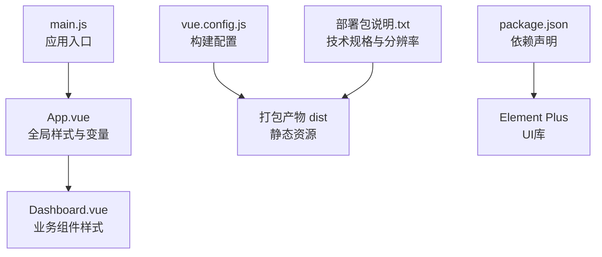
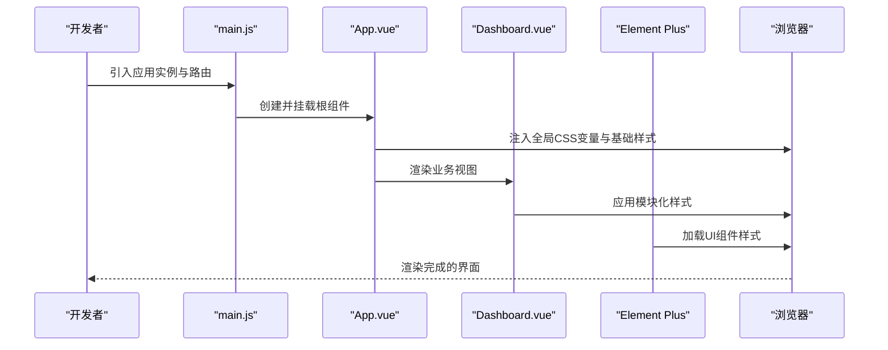
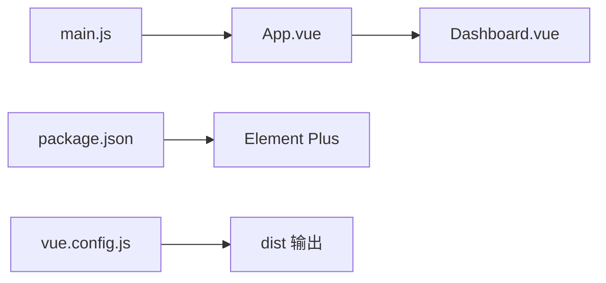

# 样式和主题系统

<cite>
**本文引用的文件**
- [dashboard-app/src/App.vue](file://dashboard-app/src/App.vue)
- [dashboard-app/src/main.js](file://dashboard-app/src/main.js)
- [dashboard-app/vue.config.js](file://dashboard-app/vue.config.js)
- [dashboard-app/package.json](file://dashboard-app/package.json)
- [dashboard-app/src/views/Dashboard.vue](file://dashboard-app/src/views/Dashboard.vue)
- [部署包说明.txt](file://部署包说明.txt)
</cite>

## 目录
1. [简介](#简介)
2. [项目结构](#项目结构)
3. [核心组件](#核心组件)
4. [架构总览](#架构总览)
5. [详细组件分析](#详细组件分析)
6. [依赖关系分析](#依赖关系分析)
7. [性能考量](#性能考量)
8. [故障排查指南](#故障排查指南)
9. [结论](#结论)
10. [附录](#附录)

## 简介
本文件面向设计师与前端开发者，系统性梳理“宜川县域监测体系整合平台”的样式与主题系统，重点包括：
- 科技蓝主题的设计理念与实现方式
- 响应式布局与4K超宽屏支持策略
- CSS变量的使用与主题定制方法
- Element Plus 组件库的主题覆盖与样式扩展
- 自定义样式的最佳实践与注意事项
- 媒体查询与断点设置说明

## 项目结构
该应用采用 Vue 3 单页应用架构，样式以全局 CSS 变量与局部组件样式为主，未在源码中发现独立的样式目录或主题文件。整体结构如下：

图表来源
- [dashboard-app/src/App.vue](file://dashboard-app/src/App.vue#L13-L40)
- [dashboard-app/src/views/Dashboard.vue](file://dashboard-app/src/views/Dashboard.vue#L740-L903)
- [dashboard-app/src/main.js](file://dashboard-app/src/main.js#L1-L5)
- [dashboard-app/vue.config.js](file://dashboard-app/vue.config.js#L1-L19)
- [dashboard-app/package.json](file://dashboard-app/package.json#L14-L22)
- [部署包说明.txt](file://部署包说明.txt#L51-L56)

章节来源
- [dashboard-app/src/App.vue](file://dashboard-app/src/App.vue#L1-L40)
- [dashboard-app/src/main.js](file://dashboard-app/src/main.js#L1-L5)
- [dashboard-app/vue.config.js](file://dashboard-app/vue.config.js#L1-L19)
- [dashboard-app/package.json](file://dashboard-app/package.json#L1-L23)
- [部署包说明.txt](file://部署包说明.txt#L51-L56)

## 核心组件
- 全局样式与变量
  - 在应用根组件中定义了科技蓝主题相关的 CSS 变量，并通过 :root 作用域暴露给全站使用。
  - 全局重置与基础排版、字体与视口高度控制等也在此处统一设定。

- 业务组件样式
  - 仪表盘组件中包含大量模块化样式，如视频监控、视频会议、气象云图等区域的布局与视觉规范，体现了深色科技风格与卡片化设计。

- 构建与运行时配置
  - 开发服务器与热更新、CSS 提取策略、构建输出等由构建配置文件统一管理。
  - 依赖中包含 Element Plus，用于组件层面的主题覆盖与样式扩展。

章节来源
- [dashboard-app/src/App.vue](file://dashboard-app/src/App.vue#L13-L40)
- [dashboard-app/src/views/Dashboard.vue](file://dashboard-app/src/views/Dashboard.vue#L740-L903)
- [dashboard-app/vue.config.js](file://dashboard-app/vue.config.js#L16-L18)
- [dashboard-app/package.json](file://dashboard-app/package.json#L14-L22)

## 架构总览
下图展示了样式与主题系统在运行时的整体交互路径，从入口到组件再到第三方 UI 库的样式注入与覆盖。

图表来源
- [dashboard-app/src/main.js](file://dashboard-app/src/main.js#L1-L5)
- [dashboard-app/src/App.vue](file://dashboard-app/src/App.vue#L13-L40)
- [dashboard-app/src/views/Dashboard.vue](file://dashboard-app/src/views/Dashboard.vue#L740-L903)
- [dashboard-app/package.json](file://dashboard-app/package.json#L14-L22)

## 详细组件分析

### 科技蓝主题系统
- 设计理念
  - 以科技蓝为主色调，搭配深色背景与半透明卡片，营造科技感与沉浸式观感。
  - 使用 CSS 变量集中管理主色、背景、文字、边框与卡片背景，便于主题切换与品牌统一。

- 实现方式
  - 在根组件中定义 :root 变量，供全站使用。
  - 通过变量在 body、容器与组件中进行复用，确保一致性与可维护性。

- 主题变量示例（变量名与用途）
  - 主色：用于强调、高亮与交互元素
  - 背景色：页面整体背景
  - 文字色：正文与次要信息
  - 边框色：分隔线与边框
  - 卡片背景：卡片与模块容器的背景

- 主题定制建议
  - 优先通过修改 :root 中的变量值实现主题切换。
  - 对于 Element Plus 组件，结合其内置变量进行覆盖，避免直接硬编码颜色。

章节来源
- [dashboard-app/src/App.vue](file://dashboard-app/src/App.vue#L13-L21)

### 响应式布局与4K超宽屏支持
- 技术规格
  - 项目文档明确支持 7680×1080（4K超宽屏），并强调窗口缩放自适应能力。
  
- 实现要点
  - 使用相对单位（如百分比、flex、grid）与弹性布局，保证在不同分辨率下的自适应。
  - 对超宽屏场景，建议在布局上保持内容密度与留白比例，避免横向拉伸导致的信息稀释。
  - 对于地图与视频等大尺寸媒体，采用容器自适应与对象填充策略，确保内容完整显示。

- 断点与媒体查询建议
  - 基于 4K 屏幕特性，建议在 3840px 以上引入超宽屏专用布局。
  - 结合业务模块（如视频监控网格、视频会议列表）设置模块级断点，避免全局强约束影响整体布局。

章节来源
- [部署包说明.txt](file://部署包说明.txt#L51-L56)
- [dashboard-app/src/views/Dashboard.vue](file://dashboard-app/src/views/Dashboard.vue#L740-L903)

### CSS变量的使用与主题定制
- 变量命名与作用域
  - 使用语义化变量名，区分主色、背景、文字、边框与卡片背景。
  - 将变量置于 :root，确保全局可用；在组件内按需引用，减少重复定义。

- 定制流程
  - 修改 :root 中的变量值即可实现主题切换。
  - 对于第三方组件（如 Element Plus），通过其提供的变量或CSS类名进行覆盖。

- 注意事项
  - 避免在组件内部硬编码颜色值，统一通过变量引用。
  - 在主题切换时，确保所有模块样式同步更新，避免颜色不一致。

章节来源
- [dashboard-app/src/App.vue](file://dashboard-app/src/App.vue#L13-L21)

### Element Plus 组件库的主题覆盖与样式扩展
- 组件库定位
  - 项目已引入 Element Plus，用于提供丰富的 UI 组件与交互能力。
  - 通过构建配置与依赖管理，确保组件样式在开发与生产环境的一致加载。

- 主题覆盖策略
  - 使用 Element Plus 的变量覆盖机制，在全局或组件范围内重写默认样式。
  - 对于卡片、表单、导航等高频组件，建议统一定义一套与科技蓝主题一致的变量集。

- 样式扩展建议
  - 在业务组件中尽量复用 Element Plus 的类名与状态类，减少自定义样式。
  - 对于特殊需求，采用局部样式隔离与层级控制，避免全局污染。

章节来源
- [dashboard-app/package.json](file://dashboard-app/package.json#L14-L22)

### 自定义样式的最佳实践与注意事项
- 最佳实践
  - 使用 CSS 变量集中管理色彩与间距，提升主题一致性与可维护性。
  - 采用 BEM 或模块化命名规范，降低选择器冲突风险。
  - 对大屏场景进行专项测试，确保布局与可读性不受影响。

- 注意事项
  - 避免在组件内硬编码颜色与尺寸，统一通过变量与类名控制。
  - 对第三方组件的样式覆盖需谨慎，优先使用官方提供的变量或类名。
  - 在超宽屏环境下，注意内容密度与对比度，防止视觉疲劳。

章节来源
- [dashboard-app/src/App.vue](file://dashboard-app/src/App.vue#L13-L40)
- [dashboard-app/src/views/Dashboard.vue](file://dashboard-app/src/views/Dashboard.vue#L740-L903)

### 媒体查询与断点设置
- 建议断点
  - 移动端：≤768px
  - 平板：769px - 1024px
  - 桌面端：1025px - 1440px
  - 超宽屏：≥1440px

- 使用策略
  - 以功能为导向的模块断点优先于固定屏幕宽度断点。
  - 在超宽屏场景下，适当增加模块间距与内容密度，保持视觉平衡。

- 示例参考
  - 仪表盘中的网格与列表布局，可根据断点调整列数与行高，确保信息密度适中。

章节来源
- [dashboard-app/src/views/Dashboard.vue](file://dashboard-app/src/views/Dashboard.vue#L740-L903)

## 依赖关系分析
- 内部依赖
  - main.js 作为入口，负责创建应用实例并挂载根组件。
  - App.vue 提供全局样式与变量，是主题系统的核心载体。
  - Dashboard.vue 包含大量模块化样式，体现业务层的视觉规范。

- 外部依赖
  - Element Plus 作为 UI 组件库，提供组件级样式与交互能力。
  - 构建工具链通过 vue.config.js 控制开发与生产环境的行为。

图表来源
- [dashboard-app/src/main.js](file://dashboard-app/src/main.js#L1-L5)
- [dashboard-app/src/App.vue](file://dashboard-app/src/App.vue#L13-L40)
- [dashboard-app/src/views/Dashboard.vue](file://dashboard-app/src/views/Dashboard.vue#L740-L903)
- [dashboard-app/package.json](file://dashboard-app/package.json#L14-L22)
- [dashboard-app/vue.config.js](file://dashboard-app/vue.config.js#L1-L19)

章节来源
- [dashboard-app/src/main.js](file://dashboard-app/src/main.js#L1-L5)
- [dashboard-app/src/App.vue](file://dashboard-app/src/App.vue#L13-L40)
- [dashboard-app/src/views/Dashboard.vue](file://dashboard-app/src/views/Dashboard.vue#L740-L903)
- [dashboard-app/package.json](file://dashboard-app/package.json#L14-L22)
- [dashboard-app/vue.config.js](file://dashboard-app/vue.config.js#L1-L19)

## 性能考量
- 样式体积控制
  - 通过 CSS 变量集中管理，减少重复样式定义，降低打包体积。
  - 避免在组件内重复定义相同颜色与尺寸，统一从全局变量引用。

- 运行时渲染优化
  - 使用相对布局与弹性容器，减少复杂计算与重绘。
  - 在超宽屏场景下，合理控制内容密度与阴影效果，避免过度绘制。

- 构建与缓存
  - 构建配置中关闭 CSS 提取可提升开发阶段的热更新效率，生产环境可按需开启提取策略。

章节来源
- [dashboard-app/vue.config.js](file://dashboard-app/vue.config.js#L16-L18)

## 故障排查指南
- 主题色不生效
  - 检查 :root 中的变量是否被正确引用，确认变量名拼写与作用域。
  - 若覆盖第三方组件样式，请确认覆盖顺序与优先级。

- 布局错位或溢出
  - 检查容器高度与视口控制，确保根容器与页面主体的高度设置正确。
  - 在超宽屏场景下，检查网格与列表的断点逻辑，避免横向溢出。

- 组件样式异常
  - 确认 Element Plus 的版本与依赖是否匹配，避免样式冲突。
  - 如需覆盖组件样式，优先使用官方提供的类名或变量。

章节来源
- [dashboard-app/src/App.vue](file://dashboard-app/src/App.vue#L13-L40)
- [dashboard-app/src/views/Dashboard.vue](file://dashboard-app/src/views/Dashboard.vue#L740-L903)
- [dashboard-app/package.json](file://dashboard-app/package.json#L14-L22)

## 结论
本项目以科技蓝为主题基调，通过 CSS 变量实现统一的视觉语言，并结合 Element Plus 组件库提供一致的交互体验。在响应式与4K超宽屏支持方面，建议以功能为导向的模块断点与弹性布局策略，确保在不同设备与分辨率下的良好表现。通过变量化与模块化的样式组织方式，可有效提升主题定制的灵活性与可维护性。

## 附录
- 关键文件与职责
  - App.vue：全局样式与变量定义
  - Dashboard.vue：业务模块样式与布局
  - main.js：应用入口与挂载
  - vue.config.js：构建与开发服务器配置
  - package.json：依赖与脚本
  - 部署包说明.txt：技术规格与分辨率支持

章节来源
- [dashboard-app/src/App.vue](file://dashboard-app/src/App.vue#L13-L40)
- [dashboard-app/src/views/Dashboard.vue](file://dashboard-app/src/views/Dashboard.vue#L740-L903)
- [dashboard-app/src/main.js](file://dashboard-app/src/main.js#L1-L5)
- [dashboard-app/vue.config.js](file://dashboard-app/vue.config.js#L1-L19)
- [dashboard-app/package.json](file://dashboard-app/package.json#L14-L22)
- [部署包说明.txt](file://部署包说明.txt#L51-L56)