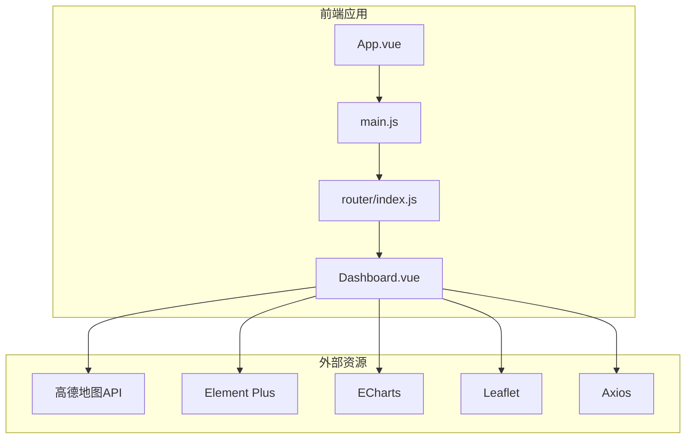
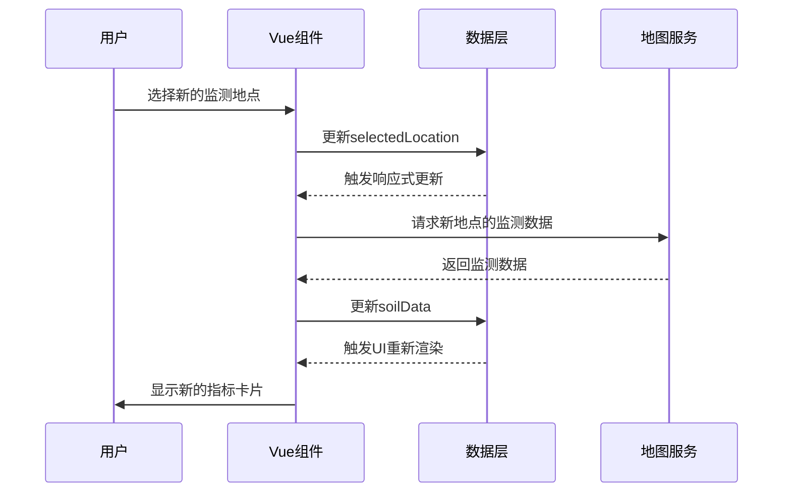
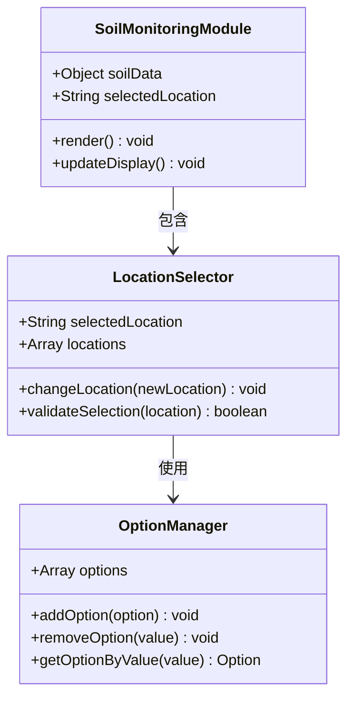
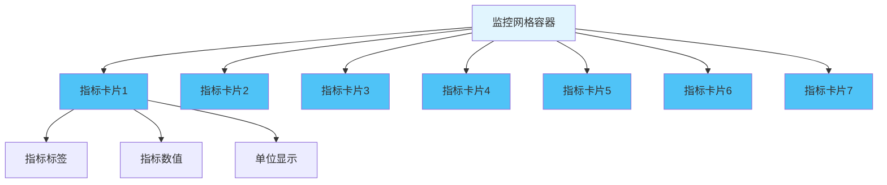
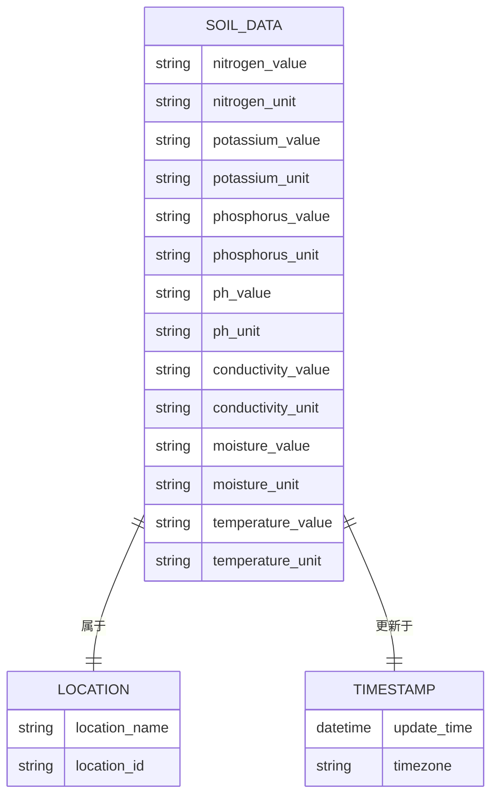
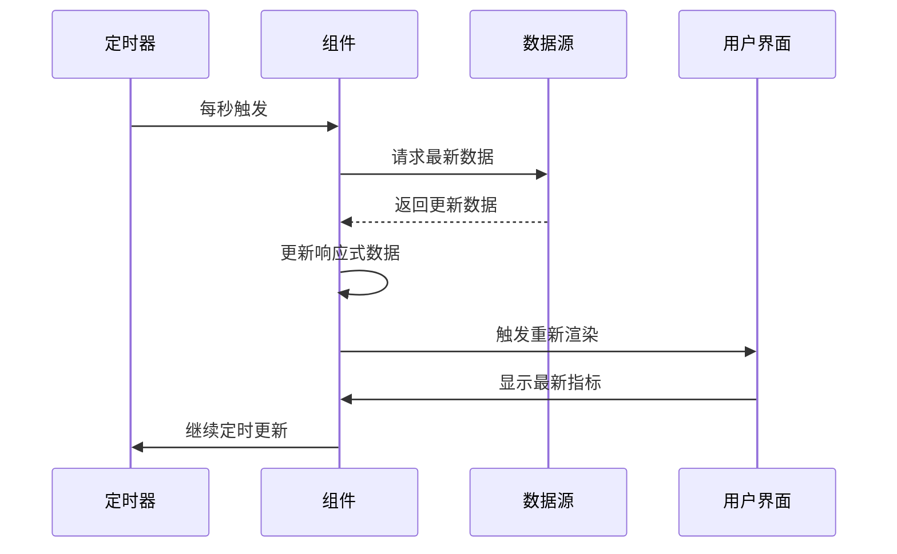

# 土壤墒情监测模块

<cite>
**本文档引用的文件**
- [App.vue](file://dashboard-app/src/App.vue)
- [main.js](file://dashboard-app/src/main.js)
- [Dashboard.vue](file://dashboard-app/src/views/Dashboard.vue)
- [router/index.js](file://dashboard-app/src/router/index.js)
- [package.json](file://dashboard-app/package.json)
- [vue.config.js](file://dashboard-app/vue.config.js)
- [public/index.html](file://dashboard-app/public/index.html)
</cite>

## 目录
1. [简介](#简介)
2. [项目结构](#项目结构)
3. [核心组件](#核心组件)
4. [架构概览](#架构概览)
5. [详细组件分析](#详细组件分析)
6. [依赖关系分析](#依赖关系分析)
7. [性能考虑](#性能考虑)
8. [故障排除指南](#故障排除指南)
9. [结论](#结论)
10. [附录](#附录)

## 简介
本文件为土壤墒情监测模块的详细技术文档，全面解释了该模块的实现原理与使用方法。该模块位于宜川县域监测体系整合平台中，负责展示土壤监测指标，包括氮、磷、钾含量、pH值、电导率、土壤水分和温度等关键指标。文档涵盖以下方面：
- 数据结构与显示格式
- 位置选择器的实现原理
- 指标卡片布局设计
- 数据格式规范、单位换算与阈值判断
- 数据更新机制、时间戳显示与历史数据对比
- 开发者扩展方案与最佳实践

## 项目结构
该模块基于Vue 3构建，采用单页应用架构，通过路由管理不同视图。Dashboard.vue作为主页面，包含多个功能模块，其中土壤墒情监测模块是核心展示区域之一。



**图表来源**
- [main.js](file://dashboard-app/src/main.js#L1-L5)
- [router/index.js](file://dashboard-app/src/router/index.js#L1-L17)
- [Dashboard.vue](file://dashboard-app/src/views/Dashboard.vue#L1-L50)

**章节来源**
- [main.js](file://dashboard-app/src/main.js#L1-L5)
- [router/index.js](file://dashboard-app/src/router/index.js#L1-L17)
- [package.json](file://dashboard-app/package.json#L1-L23)

## 核心组件
土壤墒情监测模块的核心组件为Dashboard.vue中的soil-monitoring-module模块。该模块包含以下关键元素：
- 位置选择器：用于切换不同的监测地点
- 指标卡片网格：展示7个关键土壤指标
- 时间戳显示：显示数据更新时间

模块的主要数据结构如下：
- selectedLocation：当前选中的监测地点
- soilData：包含所有监测指标的对象，每个指标包含value和unit属性

**章节来源**
- [Dashboard.vue](file://dashboard-app/src/views/Dashboard.vue#L94-L140)
- [Dashboard.vue](file://dashboard-app/src/views/Dashboard.vue#L218-L228)

## 架构概览
该模块采用MVVM架构模式，结合Vue 3的响应式系统实现数据驱动的UI更新。整体架构分为三层：
- 视图层：负责用户交互和数据展示
- 业务逻辑层：处理数据更新、计算和状态管理
- 数据层：存储监测数据和配置信息



**图表来源**
- [Dashboard.vue](file://dashboard-app/src/views/Dashboard.vue#L98-L105)
- [Dashboard.vue](file://dashboard-app/src/views/Dashboard.vue#L218-L228)

## 详细组件分析

### 位置选择器组件
位置选择器实现了下拉菜单的完整功能，包括选项管理和数据绑定机制。



**图表来源**
- [Dashboard.vue](file://dashboard-app/src/views/Dashboard.vue#L98-L105)
- [Dashboard.vue](file://dashboard-app/src/views/Dashboard.vue#L218-L228)

位置选择器的关键特性：
- 使用v-model双向绑定selectedLocation
- 支持4个预定义的监测地点选项
- 自定义下拉样式，包含渐变背景和阴影效果
- 响应式设计，支持键盘导航

**章节来源**
- [Dashboard.vue](file://dashboard-app/src/views/Dashboard.vue#L98-L105)
- [Dashboard.vue](file://dashboard-app/src/views/Dashboard.vue#L996-L1024)

### 指标卡片布局设计
指标卡片采用网格系统实现响应式布局，包含7个核心指标的展示。



**图表来源**
- [Dashboard.vue](file://dashboard-app/src/views/Dashboard.vue#L1026-L1033)
- [Dashboard.vue](file://dashboard-app/src/views/Dashboard.vue#L1035-L1078)

指标卡片的设计特点：
- 2列网格布局，自动适应容器宽度
- 每个卡片包含指标标签、数值和单位三部分
- 渐变背景和毛玻璃效果，提升视觉层次
- 悬停动画效果，增强用户体验
- 响应式字体大小，适配不同屏幕尺寸

**章节来源**
- [Dashboard.vue](file://dashboard-app/src/views/Dashboard.vue#L1026-L1078)

### 数据结构与显示格式
土壤监测数据采用统一的数据结构，确保各指标的一致性。



**图表来源**
- [Dashboard.vue](file://dashboard-app/src/views/Dashboard.vue#L218-L228)

数据格式规范：
- 数值格式：保留两位小数的字符串格式
- 单位格式：标准单位符号，如mg/kg、μS/cm、%
- 时间戳格式：本地化的时间显示格式
- 地址格式：标准化的行政区划名称

**章节来源**
- [Dashboard.vue](file://dashboard-app/src/views/Dashboard.vue#L218-L228)

### 数据更新机制
模块实现了定时更新机制，确保显示数据的实时性。



**图表来源**
- [Dashboard.vue](file://dashboard-app/src/views/Dashboard.vue#L262-L265)
- [Dashboard.vue](file://dashboard-app/src/views/Dashboard.vue#L436-L450)

更新机制特性：
- 每秒自动更新时间显示
- 支持手动刷新按钮
- 错误处理和重试机制
- 内存泄漏防护（组件销毁时清理定时器）

**章节来源**
- [Dashboard.vue](file://dashboard-app/src/views/Dashboard.vue#L262-L265)
- [Dashboard.vue](file://dashboard-app/src/views/Dashboard.vue#L436-L450)
- [Dashboard.vue](file://dashboard-app/src/views/Dashboard.vue#L485-L494)

## 依赖关系分析
该模块依赖多个外部库和服务，形成完整的功能体系。

```mermaid
graph TB
subgraph "核心依赖"
A[Vue 3.2.0]
B[vue-router 4.0.0]
end
subgraph "地图服务"
C[高德地图API]
D[Leaflet]
end
subgraph "可视化库"
E[ECharts 5.4.0]
F[Element Plus 2.2.0]
end
subgraph "网络请求"
G[Axios 1.2.0]
end
subgraph "开发工具"
H[@vue/cli-service]
end
A --> C
A --> E
A --> F
A --> G
B --> A
H --> A
```

**图表来源**
- [package.json](file://dashboard-app/package.json#L14-L22)
- [public/index.html](file://dashboard-app/public/index.html#L9-L10)

依赖关系特点：
- Vue 3提供响应式数据绑定和组件系统
- vue-router实现单页应用路由管理
- 高德地图API提供地理信息服务
- Element Plus提供UI组件库
- Axios处理HTTP请求
- ECharts支持数据可视化

**章节来源**
- [package.json](file://dashboard-app/package.json#L14-L22)
- [public/index.html](file://dashboard-app/public/index.html#L9-L10)

## 性能考虑
针对土壤墒情监测模块的性能优化建议：

### 渲染优化
- 使用虚拟DOM减少不必要的DOM操作
- 实现组件懒加载，避免一次性渲染大量指标卡片
- 采用防抖机制处理频繁的位置切换操作

### 内存管理
- 在组件销毁时清理定时器和地图实例
- 合理使用watcher和computed属性，避免内存泄漏
- 及时释放地图标记和图层资源

### 网络优化
- 实现数据缓存机制，减少重复请求
- 支持离线模式下的数据展示
- 优化图片资源加载，使用懒加载策略

## 故障排除指南
常见问题及解决方案：

### 地图显示异常
**问题描述**：高德地图无法正常显示
**解决步骤**：
1. 检查网络连接是否正常
2. 验证API密钥的有效性
3. 确认浏览器允许第三方脚本执行
4. 查看控制台是否有JavaScript错误

### 数据更新失败
**问题描述**：指标数据不更新或显示过期
**解决步骤**：
1. 检查定时器是否正常运行
2. 验证数据源连接状态
3. 查看网络请求日志
4. 确认响应数据格式正确

### 响应式布局问题
**问题描述**：指标卡片在不同屏幕尺寸下显示异常
**解决步骤**：
1. 检查CSS媒体查询是否正确
2. 验证容器尺寸计算逻辑
3. 确认Flexbox和Grid布局兼容性
4. 测试不同设备的显示效果

**章节来源**
- [Dashboard.vue](file://dashboard-app/src/views/Dashboard.vue#L485-L494)

## 结论
土壤墒情监测模块是一个功能完整、设计精良的前端组件，具有以下优势：
- 清晰的数据结构和统一的显示格式
- 直观的位置选择器和响应式布局
- 实时的数据更新机制和良好的用户体验
- 完善的错误处理和性能优化

该模块为开发者提供了良好的扩展基础，可以轻松添加新的监测指标、集成更多的数据源，并根据具体需求定制界面风格。

## 附录

### 开发者扩展指南
1. **添加新的监测指标**
   - 在soilData对象中添加新的指标字段
   - 在模板中添加对应的指标卡片
   - 更新样式以适配新的布局

2. **集成新的数据源**
   - 修改数据获取逻辑
   - 实现数据格式转换函数
   - 添加错误处理和重试机制

3. **定制界面风格**
   - 修改CSS变量调整主题色彩
   - 调整网格布局参数
   - 自定义动画效果和过渡效果

### 最佳实践建议
- 保持数据结构的一致性和可扩展性
- 实现完善的错误处理和用户反馈
- 优化性能表现，确保流畅的用户体验
- 提供充分的测试用例和文档说明