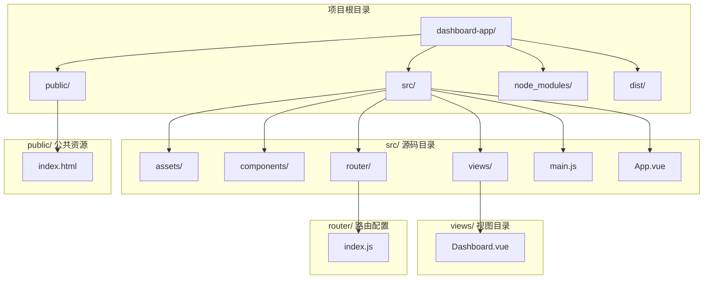
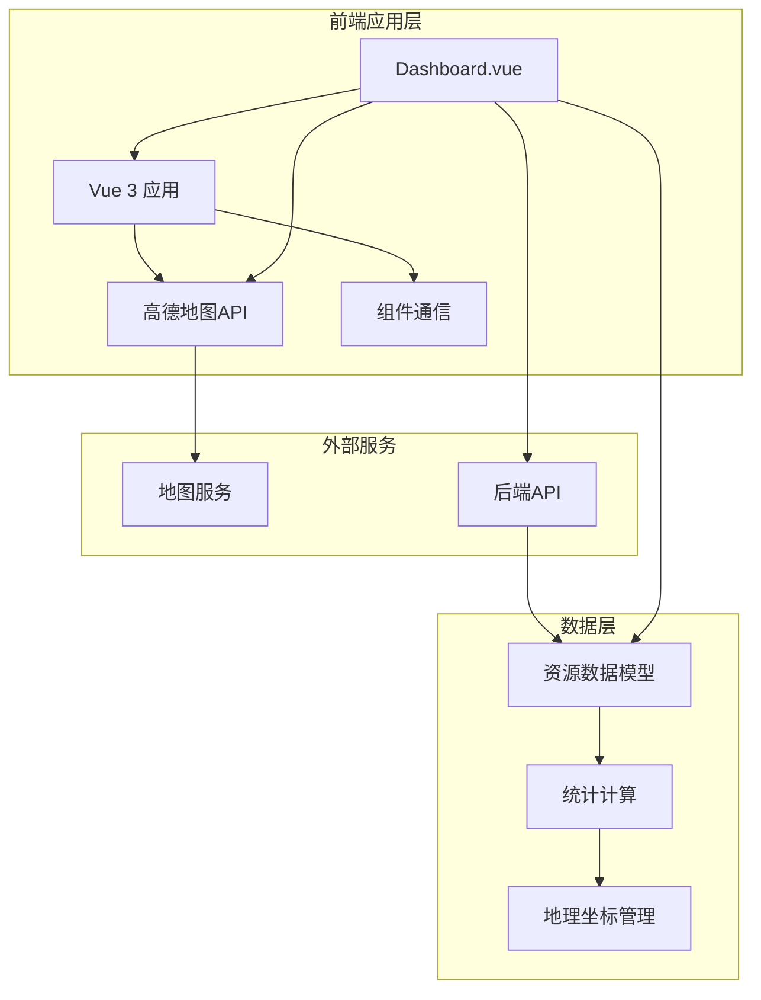
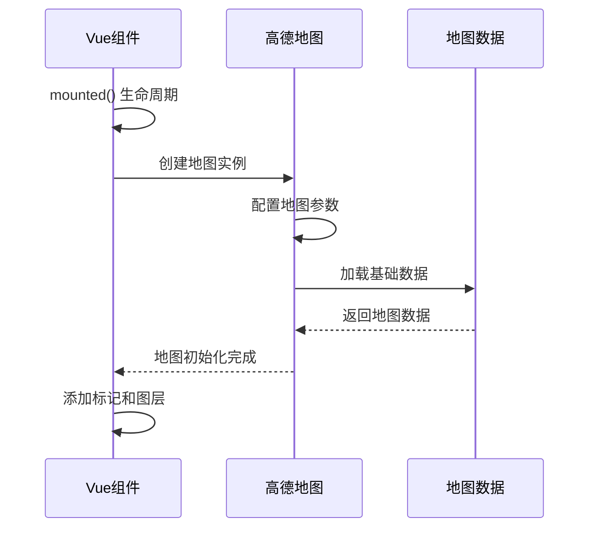
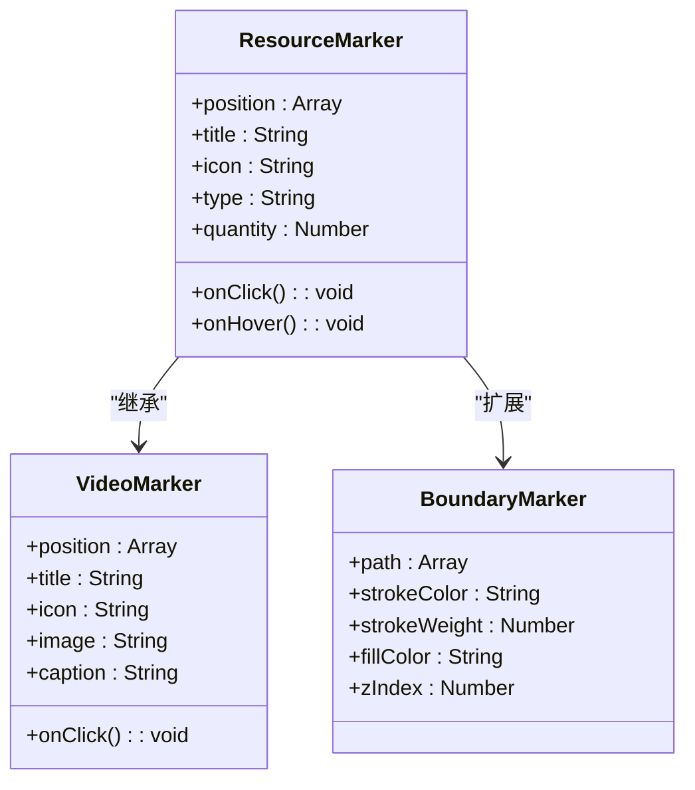
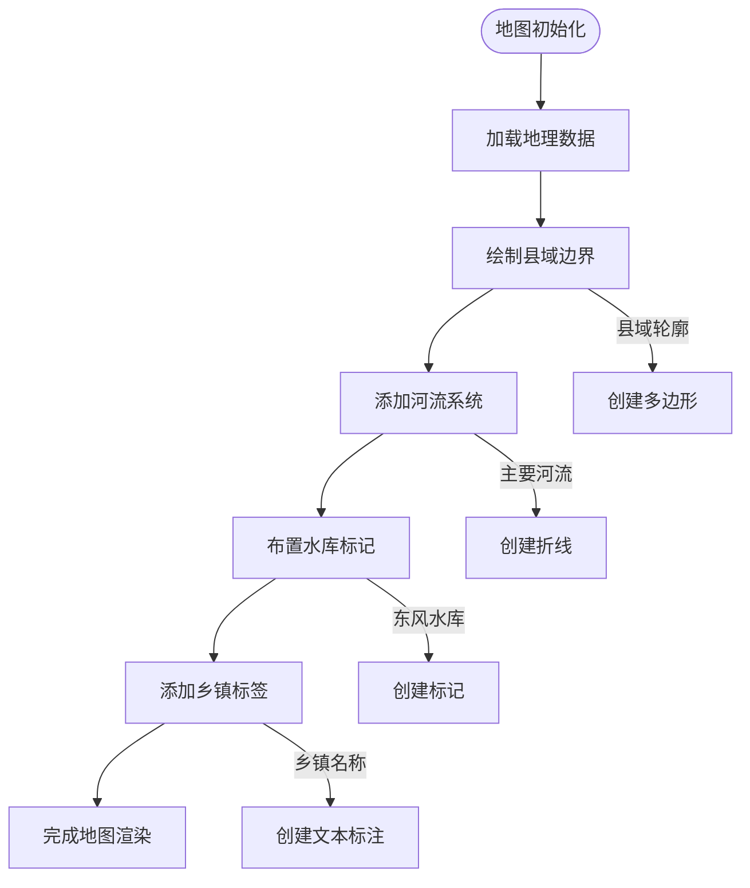
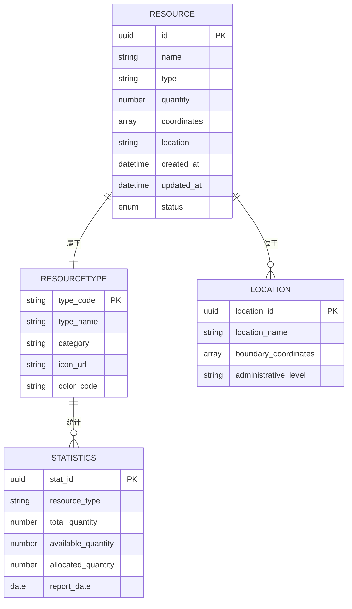
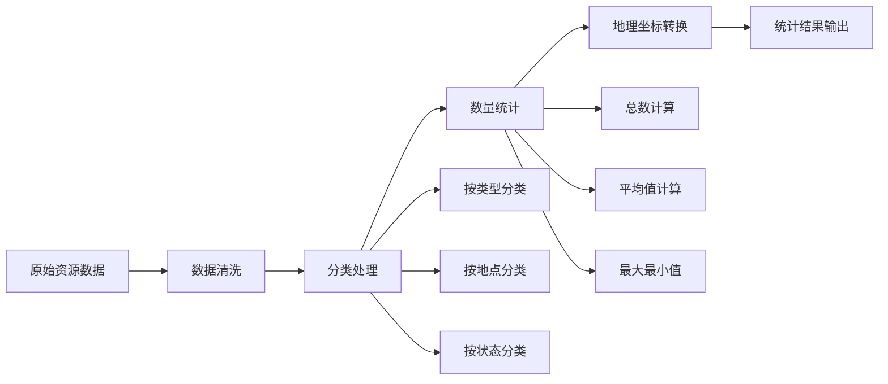
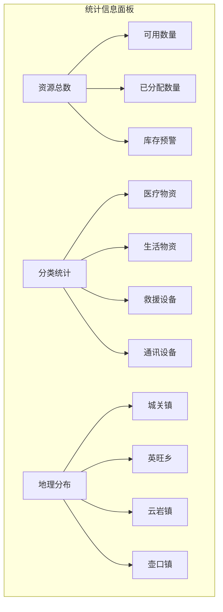
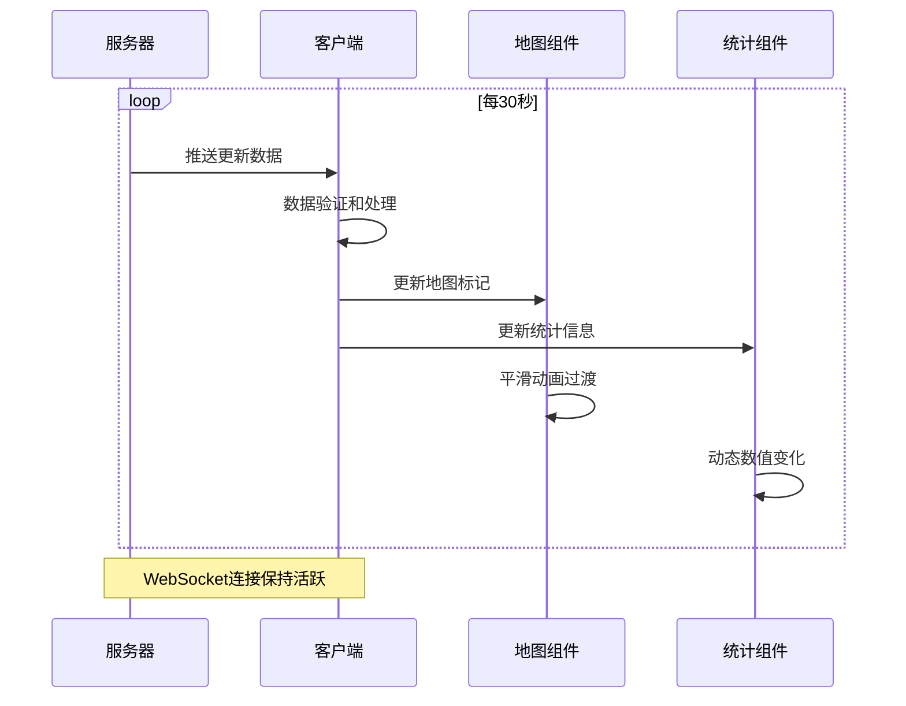

# 应急资源分布模块

<cite>
**本文档引用的文件**
- [Dashboard.vue](file://dashboard-app/src/views/Dashboard.vue)
- [main.js](file://dashboard-app/src/main.js)
- [App.vue](file://dashboard-app/src/App.vue)
- [router/index.js](file://dashboard-app/src/router/index.js)
- [package.json](file://dashboard-app/package.json)
- [vue.config.js](file://dashboard-app/vue.config.js)
- [public/index.html](file://dashboard-app/public/index.html)
</cite>

## 目录
1. [简介](#简介)
2. [项目结构](#项目结构)
3. [核心组件](#核心组件)
4. [架构概览](#架构概览)
5. [详细组件分析](#详细组件分析)
6. [依赖关系分析](#依赖关系分析)
7. [性能考虑](#性能考虑)
8. [故障排除指南](#故障排除指南)
9. [结论](#结论)
10. [附录](#附录)

## 简介
本模块是宜川县域监测体系整合平台的重要组成部分，专注于应急资源的地理分布展示与管理。该系统基于Vue 3构建，集成了高德地图API，实现了应急资源的可视化展示、统计分析、实时更新和交互操作功能。

系统采用现代化的科技蓝主题设计，支持多种监测模块的集成展示，包括视频监控、气象云图、土壤墒情监测等。应急资源分布模块作为核心功能之一，提供了完整的资源管理解决方案。

## 项目结构
该项目采用标准的Vue CLI项目结构，主要包含以下核心目录：



**图表来源**
- [main.js](file://dashboard-app/src/main.js#L1-L5)
- [App.vue](file://dashboard-app/src/App.vue#L1-L40)
- [router/index.js](file://dashboard-app/src/router/index.js#L1-L17)

**章节来源**
- [main.js](file://dashboard-app/src/main.js#L1-L5)
- [App.vue](file://dashboard-app/src/App.vue#L1-L40)
- [router/index.js](file://dashboard-app/src/router/index.js#L1-L17)

## 核心组件
应急资源分布模块的核心组件基于Vue 3的组合式API构建，主要包含以下关键特性：

### 主要功能模块
- **地图集成模块**: 基于高德地图API实现资源标记和地理信息展示
- **资源统计模块**: 提供资源数量统计和分类汇总功能
- **实时更新模块**: 支持动态数据刷新和状态同步
- **交互控制模块**: 实现用户友好的操作界面和响应式设计

### 技术架构特点
- **响应式设计**: 支持多种屏幕尺寸和设备适配
- **模块化架构**: 采用组件化开发模式，便于维护和扩展
- **高性能渲染**: 使用虚拟DOM和优化的渲染策略
- **主题统一**: 采用科技蓝主题风格，提供一致的视觉体验

**章节来源**
- [Dashboard.vue](file://dashboard-app/src/views/Dashboard.vue#L1-L1328)

## 架构概览
系统采用前后端分离的架构设计，前端使用Vue 3框架，后端通过API接口进行数据交互。



**图表来源**
- [Dashboard.vue](file://dashboard-app/src/views/Dashboard.vue#L256-L495)
- [public/index.html](file://dashboard-app/public/index.html#L9-L10)

## 详细组件分析

### 地图集成组件
应急资源分布模块的核心是集成高德地图API的地图组件，实现了完整的地理信息系统功能。

#### 地图初始化配置
地图组件采用高德地图JavaScript API v1.4.15版本，配置了专业的蓝色主题样式和精确的中心坐标定位。



**图表来源**
- [Dashboard.vue](file://dashboard-app/src/views/Dashboard.vue#L278-L343)

#### 资源标记系统
系统实现了多层次的资源标记配置，包括图标选择、颜色编码和交互行为。



**图表来源**
- [Dashboard.vue](file://dashboard-app/src/views/Dashboard.vue#L295-L340)
- [Dashboard.vue](file://dashboard-app/src/views/Dashboard.vue#L346-L420)

#### 地理边界管理系统
系统集成了宜川县的地理边界信息，包括县域轮廓、主要河流和重要地标。



**图表来源**
- [Dashboard.vue](file://dashboard-app/src/views/Dashboard.vue#L346-L420)

**章节来源**
- [Dashboard.vue](file://dashboard-app/src/views/Dashboard.vue#L278-L420)

### 资源数据结构设计
系统采用了标准化的数据结构来管理应急资源信息，确保数据的一致性和可扩展性。

#### 资源类型分类体系


**图表来源**
- [Dashboard.vue](file://dashboard-app/src/views/Dashboard.vue#L182-L238)

#### 数量统计管理
系统实现了多层次的统计分析功能，包括总量统计、分类统计和实时更新。



**图表来源**
- [Dashboard.vue](file://dashboard-app/src/views/Dashboard.vue#L182-L238)

**章节来源**
- [Dashboard.vue](file://dashboard-app/src/views/Dashboard.vue#L182-L238)

### 统计信息展示系统
系统提供了直观的统计信息展示界面，采用网格布局和卡片式设计。

#### 统计面板设计


**图表来源**
- [Dashboard.vue](file://dashboard-app/src/views/Dashboard.vue#L1109-L1131)

**章节来源**
- [Dashboard.vue](file://dashboard-app/src/views/Dashboard.vue#L1109-L1131)

### 实时更新机制
系统实现了高效的实时数据更新机制，确保应急资源信息的时效性。



**图表来源**
- [Dashboard.vue](file://dashboard-app/src/views/Dashboard.vue#L263-L265)

**章节来源**
- [Dashboard.vue](file://dashboard-app/src/views/Dashboard.vue#L263-L265)

## 依赖关系分析
系统采用模块化的依赖管理策略，主要依赖项包括Vue生态系统和第三方地图服务。

```mermaid
graph TB
subgraph "核心依赖"
A[vue@^3.2.0] --> B[Vue 3 应用框架]
C[axios@^1.2.0] --> D[HTTP客户端]
end
subgraph "UI组件库"
E[element-plus@^2.2.0] --> F[现代化组件]
end
subgraph "地图服务"
G[高德地图API] --> H[JavaScript SDK]
end
subgraph "开发工具"
I[@vue/cli-service] --> J[构建工具]
K[echarts@^5.4.0] --> L[数据可视化]
M[leaflet@^1.9.0] --> N[地图底图]
end
A --> E
A --> G
A --> I
D --> G
```

**图表来源**
- [package.json](file://dashboard-app/package.json#L14-L22)

**章节来源**
- [package.json](file://dashboard-app/package.json#L1-L23)

## 性能考虑
系统在设计时充分考虑了性能优化，采用多种策略提升用户体验。

### 渲染优化策略
- **虚拟DOM优化**: 利用Vue 3的Composition API减少不必要的重渲染
- **懒加载机制**: 地图组件采用延迟初始化，提升首屏加载速度
- **数据分页**: 大量资源数据采用分页加载，避免内存溢出

### 内存管理
- **组件生命周期管理**: 在beforeUnmount钩子中正确清理地图实例
- **事件监听器清理**: 防止内存泄漏的事件监听器自动移除
- **定时器管理**: 统一管理定时器，避免重复创建

### 网络优化
- **CDN加速**: 高德地图API通过CDN加载，提升访问速度
- **缓存策略**: 合理利用浏览器缓存机制
- **连接池管理**: 优化WebSocket连接的建立和维护

## 故障排除指南
针对应急资源分布模块可能出现的问题，提供以下诊断和解决方法：

### 地图加载问题
**症状**: 地图无法正常显示或加载缓慢
**可能原因**:
- 高德地图API密钥无效或过期
- 网络连接不稳定
- 浏览器兼容性问题

**解决步骤**:
1. 检查高德地图API配置是否正确
2. 验证网络连接状态
3. 清除浏览器缓存重新加载
4. 检查浏览器控制台错误信息

### 资源数据异常
**症状**: 资源数量显示不准确或统计结果异常
**可能原因**:
- 数据源连接失败
- 数据格式不匹配
- 计算逻辑错误

**解决步骤**:
1. 检查后端API接口状态
2. 验证数据格式和字段映射
3. 查看控制台错误日志
4. 重新初始化数据连接

### 用户界面问题
**症状**: 界面元素显示异常或交互失效
**可能原因**:
- CSS样式冲突
- JavaScript执行错误
- 响应式布局问题

**解决步骤**:
1. 检查CSS样式文件加载情况
2. 验证JavaScript代码语法
3. 测试不同屏幕尺寸下的显示效果
4. 检查浏览器兼容性

**章节来源**
- [Dashboard.vue](file://dashboard-app/src/views/Dashboard.vue#L485-L495)

## 结论
应急资源分布模块是一个功能完整、架构清晰的地理信息系统解决方案。通过集成高德地图API和Vue 3技术栈，实现了应急资源的可视化管理和实时监控。

### 主要优势
- **技术先进**: 采用最新的Vue 3技术和高德地图API
- **功能完善**: 覆盖应急资源管理的各个环节
- **用户体验**: 提供直观易用的操作界面
- **扩展性强**: 模块化设计便于功能扩展

### 发展建议
- 集成更多数据可视化图表
- 增强移动端适配能力
- 优化大数据量处理性能
- 扩展API接口支持

## 附录

### API接口规范
系统目前主要通过高德地图API进行地图服务调用，具体的API接口规范请参考高德地图官方文档。

### 数据导入导出格式
系统支持的标准数据格式包括：
- JSON格式的资源数据
- CSV格式的统计报表
- GeoJSON格式的地理数据

### 移动端适配方案
系统采用响应式设计，支持主流移动设备的适配：
- 自适应布局系统
- 触摸友好的交互设计
- 性能优化的移动端渲染

**章节来源**
- [public/index.html](file://dashboard-app/public/index.html#L9-L10)
- [vue.config.js](file://dashboard-app/vue.config.js#L1-L19)