# 核心功能模块

<cite>
**本文档引用的文件**
- [Dashboard.vue](file://dashboard-app/src/views/Dashboard.vue)
- [App.vue](file://dashboard-app/src/App.vue)
- [main.js](file://dashboard-app/src/main.js)
- [router/index.js](file://dashboard-app/src/router/index.js)
- [package.json](file://dashboard-app/package.json)
- [vue.config.js](file://dashboard-app/vue.config.js)
- [app-config.json](file://yichuan-dashboard-production-deployment/config/app-config.json)
- [deployment-guide.txt](file://yichuan-dashboard-production-deployment/docs/deployment-guide.txt)
- [部署文档.md](file://部署包/部署文档.md)
- [proxy-server.js](file://代理服务部署包/proxy-server.js)
- [config.json](file://代理服务部署包/config.json)
</cite>

## 更新摘要
**变更内容**
- 新增部署结构相关章节，涵盖生产环境部署配置
- 更新代理服务器配置说明，包括认证机制和CORS设置
- 补充多环境部署支持，包括开发、测试和生产环境
- 增加部署包结构和启动脚本说明
- 更新屏幕适配和分辨率配置

## 目录
1. [简介](#简介)
2. [项目结构](#项目结构)
3. [核心组件](#核心组件)
4. [架构概览](#架构概览)
5. [详细组件分析](#详细组件分析)
6. [部署架构](#部署架构)
7. [依赖关系分析](#依赖关系分析)
8. [性能考虑](#性能考虑)
9. [故障排除指南](#故障排除指南)
10. [结论](#结论)

## 简介

宜川县域监测体系整合平台是一个基于Vue 3构建的现代化监控管理界面，专为陕西省延安市宜川县设计。该平台集成了多个关键监测功能模块，包括视频监控墙、视频会议系统、气象云图、应急资源分布和土壤墒情监测等，为县域治理提供全面的数字化解决方案。

平台采用模块化设计理念，通过Dashboard.vue主组件统一管理和协调各个功能模块，实现了高度集成且易于维护的监控体系。系统支持实时数据更新、地图可视化、多媒体展示等功能，为政府部门提供了直观高效的决策支持工具。

**更新** 平台现已支持多环境部署，包括开发、测试和生产环境，提供完整的代理服务器配置和认证机制。

## 项目结构

该项目采用标准的Vue CLI项目结构，主要由以下核心部分组成：

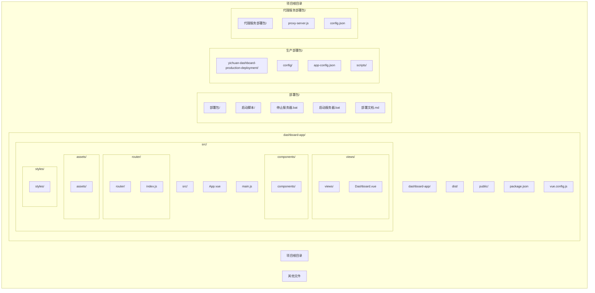

**图表来源**
- [Dashboard.vue:1-50](file://dashboard-app/src/views/Dashboard.vue#L1-L50)
- [main.js:1-5](file://dashboard-app/src/main.js#L1-L5)
- [router/index.js:1-17](file://dashboard-app/src/router/index.js#L1-L17)

**章节来源**
- [package.json:1-23](file://dashboard-app/package.json#L1-L23)
- [vue.config.js:1-19](file://dashboard-app/vue.config.js#L1-L19)

## 核心组件

Dashboard.vue作为整个系统的主控制器，承担着以下核心职责：

### 主要功能特性

1. **响应式布局设计** - 采用Flexbox布局，支持不同屏幕尺寸的自适应显示
2. **模块化架构** - 将复杂功能分解为独立的功能模块
3. **实时数据更新** - 集成定时器实现动态时间显示和数据刷新
4. **地图集成** - 整合高德地图API实现地理信息可视化
5. **多媒体展示** - 支持图片弹窗和iframe嵌入式内容展示

### 数据流管理

系统采用Vue 3的响应式数据绑定机制，通过data()函数定义状态数据，computed属性进行派生计算，methods方法处理用户交互。

**章节来源**
- [Dashboard.vue:177-255](file://dashboard-app/src/views/Dashboard.vue#L177-L255)
- [App.vue:1-40](file://dashboard-app/src/App.vue#L1-L40)

## 架构概览

平台采用分层架构设计，从底层到上层依次为：

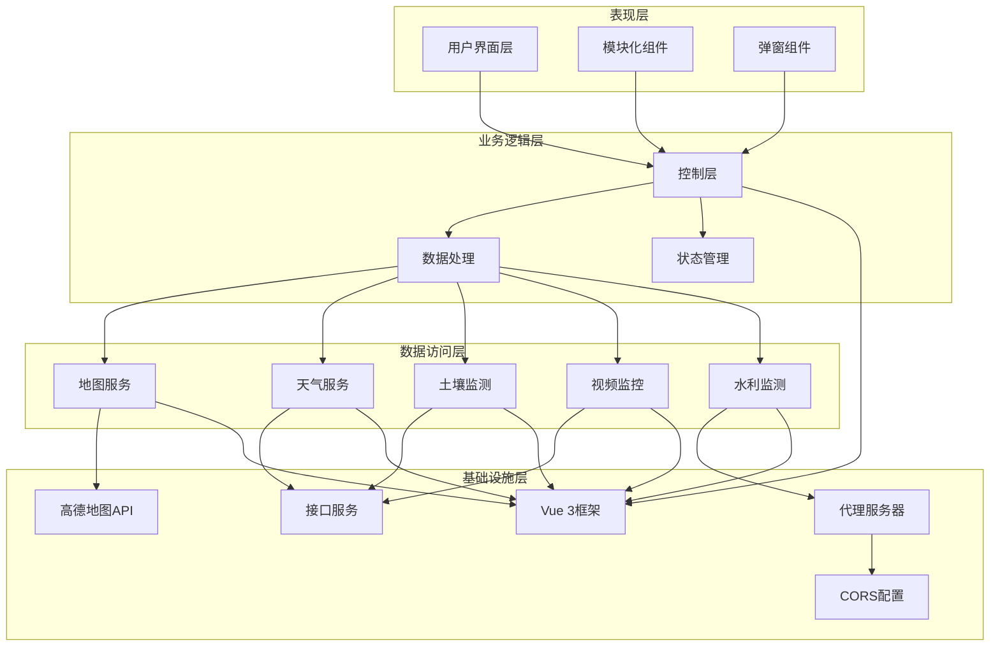

**图表来源**
- [Dashboard.vue:256-495](file://dashboard-app/src/views/Dashboard.vue#L256-L495)
- [router/index.js:1-17](file://dashboard-app/src/router/index.js#L1-L17)

## 详细组件分析

### 视频监控墙模块

视频监控墙是系统的核心功能模块之一，集成了地理信息系统和实时视频监控功能。

#### 功能特性

1. **地理信息系统集成** - 使用高德地图API实现宜川县地理信息可视化
2. **监控点位管理** - 支持多个监控点位的标记和交互
3. **实时预览功能** - 点击监控点可查看实时监控画面
4. **地图导航** - 提供宜川县行政区划和重要地标标注

#### 技术实现

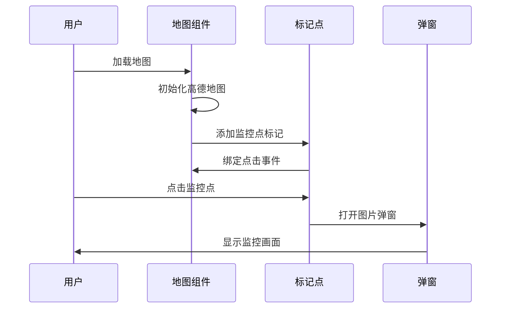

**图表来源**
- [Dashboard.vue:283-343](file://dashboard-app/src/views/Dashboard.vue#L283-L343)
- [Dashboard.vue:422-434](file://dashboard-app/src/views/Dashboard.vue#L422-L434)

#### 关键配置参数

- **地图中心点**: 延安市宜川县城区坐标 [110.1764, 36.0485]
- **初始缩放级别**: 12级
- **地图主题**: 科技蓝风格
- **监控点数量**: 4个主要监控点

**章节来源**
- [Dashboard.vue:283-343](file://dashboard-app/src/views/Dashboard.vue#L283-L343)
- [Dashboard.vue:345-420](file://dashboard-app/src/views/Dashboard.vue#L345-L420)

### 视频会议模块

视频会议模块提供远程协作和应急指挥功能，支持参会单位的实时状态展示。

#### 功能特性

1. **参会单位展示** - 以滚动方式展示各乡镇和部门的在线状态
2. **状态指示** - 通过颜色编码显示设备连接状态
3. **实时更新** - 支持动态添加和移除参会单位
4. **网格布局** - 采用响应式网格布局适配不同屏幕尺寸

#### 数据结构设计

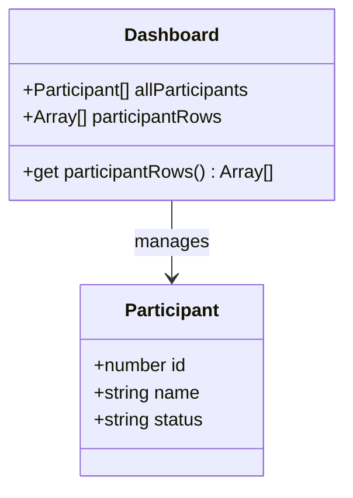

**图表来源**
- [Dashboard.vue:188-210](file://dashboard-app/src/views/Dashboard.vue#L188-L210)
- [Dashboard.vue:242-254](file://dashboard-app/src/views/Dashboard.vue#L242-L254)

**章节来源**
- [Dashboard.vue:53-72](file://dashboard-app/src/views/Dashboard.vue#L53-L72)
- [Dashboard.vue:188-254](file://dashboard-app/src/views/Dashboard.vue#L188-L254)

### 气象与水利监测模块

气象与水利监测模块提供宜川县的天气信息展示和配置功能。

#### 功能特性

1. **云图可视化** - 通过iframe嵌入外部气象云图服务
2. **实时天气数据** - 展示当前温度、湿度、风力等气象指标
3. **动态配置** - 支持用户自定义云图URL
4. **数据面板** - 以卡片形式展示关键气象参数
5. **代理服务器集成** - 通过代理服务器访问后端水利平台

#### 配置流程

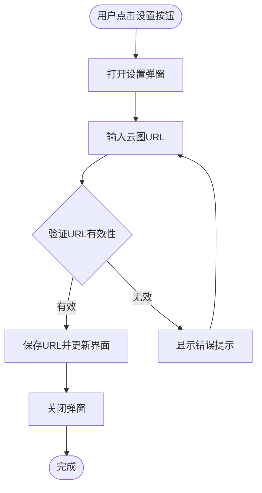

**图表来源**
- [Dashboard.vue:452-482](file://dashboard-app/src/views/Dashboard.vue#L452-L482)

#### 代理服务器配置

系统通过代理服务器实现跨域访问和认证：

- **代理端口**: 3001
- **目标服务器**: http://47.108.54.75:2022
- **认证方式**: Bearer Token + Cookie
- **CORS配置**: 允许 http://localhost:8080 访问

**章节来源**
- [Dashboard.vue:74-92](file://dashboard-app/src/views/Dashboard.vue#L74-L92)
- [Dashboard.vue:452-482](file://dashboard-app/src/views/Dashboard.vue#L452-L482)

### 土壤墒情监测模块

土壤墒情监测模块专注于农业环境监测，提供关键土壤参数的实时数据展示。

#### 监测指标

系统监测以下关键土壤参数：

| 指标名称 | 正常范围 | 单位 | 重要性 |
|---------|---------|------|--------|
| 氮含量 | 15-25 mg/kg | mg/kg | 高 |
| 磷含量 | 18-25 mg/kg | mg/kg | 中 |
| 钾含量 | 20-35 mg/kg | mg/kg | 中 |
| 土壤pH值 | 6.5-8.0 | 无量纲 | 高 |
| 电导率 | 50-150 μS/cm | μS/cm | 中 |
| 土壤水分 | 15-25% | % | 高 |
| 土壤温度 | 10-25°C | °C | 中 |

#### 数据展示设计

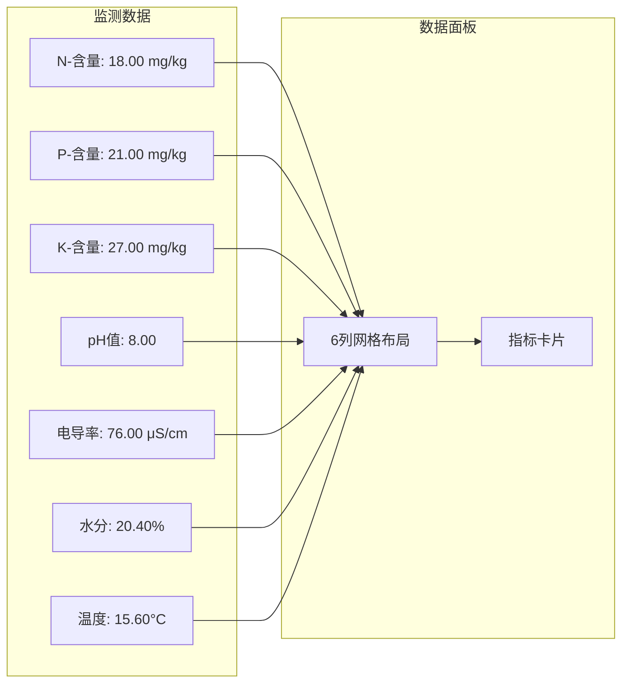

**图表来源**
- [Dashboard.vue:218-228](file://dashboard-app/src/views/Dashboard.vue#L218-L228)
- [Dashboard.vue:1016-1061](file://dashboard-app/src/views/Dashboard.vue#L1016-L1061)

**章节来源**
- [Dashboard.vue:94-140](file://dashboard-app/src/views/Dashboard.vue#L94-L140)
- [Dashboard.vue:218-228](file://dashboard-app/src/views/Dashboard.vue#L218-L228)

### 应急资源分布模块

应急资源分布模块提供全县应急资源的可视化展示和管理功能。

#### 功能特性

1. **资源地图展示** - 在地图上标注各类应急资源的位置
2. **资源统计面板** - 展示各类应急资源的数量统计
3. **资源变动追踪** - 通过滚动动画展示资源的进出变动情况
4. **交互式查询** - 支持按类型筛选和位置查询

#### 资源分类体系

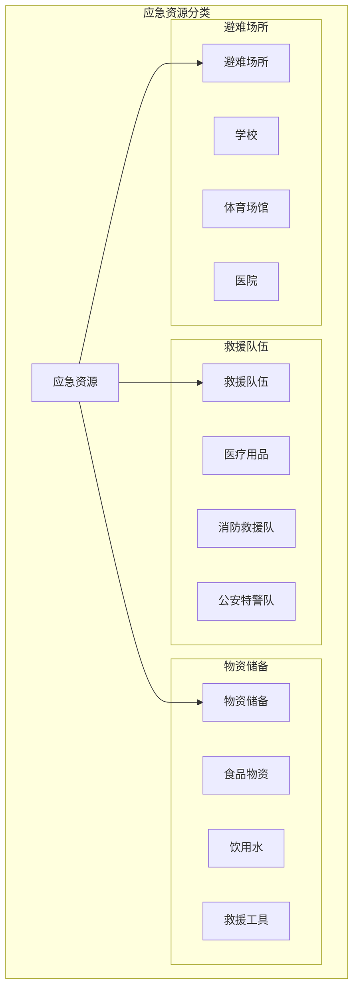

**图表来源**
- [Dashboard.vue:1075-1160](file://dashboard-app/src/views/Dashboard.vue#L1075-L1160)

**章节来源**
- [Dashboard.vue:1075-1160](file://dashboard-app/src/views/Dashboard.vue#L1075-L1160)

## 部署架构

平台支持多环境部署，包括开发、测试和生产环境，提供完整的部署配置和管理机制。

### 生产环境部署

生产环境采用独立的部署包结构，包含完整的静态资源和服务配置：

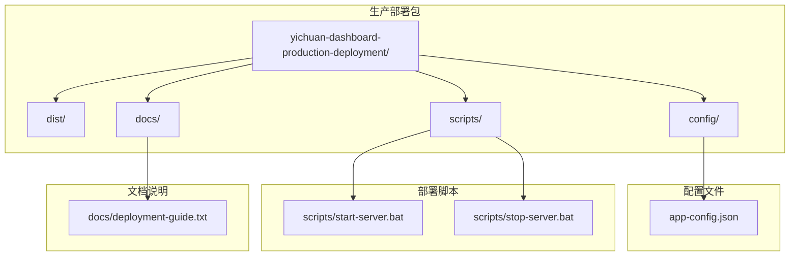

**图表来源**
- [app-config.json:1-53](file://yichuan-dashboard-production-deployment/config/app-config.json#L1-L53)
- [deployment-guide.txt:1-108](file://yichuan-dashboard-production-deployment/docs/deployment-guide.txt#L1-L108)

### 代理服务器架构

系统通过代理服务器实现跨域访问和认证，支持多种部署场景：

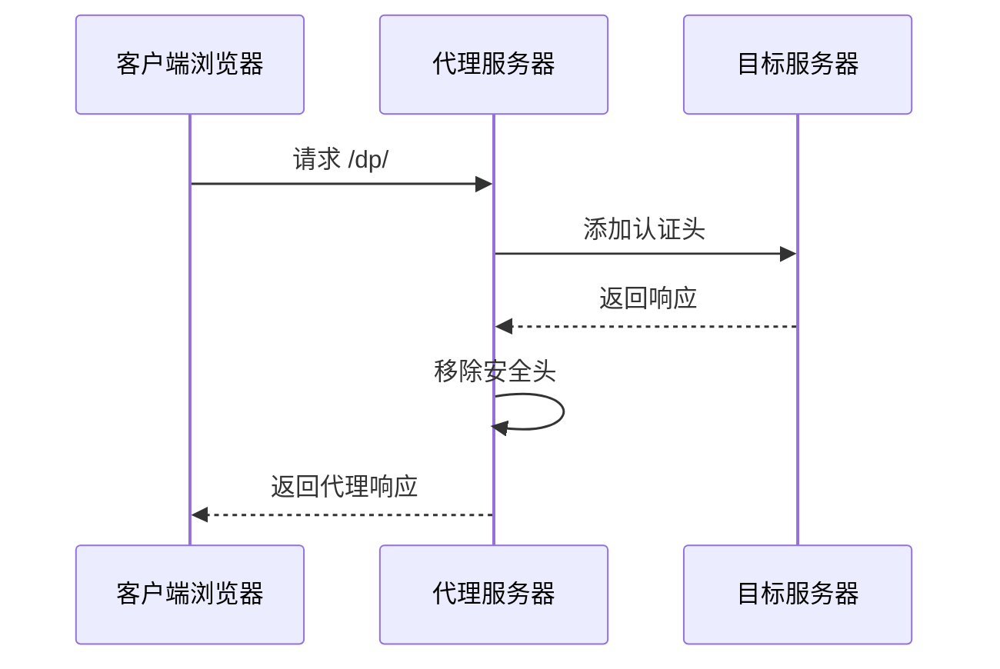

**图表来源**
- [proxy-server.js:64-92](file://代理服务部署包/proxy-server.js#L64-L92)

#### 代理服务器配置

- **端口**: 3001
- **目标服务器**: http://47.108.54.75:2022
- **认证机制**: Bearer Token + Cookie
- **CORS设置**: 允许 http://localhost:8080 访问
- **路径重写**: /dp/* -> 目标服务器/dp/*

**章节来源**
- [app-config.json:1-53](file://yichuan-dashboard-production-deployment/config/app-config.json#L1-L53)
- [deployment-guide.txt:1-108](file://yichuan-dashboard-production-deployment/docs/deployment-guide.txt#L1-L108)
- [proxy-server.js:1-149](file://代理服务部署包/proxy-server.js#L1-L149)

### 屏幕适配配置

系统支持高分辨率大屏显示，提供精确的布局配置：

| 模块 | 宽度百分比 | 宽度像素 | 说明 |
|------|------------|----------|------|
| 视频监控墙 | 26% | 1747px | 第1模块 |
| 视频会议 | 26% | 1747px | 第2模块 |
| 气象与水利监测 | 26% | 1747px | 第3模块 |
| 土壤墒情监测 | 14% | 941px | 第4模块 |
| 模块间距 | 30px × 3 | 90px | 总计6720px |

**章节来源**
- [app-config.json:18-35](file://yichuan-dashboard-production-deployment/config/app-config.json#L18-L35)

## 依赖关系分析

### 外部依赖

项目使用了以下关键外部依赖：

```mermaid
graph TB
subgraph "Vue生态系统"
VUE[Vue 3.2.0]
ROUTER[Vue Router 4.0.0]
END
subgraph "地图服务"
AMap[高德地图API]
end
subgraph "可视化库"
ECharts[ECharts 5.4.0]
Leaflet[Leaflet 1.9.0]
end
subgraph "HTTP客户端"
AXIOS[Axios 1.2.0]
end
subgraph "UI组件库"
ELEMENT[Element Plus 2.2.0]
end
subgraph "代理服务器"
EXPRESS[Express 4.18.0]
HTTP_PROXY[http-proxy-middleware 2.0.6]
CORS[CORS 2.8.5]
end
VUE --> ROUTER
VUE --> AMap
VUE --> ECharts
VUE --> Leaflet
VUE --> AXIOS
VUE --> ELEMENT
EXPRESS --> HTTP_PROXY
EXPRESS --> CORS
```

**图表来源**
- [package.json:14-22](file://dashboard-app/package.json#L14-L22)

### 内部模块依赖

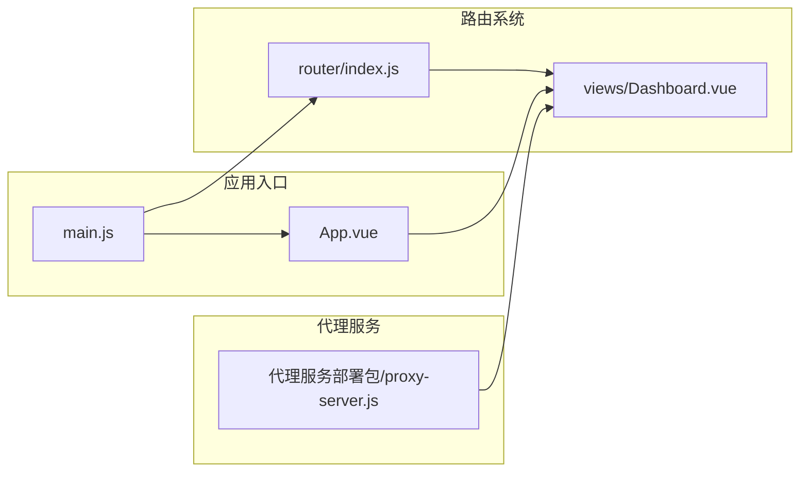

**图表来源**
- [main.js:1-5](file://dashboard-app/src/main.js#L1-L5)
- [router/index.js:1-17](file://dashboard-app/src/router/index.js#L1-L17)

**章节来源**
- [package.json:14-22](file://dashboard-app/package.json#L14-L22)
- [main.js:1-5](file://dashboard-app/src/main.js#L1-L5)

## 性能考虑

### 性能优化策略

1. **懒加载机制** - 仅在需要时加载地图和图表组件
2. **内存管理** - 在组件销毁时清理定时器和地图实例
3. **渲染优化** - 使用虚拟滚动减少DOM节点数量
4. **缓存策略** - 对静态资源和配置数据进行缓存
5. **代理服务器优化** - 减少不必要的请求转发

### 内存泄漏防护

系统实现了完整的生命周期管理：

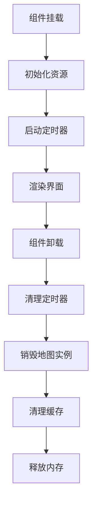

**图表来源**
- [Dashboard.vue:485-494](file://dashboard-app/src/views/Dashboard.vue#L485-L494)

**章节来源**
- [Dashboard.vue:485-494](file://dashboard-app/src/views/Dashboard.vue#L485-L494)

## 故障排除指南

### 常见问题及解决方案

#### 地图加载失败

**问题描述**: 高德地图无法正常加载

**可能原因**:
1. 网络连接异常
2. API密钥配置错误
3. 地图服务不可用

**解决步骤**:
1. 检查网络连接状态
2. 验证地图API配置
3. 查看浏览器控制台错误信息

#### 气象云图显示异常

**问题描述**: 气象云图无法正确显示

**解决方法**:
1. 确认URL格式的有效性
2. 检查跨域访问权限
3. 验证第三方服务可用性

#### 代理服务器连接失败

**问题描述**: 代理服务器无法连接目标服务

**可能原因**:
1. 目标服务器地址配置错误
2. 认证信息过期
3. 网络连接异常

**解决步骤**:
1. 检查 config.json 中的目标服务器配置
2. 验证 Bearer Token 和 Cookie 的有效性
3. 使用健康检查端点验证代理服务器状态
4. 查看代理服务器日志获取详细错误信息

#### 数据更新延迟

**问题描述**: 实时数据显示存在延迟

**优化建议**:
1. 调整定时器更新频率
2. 优化数据请求策略
3. 实现增量更新机制

**章节来源**
- [Dashboard.vue:474-482](file://dashboard-app/src/views/Dashboard.vue#L474-L482)

## 结论

宜川县域监测体系整合平台通过模块化设计实现了功能的高度集成和良好的可维护性。Dashboard.vue作为核心控制器，成功地将视频监控、视频会议、气象监测、土壤检测和应急资源管理等复杂功能整合在一个统一的界面中。

### 主要优势

1. **模块化架构**: 清晰的功能分离便于维护和扩展
2. **响应式设计**: 适配多种设备和屏幕尺寸
3. **实时数据**: 支持动态数据更新和可视化展示
4. **多环境部署**: 支持开发、测试和生产环境的灵活部署
5. **代理服务器**: 提供完整的跨域访问和认证解决方案
6. **用户体验**: 直观的界面设计和流畅的交互体验

### 发展建议

1. **微服务化改造**: 将各功能模块拆分为独立的服务
2. **数据标准化**: 建立统一的数据格式和接口规范
3. **移动端适配**: 开发专门的移动应用版本
4. **AI集成**: 集成机器学习算法进行智能分析
5. **容器化部署**: 采用Docker容器化部署提升运维效率

该平台为县域治理提供了强有力的技术支撑，通过持续的优化和扩展，有望成为智慧城市建设的典范。

**更新** 平台现已具备完善的多环境部署能力，支持生产环境的稳定运行和快速部署，为后续的功能扩展和维护提供了坚实的基础。