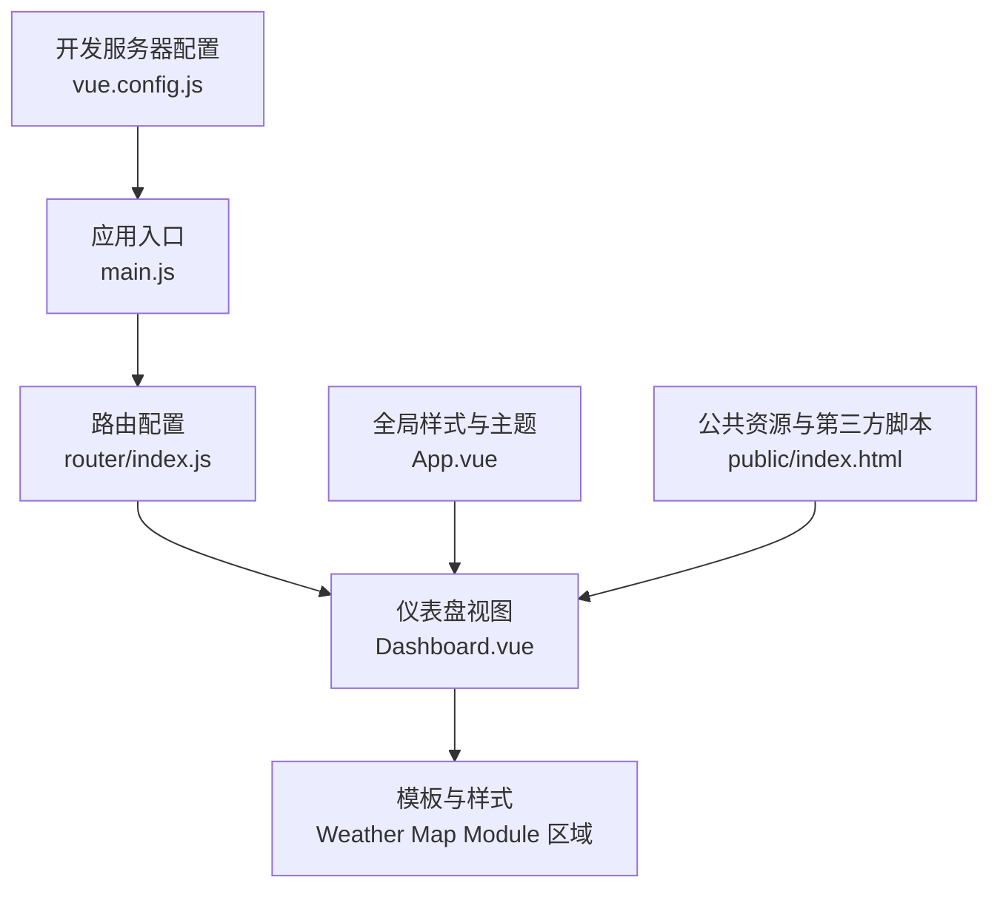
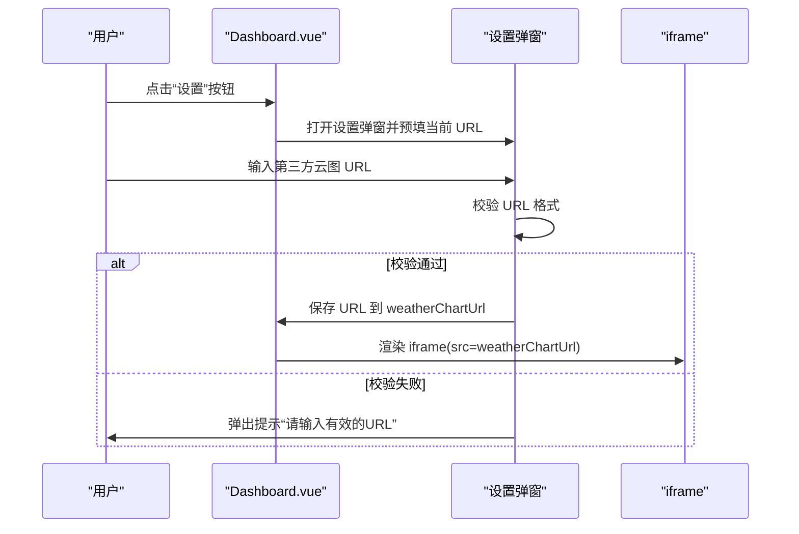
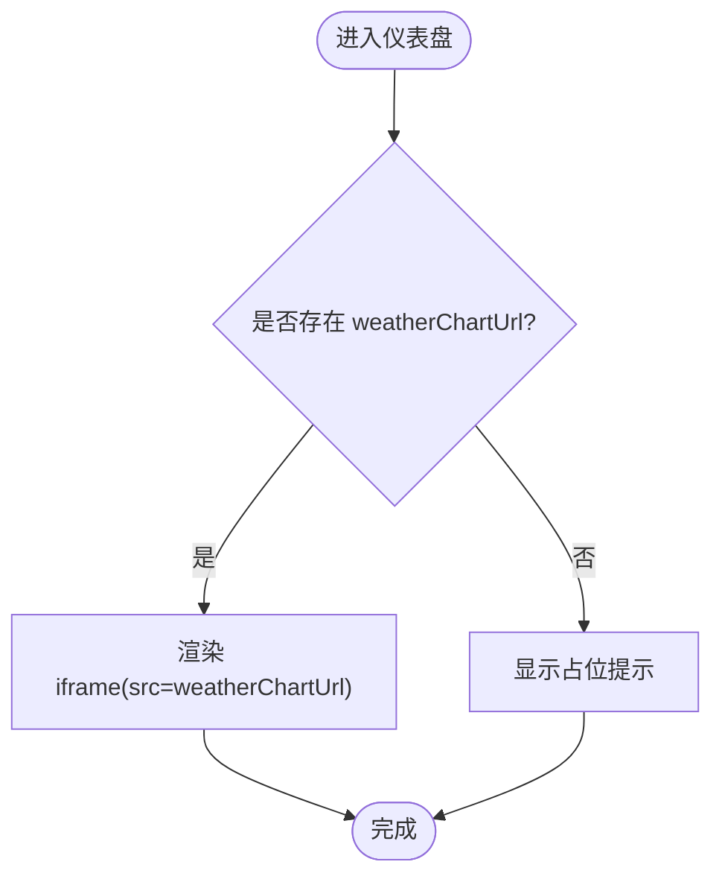
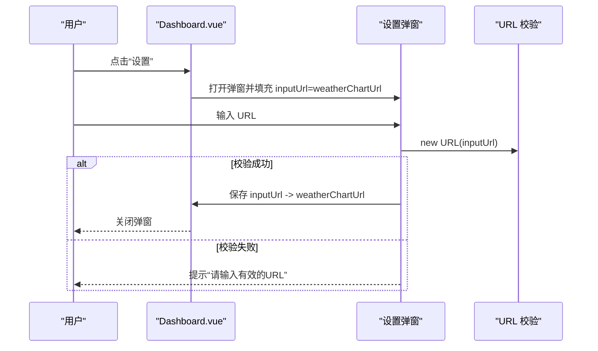
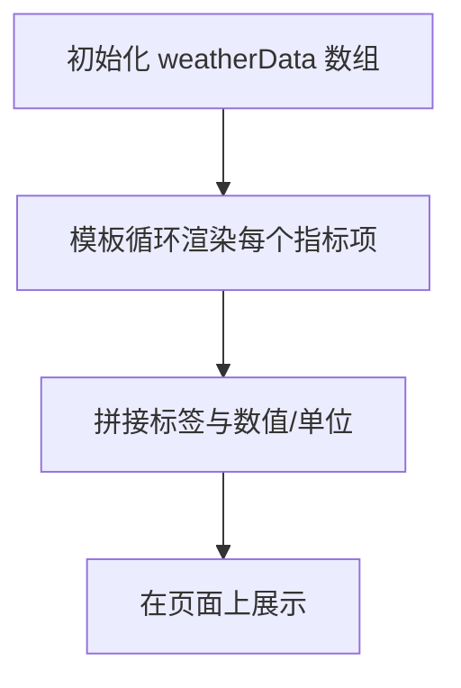
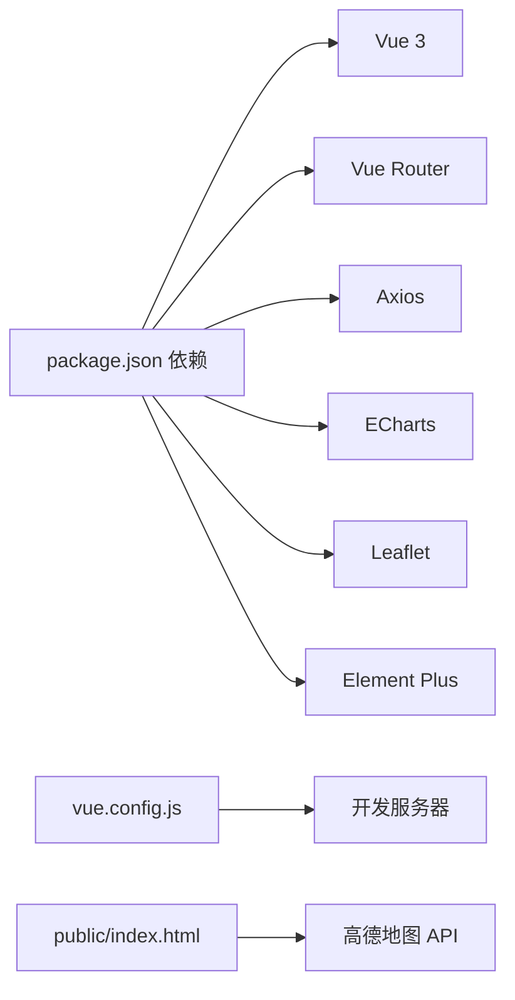

# 气象云图模块

<cite>
**本文引用的文件**
- [Dashboard.vue](file://dashboard-app/src/views/Dashboard.vue)
- [main.js](file://dashboard-app/src/main.js)
- [App.vue](file://dashboard-app/src/App.vue)
- [router/index.js](file://dashboard-app/src/router/index.js)
- [package.json](file://dashboard-app/package.json)
- [vue.config.js](file://dashboard-app/vue.config.js)
- [public/index.html](file://dashboard-app/public/index.html)
</cite>

## 目录
1. [简介](#简介)
2. [项目结构](#项目结构)
3. [核心组件](#核心组件)
4. [架构总览](#架构总览)
5. [详细组件分析](#详细组件分析)
6. [依赖关系分析](#依赖关系分析)
7. [性能考虑](#性能考虑)
8. [故障排查指南](#故障排查指南)
9. [结论](#结论)
10. [附录](#附录)

## 简介
本文件面向“气象云图模块”的实现与使用，围绕以下目标展开：
- 解释 iframe 集成第三方气象云图服务的实现原理，包括 URL 配置管理、安全验证机制与错误处理策略
- 说明气象数据展示系统（温度、湿度、风力、降雨量等）的数据结构与显示格式
- 解释设置弹窗功能的实现，包括 URL 输入验证、配置保存与界面交互逻辑
- 提供气象数据 API 集成示例、数据格式规范与更新频率控制建议
- 总结第三方服务集成最佳实践、缓存策略与性能优化方案
- 给出扩展与替换数据源的技术指导

## 项目结构
该模块位于 Vue 3 应用的仪表盘页面中，采用单文件组件（SFC）组织，路由指向仪表盘视图，应用入口负责挂载路由。

图表来源
- [main.js](file://dashboard-app/src/main.js#L1-L5)
- [router/index.js](file://dashboard-app/src/router/index.js#L1-L17)
- [Dashboard.vue](file://dashboard-app/src/views/Dashboard.vue#L1-L120)
- [App.vue](file://dashboard-app/src/App.vue#L1-L40)
- [vue.config.js](file://dashboard-app/vue.config.js#L1-L19)
- [public/index.html](file://dashboard-app/public/index.html#L1-L27)

章节来源
- [main.js](file://dashboard-app/src/main.js#L1-L5)
- [router/index.js](file://dashboard-app/src/router/index.js#L1-L17)
- [Dashboard.vue](file://dashboard-app/src/views/Dashboard.vue#L1-L120)
- [App.vue](file://dashboard-app/src/App.vue#L1-L40)
- [vue.config.js](file://dashboard-app/vue.config.js#L1-L19)
- [public/index.html](file://dashboard-app/public/index.html#L1-L27)

## 核心组件
- 仪表盘视图（Dashboard.vue）
  - 气象云图模块：包含 iframe 展示区域与静态天气数据展示
  - 设置弹窗：用于输入与校验第三方云图服务 URL 并保存到组件状态
  - 天气数据结构：以数组形式维护温度、湿度、风力、降雨量与预警信息
- 应用入口与路由
  - main.js：创建应用并挂载路由
  - router/index.js：定义根路径到 Dashboard 的路由映射
- 全局样式与主题
  - App.vue：定义科技蓝主题变量与基础样式
- 开发服务器与公共资源
  - vue.config.js：开发服务器端口、热重载与 CSS 内联配置
  - public/index.html：引入高德地图 JS API，为其他模块提供地图能力

章节来源
- [Dashboard.vue](file://dashboard-app/src/views/Dashboard.vue#L74-L92)
- [Dashboard.vue](file://dashboard-app/src/views/Dashboard.vue#L153-L173)
- [Dashboard.vue](file://dashboard-app/src/views/Dashboard.vue#L210-L217)
- [main.js](file://dashboard-app/src/main.js#L1-L5)
- [router/index.js](file://dashboard-app/src/router/index.js#L1-L17)
- [App.vue](file://dashboard-app/src/App.vue#L13-L40)
- [vue.config.js](file://dashboard-app/vue.config.js#L1-L19)
- [public/index.html](file://dashboard-app/public/index.html#L9-L11)

## 架构总览
气象云图模块通过 iframe 将第三方云图服务嵌入到仪表盘中，同时在同页面展示本地化的静态天气数据。设置弹窗负责 URL 的输入、校验与持久化（保存在组件状态）。整体交互流程如下：

图表来源
- [Dashboard.vue](file://dashboard-app/src/views/Dashboard.vue#L77-L85)
- [Dashboard.vue](file://dashboard-app/src/views/Dashboard.vue#L452-L482)

## 详细组件分析

### 气象云图 iframe 集成
- 模板渲染
  - 当存在有效 URL 时，渲染 iframe；否则显示占位提示
  - iframe 容器与样式保证全尺寸填充与无边框
- 数据绑定
  - weatherChartUrl 作为动态 src 绑定值，由设置弹窗确认后写入
- 安全与错误处理
  - 未见 CSP 或同源策略拦截逻辑，需在第三方服务端正确配置跨域与内容安全策略
  - 未见加载失败回退或错误占位，建议在 iframe 上监听 load/error 事件进行容错处理

图表来源
- [Dashboard.vue](file://dashboard-app/src/views/Dashboard.vue#L80-L85)

章节来源
- [Dashboard.vue](file://dashboard-app/src/views/Dashboard.vue#L80-L85)
- [Dashboard.vue](file://dashboard-app/src/views/Dashboard.vue#L941-L951)

### 设置弹窗与 URL 配置管理
- 界面交互
  - 点击设置按钮打开弹窗，预填当前 weatherChartUrl
  - 输入框为 URL 类型，具备浏览器内置校验
  - 确认按钮触发校验与保存，关闭弹窗
- 校验逻辑
  - 使用原生 URL 构造函数进行格式校验
  - 校验失败时提示用户
- 配置保存
  - 成功校验后将输入值赋给 weatherChartUrl，驱动 iframe 重新渲染

图表来源
- [Dashboard.vue](file://dashboard-app/src/views/Dashboard.vue#L452-L482)

章节来源
- [Dashboard.vue](file://dashboard-app/src/views/Dashboard.vue#L153-L173)
- [Dashboard.vue](file://dashboard-app/src/views/Dashboard.vue#L452-L482)

### 气象数据展示系统
- 数据结构
  - 以数组形式存储多个指标项，每项包含类型、标签与值
  - 默认值覆盖温度、湿度、风力、降雨量与预警信息
- 显示格式
  - 标签与数值分开展示，数值右对齐
  - 数值单位与文本组合显示
- 扩展建议
  - 可将默认值替换为从 API 获取的实时数据
  - 支持按地区切换与多站点对比

图表来源
- [Dashboard.vue](file://dashboard-app/src/views/Dashboard.vue#L210-L217)
- [Dashboard.vue](file://dashboard-app/src/views/Dashboard.vue#L953-L973)

章节来源
- [Dashboard.vue](file://dashboard-app/src/views/Dashboard.vue#L210-L217)
- [Dashboard.vue](file://dashboard-app/src/views/Dashboard.vue#L953-L973)

### 第三方服务集成最佳实践
- URL 安全性
  - 仅允许 https 协议与可信域名
  - 在服务端或代理层统一出口，避免直接暴露第三方密钥
- 跨域与 CSP
  - 第三方云图服务需正确设置 CORS 与 Content-Security-Policy
  - 若 iframe 内容受限，可在网关层代理或使用同源服务
- 错误处理
  - 为 iframe 绑定 load/error 事件，出现错误时显示占位或降级内容
- 缓存策略
  - 对于非实时数据，可结合 HTTP 缓存头与前端缓存
  - 对于频繁刷新的图表，建议限制刷新频率并使用节流/防抖
- 性能优化
  - 按需加载 iframe，滚动到可视区域再渲染
  - 控制 iframe 数量与并发请求，避免阻塞主线程
- 更新频率控制
  - 对于外部 iframe，遵循第三方提供的刷新策略
  - 对于内部数据，建议最小 30 秒刷新一次，避免过度请求

章节来源
- [Dashboard.vue](file://dashboard-app/src/views/Dashboard.vue#L474-L482)

### 数据源替换与扩展
- 替换第三方云图
  - 将 weatherChartUrl 指向新的第三方服务或自建服务
  - 确保新服务支持跨域与必要的安全策略
- 自建数据接口
  - 通过 API 获取 JSON 格式的气象数据，解析为图表组件所需格式
  - 接口字段建议包含：温度、湿度、风速、风向、降水量、能见度、紫外线强度、空气质量等
  - 响应示例字段（命名与单位可根据实际服务调整）：
    - temperature: 数值字符串（如 "15°C"）
    - humidity: 数值字符串（如 "68%"）
    - wind: 风级或风速字符串（如 "3级" 或 "3 m/s"）
    - rainfall: 当日累计或小时值（如 "0mm" 或 "0.2 mm/h"）
    - warning: 预警状态（如 "无" 或 "暴雨橙色预警"）
- 更新频率控制
  - 建议后端接口返回 Cache-Control 与 ETag
  - 前端使用定时器或 IntersectionObserver 控制刷新时机

章节来源
- [Dashboard.vue](file://dashboard-app/src/views/Dashboard.vue#L210-L217)

## 依赖关系分析
- 运行时依赖
  - vue: ^3.2.0（响应式与组件系统）
  - vue-router: ^4.0.0（路由）
  - axios: ^1.2.0（HTTP 请求，可用于对接气象 API）
  - echarts: ^5.4.0（图表库，可用于自绘气象图表）
  - leaflet: ^1.9.0（地图库，可用于自绘站点与图层）
  - element-plus: ^2.2.0（UI 组件库，可选）
- 构建与开发
  - @vue/cli-service：Vue CLI 构建与开发服务器
  - vue.config.js：开发服务器端口、热重载与 CSS 内联配置
- 公共资源
  - public/index.html：引入高德地图 JS API，为地图类模块提供基础能力

图表来源
- [package.json](file://dashboard-app/package.json#L14-L22)
- [vue.config.js](file://dashboard-app/vue.config.js#L1-L19)
- [public/index.html](file://dashboard-app/public/index.html#L9-L11)

章节来源
- [package.json](file://dashboard-app/package.json#L14-L22)
- [vue.config.js](file://dashboard-app/vue.config.js#L1-L19)
- [public/index.html](file://dashboard-app/public/index.html#L9-L11)

## 性能考虑
- 按需渲染
  - iframe 仅在可见时加载，减少初始渲染压力
- 刷新策略
  - 对外部 iframe，避免频繁刷新；对内部数据，使用节流/防抖
- 缓存与代理
  - 对第三方服务使用代理或 CDN，提升稳定性与速度
- 资源优化
  - 合理设置 CSS 内联与打包策略，避免重复加载

## 故障排查指南
- iframe 无法加载
  - 检查 URL 是否为 https 且第三方服务允许跨域
  - 在浏览器控制台查看网络与安全策略相关错误
- URL 校验失败
  - 确认输入为合法 URL（协议、主机名、路径）
  - 如仍失败，检查第三方服务是否支持 iframe 嵌入
- 页面样式异常
  - 检查 App.vue 主题变量与 Dashboard.vue 样式是否冲突
  - 确认 vue.config.js 中 CSS 内联配置未影响样式加载

章节来源
- [Dashboard.vue](file://dashboard-app/src/views/Dashboard.vue#L474-L482)
- [App.vue](file://dashboard-app/src/App.vue#L13-L40)
- [vue.config.js](file://dashboard-app/vue.config.js#L16-L18)

## 结论
本模块通过 iframe 实现了对第三方气象云图服务的快速集成，配合设置弹窗完成 URL 的输入、校验与保存。展示侧以静态数据为主，便于后续接入真实 API。建议在生产环境中完善安全策略、错误处理与缓存机制，并根据业务需求选择合适的刷新频率与数据源。

## 附录
- 开发与运行
  - 使用 npm scripts 启动开发服务器与构建产物
  - 开发服务器默认端口为 8080，自动打开浏览器
- 资源与地图
  - public/index.html 引入高德地图 JS API，为地图类模块提供基础能力

章节来源
- [package.json](file://dashboard-app/package.json#L5-L8)
- [vue.config.js](file://dashboard-app/vue.config.js#L5-L15)
- [public/index.html](file://dashboard-app/public/index.html#L9-L11)