# 视频会议模块

<cite>
**本文档引用的文件**
- [App.vue](file://dashboard-app/src/App.vue)
- [main.js](file://dashboard-app/src/main.js)
- [Dashboard.vue](file://dashboard-app/src/views/Dashboard.vue)
- [router/index.js](file://dashboard-app/src/router/index.js)
- [package.json](file://dashboard-app/package.json)
</cite>

## 目录
1. [简介](#简介)
2. [项目结构](#项目结构)
3. [核心组件](#核心组件)
4. [架构概览](#架构概览)
5. [详细组件分析](#详细组件分析)
6. [依赖关系分析](#依赖关系分析)
7. [性能考虑](#性能考虑)
8. [故障排除指南](#故障排除指南)
9. [结论](#结论)

## 简介

视频会议模块是宜川县域监测体系整合平台中的一个重要组成部分，负责展示参会单位的状态信息和实时滚动展示。该模块实现了以下核心功能：

- **参会单位状态展示**：通过状态指示器清晰展示各单位的在线/离线状态
- **滚动展示功能**：使用CSS动画实现参会单位列表的平滑滚动效果
- **网格布局设计**：采用3行2列的布局模式，支持响应式适配
- **视觉反馈机制**：提供丰富的视觉层次和交互反馈

## 项目结构

该项目采用Vue.js 3构建，整体架构清晰，模块化程度高：

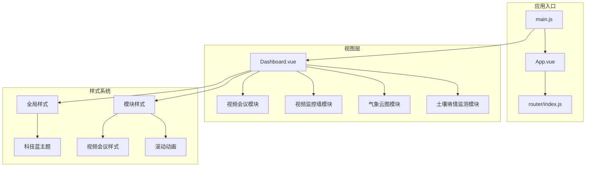

**图表来源**
- [main.js](file://dashboard-app/src/main.js#L1-L5)
- [App.vue](file://dashboard-app/src/App.vue#L1-L40)
- [Dashboard.vue](file://dashboard-app/src/views/Dashboard.vue#L1-L175)

**章节来源**
- [main.js](file://dashboard-app/src/main.js#L1-L5)
- [App.vue](file://dashboard-app/src/App.vue#L1-L40)
- [router/index.js](file://dashboard-app/src/router/index.js#L1-L17)

## 核心组件

### 视频会议模块架构

视频会议模块位于仪表板的中央位置，采用现代化的设计理念：

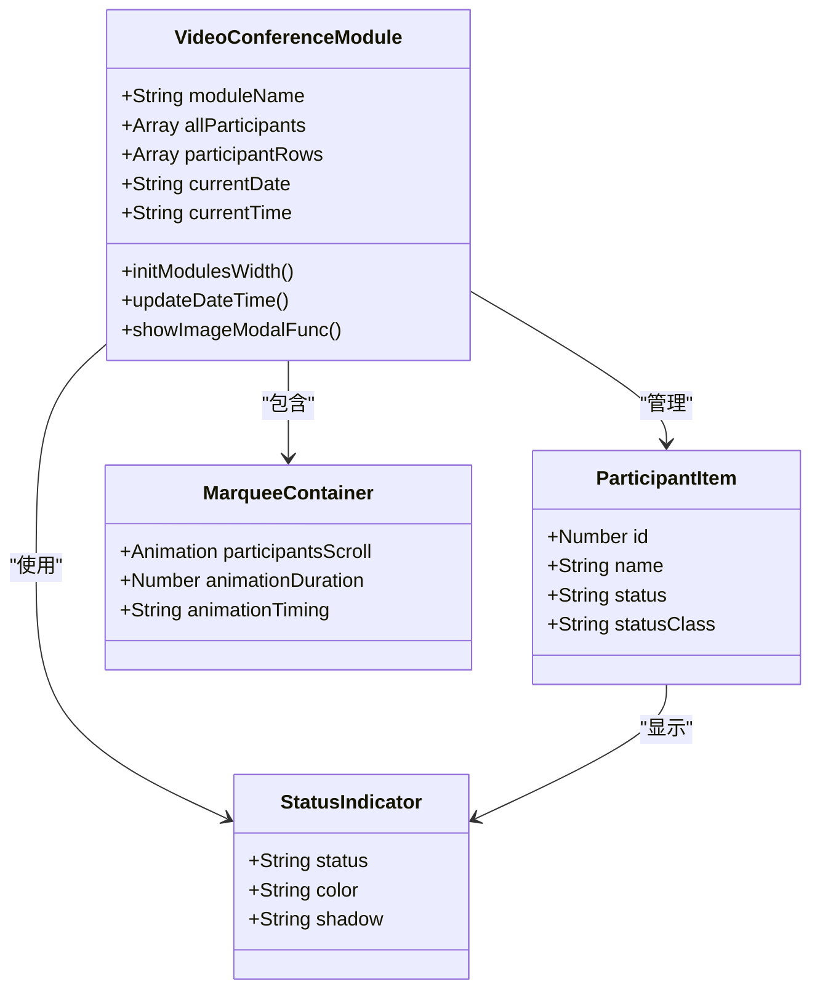

**图表来源**
- [Dashboard.vue](file://dashboard-app/src/views/Dashboard.vue#L178-L255)
- [Dashboard.vue](file://dashboard-app/src/views/Dashboard.vue#L828-L887)

### 数据结构定义

#### 参会单位数据模型

| 字段名 | 类型 | 描述 | 示例值 |
|--------|------|------|--------|
| id | Number | 参会单位唯一标识符 | 1, 2, 3 |
| name | String | 参会单位名称 | "城关镇", "英旺乡" |
| status | String | 参会单位状态 | "online", "offline" |

#### 状态枚举值

| 枚举值 | 颜色 | CSS类 | 描述 |
|--------|------|-------|------|
| online | #8bc34a | `.participant-status.online` | 在线状态，绿色指示器 |
| offline | #f44336 | `.participant-status.offline` | 离线状态，红色指示器 |

**章节来源**
- [Dashboard.vue](file://dashboard-app/src/views/Dashboard.vue#L189-L210)
- [Dashboard.vue](file://dashboard-app/src/views/Dashboard.vue#L864-L870)

## 架构概览

### 整体架构设计

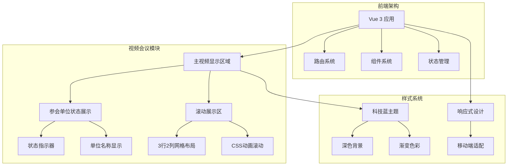

**图表来源**
- [Dashboard.vue](file://dashboard-app/src/views/Dashboard.vue#L54-L72)
- [Dashboard.vue](file://dashboard-app/src/views/Dashboard.vue#L828-L887)

### 状态管理流程

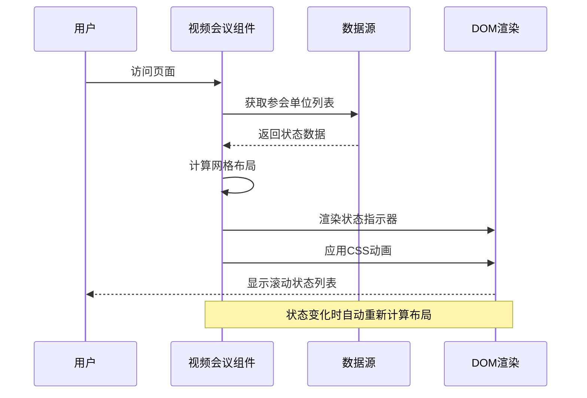

**图表来源**
- [Dashboard.vue](file://dashboard-app/src/views/Dashboard.vue#L240-L255)
- [Dashboard.vue](file://dashboard-app/src/views/Dashboard.vue#L61-L70)

## 详细组件分析

### 状态指示器设计

#### 设计原则

状态指示器采用简洁而直观的设计理念：

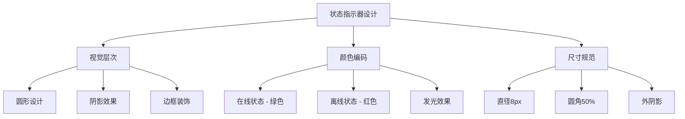

**图表来源**
- [Dashboard.vue](file://dashboard-app/src/views/Dashboard.vue#L857-L870)

#### 实现细节

状态指示器通过CSS类实现动态状态切换：

- **在线状态**：使用绿色(#8bc34a)，带有柔和的发光效果
- **离线状态**：使用红色(#f44336)，表示连接异常
- **尺寸规格**：8px × 8px的圆形指示器，确保在小空间内清晰可见

**章节来源**
- [Dashboard.vue](file://dashboard-app/src/views/Dashboard.vue#L857-L870)

### 在线离线状态管理

#### 状态转换机制

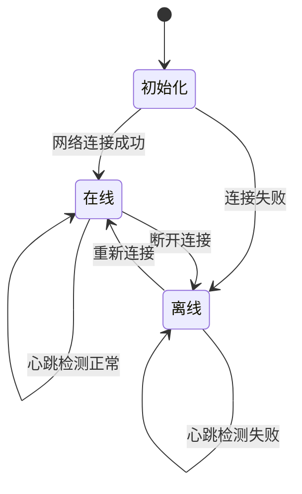

#### 状态更新策略

状态管理采用以下策略：
- **实时性**：状态变化立即反映在UI上
- **容错性**：网络波动时提供合理的重试机制
- **可观察性**：通过视觉反馈让用户清楚了解系统状态

**章节来源**
- [Dashboard.vue](file://dashboard-app/src/views/Dashboard.vue#L189-L210)

### 视觉反馈机制

#### 多层次视觉设计

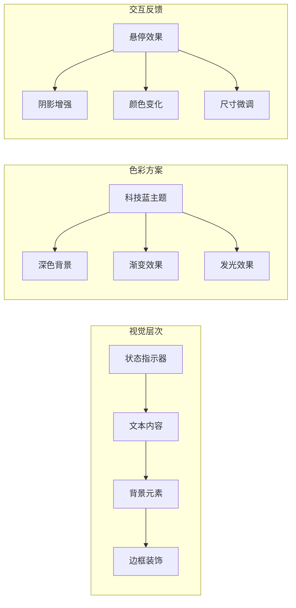

**图表来源**
- [Dashboard.vue](file://dashboard-app/src/views/Dashboard.vue#L828-L887)
- [App.vue](file://dashboard-app/src/App.vue#L13-L40)

### 参会单位列表滚动展示

#### Marquee效果实现

滚动展示功能通过CSS动画实现：

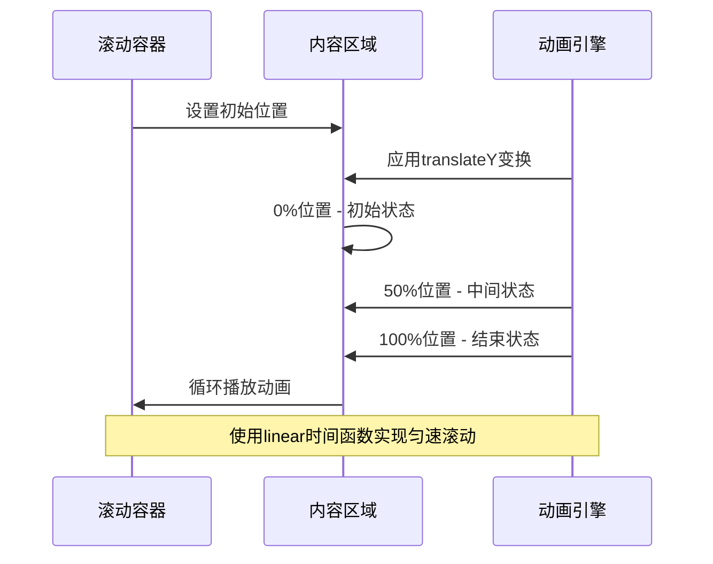

**图表来源**
- [Dashboard.vue](file://dashboard-app/src/views/Dashboard.vue#L837-L887)

#### 动画参数配置

| 参数 | 值 | 说明 |
|------|-----|------|
| 动画时长 | 20秒 | 确保滚动速度适中，便于阅读 |
| 时间函数 | linear | 保持恒定速度，避免视觉跳跃 |
| 重复次数 | infinite | 持续循环展示 |
| 变换类型 | translateY | 垂直方向滚动 |

**章节来源**
- [Dashboard.vue](file://dashboard-app/src/views/Dashboard.vue#L837-L887)

### 数据分组算法

#### 3行2列网格布局

```mermaid
flowchart TD
A[原始数据列表] --> B[分组算法]
B --> C[每行6个元素]
C --> D[3行布局]
D --> E[2列排列]
B --> F[索引计算]
F --> G[rowIndex = Math.floor(i/6)]
F --> H[colIndex = i % 6]
G --> I[行索引计算]
H --> J[列索引计算]
I --> K[第1行: 索引0-5]
I --> L[第2行: 索引6-11]
I --> M[第3行: 索引12-17]
K --> N[第1列: 索引0,2,4]
K --> O[第2列: 索引1,3,5]
```

**图表来源**
- [Dashboard.vue](file://dashboard-app/src/views/Dashboard.vue#L240-L255)

#### 分组实现逻辑

分组算法采用以下步骤：
1. **批量处理**：每次处理6个元素形成一行
2. **索引映射**：将一维数组映射到二维网格
3. **动态计算**：根据当前元素数量动态调整行数

**章节来源**
- [Dashboard.vue](file://dashboard-app/src/views/Dashboard.vue#L240-L255)

### 布局优化策略

#### 响应式适配

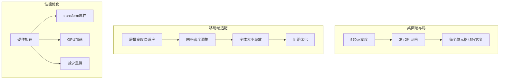

**图表来源**
- [Dashboard.vue](file://dashboard-app/src/views/Dashboard.vue#L841-L855)
- [Dashboard.vue](file://dashboard-app/src/views/Dashboard.vue#L709-L727)

#### 性能优化技术

- **硬件加速**：使用transform属性触发GPU加速
- **减少重绘**：避免频繁的DOM操作
- **内存管理**：及时清理定时器和事件监听器

**章节来源**
- [Dashboard.vue](file://dashboard-app/src/views/Dashboard.vue#L841-L855)
- [Dashboard.vue](file://dashboard-app/src/views/Dashboard.vue#L709-L727)

## 依赖关系分析

### 技术栈依赖

```mermaid
graph TD
subgraph "核心框架"
A[Vue 3.2.0] --> B[Composition API]
A --> C[响应式系统]
end
subgraph "路由系统"
D[Vue Router 4.0.0] --> E[历史模式]
D --> F[嵌套路由]
end
subgraph "第三方库"
G[Element Plus 2.2.0] --> H[UI组件库]
I[Axios 1.2.0] --> J[HTTP客户端]
K[ECharts 5.4.0] --> L[数据可视化]
end
subgraph "开发工具"
M[@Vue CLI Service 5.0.0] --> N[构建工具]
O[ESLint] --> P[代码质量]
end
A --> D
A --> G
M --> N
```

**图表来源**
- [package.json](file://dashboard-app/package.json#L14-L22)

### 组件依赖关系

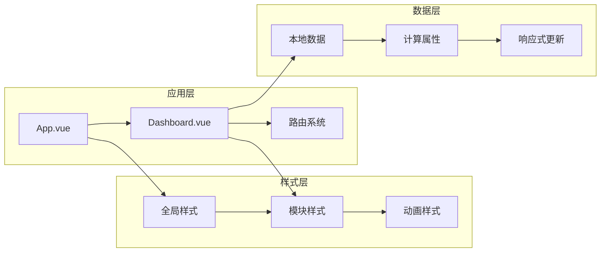

**图表来源**
- [main.js](file://dashboard-app/src/main.js#L1-L5)
- [Dashboard.vue](file://dashboard-app/src/views/Dashboard.vue#L178-L255)

**章节来源**
- [package.json](file://dashboard-app/package.json#L1-L23)
- [Dashboard.vue](file://dashboard-app/src/views/Dashboard.vue#L178-L255)

## 性能考虑

### 滚动动画性能优化

#### GPU加速实现

滚动动画通过CSS transform属性实现硬件加速：

- **transform3d**：启用GPU加速渲染
- **will-change**：提示浏览器进行优化
- **backface-visibility**：防止背面可见性问题

#### 内存管理策略

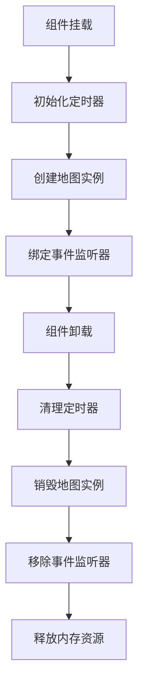

#### 性能监控指标

| 指标 | 目标值 | 说明 |
|------|--------|------|
| FPS | ≥60 | 保持流畅的动画效果 |
| 内存占用 | ≤50MB | 控制内存使用量 |
| CPU使用率 | ≤30% | 避免过度消耗CPU资源 |
| 响应时间 | ≤100ms | 确保用户交互响应速度 |

## 故障排除指南

### 常见问题及解决方案

#### 状态显示异常

**问题描述**：状态指示器不显示或显示错误

**可能原因**：
1. CSS类名拼写错误
2. 状态值不在预定义范围内
3. 样式被其他样式覆盖

**解决步骤**：
1. 检查状态值是否为"online"或"offline"
2. 验证CSS类名正确性
3. 使用浏览器开发者工具检查样式应用情况

#### 滚动动画不工作

**问题描述**：参会单位列表不滚动或滚动异常

**可能原因**：
1. CSS动画未正确加载
2. 容器高度设置不当
3. 动画时长配置错误

**解决步骤**：
1. 检查@keyframes定义是否正确
2. 验证容器的height和overflow属性
3. 确认animation属性应用到正确元素

#### 布局错乱问题

**问题描述**：网格布局显示异常

**可能原因**：
1. 数据长度不是6的倍数
2. CSS媒体查询未正确配置
3. Flexbox属性设置错误

**解决步骤**：
1. 检查数据数组长度
2. 验证CSS媒体查询语法
3. 确认Flexbox属性兼容性

**章节来源**
- [Dashboard.vue](file://dashboard-app/src/views/Dashboard.vue#L837-L887)
- [Dashboard.vue](file://dashboard-app/src/views/Dashboard.vue#L240-L255)

## 结论

视频会议模块展现了现代前端开发的最佳实践，通过精心设计的状态管理系统、流畅的动画效果和响应式的布局设计，为用户提供了一个专业而直观的参会单位状态展示界面。

### 主要优势

1. **用户体验优秀**：清晰的状态指示和流畅的动画效果
2. **技术实现先进**：采用最新的Vue.js技术和CSS3特性
3. **性能表现优异**：通过硬件加速和优化策略确保流畅运行
4. **可维护性强**：模块化设计和清晰的代码结构

### 扩展建议

1. **状态同步**：集成实时WebSocket连接实现状态同步
2. **数据持久化**：添加本地存储支持断线恢复
3. **主题定制**：提供更多主题选项满足不同需求
4. **无障碍访问**：增强键盘导航和屏幕阅读器支持

该模块为后续的功能扩展奠定了坚实的基础，开发者可以根据实际需求进行进一步的定制和优化。