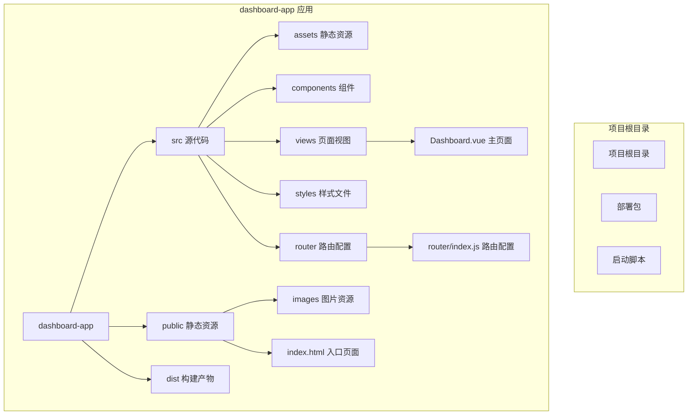
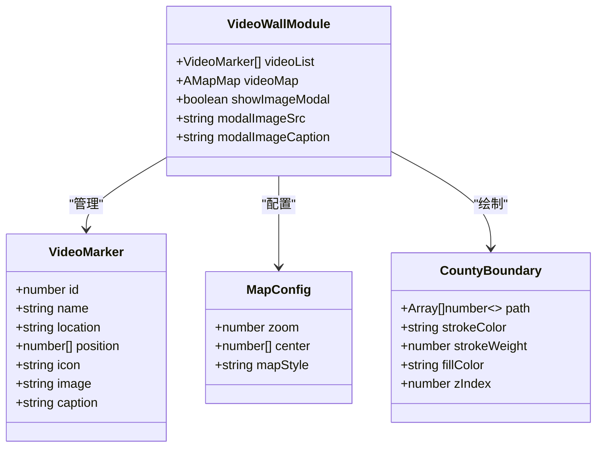
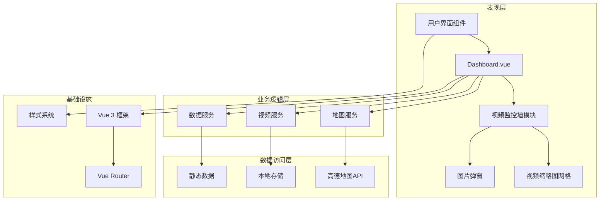
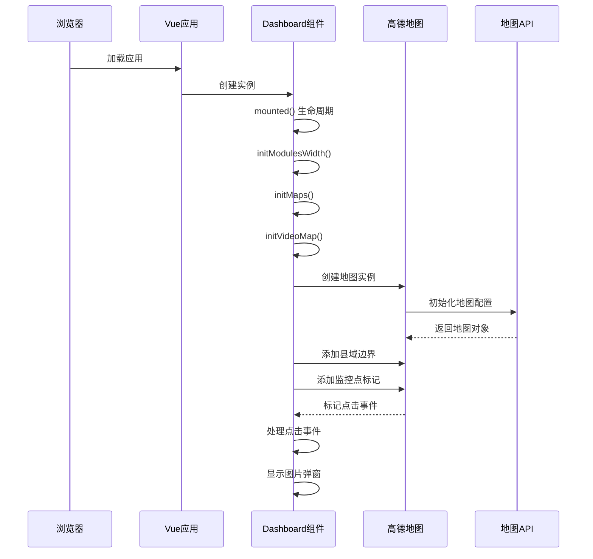
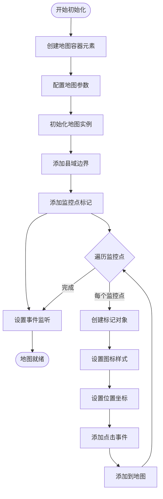
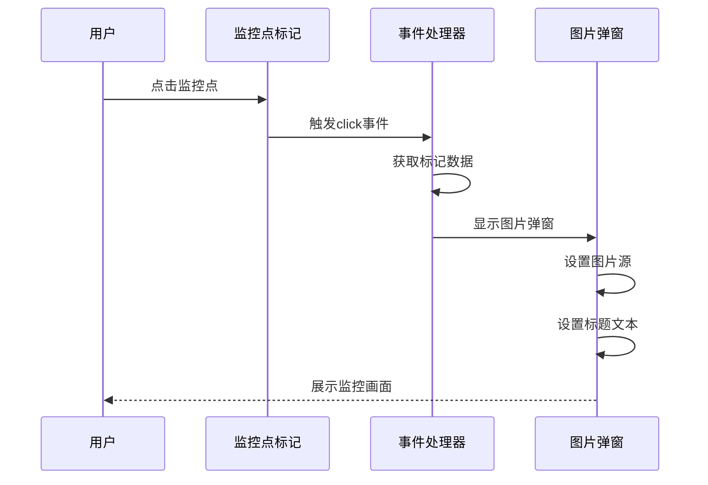
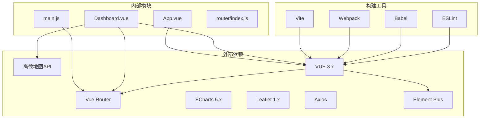

# 视频监控墙模块

<cite>
**本文档引用的文件**
- [App.vue](file://dashboard-app/src/App.vue)
- [main.js](file://dashboard-app/src/main.js)
- [Dashboard.vue](file://dashboard-app/src/views/Dashboard.vue)
- [router/index.js](file://dashboard-app/src/router/index.js)
- [package.json](file://dashboard-app/package.json)
- [public/index.html](file://dashboard-app/public/index.html)
</cite>

## 目录
1. [简介](#简介)
2. [项目结构](#项目结构)
3. [核心组件](#核心组件)
4. [架构概览](#架构概览)
5. [详细组件分析](#详细组件分析)
6. [依赖关系分析](#依赖关系分析)
7. [性能考虑](#性能考虑)
8. [故障排除指南](#故障排除指南)
9. [结论](#结论)
10. [附录](#附录)

## 简介
视频监控墙模块是宜川县域监测体系整合平台的核心可视化组件，集成了高德地图API实现视频监控点位的地理信息系统展示。该模块提供了完整的地图功能，包括地图初始化、县域轮廓边界绘制、监控点位标记添加、视频缩略图展示等核心功能。

该模块采用Vue 3框架构建，使用高德地图JavaScript API进行地图渲染，实现了科技蓝主题风格的现代化界面设计。模块支持实时监控数据展示、地图交互操作和响应式布局。

## 项目结构
项目采用标准的Vue CLI项目结构，重点关注dashboard-app目录下的前端应用实现：



**图表来源**
- [Dashboard.vue](file://dashboard-app/src/views/Dashboard.vue#L1-L50)
- [router/index.js](file://dashboard-app/src/router/index.js#L1-L17)

**章节来源**
- [Dashboard.vue](file://dashboard-app/src/views/Dashboard.vue#L1-L50)
- [package.json](file://dashboard-app/package.json#L1-L23)

## 核心组件
视频监控墙模块的核心组件包括：

### 主要组件职责
- **Dashboard组件**: 整合所有监控模块的主页面容器
- **视频监控墙模块**: 集成地图展示和视频缩略图的综合展示区域
- **地图组件**: 基于高德地图API的地图渲染和交互控制
- **视频缩略图组件**: 监控点位的网格化展示和图片弹窗功能

### 数据结构设计
模块采用统一的数据模型来管理监控点位信息：



**图表来源**
- [Dashboard.vue](file://dashboard-app/src/views/Dashboard.vue#L182-L340)

**章节来源**
- [Dashboard.vue](file://dashboard-app/src/views/Dashboard.vue#L182-L340)

## 架构概览
视频监控墙模块采用分层架构设计，实现了清晰的关注点分离：



**图表来源**
- [Dashboard.vue](file://dashboard-app/src/views/Dashboard.vue#L256-L495)
- [router/index.js](file://dashboard-app/src/router/index.js#L1-L17)

### 控制流分析
模块的初始化流程遵循标准的Vue生命周期模式：



**图表来源**
- [Dashboard.vue](file://dashboard-app/src/views/Dashboard.vue#L256-L340)

**章节来源**
- [Dashboard.vue](file://dashboard-app/src/views/Dashboard.vue#L256-L340)

## 详细组件分析

### 地图初始化与配置
地图模块实现了完整的初始化流程，包括基础配置和高级功能设置：

#### 地图配置参数
- **缩放级别**: 默认12级，适合县域范围的监控展示
- **中心坐标**: 延安市宜川县城区坐标 `[110.1764, 36.0485]`
- **地图样式**: 科技蓝主题 `amap://styles/blue`
- **容器元素**: `#video-map-container` ID的DOM元素

#### 地图初始化流程


**图表来源**
- [Dashboard.vue](file://dashboard-app/src/views/Dashboard.vue#L283-L340)

**章节来源**
- [Dashboard.vue](file://dashboard-app/src/views/Dashboard.vue#L283-L340)

### 县域轮廓边界绘制
模块实现了多层次的地理要素绘制功能：

#### 县域轮廓绘制
- **轮廓路径**: 使用6个坐标点构成的多边形
- **视觉样式**: 橙色轮廓线 `#FFA500`，3像素线宽
- **填充样式**: 透明填充，确保不影响地图底图
- **层级控制**: Z-index设置为10，确保轮廓在其他要素之上

#### 地理要素补充
- **主要河流**: 蓝色河流线 `#00BFFF`，4像素线宽
- **水库标记**: 东风水库位置标注
- **乡镇名称**: 城关镇、英旺乡、云岩镇等标注

**章节来源**
- [Dashboard.vue](file://dashboard-app/src/views/Dashboard.vue#L345-L420)

### 监控点位标记系统
监控点位采用统一的标记系统，支持丰富的交互功能：

#### 标记数据结构
每个监控点位包含以下关键属性：
- **位置坐标**: 精确的经纬度坐标数组
- **标题信息**: 显示在工具提示中的文本
- **图标样式**: 自定义的标记图标URL
- **关联图片**: 点击时显示的监控画面
- **描述信息**: 图片的详细说明文本

#### 标记样式配置
- **偏移量**: `-10, -36`像素的精确对齐
- **图标尺寸**: 高德地图默认的蓝色标记系列
- **交互效果**: 支持点击、悬停等标准地图交互

#### 点击事件处理机制


**图表来源**
- [Dashboard.vue](file://dashboard-app/src/views/Dashboard.vue#L334-L340)

**章节来源**
- [Dashboard.vue](file://dashboard-app/src/views/Dashboard.vue#L295-L340)

### 视频缩略图展示系统
视频缩略图采用网格布局设计，提供直观的监控点位浏览体验：

#### 网格布局设计
- **布局结构**: 2列2行的网格布局
- **尺寸规格**: 每个缩略图单元1fr网格轨道
- **间距控制**: 10像素的网格间距
- **高度限制**: 固定120像素的高度

#### 缩略图内容结构
每个缩略图包含两个主要部分：
- **占位符区域**: 80像素高的预览区域
- **信息标签**: 10像素字体的位置信息显示

#### 交互逻辑
- **点击行为**: 点击缩略图触发对应的监控画面展示
- **悬停效果**: 提供视觉反馈增强用户体验
- **响应式设计**: 适配不同屏幕尺寸的显示需求

**章节来源**
- [Dashboard.vue](file://dashboard-app/src/views/Dashboard.vue#L45-L50)

### 图片弹窗功能
图片弹窗提供了全屏的监控画面展示能力：

#### 弹窗结构设计
- **遮罩层**: 半透明黑色背景，z-index 1000
- **内容容器**: 白色背景，圆角边框，最大80%尺寸
- **关闭按钮**: 绝对定位的×按钮，便于用户关闭

#### 图片展示特性
- **自适应尺寸**: 最大宽度100%，最大高度70vh
- **圆角设计**: 4像素圆角提升视觉效果
- **居中对齐**: 弹窗内容垂直水平居中显示

#### 交互控制
- **点击遮罩关闭**: 点击弹窗外部区域自动关闭
- **点击内容阻止冒泡**: 防止内容区域点击影响关闭行为
- **键盘支持**: 支持ESC键快速关闭弹窗

**章节来源**
- [Dashboard.vue](file://dashboard-app/src/views/Dashboard.vue#L144-L151)

## 依赖关系分析
模块的依赖关系体现了清晰的层次结构：



**图表来源**
- [package.json](file://dashboard-app/package.json#L14-L22)

### 外部API集成
模块主要依赖高德地图JavaScript API进行地图功能实现：

#### API版本与配置
- **API版本**: 1.4.15
- **密钥管理**: 使用项目特定的API密钥
- **加载方式**: 在HTML头部静态引入

#### 功能覆盖范围
- **地图渲染**: 基础地图瓦片和矢量要素
- **标记系统**: 自定义标记和交互功能
- **几何图形**: 多边形、折线等地理要素
- **文本标注**: 地理名称和信息标注

**章节来源**
- [package.json](file://dashboard-app/package.json#L14-L22)
- [public/index.html](file://dashboard-app/public/index.html#L9-L10)

## 性能考虑
模块在设计时充分考虑了性能优化：

### 地图性能优化
- **延迟加载**: 地图API在应用启动后按需加载
- **内存管理**: 组件销毁时正确清理地图实例
- **事件解绑**: 避免内存泄漏的事件监听器管理

### 渲染性能优化
- **虚拟滚动**: 大量监控点位时可考虑虚拟滚动实现
- **懒加载**: 图片资源的懒加载策略
- **缓存机制**: 地图瓦片和标记的缓存利用

### 内存管理
- **定时器清理**: 正确清理时间更新定时器
- **事件监听器**: 组件卸载时移除所有事件监听
- **资源释放**: 地图实例的destroy方法调用

## 故障排除指南

### 常见问题诊断
#### 地图不显示问题
1. **检查API密钥**: 确认高德地图API密钥有效且未过期
2. **网络连接**: 验证网络连接正常，能够访问高德地图服务
3. **容器尺寸**: 确保地图容器具有明确的宽高设置

#### 标记不显示问题
1. **坐标精度**: 验证经纬度坐标的精度和格式
2. **图标路径**: 检查自定义图标的URL是否可访问
3. **层级冲突**: 确认标记的z-index设置合理

#### 事件不响应问题
1. **事件绑定**: 验证事件监听器是否正确绑定
2. **作用域问题**: 确保事件处理函数的this指向正确
3. **DOM状态**: 检查目标DOM元素是否存在且可交互

### 调试技巧
- **浏览器控制台**: 使用console.log输出调试信息
- **地图API调试**: 利用高德地图提供的调试工具
- **Vue DevTools**: 使用Vue官方开发工具进行组件状态检查

**章节来源**
- [Dashboard.vue](file://dashboard-app/src/views/Dashboard.vue#L485-L495)

## 结论
视频监控墙模块成功实现了基于高德地图的完整监控可视化解决方案。模块具备以下核心优势：

### 技术优势
- **完整的地图功能**: 包含地图初始化、边界绘制、标记系统等核心功能
- **现代化UI设计**: 科技蓝主题风格，符合监控系统的专业要求
- **良好的用户体验**: 响应式布局，直观的交互设计
- **可扩展性**: 模块化设计便于功能扩展和定制

### 实现特色
- **统一的数据模型**: 标准化的监控点位数据结构
- **完善的事件处理**: 从地图到UI的完整事件链路
- **优雅的视觉效果**: CSS动画和过渡效果提升用户体验
- **健壮的错误处理**: 完善的生命周期管理和资源清理

该模块为宜川县域监测体系提供了强大的地理信息系统支撑，为未来的功能扩展和定制化开发奠定了坚实基础。

## 附录

### 地图API调用示例
以下是一些常用的地图API调用示例：

#### 基础地图配置
```javascript
// 创建地图实例
const map = new AMap.Map('container', {
    zoom: 12,
    center: [110.1764, 36.0485],
    mapStyle: 'amap://styles/blue'
});
```

#### 添加标记
```javascript
// 创建标记
const marker = new AMap.Marker({
    position: [110.1653, 36.0514],
    title: '监控点名称',
    icon: 'https://example.com/icon.png',
    offset: new AMap.Pixel(-10, -36)
});

// 添加到地图
map.add(marker);
```

#### 添加几何图形
```javascript
// 添加多边形
const polygon = new AMap.Polygon({
    path: [[110.05, 35.95], [110.30, 36.05], ...],
    strokeColor: "#FFA500",
    strokeWeight: 3,
    fillColor: "transparent"
});

map.add(polygon);
```

### 配置选项说明
#### 地图配置参数
- **zoom**: 地图缩放级别 (默认: 12)
- **center**: 中心坐标 [经度, 纬度]
- **mapStyle**: 地图样式 (支持多种内置样式)
- **zooms**: 缩放级别范围
- **resizeEnable**: 是否允许调整容器大小

#### 标记配置参数
- **position**: 标记位置坐标
- **title**: 工具提示文本
- **icon**: 自定义图标URL
- **offset**: 偏移量 Pixel对象
- **label**: 文本标签配置
- **bubble**: 是否显示气泡窗口

### 监控点位数据格式
#### 基本数据结构
```javascript
{
    id: number,           // 唯一标识符
    name: string,         // 监控点名称
    location: string,     // 位置描述
    position: [number, number], // [经度, 纬度]
    icon: string,         // 图标URL
    image: string,        // 监控图片URL
    caption: string       // 图片描述
}
```

#### 坐标定位方法
- **GPS坐标**: 使用WGS84坐标系
- **高德坐标**: 地图API自动转换
- **精度要求**: 保留小数点后4-6位

### 图标自定义指南
#### 图标规范
- **尺寸建议**: 20x36像素的标准标记尺寸
- **格式要求**: PNG格式支持透明背景
- **URL要求**: HTTPS协议的安全链接
- **缓存策略**: 合理的图标缓存机制

#### 颜色方案
- **蓝色系列**: 标准监控点位
- **橙色系列**: 重要监控点位
- **红色系列**: 警告或异常状态
- **绿色系列**: 正常运行状态

### 开发者扩展指南
#### 功能扩展建议
1. **动态数据源**: 集成实时监控数据API
2. **多地图支持**: 支持卫星图、地形图等切换
3. **搜索功能**: 添加监控点位搜索和筛选
4. **历史回放**: 支持历史监控画面回放
5. **权限控制**: 不同用户角色的访问权限

#### 性能优化建议
1. **批量操作**: 大量标记时使用批量添加
2. **虚拟化**: 超大量数据时考虑虚拟滚动
3. **懒加载**: 图片和数据的按需加载
4. **缓存策略**: 合理的缓存和清理机制

#### 安全注意事项
1. **API密钥保护**: 避免在客户端暴露敏感密钥
2. **输入验证**: 对用户输入进行严格验证
3. **跨域处理**: 正确处理跨域请求
4. **错误处理**: 完善的异常处理机制

**章节来源**
- [Dashboard.vue](file://dashboard-app/src/views/Dashboard.vue#L283-L340)
- [public/index.html](file://dashboard-app/public/index.html#L9-L10)