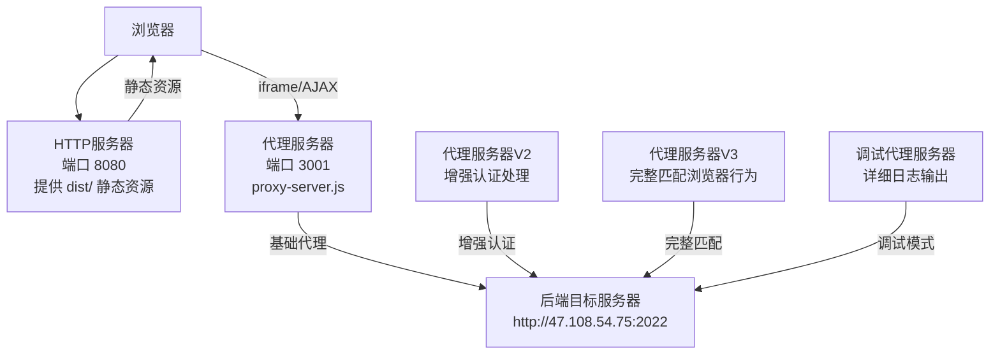
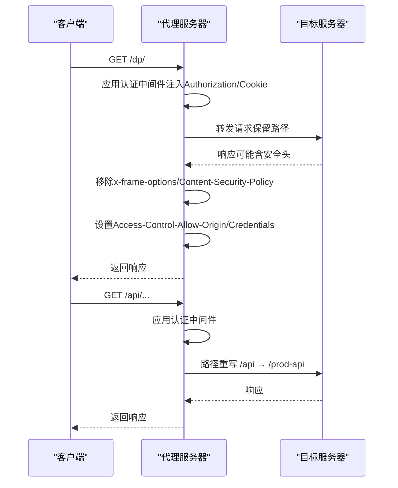
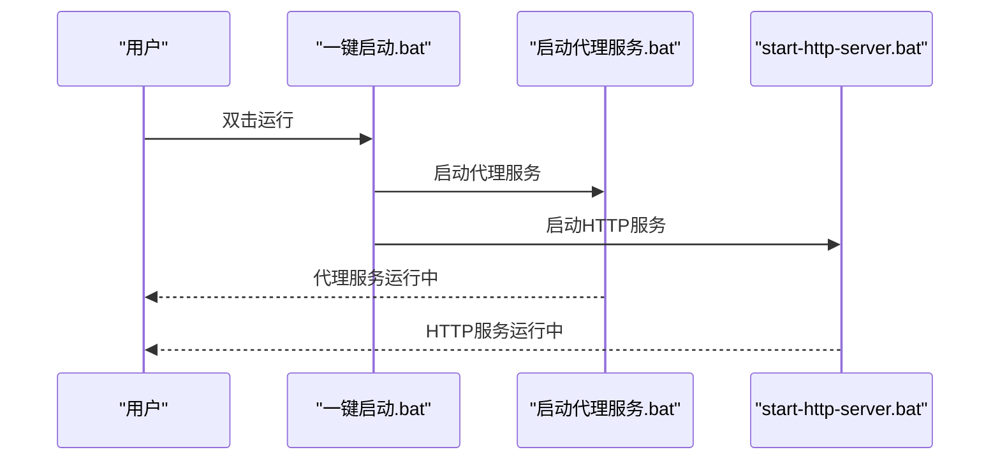
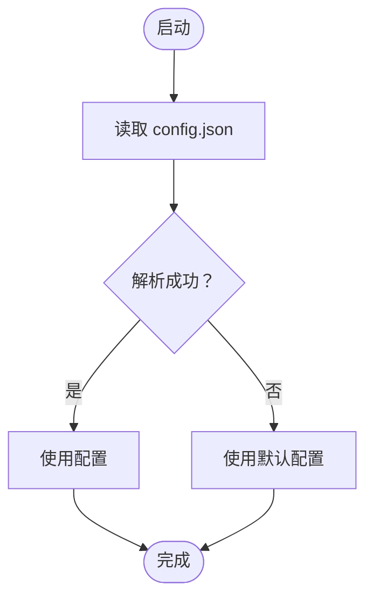
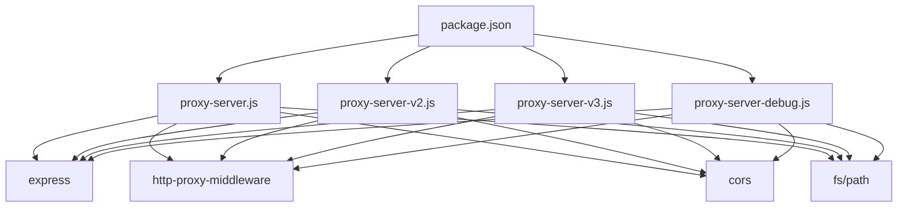

# 部署包

<cite>
**本文档引用的文件**
- [部署包说明.txt](file://部署包/部署包说明.txt)
- [部署文档.md](file://部署包/部署文档.md)
- [config.json](file://部署包/config.json)
- [package.json](file://部署包/package.json)
- [proxy-server.js](file://部署包/proxy-server.js)
- [proxy-server-v2.js](file://部署包/proxy-server-v2.js)
- [proxy-server-v3.js](file://部署包/proxy-server-v3.js)
- [proxy-server-debug.js](file://部署包/proxy-server-debug.js)
- [启动脚本/start-all.bat](file://部署包/启动脚本/start-all.bat)
- [启动脚本/start-proxy.bat](file://部署包/启动脚本/start-proxy.bat)
- [启动脚本/start-http-server.bat](file://部署包/启动脚本/start-http-server.bat)
- [启动代理服务-V2.bat](file://部署包/启动代理服务-V2.bat)
- [启动代理服务-V3.bat](file://部署包/启动代理服务-V3.bat)
- [启动代理服务-调试.bat](file://部署包/启动代理服务-调试.bat)
- [停止服务.bat](file://部署包/停止服务.bat)
</cite>

## 更新摘要
**所做更改**
- 新增多版本代理服务器支持说明，包括V2增强版、V3完整匹配版和调试版
- 更新部署包结构以反映重构后的完整目录组织
- 完善启动脚本的详细说明和使用指南
- 增强配置文件的说明和字段解释
- 更新架构图以反映实际的部署结构
- 补充技术规格和屏幕适配说明

## 目录
1. [简介](#简介)
2. [部署包结构](#部署包结构)
3. [核心组件](#核心组件)
4. [架构总览](#架构总览)
5. [详细组件分析](#详细组件分析)
6. [多版本代理服务器](#多版本代理服务器)
7. [依赖关系分析](#依赖关系分析)
8. [性能考虑](#性能考虑)
9. [故障排除指南](#故障排除指南)
10. [结论](#结论)
11. [附录](#附录)

## 简介
本部署包用于在 Windows 环境下快速部署"宜川大屏系统"。系统采用前后端分离架构，包含代理服务器和静态资源服务器两大核心组件，以及多版本代理服务器支持：

- **代理服务器**：监听端口 3001，负责代理访问后端水利平台，自动注入认证信息（Token 和 Cookie），并处理跨域与 iframe 嵌入限制。
- **HTTP 静态服务器**：监听端口 8080，提供前端静态资源服务，支持 Vue Router 的 history 模式。
- **多版本代理支持**：包含标准代理服务器、V2增强版、V3完整匹配版和调试版，满足不同场景需求。
- **认证代理页面**：提供独立的认证代理页面，支持直接访问后端系统的认证界面。
- **完整部署包**：包含生产环境文件、启动脚本、配置文件和多版本代理服务器。

部署包提供了多种启动方式（一键启动、分别启动、命令行启动），并包含完整的配置文件与脚本，便于在 Windows 服务器上快速上线。

## 部署包结构
部署包采用"前后端分离 + 多版本代理"的结构，包含完整的生产环境文件、启动脚本和多版本代理服务器：

```
宜川大屏部署包/
├── dist/                           # 生产环境文件（已构建完成）
│   ├── index.html                 # 主页面文件
│   ├── css/                       # 样式文件
│   ├── js/                        # JavaScript文件
│   ├── images/                    # 图片资源
│   └── favicon.ico               # 网站图标
├── public/                        # 静态资源文件
│   └── images/                   # 图片资源
│       ├── hy.png                # 视频会议配图
│       ├── river.png             # 河道监控图片
│       ├── shuiku.png            # 水库监控图片
│       └── wuzi.png              # 物资分布图片
├── 启动脚本/                      # 启动脚本目录
│   ├── start-all.bat             # 一键启动所有服务
│   ├── start-proxy.bat           # 启动代理服务器
│   ├── start-http-server.bat     # 启动HTTP服务器
│   ├── stop-all.bat              # 停止所有服务
│   ├── 停止服务器.bat            # 停止服务脚本
│   └── 启动服务器.bat            # 启动服务脚本
├── config.json                    # 配置文件（Cookie和认证信息）
├── proxy-server.js               # 标准代理服务器主程序
├── proxy-server-v2.js            # V2增强版代理服务器
├── proxy-server-v3.js            # V3完整匹配版代理服务器
├── proxy-server-debug.js         # 调试版代理服务器
├── package.json                  # Node.js依赖配置
├── package-lock.json             # 依赖锁定文件
├── node_modules/                 # Node.js依赖包（首次运行后生成）
├── 启动代理服务-V2.bat           # V2版本启动脚本
├── 启动代理服务-V3.bat           # V3版本启动脚本
├── 启动代理服务-调试.bat         # 调试版本启动脚本
├── 一键启动.bat                  # 一键启动脚本
├── 使用说明.txt                  # 使用说明
├── 停止服务.bat                  # 停止服务脚本
├── 启动大屏服务.bat              # 启动大屏服务脚本
├── 部署包说明.txt                 # 快速说明
└── 部署文档.md                    # 详细部署说明文档
```

**章节来源**
- [部署包说明.txt:1-33](file://部署包/部署包说明.txt#L1-L33)
- [部署文档.md:10-40](file://部署包/部署文档.md#L10-L40)

## 核心组件

### 代理服务器（端口3001）
**启动文件**: `proxy-server.js`
**启动脚本**: `启动脚本/start-proxy.bat`

**功能特性**：
- 代理访问后端水利平台
- 自动添加认证Cookie
- 解决跨域和iframe嵌入限制
- 提供健康检查端点

**访问地址**：
- 健康检查: http://localhost:3001/health
- 代理页面: http://localhost:3001/dp/#/

### HTTP服务器（端口8080）
**工具**: http-server (npm全局安装，首次自动安装)
**启动脚本**: `启动脚本/start-http-server.bat`
**根目录**: `dist/`

**功能特性**：
- 提供大屏前端静态文件服务
- 支持Vue Router的history模式

**访问地址**：
- 大屏系统: http://localhost:8080

### 配置文件（config.json）
**字段说明**：
- **proxy.port**: 代理服务器端口（默认 3001）
- **proxy.targetServer**: 目标服务器地址（如 http://47.108.54.75:2022）
- **auth.token**: Bearer Token认证（可选）
- **auth.cookie**: Cookie字符串（可选）
- **cors.origin**: 允许跨域的来源（如 http://localhost:8080）

**章节来源**
- [config.json:1-14](file://部署包/config.json#L1-L14)
- [proxy-server.js:1-149](file://部署包/proxy-server.js#L1-L149)

## 架构总览
系统采用"代理前置 + 静态资源直出"的架构设计，支持多版本代理服务器：



**图表来源**
- [部署文档.md:120-151](file://部署包/部署文档.md#L120-L151)
- [proxy-server.js:64-134](file://部署包/proxy-server.js#L64-L134)

## 详细组件分析

### 代理服务器组件分析
**组件职责**
- 加载并解析 config.json，动态设置代理端口、目标服务器、认证信息与 CORS 来源
- 注入 Authorization 与 Cookie 请求头，转发到目标服务器
- 修改响应头，移除 iframe 嵌入限制，设置 Content-Security-Policy 以允许 frame-ancestors
- 提供 /health 健康检查端点

**关键流程（启动与代理请求）**


**图表来源**
- [proxy-server.js:47-92](file://部署包/proxy-server.js#L47-L92)
- [proxy-server.js:107-134](file://部署包/proxy-server.js#L107-L134)

### 启动脚本组件分析
**启动顺序与行为**
- **一键启动.bat**: 先启动代理服务（端口 3001），再启动 HTTP 服务器（端口 8080），并提示访问地址
- **start-proxy.bat**: 检查 Node.js 与配置文件，首次运行自动安装依赖，然后启动代理服务器
- **start-http-server.bat**: 检查 Node.js，首次运行自动安装 http-server，然后启动静态服务器
- **stop-all.bat**: 通过 netstat 查找并终止占用 3001 与 8080 端口的进程

**启动序列（一键启动）**


**图表来源**
- [一键启动.bat:40-58](file://部署包/一键启动.bat#L40-L58)
- [启动代理服务.bat:44-51](file://部署包/启动代理服务.bat#L44-L51)

**章节来源**
- [一键启动.bat:1-65](file://部署包/一键启动.bat#L1-L65)
- [启动代理服务.bat:1-54](file://部署包/启动代理服务.bat#L1-L54)
- [启动大屏服务.bat:1-60](file://部署包/启动大屏服务.bat#L1-L60)
- [停止服务.bat:1-41](file://部署包/停止服务.bat#L1-L41)

### 配置文件分析
**字段说明**
- **proxy.port**: 代理服务器监听端口（默认 3001）
- **proxy.targetServer**: 后端目标服务器地址（如 http://47.108.54.75:2022）
- **auth.token**: Bearer Token（可选）
- **auth.cookie**: Cookie 字符串（可选）
- **cors.origin**: 允许跨域的来源（如 http://localhost:8080）

**配置流程（加载与回退）**


**图表来源**
- [proxy-server.js:9-29](file://部署包/proxy-server.js#L9-L29)

**章节来源**
- [config.json:1-14](file://部署包/config.json#L1-L14)
- [proxy-server.js:9-29](file://部署包/proxy-server.js#L9-L29)

## 多版本代理服务器

### 标准代理服务器（proxy-server.js）
**特点**：
- 基础认证代理功能
- 简洁的配置和日志输出
- 适用于大多数部署场景

**启动脚本**：`启动脚本/start-proxy.bat`

### V2增强版代理服务器（proxy-server-v2.js）
**特点**：
- 增强的Cookie处理机制
- 更详细的日志输出
- 支持登录状态检测
- 更好的错误处理

**启动脚本**：`启动代理服务-V2.bat`

### V3完整匹配版代理服务器（proxy-server-v3.js）
**特点**：
- 与浏览器行为完全匹配
- 精确的请求头设置
- 支持WebSocket
- 包含完整的测试端点

**启动脚本**：`启动代理服务-V3.bat`

### 调试版代理服务器（proxy-server-debug.js）
**特点**：
- 详细的请求和响应日志
- 完整的认证信息预览
- 调试模式下的完整输出
- 便于问题诊断

**启动脚本**：`启动代理服务-调试.bat`

**章节来源**
- [proxy-server.js:1-149](file://部署包/proxy-server.js#L1-L149)
- [proxy-server-v2.js:1-221](file://部署包/proxy-server-v2.js#L1-L221)
- [proxy-server-v3.js:1-214](file://部署包/proxy-server-v3.js#L1-L214)
- [proxy-server-debug.js:1-180](file://部署包/proxy-server-debug.js#L1-L180)

## 依赖关系分析
**代理服务器依赖**
- **express**: Web 框架
- **http-proxy-middleware**: 反向代理中间件
- **cors**: 跨域处理
- **fs/path**: 读取配置文件与路径拼接

**依赖关系图**


**图表来源**
- [package.json:10-14](file://部署包/package.json#L10-L14)

**章节来源**
- [package.json:1-31](file://部署包/package.json#L1-L31)

## 性能考虑
- **代理服务器为单进程 Node.js 应用**，适合中小规模并发访问。若需更高吞吐，建议：
  - 使用 Nginx 作为反向代理前置，将静态资源与代理请求分流
  - 对频繁访问的接口进行缓存与限流
  - 合理设置超时与重试策略，避免长时间阻塞
- **HTTP 服务器使用 http-server**，适合静态资源分发。对于生产环境，建议使用更成熟的 Web 服务器（如 Nginx/IIS）以提升稳定性与性能
- **多版本代理服务器选择**：
  - 标准版：适用于一般场景
  - V2版：适用于需要增强认证处理的场景
  - V3版：适用于需要完全匹配浏览器行为的场景
  - 调试版：仅用于问题诊断和开发阶段

## 故障排除指南

### 通用问题
**未检测到 Node.js**
- 现象：启动脚本报错提示未检测到 Node.js
- 处理：安装 Node.js v18.x 并加入系统 PATH，重启命令行后重试

**端口被占用**
- 现象：启动失败或提示端口冲突
- 处理：执行停止服务.bat 停止服务，或手动结束占用端口的进程

### 代理服务器特定问题
**Cookie认证问题**
- 现象：大屏显示但iframe模块无数据
- 处理：检查 config.json 中的 auth.token 与 auth.cookie 是否有效；直接访问 http://localhost:3001/dp/#/ 验证代理是否正常；如过期则重新登录获取新 Cookie

**健康检查**
- 访问 http://localhost:3001/health 检查代理服务器运行状态

### 多版本代理服务器问题
**V2版本登录检测**
- 访问 http://localhost:3001/check-login 检查登录状态

**V3版本API测试**
- 访问 http://localhost:3001/test-api 测试API访问

**调试版本详细日志**
- 查看控制台输出的详细请求和响应信息

### 其他问题
**http-server 安装失败**
- 现象：首次启动提示安装失败
- 处理：手动执行 npm install -g http-server

**章节来源**
- [一键启动.bat:9-16](file://部署包/一键启动.bat#L9-L16)
- [启动代理服务.bat:9-16](file://部署包/启动代理服务.bat#L9-L16)
- [停止服务.bat:12-34](file://部署包/停止服务.bat#L12-L34)
- [部署文档.md:238-254](file://部署包/部署文档.md#L238-L254)
- [proxy-server.js:94-105](file://部署包/proxy-server.js#L94-L105)

## 结论
本部署包通过"代理前置 + 静态资源直出"的方式，实现了对后端水利平台的认证代理与跨域访问。系统提供了便捷的一键启动与停止脚本，通过合理配置 config.json 与使用提供的启动脚本，可在 Windows 服务器上快速完成部署与上线。新增的多版本代理服务器支持为不同场景提供了灵活的选择，包括标准版、V2增强版、V3完整匹配版和调试版，满足从基础使用到深度定制的各种需求。对于更高性能与稳定性的需求，建议结合 Nginx 等专业 Web 服务器进行优化。

## 附录

### 快速开始
- 安装 Node.js v18.x
- 配置 config.json 中的认证信息
- 双击运行 一键启动.bat
- 在浏览器访问 http://localhost:8080

### 服务地址
- **大屏系统**: http://localhost:8080
- **代理服务**: http://localhost:3001
- **代理页面**: http://localhost:3001/dp/#/
- **健康检查**: http://localhost:3001/health

### 多版本代理服务器选择指南
- **标准版**: 适用于一般部署场景
- **V2版**: 需要增强认证处理和登录状态检测
- **V3版**: 需要完全匹配浏览器行为和WebSocket支持
- **调试版**: 用于问题诊断和开发测试

### 技术规格
- **分辨率支持**: 6720×1260（适配目标屏幕）
- **浏览器兼容**: Chrome 90+, Edge 90+, Firefox 88+
- **模块布局**：
  - 前3个模块宽度: 1845px
  - 第4个模块宽度: 1096px
  - 模块间距: 30px
- **交互功能**: 支持鼠标滚动、点击交互

**章节来源**
- [部署包说明.txt:6-24](file://部署包/部署包说明.txt#L6-L24)
- [部署包说明.txt:41-63](file://部署包/部署包说明.txt#L41-L63)
- [部署文档.md:111-116](file://部署包/部署文档.md#L111-L116)
- [proxy-server.js:94-105](file://部署包/proxy-server.js#L94-L105)