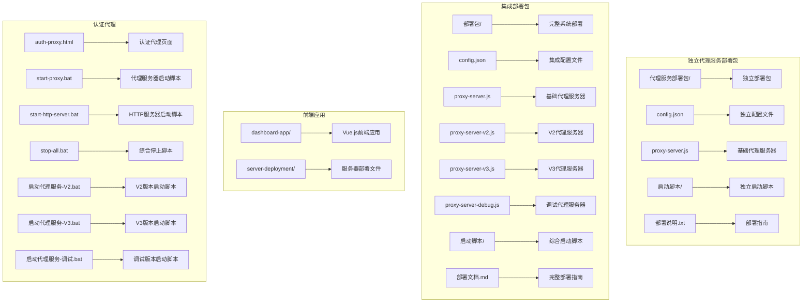
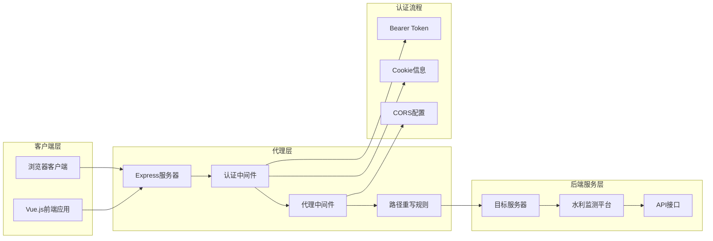
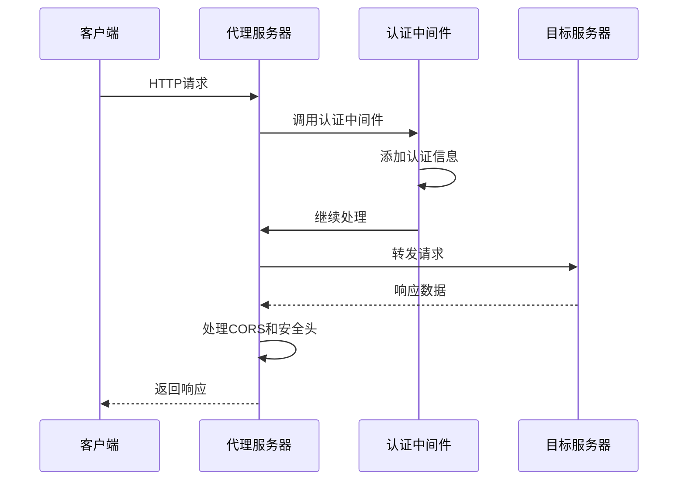
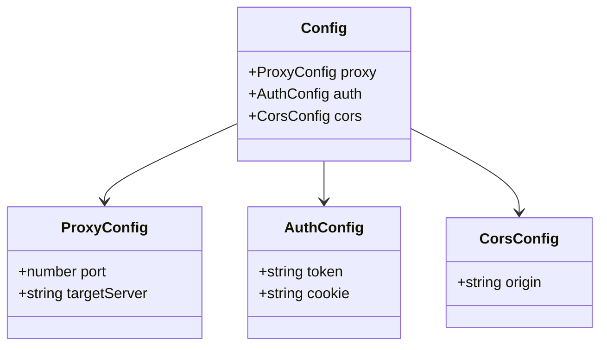
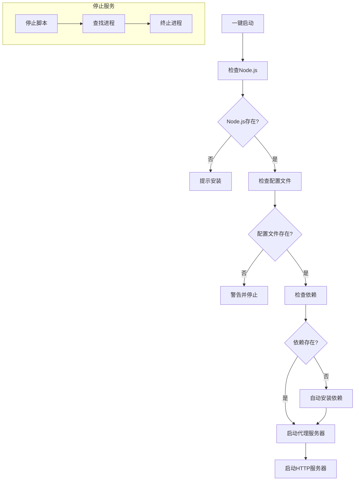
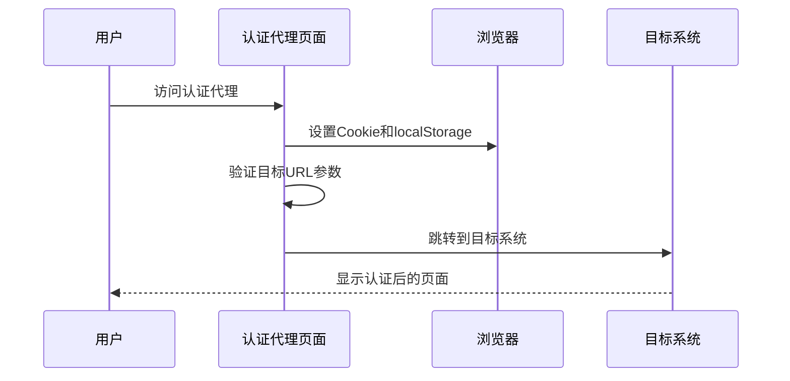
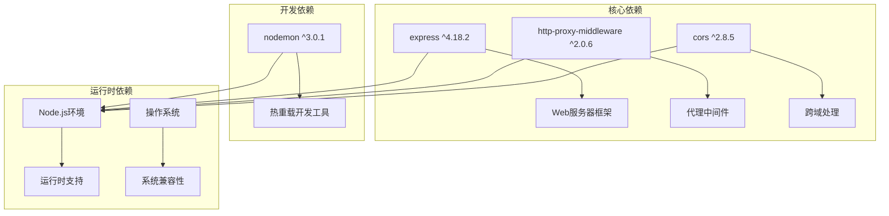

# 代理服务器配置

<cite>
**本文档引用的文件**
- [proxy-server.js](file://代理服务部署包/proxy-server.js)
- [proxy-server-v2.js](file://部署包/proxy-server-v2.js)
- [proxy-server-v3.js](file://部署包/proxy-server-v3.js)
- [proxy-server-debug.js](file://部署包/proxy-server-debug.js)
- [config.json](file://代理服务部署包/config.json)
- [package.json](file://代理服务部署包/package.json)
- [部署说明.txt](file://代理服务部署包/部署说明.txt)
- [start-proxy.bat](file://代理服务部署包/启动脚本/start-proxy.bat)
- [stop-proxy.bat](file://代理服务部署包/启动脚本/stop-proxy.bat)
- [proxy-server.js](file://部署包/proxy-server.js)
- [config.json](file://部署包/config.json)
- [package.json](file://部署包/package.json)
- [部署文档.md](file://部署包/部署文档.md)
- [一键启动.bat](file://部署包/一键启动.bat)
- [start-proxy.bat](file://部署包/启动脚本/start-proxy.bat)
- [stop-all.bat](file://部署包/启动脚本/stop-all.bat)
- [启动代理服务-V2.bat](file://部署包/启动代理服务-V2.bat)
- [启动代理服务-V3.bat](file://部署包/启动代理服务-V3.bat)
- [启动代理服务-调试.bat](file://部署包/启动代理服务-调试.bat)
- [auth-proxy.html](file://dashboard-app/public/auth-proxy.html)
- [auth-proxy.html](file://server-deployment/auth-proxy.html)
- [auth-proxy.html](file://dashboard-app/dist/auth-proxy.html)
</cite>

## 更新摘要
**变更内容**
- 新增代理服务器V3版本支持，提供完全精确的浏览器行为模拟
- 新增调试版代理服务器（proxy-server-debug.js），提供详细日志和诊断功能
- 更新部署包对比分析，详细说明三个版本的功能差异
- 补充独立代理服务部署包的配置说明和启动脚本
- 新增版本特定的代理规则和认证机制说明
- 更新故障排除指南，包含各版本特有的问题诊断
- 新增调试模式的详细日志记录和错误诊断功能
- **新增** V3版本的精确Cookie处理机制和WebSocket支持
- **新增** V2版本的Cookie解析合并功能
- **新增** 调试版本的详细请求日志和认证信息预览

## 目录
1. [简介](#简介)
2. [项目结构](#项目结构)
3. [核心组件](#核心组件)
4. [架构概览](#架构概览)
5. [详细组件分析](#详细组件分析)
6. [代理服务器版本对比](#代理服务器版本对比)
7. [部署包对比分析](#部署包对比分析)
8. [依赖关系分析](#依赖关系分析)
9. [性能考虑](#性能考虑)
10. [故障排除指南](#故障排除指南)
11. [结论](#结论)

## 简介

这是一个为宜川大屏系统设计的认证代理服务器配置项目。该系统通过代理服务器实现对后端水利监测平台的访问控制和跨域解决方案，支持iframe嵌入和多种认证方式。

项目采用Node.js + Express技术栈，结合http-proxy-middleware中间件实现智能代理功能，能够自动处理认证信息、跨域请求和iframe嵌入限制。系统提供五个版本的代理服务器：基础版本、V2版本、V3版本、调试版本和独立代理版本，每个版本针对不同的认证需求、浏览器兼容性和调试需求进行优化。同时提供两种部署包形式：集成部署包和独立代理服务部署包，满足不同场景的部署需求。

**更新** 从最初的简单代理服务器发展到现在，V3版本实现了对浏览器行为的完全精确模拟，包括精确的Cookie格式、完整的请求头设置、WebSocket支持和API测试端点。

## 项目结构

**图表来源**
- [代理服务部署包/config.json:1-14](file://代理服务部署包/config.json#L1-L14)
- [代理服务部署包/proxy-server.js:1-149](file://代理服务部署包/proxy-server.js#L1-L149)
- [部署包/config.json:1-14](file://部署包/config.json#L1-L14)
- [部署包/proxy-server-v2.js:1-221](file://部署包/proxy-server-v2.js#L1-L221)
- [部署包/proxy-server-v3.js:1-214](file://部署包/proxy-server-v3.js#L1-L214)
- [部署包/proxy-server-debug.js:1-180](file://部署包/proxy-server-debug.js#L1-L180)

**章节来源**
- [部署包/部署文档.md:10-40](file://部署包/部署文档.md#L10-L40)
- [代理服务部署包/部署说明.txt:1-112](file://代理服务部署包/部署说明.txt#L1-L112)

## 核心组件

### 代理服务器核心功能

代理服务器主要包含以下核心功能：

1. **认证管理**：自动添加Bearer Token和Cookie认证信息
2. **跨域处理**：启用CORS并允许iframe嵌入
3. **路径重写**：智能重写API请求路径
4. **健康检查**：提供服务状态监控接口
5. **错误处理**：完善的错误捕获和日志记录

### 配置管理系统

系统采用集中式配置管理，通过config.json文件统一管理：
- 代理服务器端口配置
- 目标服务器地址
- 认证令牌和Cookie信息
- CORS跨域设置

**章节来源**
- [代理服务部署包/proxy-server.js:24-62](file://代理服务部署包/proxy-server.js#L24-L62)
- [代理服务部署包/config.json:1-14](file://代理服务部署包/config.json#L1-L14)

## 架构概览

**图表来源**
- [代理服务部署包/proxy-server.js:15-95](file://代理服务部署包/proxy-server.js#L15-L95)
- [代理服务部署包/config.json:6-12](file://代理服务部署包/config.json#L6-L12)

## 详细组件分析

### 代理服务器实现

代理服务器基于Express框架构建，采用中间件模式处理请求：

**图表来源**
- [代理服务部署包/proxy-server.js:24-62](file://代理服务部署包/proxy-server.js#L24-L62)
- [代理服务部署包/proxy-server.js:37-62](file://代理服务部署包/proxy-server.js#L37-L62)

#### 认证中间件设计

认证中间件负责处理所有请求的认证信息：
- 自动添加Authorization头
- 设置Cookie信息
- 记录请求日志
- 确保认证信息完整性

#### 代理中间件配置

代理中间件支持多种配置模式：
- 页面请求代理：`/dp/*` → 目标服务器`/dp/*`
- API请求代理：`/api/*` → 目标服务器`/prod-api/*`
- 默认代理：所有其他请求

**章节来源**
- [代理服务部署包/proxy-server.js:24-95](file://代理服务部署包/proxy-server.js#L24-L95)

### 配置文件管理

配置文件采用JSON格式，提供清晰的层次结构：

**图表来源**
- [代理服务部署包/config.json:1-14](file://代理服务部署包/config.json#L1-L14)

#### 配置文件字段说明

| 字段名 | 类型 | 描述 | 示例值 |
|--------|------|------|--------|
| proxy.port | number | 代理服务器监听端口 | 3001 |
| proxy.targetServer | string | 目标服务器地址 | http://47.108.54.75:2022 |
| auth.token | string | Bearer认证令牌 | Bearer eyJhbG... |
| auth.cookie | string | Cookie认证信息 | username=xxx; ... |
| cors.origin | string | 允许的跨域来源 | http://localhost:8080 |

**章节来源**
- [代理服务部署包/config.json:1-14](file://代理服务部署包/config.json#L1-L14)
- [部署包/部署文档.md:258-269](file://部署包/部署文档.md#L258-L269)

### 启动脚本系统

系统提供完整的批处理脚本支持：

**图表来源**
- [一键启动.bat:39-48](file://部署包/一键启动.bat#L39-L48)
- [start-proxy.bat:9-42](file://部署包/启动脚本/start-proxy.bat#L9-L42)

#### 启动脚本功能特性

1. **环境检查**：自动检测Node.js安装状态
2. **依赖管理**：首次运行时自动安装所需依赖
3. **配置验证**：检查配置文件的完整性和有效性
4. **服务监控**：提供服务状态反馈和错误处理

**章节来源**
- [start-proxy.bat:1-54](file://部署包/启动脚本/start-proxy.bat#L1-L54)
- [start-http-server.bat:1-60](file://部署包/启动脚本/start-http-server.bat#L1-L60)

### 认证代理页面

认证代理页面提供了一种替代的认证方式：

**图表来源**
- [auth-proxy.html:10-50](file://dashboard-app/public/auth-proxy.html#L10-L50)

#### 认证代理功能

1. **自动认证设置**：自动设置必要的Cookie和localStorage
2. **URL参数处理**：支持target参数指定目标URL
3. **延迟跳转**：确保认证信息设置完成后再跳转
4. **错误处理**：提供友好的错误提示界面

**章节来源**
- [auth-proxy.html:1-60](file://dashboard-app/public/auth-proxy.html#L1-L60)

## 代理服务器版本对比

### 基础版本（proxy-server.js）

基础版本是最简化的代理服务器实现，提供基本的认证和代理功能：

**特点**：
- 最小化的代码实现
- 基本的认证头设置
- 简单的CORS配置
- 通用的代理规则

**适用场景**：
- 基础的代理需求
- 开发和测试环境
- 资源受限的部署环境

**章节来源**
- [代理服务部署包/proxy-server.js:1-149](file://代理服务部署包/proxy-server.js#L1-L149)

### V2版本（proxy-server-v2.js）

V2版本增强了认证机制和请求头模拟，提供更精确的浏览器行为：

**增强功能**：
- Cookie解析和合并机制
- 更详细的请求头设置
- 健康检查和登录状态测试
- 改进的日志记录和错误处理

**技术改进**：
- Cookie字符串解析为对象
- 客户端Cookie与配置Cookie合并
- 更完整的浏览器User-Agent模拟
- 增强的CORS和安全头处理

**适用场景**：
- 需要更精确认证的场景
- 需要详细诊断功能的环境
- 对性能有更高要求的应用

**章节来源**
- [部署包/proxy-server-v2.js:1-221](file://部署包/proxy-server-v2.js#L1-L221)

### V3版本（proxy-server-v3.js）

V3版本是最完整的版本，完全模拟浏览器行为，提供最高级别的兼容性：

**最高级功能**：
- 精确匹配浏览器Cookie格式
- 完整的请求头模拟（包括Host和Referer）
- WebSocket支持
- 专门的API测试端点
- 最严格的认证模拟

**技术特性**：
- 按固定顺序构建Cookie字符串
- 精确的Host头设置
- 完整的User-Agent字符串
- 专门的API测试接口
- WebSocket代理支持

**适用场景**：
- 需要最高兼容性的生产环境
- 复杂的认证系统
- 需要WebSocket支持的应用

**章节来源**
- [部署包/proxy-server-v3.js:1-214](file://部署包/proxy-server-v3.js#L1-L214)

### 调试版本（proxy-server-debug.js）

调试版本专为开发和故障排除设计，提供详细的日志记录和诊断功能：

**调试特性**：
- 详细的请求日志输出
- 配置文件加载状态检查
- 认证信息预览和验证
- 完整的请求头分析
- 错误详情输出

**诊断功能**：
- 健康检查端点
- 认证测试端点
- 请求详细分析
- 响应头监控
- 错误追踪

**适用场景**：
- 开发环境调试
- 故障排除
- 认证问题诊断
- 网络问题分析

**章节来源**
- [部署包/proxy-server-debug.js:1-180](file://部署包/proxy-server-debug.js#L1-L180)

## 部署包对比分析

### 独立代理服务部署包

独立部署包是一个轻量级的代理服务解决方案，专注于代理功能本身：

**特点**：
- 独立的配置文件和启动脚本
- 简化的配置结构
- 专门的部署说明文档
- 独立的Node.js依赖管理

**适用场景**：
- 仅需要代理服务的场景
- 需要独立部署代理服务器的情况
- 简化部署和维护的场景

**章节来源**
- [代理服务部署包/部署说明.txt:1-112](file://代理服务部署包/部署说明.txt#L1-L112)
- [代理服务部署包/proxy-server.js:1-149](file://代理服务部署包/proxy-server.js#L1-L149)

### 集成部署包

集成部署包提供完整的系统解决方案，包含多个服务和组件：

**特点**：
- 包含前端应用、代理服务器、HTTP服务器
- 统一的配置管理和启动脚本
- 完整的系统功能覆盖
- 综合性的部署文档

**适用场景**：
- 需要完整系统部署的场景
- 需要同时运行多个服务的情况
- 需要一体化解决方案的场景

**版本支持**：
- 基础代理服务器（proxy-server.js）
- V2代理服务器（proxy-server-v2.js）
- V3代理服务器（proxy-server-v3.js）
- 调试代理服务器（proxy-server-debug.js）
- 对应的启动脚本（启动代理服务-V2.bat、启动代理服务-V3.bat、启动代理服务-调试.bat）

**章节来源**
- [部署包/部署文档.md:10-40](file://部署包/部署文档.md#L10-L40)
- [部署包/一键启动.bat:1-64](file://部署包/一键启动.bat#L1-L64)

## 依赖关系分析

系统依赖关系清晰明确，采用模块化设计：

**图表来源**
- [package.json:10-17](file://package.json#L10-L17)

### 依赖管理策略

1. **生产环境依赖**：专注于核心功能实现
2. **开发环境依赖**：提供开发便利性
3. **版本控制**：使用语义化版本管理
4. **兼容性保证**：确保与Node.js LTS版本兼容

**章节来源**
- [package.json:1-20](file://package.json#L1-L20)

## 性能考虑

### 代理性能优化

1. **连接复用**：利用http-proxy-middleware的连接池机制
2. **请求缓存**：合理设置缓存策略避免重复请求
3. **并发处理**：支持多请求并发处理
4. **内存管理**：及时清理中间件产生的临时数据

### 网络性能优化

1. **路径重写**：减少不必要的路径转换开销
2. **头部处理**：最小化头部修改操作
3. **错误处理**：快速失败机制避免资源浪费
4. **日志管理**：控制日志级别避免性能影响

## 故障排除指南

### 常见问题及解决方案

#### 端口占用问题

**问题描述**：启动时提示端口已被占用
**解决方案**：
1. 使用停止脚本停止现有服务
2. 通过命令行查找并终止占用进程
3. 修改配置文件使用其他端口

#### 认证失败问题

**问题描述**：代理页面无法正常访问目标系统
**解决方案**：
1. 检查config.json中的认证信息是否有效
2. 重新登录目标系统获取新的认证信息
3. 验证目标服务器的可达性

#### 依赖安装问题

**问题描述**：npm install执行失败
**解决方案**：
1. 检查网络连接状态
2. 清理npm缓存后重试
3. 手动安装依赖包

#### 版本特定问题

**V2版本问题**：
- Cookie解析失败：检查config.json中的Cookie格式
- 认证状态检查失败：使用`/check-login`端点验证
- 请求头不完整：确认所有必要头都已设置

**V3版本问题**：
- Host头错误：确保Host头与目标服务器匹配
- Cookie格式不正确：使用精确的Cookie构建方法
- WebSocket连接失败：确认ws: true配置已启用

**调试版本问题**：
- 日志过多影响性能：调整日志级别
- 配置文件加载失败：检查config.json格式
- 认证信息不完整：使用`/test-auth`端点验证

**章节来源**
- [部署包/部署文档.md:219-255](file://部署包/部署文档.md#L219-L255)
- [stop-all.bat:12-34](file://部署包/启动脚本/stop-all.bat#L12-L34)

### 诊断工具

1. **健康检查接口**：`http://localhost:3001/health`
2. **认证测试接口**：`http://localhost:3001/test-auth`
3. **V2登录检查**：`http://localhost:3001/check-login`
4. **V3 API测试**：`http://localhost:3001/test-api`
5. **调试详细日志**：查看命令行输出的完整请求信息
6. **浏览器调试**：使用开发者工具查看网络请求

## 结论

该代理服务器配置项目提供了完整的认证代理解决方案，具有以下特点：

1. **功能完整**：涵盖认证、代理、跨域等核心功能
2. **版本丰富**：提供基础版、V2版、V3版、调试版、独立版五种选择，满足不同复杂度需求
3. **部署灵活**：提供独立部署包和集成部署包两种选择
4. **易于部署**：提供自动化脚本和详细文档
5. **配置灵活**：支持动态配置和环境适配
6. **维护友好**：清晰的代码结构和错误处理机制
7. **调试完善**：提供专门的调试版本用于问题诊断

通过合理的架构设计和完善的部署方案，该系统能够稳定支持宜川大屏系统的各种应用场景，为用户提供可靠的代理服务。独立部署包和集成部署包的双重设计，以及五个版本的差异化功能，满足了不同场景下的部署需求，提高了系统的适用性和灵活性。

**更新** V2、V3和调试版本的引入进一步提升了系统的兼容性、功能性和可维护性，特别是V3版本对浏览器行为的精确模拟和调试版本的详细日志记录，确保了与后端系统的最佳兼容性和高效的故障排除能力。用户可以根据具体需求选择合适的版本和部署方式，获得最优的使用体验。

**更新** 从最初的简单proxy-server.js到现在的V3版本，代理服务器经历了从基础认证到完全精确浏览器模拟的重大演进，特别是在Cookie处理机制上的改进，使得认证更加可靠和稳定。V2版本引入了Cookie解析和合并功能，而V3版本则实现了完全精确的浏览器行为模拟，包括精确的Cookie格式、完整的请求头设置和WebSocket支持，为复杂的认证系统提供了强有力的技术支撑。调试版本的加入更是为开发和维护提供了强大的工具支持。