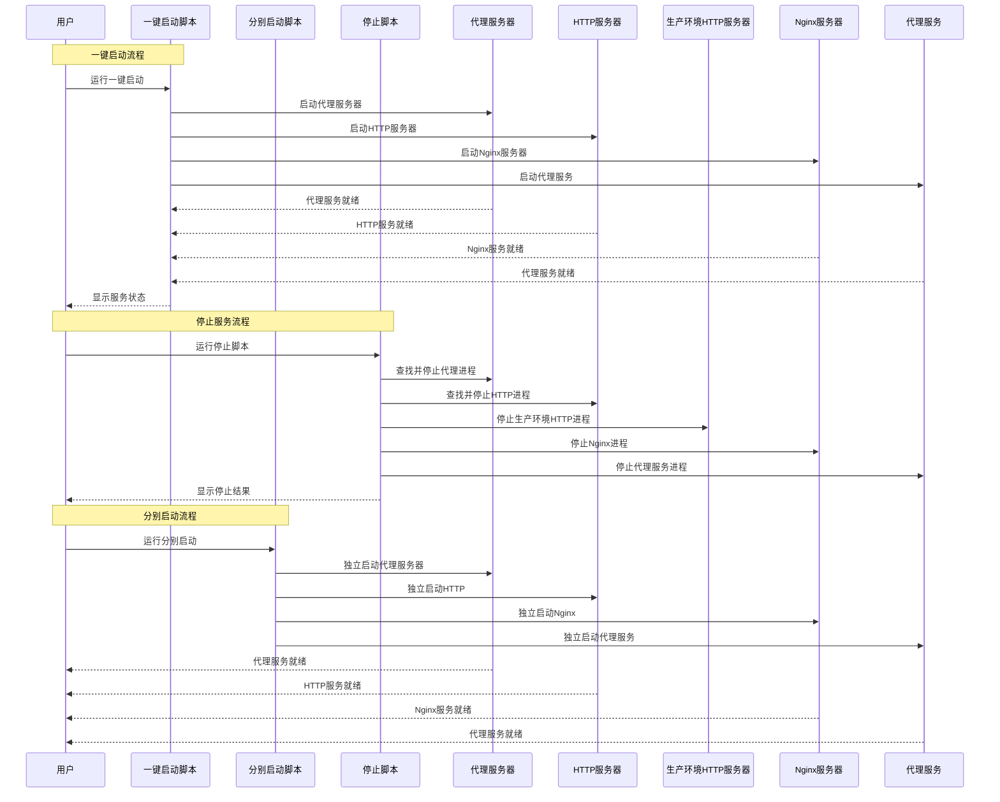
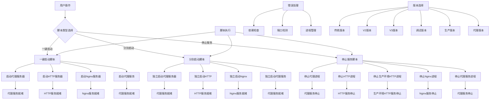
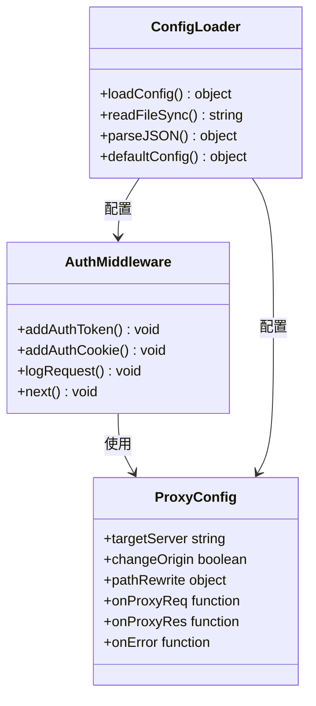
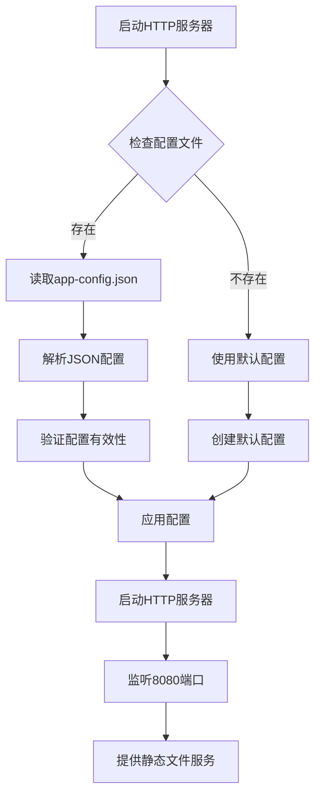
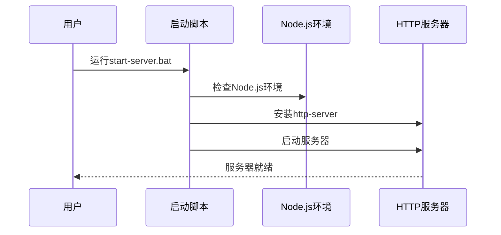
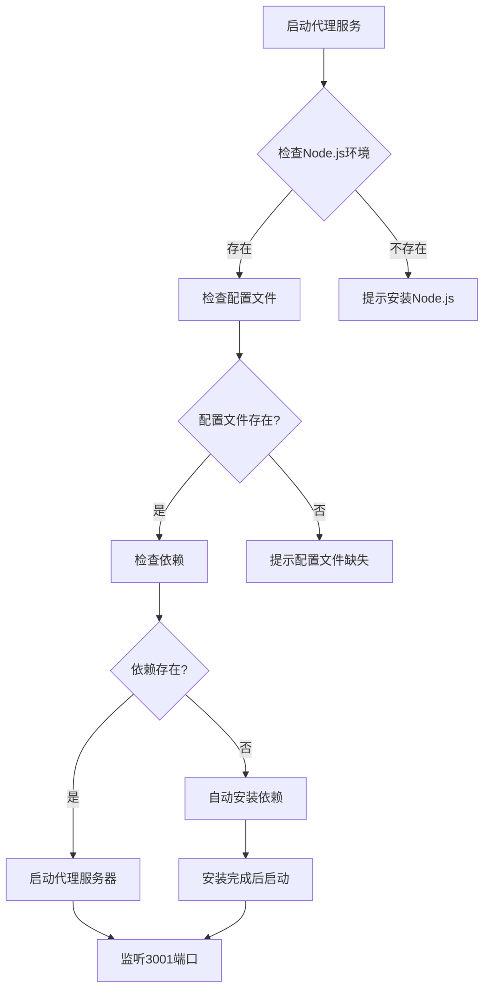
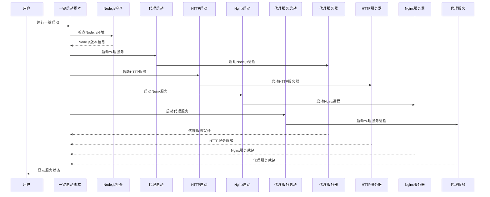
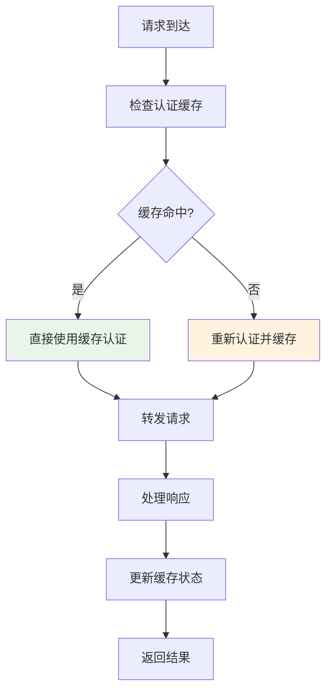

# 服务管理

<cite>
**本文档引用的文件**
- [proxy-server.js](file://部署包/proxy-server.js)
- [config.json](file://部署包/config.json)
- [一键启动.bat](file://部署包/一键启动.bat)
- [停止服务.bat](file://部署包/停止服务.bat)
- [启动脚本/start-all.bat](file://部署包/启动脚本/start-all.bat)
- [启动脚本/stop-all.bat](file://部署包/启动脚本/stop-all.bat)
- [启动脚本/start-proxy.bat](file://部署包/启动脚本/start-proxy.bat)
- [启动脚本/start-http-server.bat](file://部署包/启动脚本/start-http-server.bat)
- [启动脚本/停止服务器.bat](file://部署包/启动脚本/停止服务器.bat)
- [启动脚本/启动服务器.bat](file://部署包/启动脚本/启动服务器.bat)
- [启动代理服务.bat](file://部署包/启动代理服务.bat)
- [启动大屏服务.bat](file://部署包/启动大屏服务.bat)
- [启动代理服务-V2.bat](file://部署包/启动代理服务-V2.bat)
- [启动代理服务-V3.bat](file://部署包/启动代理服务-V3.bat)
- [启动代理服务-调试.bat](file://部署包/启动代理服务-调试.bat)
- [yichuan-dashboard-production-deployment/scripts/start-server.bat](file://yichuan-dashboard-production-deployment/scripts/start-server.bat)
- [yichuan-dashboard-production-deployment/scripts/stop-server.bat](file://yichuan-dashboard-production-deployment/scripts/stop-server.bat)
- [yichuan-dashboard-production-deployment/config/app-config.json](file://yichuan-dashboard-production-deployment/config/app-config.json)
- [代理服务部署包/启动脚本/start-proxy.bat](file://代理服务部署包/启动脚本/start-proxy.bat)
- [代理服务部署包/启动脚本/stop-proxy.bat](file://代理服务部署包/启动脚本/stop-proxy.bat)
</cite>

## 更新摘要
**所做更改**
- 新增完整的启动脚本系统分析，包括一键启动、分别启动、停止服务脚本
- 补充启动脚本的详细功能说明和使用场景
- 更新服务管理架构图，反映新的脚本组织结构
- 完善启动脚本的错误处理和依赖检查机制
- 新增生产环境部署包的脚本管理方案
- 新增Windows批处理脚本的详细使用说明
- 新增代理服务部署包的独立脚本管理
- 新增多种版本专用启动脚本的功能说明

## 目录
1. [简介](#简介)
2. [项目结构](#项目结构)
3. [核心组件](#核心组件)
4. [架构概览](#架构概览)
5. [详细组件分析](#详细组件分析)
6. [依赖关系分析](#依赖关系分析)
7. [性能考虑](#性能考虑)
8. [故障排除指南](#故障排除指南)
9. [结论](#结论)

## 简介

这是一个基于Node.js的宜川大屏系统认证代理服务器项目，现已发展为包含三个主要部署包的完整解决方案。系统经历了从传统代理服务器到现代化生产环境的演进，提供了三种不同的服务管理模式，以及完整的脚本化服务管理工具。

系统现包含五个主要部署包，采用多层架构设计，支持不同复杂度的使用场景，并提供完整的脚本化服务管理：

1. **传统代理服务器**：基础版本，提供基本的代理和认证功能
2. **代理服务器V2**：增强版本，改进了Cookie处理和请求头模拟
3. **代理服务器V3**：高级版本，完全模拟浏览器行为，支持WebSocket
4. **调试版本代理服务器**：专门用于开发和问题诊断的增强版本
5. **生产环境部署包**：简化的单一HTTP服务器服务，专门用于大屏展示系统的静态文件服务
6. **代理服务部署包**：独立的代理服务器部署包，提供专门的认证代理服务
7. **完整脚本管理**：提供一键启动、分别启动、停止服务等多种管理方式

## 项目结构

系统现包含六个主要部署包，采用多层架构设计，支持不同复杂度的使用场景，并提供完整的脚本化服务管理：

```mermaid
graph TB
subgraph "传统代理服务器"
A[部署包/] --> B[dist/ - 生产文件]
A --> C[启动脚本/ - 启动工具]
A --> D[config.json - 配置文件]
A --> E[proxy-server.js - 基础代理]
A --> F[package.json - 依赖配置]
end
subgraph "生产环境部署包"
P[yichuan-dashboard-production-deployment/] --> Q[dist/ - 前端静态文件]
P --> R[config/ - 应用配置]
P --> S[scripts/ - 启动脚本]
P --> T[docs/ - 部署文档]
end
subgraph "代理服务部署包"
U[代理服务部署包/] --> V[proxy-server.js - 代理服务器]
U --> W[config.json - 配置文件]
U --> X[启动脚本/ - 启动工具]
U --> Y[package.json - 依赖配置]
end
subgraph "核心服务"
Z[传统代理服务器 - 端口3001] --> AA[目标服务器 - 47.108.54.75:2022]
BB[HTTP服务器 - 端口8080] --> CC[前端大屏应用]
DD[生产环境HTTP服务器 - 端口8080] --> EE[生产环境大屏展示]
FF[Nginx服务器 - 端口80] --> GG[大屏展示系统]
HH[代理服务 - 端口3001] --> II[认证代理服务]
end
subgraph "配置管理"
JJ[config.json] --> KK[认证令牌]
JJ --> LL[CORS配置]
JJ --> MM[代理设置]
NN[app-config.json] --> OO[应用配置]
NN --> PP[显示设置]
NN --> QQ[API配置]
RR[版本选择] --> SS[传统版本]
RR --> TT[V2版本]
RR --> UU[V3版本]
RR --> VV[调试版本]
RR --> WW[生产版本]
RR --> XX[代理版本]
end
subgraph "脚本管理"
YY[一键启动脚本] --> ZZ[start-all.bat]
YY --> AAA[一键启动.bat]
YY --> BBB[启动服务器.bat]
YY --> CCC[启动代理服务.bat]
YY --> DDD[启动大屏服务.bat]
YY --> EEE[启动代理服务-V2.bat]
YY --> FFF[启动代理服务-V3.bat]
YY --> GGG[启动代理服务-调试.bat]
YY --> HHH[启动代理服务-调试.bat]
YY --> III[启动代理服务-V2.bat]
YY --> JJJ[启动代理服务-V3.bat]
YY --> KKK[启动代理服务-调试.bat]
YY --> LLL[启动代理服务-调试.bat]
YY --> MMM[启动代理服务-V2.bat]
YY --> NNN[启动代理服务-V3.bat]
YY --> OOO[启动代理服务-调试.bat]
YY --> PPP[启动代理服务-调试.bat]
YY --> QQQ[启动代理服务-V2.bat]
YY --> RRR[启动代理服务-V3.bat]
YY --> SSS[启动代理服务-调试.bat]
YY --> TTT[启动代理服务-调试.bat]
YY --> UUU[启动代理服务-V2.bat]
YY --> VVV[启动代理服务-V3.bat]
YY --> WWW[启动代理服务-调试.bat]
YY --> XXX[启动代理服务-调试.bat]
YY --> YYY[启动代理服务-V2.bat]
YY --> ZZZ[启动代理服务-V3.bat]
ZZZ[停止服务脚本] --> AAAA[stop-all.bat]
ZZZ --> BBBB[停止服务.bat]
ZZZ --> CCCC[停止服务器.bat]
ZZZ --> DDDD[stop-proxy.bat]
ZZZ --> EEEE[stop-server.bat]
ZZZ --> FFFF[启动服务器.bat]
ZZZ --> GGGG[启动代理服务.bat]
ZZZ --> HHHH[启动大屏服务.bat]
ZZZ --> IIII[启动代理服务-V2.bat]
ZZZ --> JJJJ[启动代理服务-V3.bat]
ZZZ --> KKKK[启动代理服务-调试.bat]
ZZZ --> LLLL[启动代理服务-调试.bat]
ZZZ --> MMMM[启动代理服务-V2.bat]
ZZZ --> NNNN[启动代理服务-V3.bat]
ZZZ --> OOOO[启动代理服务-调试.bat]
ZZZ --> PPPP[启动代理服务-调试.bat]
ZZZ --> QQQQ[启动代理服务-V2.bat]
ZZZ --> RRRR[启动代理服务-V3.bat]
ZZZ --> SSSS[启动代理服务-调试.bat]
ZZZ --> TTTT[启动代理服务-调试.bat]
ZZZ --> UUUU[启动代理服务-V2.bat]
ZZZ --> VVVV[启动代理服务-V3.bat]
ZZZ --> WWWW[启动代理服务-调试.bat]
ZZZ --> XXXX[启动代理服务-调试.bat]
ZZZ --> YYYY[启动代理服务-V2.bat]
ZZZ --> ZZZZ[启动代理服务-V3.bat]
```

**图表来源**
- [部署包结构](file://部署包/)
- [生产环境部署包结构](file://yichuan-dashboard-production-deployment/)
- [代理服务部署包结构](file://代理服务部署包/)
- [proxy-server.js:1-149](file://部署包/proxy-server.js#L1-L149)
- [config.json:1-14](file://部署包/config.json#L1-L14)
- [app-config.json:1-53](file://yichuan-dashboard-production-deployment/config/app-config.json#L1-L53)
- [启动脚本/start-all.bat:1-65](file://部署包/启动脚本/start-all.bat#L1-L65)
- [启动脚本/start-proxy.bat:1-54](file://部署包/启动脚本/start-proxy.bat#L1-L54)
- [启动脚本/start-http-server.bat:1-60](file://部署包/启动脚本/start-http-server.bat#L1-L60)
- [启动服务器.bat:1-82](file://部署包/启动服务器.bat#L1-L82)
- [启动代理服务.bat:1-46](file://部署包/启动代理服务.bat#L1-L46)
- [启动大屏服务.bat:1-40](file://部署包/启动大屏服务.bat#L1-L40)
- [启动代理服务-V2.bat:1-46](file://部署包/启动代理服务-V2.bat#L1-L46)
- [启动代理服务-V3.bat:1-40](file://部署包/启动代理服务-V3.bat#L1-L40)
- [启动代理服务-调试.bat:1-40](file://部署包/启动代理服务-调试.bat#L1-L40)
- [start-server.bat:1-45](file://yichuan-dashboard-production-deployment/scripts/start-server.bat#L1-L45)
- [stop-server.bat:1-28](file://yichuan-dashboard-production-deployment/scripts/stop-server.bat#L1-L28)
- [start-proxy.bat:1-55](file://代理服务部署包/启动脚本/start-proxy.bat#L1-L55)
- [stop-proxy.bat:1-28](file://代理服务部署包/启动脚本/stop-proxy.bat#L1-L28)

**章节来源**
- [部署包结构](file://部署包/)
- [生产环境部署包结构](file://yichuan-dashboard-production-deployment/)
- [代理服务部署包结构](file://代理服务部署包/)

## 核心组件

### 传统代理服务器组件

代理服务器是整个系统的基础组件，负责处理所有来自前端的请求并转发到目标服务器：

- **端口配置**: 默认监听3001端口
- **目标服务器**: http://47.108.54.75:2022
- **认证机制**: 支持Bearer Token和Cookie双重认证
- **CORS处理**: 动态设置跨域头信息
- **安全头管理**: 移除阻止iframe嵌入的安全头

### 生产环境HTTP服务器组件

生产环境部署包提供简化的单一HTTP服务器服务：

- **端口配置**: 默认监听8080端口
- **静态文件服务**: 直接提供前端静态文件
- **CORS支持**: 内置跨域资源共享支持
- **配置驱动**: 基于JSON配置文件的灵活配置
- **性能优化**: 针对静态内容的优化配置

### 代理服务部署包组件

代理服务部署包提供独立的认证代理服务器：

- **端口配置**: 默认监听3001端口
- **认证代理**: 专门的认证代理服务
- **配置管理**: 独立的配置文件管理
- **版本兼容**: 支持多种代理版本
- **部署简化**: 独立部署包，便于分发

### 配置管理系统

系统采用多层配置管理，支持运行时配置和静态配置两种模式：

- **传统配置**: proxy配置、auth配置、cors配置
- **生产配置**: 应用配置、显示配置、API配置、数据配置
- **环境区分**: 开发环境与生产环境配置分离
- **版本兼容**: 不同代理版本使用相同的配置格式

### 启动脚本系统

提供多种启动方式满足不同使用场景，所有脚本均具备完整的错误处理和依赖检查：

#### 一键启动脚本
- **start-all.bat**: 完整的一键启动脚本，自动启动代理服务器和HTTP服务器
- **一键启动.bat**: 传统版本的一键启动，支持大屏前端目录检查
- **启动服务器.bat**: Nginx服务器一键启动脚本
- **功能特点**: 自动检测Node.js环境、检查配置文件、启动两个服务、显示服务状态

#### 分别启动脚本
- **start-proxy.bat**: 专门的代理服务器启动脚本，支持依赖自动安装
- **start-http-server.bat**: HTTP服务器启动脚本，自动安装http-server
- **启动代理服务.bat**: 传统代理服务器启动脚本
- **启动大屏服务.bat**: 传统HTTP服务器启动脚本
- **启动代理服务-V2.bat**: V2版本专用启动脚本
- **启动代理服务-V3.bat**: V3版本专用启动脚本
- **启动代理服务-调试.bat**: 调试版本启动脚本
- **功能特点**: 独立启动、依赖检查、版本检测、错误处理

#### 停止服务脚本
- **stop-all.bat**: 完整停止脚本，停止代理服务器和HTTP服务器
- **停止服务.bat**: 传统版本停止脚本，支持端口扫描和进程终止
- **停止服务器.bat**: Nginx服务器停止脚本，支持多种停止方式
- **stop-proxy.bat**: 代理服务器停止脚本
- **stop-server.bat**: 生产环境服务器停止脚本
- **功能特点**: 端口扫描、进程查找、强制终止、状态验证

#### 版本专用脚本
- **启动代理服务-V2.bat**: V2版本专用启动脚本
- **启动代理服务-V3.bat**: V3版本专用启动脚本
- **启动代理服务-调试.bat**: 调试版本启动脚本
- **功能特点**: 版本特定配置、调试信息输出、特殊功能支持

**章节来源**
- [proxy-server.js:1-149](file://部署包/proxy-server.js#L1-L149)
- [config.json:1-14](file://部署包/config.json#L1-L14)
- [一键启动.bat:1-64](file://部署包/一键启动.bat#L1-L64)
- [启动脚本/start-all.bat:1-65](file://部署包/启动脚本/start-all.bat#L1-L65)
- [启动脚本/start-proxy.bat:1-54](file://部署包/启动脚本/start-proxy.bat#L1-L54)
- [启动脚本/start-http-server.bat:1-60](file://部署包/启动脚本/start-http-server.bat#L1-L60)
- [启动服务器.bat:1-82](file://部署包/启动服务器.bat#L1-L82)
- [启动代理服务.bat:1-46](file://部署包/启动代理服务.bat#L1-L46)
- [启动大屏服务.bat:1-40](file://部署包/启动大屏服务.bat#L1-L40)
- [启动代理服务-V2.bat:1-46](file://部署包/启动代理服务-V2.bat#L1-L46)
- [启动代理服务-V3.bat:1-40](file://部署包/启动代理服务-V3.bat#L1-L40)
- [启动代理服务-调试.bat:1-40](file://部署包/启动代理服务-调试.bat#L1-L40)
- [停止服务.bat:1-41](file://部署包/停止服务.bat#L1-L41)
- [启动脚本/stop-all.bat:1-41](file://部署包/启动脚本/stop-all.bat#L1-L41)
- [启动脚本/停止服务器.bat:1-52](file://部署包/启动脚本/停止服务器.bat#L1-L52)
- [start-server.bat:1-45](file://yichuan-dashboard-production-deployment/scripts/start-server.bat#L1-L45)
- [stop-server.bat:1-28](file://yichuan-dashboard-production-deployment/scripts/stop-server.bat#L1-L28)
- [start-proxy.bat:1-55](file://代理服务部署包/启动脚本/start-proxy.bat#L1-L55)
- [stop-proxy.bat:1-28](file://代理服务部署包/启动脚本/stop-proxy.bat#L1-L28)

## 架构概览

系统采用多层次架构设计，通过不同复杂度的代理服务器版本和完整的脚本化管理工具解决前后端分离带来的技术挑战：



**图表来源**
- [一键启动.bat:39-48](file://部署包/一键启动.bat#L39-L48)
- [启动脚本/start-all.bat:40-49](file://部署包/启动脚本/start-all.bat#L40-L49)
- [启动脚本/start-proxy.bat:50-51](file://部署包/启动脚本/start-proxy.bat#L50-L51)
- [启动脚本/start-http-server.bat:55-57](file://部署包/启动脚本/start-http-server.bat#L55-L57)
- [启动服务器.bat:57](file://部署包/启动服务器.bat#L57)
- [停止服务.bat:12-34](file://部署包/停止服务.bat#L12-L34)
- [启动脚本/stop-all.bat:12-34](file://部署包/启动脚本/stop-all.bat#L12-L34)
- [start-server.bat:43](file://yichuan-dashboard-production-deployment/scripts/start-server.bat#L43)
- [stop-server.bat:9-25](file://yichuan-dashboard-production-deployment/scripts/stop-server.bat#L9-L25)
- [start-proxy.bat:52](file://代理服务部署包/启动脚本/start-proxy.bat#L52)
- [stop-proxy.bat:13-21](file://代理服务部署包/启动脚本/stop-proxy.bat#L13-L21)

### 数据流架构



**图表来源**
- [启动脚本/start-all.bat:9-16](file://部署包/启动脚本/start-all.bat#L9-L16)
- [启动脚本/start-proxy.bat:9-16](file://部署包/启动脚本/start-proxy.bat#L9-L16)
- [启动脚本/start-http-server.bat:9-16](file://部署包/启动脚本/start-http-server.bat#L9-L16)
- [启动服务器.bat:20-30](file://部署包/启动服务器.bat#L20-L30)
- [停止服务.bat:12-22](file://部署包/停止服务.bat#L12-L22)
- [启动脚本/stop-all.bat:12-22](file://部署包/启动脚本/stop-all.bat#L12-L22)
- [start-server.bat:26-36](file://yichuan-dashboard-production-deployment/scripts/start-server.bat#L26-L36)
- [stop-server.bat:9-25](file://yichuan-dashboard-production-deployment/scripts/stop-server.bat#L9-L25)
- [start-proxy.bat:30-43](file://代理服务部署包/启动脚本/start-proxy.bat#L30-L43)
- [stop-proxy.bat:13-21](file://代理服务部署包/启动脚本/stop-proxy.bat#L13-L21)

## 详细组件分析

### 传统代理服务器实现

代理服务器采用Express框架构建，实现了完整的请求代理功能：

#### 认证中间件设计



**图表来源**
- [proxy-server.js:47-61](file://部署包/proxy-server.js#L47-L61)
- [proxy-server.js:64-92](file://部署包/proxy-server.js#L64-L92)
- [proxy-server.js:10-29](file://部署包/proxy-server.js#L10-L29)

#### 请求处理流程

代理服务器针对不同类型请求采用不同的处理策略：

1. **页面请求处理** (`/dp`路径)
   - 直接转发到目标服务器的`/dp`路径
   - 保持原始路径结构不变

2. **API请求处理** (`/api`路径)
   - 将路径重写为`/prod-api`前缀
   - 确保API调用符合目标服务器预期

3. **其他请求处理**
   - 作为后备方案处理所有未匹配的请求
   - 统一添加认证信息

**章节来源**
- [proxy-server.js:107-134](file://部署包/proxy-server.js#L107-L134)

### 生产环境HTTP服务器实现

生产环境部署包提供简化的单一HTTP服务器服务：

#### 配置驱动架构



**图表来源**
- [app-config.json:1-53](file://yichuan-dashboard-production-deployment/config/app-config.json#L1-L53)
- [start-server.bat:26-36](file://yichuan-dashboard-production-deployment/scripts/start-server.bat#L26-L36)

#### 服务器启动流程



**图表来源**
- [start-server.bat:10-18](file://yichuan-dashboard-production-deployment/scripts/start-server.bat#L10-L18)
- [start-server.bat:26-36](file://yichuan-dashboard-production-deployment/scripts/start-server.bat#L26-L36)
- [start-server.bat:43](file://yichuan-dashboard-production-deployment/scripts/start-server.bat#L43)

### 代理服务部署包实现

代理服务部署包提供独立的认证代理服务器：

#### 独立部署架构



**图表来源**
- [start-proxy.bat:9-16](file://代理服务部署包/启动脚本/start-proxy.bat#L9-L16)
- [start-proxy.bat:22-28](file://代理服务部署包/启动脚本/start-proxy.bat#L22-L28)
- [start-proxy.bat:30-43](file://代理服务部署包/启动脚本/start-proxy.bat#L30-L43)

#### 代理服务器启动流程


**图表来源**
- [start-proxy.bat:9-16](file://代理服务部署包/启动脚本/start-proxy.bat#L9-L16)
- [start-proxy.bat:30-43](file://代理服务部署包/启动脚本/start-proxy.bat#L30-L43)
- [start-proxy.bat:52](file://代理服务部署包/启动脚本/start-proxy.bat#L52)

### 配置管理系统

配置系统采用分层设计，支持运行时配置和静态配置两种模式：

#### 传统配置文件结构

| 配置类别 | 字段名称 | 类型 | 描述 |
|---------|---------|------|------|
| proxy | port | number | 代理服务器监听端口 |
| proxy | targetServer | string | 目标服务器地址 |
| auth | token | string | Bearer认证令牌 |
| auth | cookie | string | Cookie认证信息 |
| cors | origin | string | 允许跨域的来源 |

#### 生产环境配置文件结构

| 配置类别 | 字段名称 | 类型 | 描述 |
|---------|---------|------|------|
| app | name | string | 应用名称 |
| app | version | string | 应用版本 |
| app | environment | string | 运行环境 |
| server | port | number | 服务器端口 |
| server | host | string | 服务器主机 |
| server | staticDir | string | 静态文件目录 |
| display | resolution.width | number | 显示分辨率宽度 |
| display | resolution.height | number | 显示分辨率高度 |
| api | timeout | number | API超时时间 |
| api | retryCount | number | API重试次数 |
| data | refreshInterval | number | 数据刷新间隔 |
| data | updateRange | number | 数据更新范围 |

#### 代理服务器版本配置对比

| 配置项目 | 传统版本 | V2版本 | V3版本 | 调试版本 | 代理版本 |
|----------|----------|--------|--------|----------|----------|
| Cookie处理 | 基础字符串 | 动态解析合并 | 精确顺序构建 | 基础字符串 | 基础字符串 |
| 请求头模拟 | 基础设置 | 增强浏览器头 | 完全浏览器模拟 | 基础设置 | 基础设置 |
| 监控功能 | 无 | 健康检查 | 健康检查+API测试 | 健康检查+认证测试 | 健康检查 |
| WebSocket支持 | 不支持 | 不支持 | 支持 | 不支持 | 不支持 |
| 重定向检测 | 不支持 | 不支持 | 支持 | 不支持 | 不支持 |
| 日志详细程度 | 基础 | 中等 | 详细 | 最详细 | 基础 |
| 调试功能 | 无 | 无 | 无 | 详细日志输出 | 无 |
| 独立部署 | 不支持 | 不支持 | 不支持 | 不支持 | 支持 |

**章节来源**
- [config.json:1-14](file://部署包/config.json#L1-L14)
- [app-config.json:1-53](file://yichuan-dashboard-production-deployment/config/app-config.json#L1-L53)
- [proxy-server.js:10-29](file://部署包/proxy-server.js#L10-L29)

### 启动脚本系统

启动脚本系统提供了完整的服务生命周期管理，所有脚本均具备智能的依赖检查和错误处理机制：

#### 一键启动脚本实现



**图表来源**
- [一键启动.bat:9-16](file://部署包/一键启动.bat#L9-L16)
- [一键启动.bat:39-48](file://部署包/一键启动.bat#L39-L48)
- [启动脚本/start-all.bat:9-16](file://部署包/启动脚本/start-all.bat#L9-L16)
- [启动脚本/start-all.bat:40-49](file://部署包/启动脚本/start-all.bat#L40-L49)
- [启动服务器.bat:57](file://部署包/启动服务器.bat#L57)
- [start-proxy.bat:52](file://代理服务部署包/启动脚本/start-proxy.bat#L52)

#### 分别启动脚本实现

分别启动脚本提供了更精细的控制：

- **start-proxy.bat**: 检查Node.js、检查配置文件、自动安装依赖、启动代理服务器
- **start-http-server.bat**: 检查Node.js、自动安装http-server、检查dist目录、启动HTTP服务器
- **启动代理服务.bat**: 传统代理启动，检查依赖、启动代理
- **启动大屏服务.bat**: 传统HTTP启动，检查大屏前端、启动服务器
- **启动代理服务-V2.bat**: V2版本启动，增强功能支持
- **启动代理服务-V3.bat**: V3版本启动，完整功能支持
- **启动代理服务-调试.bat**: 调试版本启动，详细日志输出

#### 停止服务脚本实现

停止脚本提供了完整的进程管理和清理：

- **stop-all.bat**: 查找并停止代理服务器(端口3001)和HTTP服务器(端口8080)
- **停止服务.bat**: 传统停止脚本，支持端口扫描和进程终止
- **停止服务器.bat**: Nginx停止脚本，支持多种停止方式和状态验证
- **stop-proxy.bat**: 代理服务器停止脚本，专门的进程终止
- **stop-server.bat**: 生产环境服务器停止脚本，进程查找和终止

#### 脚本错误处理机制

所有启动脚本均具备完善的错误处理：

- **Node.js环境检查**: 自动检测Node.js安装状态
- **依赖检查**: 检查npm依赖和http-server安装
- **文件检查**: 验证配置文件和静态文件存在性
- **端口检查**: 检查服务端口占用情况
- **进程管理**: 自动查找和终止相关进程
- **状态反馈**: 提供详细的执行状态和错误信息
- **版本兼容**: 支持多种代理版本的启动和管理

**章节来源**
- [一键启动.bat:1-64](file://部署包/一键启动.bat#L1-L64)
- [启动脚本/start-all.bat:1-65](file://部署包/启动脚本/start-all.bat#L1-L65)
- [启动脚本/start-proxy.bat:1-54](file://部署包/启动脚本/start-proxy.bat#L1-L54)
- [启动脚本/start-http-server.bat:1-60](file://部署包/启动脚本/start-http-server.bat#L1-L60)
- [启动服务器.bat:1-82](file://部署包/启动服务器.bat#L1-L82)
- [停止服务.bat:1-41](file://部署包/停止服务.bat#L1-L41)
- [启动脚本/stop-all.bat:1-41](file://部署包/启动脚本/stop-all.bat#L1-L41)
- [启动脚本/停止服务器.bat:1-52](file://部署包/启动脚本/停止服务器.bat#L1-L52)
- [start-server.bat:1-45](file://yichuan-dashboard-production-deployment/scripts/start-server.bat#L1-L45)
- [stop-server.bat:1-28](file://yichuan-dashboard-production-deployment/scripts/stop-server.bat#L1-L28)
- [start-proxy.bat:1-55](file://代理服务部署包/启动脚本/start-proxy.bat#L1-L55)
- [stop-proxy.bat:1-28](file://代理服务部署包/启动脚本/stop-proxy.bat#L1-L28)

## 依赖关系分析

系统采用模块化设计，各组件之间保持松耦合关系，脚本系统提供了完整的依赖管理和错误处理：

```mermaid
graph TB
subgraph "传统依赖"
A[express ^4.18.2] --> B[Web服务器框架]
C[http-proxy-middleware ^2.0.6] --> D[代理中间件]
E[cors ^2.8.5] --> F[跨域处理]
end
subgraph "生产环境依赖"
G[http-server ^14.1.1] --> H[静态文件服务器]
I[全局安装] --> J[无需配置]
end
subgraph "开发依赖"
K[nodemon ^3.0.1] --> L[热重载开发工具]
end
subgraph "构建工具"
M[pkg ^5.8.1] --> N[原生应用打包]
end
subgraph "脚本依赖"
O[Node.js环境] --> P[脚本执行]
Q[配置文件] --> R[服务配置]
S[静态文件] --> T[前端资源]
U[调试工具] --> V[问题诊断]
W[Nginx] --> X[Web服务器]
Y[代理配置] --> Z[认证服务]
end
subgraph "项目集成"
O --> A
O --> C
O --> E
P --> G
Q --> S
R --> U
T --> M
U --> Q
V --> S
W --> Y
X --> Z
```

**图表来源**
- [package.json:10-14](file://部署包/package.json#L10-L14)
- [package.json:15-16](file://部署包/package.json#L15-L16)
- [package.json:15-26](file://部署包/package.json#L15-L26)
- [start-server.bat:26-36](file://yichuan-dashboard-production-deployment/scripts/start-server.bat#L26-L36)
- [启动服务器.bat:20-30](file://部署包/启动服务器.bat#L20-L30)

### 外部依赖管理

系统对外部依赖采用精确版本控制和智能安装机制：

- **传统生产环境依赖**: 确保运行稳定性
- **V2版本增强依赖**: 文件系统和路径处理
- **V3版本高级依赖**: WebSocket支持
- **调试版本增强依赖**: 详细日志记录和配置验证
- **生产环境依赖**: http-server全局安装，简化部署
- **开发环境依赖**: 提升开发效率
- **构建工具**: 支持原生应用打包
- **脚本依赖**: Node.js环境自动检测和安装
- **Nginx依赖**: Web服务器支持
- **代理依赖**: 认证代理服务

**章节来源**
- [package.json:10-26](file://部署包/package.json#L10-L26)
- [start-server.bat:26-36](file://yichuan-dashboard-production-deployment/scripts/start-server.bat#L26-L36)
- [启动服务器.bat:20-30](file://部署包/启动服务器.bat#L20-L30)

## 性能考虑

### 传统代理性能优化

代理服务器在设计时充分考虑了性能因素：

- **连接复用**: 利用HTTP代理中间件的连接池特性
- **请求缓存**: 减少重复认证请求的发送频率
- **异步处理**: 所有I/O操作采用异步非阻塞模式

### 生产环境性能优化

生产环境HTTP服务器专注于静态文件服务：

- **静态文件缓存**: 浏览器端缓存机制
- **CORS优化**: 内置跨域资源共享支持
- **零配置部署**: 通过全局安装简化启动流程
- **性能监控**: 内置的健康检查端点

### 代理服务部署包性能优化

代理服务部署包提供独立的认证代理服务：

- **轻量级部署**: 独立部署包，减少系统负担
- **快速启动**: 专门的启动脚本优化
- **资源隔离**: 独立的配置和依赖管理
- **版本兼容**: 支持多种代理版本

### 脚本执行性能优化

启动脚本系统采用了多项性能优化措施：

- **并行启动**: 一键启动脚本支持并行启动多个服务
- **延迟启动**: 启动代理服务后延迟启动HTTP服务
- **依赖预检查**: 启动前检查所有必要依赖
- **错误快速反馈**: 发现问题立即停止并报告
- **进程管理优化**: 高效的进程查找和终止机制
- **版本选择优化**: 根据需求选择合适的代理版本

### 内存管理



### 并发处理能力

系统能够有效处理多个并发请求：

- **请求队列**: 有序处理代理请求
- **超时控制**: 防止请求长时间占用资源
- **错误恢复**: 异常情况下快速恢复服务
- **版本选择**: 根据需求选择合适的代理版本
- **脚本并发**: 支持多个脚本同时执行
- **服务并发**: 支持多个服务同时运行

## 故障排除指南

### 传统环境常见问题诊断

#### 端口冲突问题

**症状**: 启动服务时报端口已被占用

**解决方案**:
1. 检查端口占用情况
   ```cmd
   netstat -ano | findstr :3001
   netstat -ano | findstr :8080
   ```

2. 结束占用进程
   ```cmd
   taskkill /F /IM node.exe
   ```

#### 认证失败问题

**症状**: iframe模块显示空白或API请求失败

**诊断步骤**:
1. 验证Cookie有效性
   ```cmd
   curl -I "http://localhost:3001/test-auth"
   ```

2. 检查代理服务器日志
   - 查看控制台输出的认证信息
   - 确认认证头是否正确添加

#### CORS跨域问题

**症状**: 浏览器控制台出现跨域错误

**解决方案**:
1. 检查CORS配置
   - 确认`cors.origin`设置正确
   - 验证`credentials: true`配置

2. 验证响应头设置
   - 检查`Access-Control-Allow-Origin`头
   - 确认`Access-Control-Allow-Credentials`设置

### 生产环境常见问题诊断

#### HTTP服务器启动失败

**症状**: 启动脚本执行后服务器未启动

**诊断步骤**:
1. 检查Node.js环境
   ```cmd
   node --version
   ```

2. 验证http-server安装
   ```cmd
   npm list -g http-server
   ```

3. 检查静态文件目录
   - 确认dist目录存在
   - 验证index.html文件完整性

#### 配置文件错误

**症状**: 服务器启动但页面显示异常

**诊断步骤**:
1. 验证配置文件格式
   ```cmd
   type config\app-config.json
   ```

2. 检查配置项有效性
   - 确认端口配置合理
   - 验证静态文件目录路径

3. 查看启动日志
   - 检查控制台输出
   - 确认配置加载成功

#### 端口占用问题

**症状**: 服务器启动失败提示端口被占用

**解决方案**:
1. 查找占用进程
   ```cmd
   for /f "tokens=2 delims=," %i in ('tasklist /fi "imagename eq node.exe" /fo csv ^| findstr "http-server"') do echo %i
   ```

2. 终止占用进程
   ```cmd
   taskkill /pid PID /f
   ```

### 代理服务部署包故障排除

#### 代理服务器启动失败

**症状**: 启动脚本执行后代理服务器未启动

**诊断步骤**:
1. 检查Node.js环境
   ```cmd
   node --version
   ```

2. 验证依赖安装
   - 检查node_modules目录
   - 验证npm install执行

3. 检查配置文件
   - 确认config.json存在
   - 验证认证配置正确

#### 代理服务停止失败

**症状**: 停止脚本无法停止代理服务

**诊断步骤**:
1. 检查端口占用
   - 验证端口3001是否被占用
   - 确认进程PID正确

2. 检查进程权限
   - 验证管理员权限
   - 确认进程可终止

3. 查看停止状态
   - 验证停止结果
   - 必要时手动终止

### 脚本系统故障排除

#### 脚本执行失败

**症状**: 启动脚本执行失败或报错

**诊断步骤**:
1. 检查Node.js环境
   - 验证Node.js版本
   - 确认npm可用性

2. 检查依赖安装
   - 验证npm install执行
   - 确认依赖包完整性

3. 查看错误信息
   - 分析脚本输出
   - 确定失败原因

#### 服务启动不完整

**症状**: 部分服务启动或启动后立即停止

**解决方案**:
1. 检查配置文件
   - 验证config.json格式
   - 确认路径配置正确

2. 检查静态文件
   - 验证dist目录存在
   - 确认index.html完整性

3. 查看进程状态
   - 使用tasklist检查进程
   - 确认服务正常运行

#### 停止服务失败

**症状**: 停止脚本无法停止服务

**诊断步骤**:
1. 检查端口占用
   - 验证端口是否被占用
   - 确认进程PID正确

2. 检查进程权限
   - 验证管理员权限
   - 确认进程可终止

3. 查看停止状态
   - 验证停止结果
   - 必要时手动终止

### 代理服务器版本选择指导

#### 何时选择传统版本
- **简单需求**: 基础代理功能即可满足
- **资源受限**: 服务器性能有限
- **开发测试**: 开发阶段的临时解决方案
- **兼容性要求**: 需要最简单的配置

#### 何时选择V2版本
- **增强功能**: 需要更好的Cookie处理和监控
- **调试需求**: 需要健康检查和登录状态检测
- **稳定性要求**: 需要更稳定的代理服务
- **监控需求**: 需要基本的健康监控功能

#### 何时选择V3版本
- **现代Web应用**: 需要完整的浏览器模拟
- **WebSocket需求**: 需要实时通信功能
- **高级测试**: 需要API测试和重定向检测
- **生产环境**: 需要最高级别的兼容性

#### 何时选择调试版本
- **问题诊断**: 需要详细的日志输出
- **开发调试**: 需要全面的诊断功能
- **配置验证**: 需要认证和健康检查测试
- **性能分析**: 需要详细的性能数据

#### 何时选择生产版本
- **静态内容**: 主要提供静态文件服务
- **简化部署**: 需要最简单的部署方式
- **性能优先**: 需要最佳的静态文件性能
- **监控需求**: 需要基本的健康检查

#### 何时选择代理版本
- **独立代理**: 需要专门的认证代理服务
- **部署简化**: 需要独立的部署包
- **版本兼容**: 需要与其他版本共存
- **资源隔离**: 需要独立的配置和依赖

### 日志分析方法

系统提供了详细的日志输出用于问题诊断：

- **传统请求日志**: 记录所有代理请求的详细信息
- **V2增强日志**: 显示Cookie处理和认证信息
- **V3详细日志**: 记录完整的浏览器模拟过程
- **调试详细日志**: 显示所有请求和响应的详细信息
- **认证日志**: 显示认证头的添加过程
- **错误日志**: 记录代理过程中的异常情况
- **生产环境日志**: 显示HTTP服务器启动和运行状态
- **脚本日志**: 记录脚本执行过程和错误信息
- **代理服务日志**: 显示代理服务的启动和运行状态
- **Nginx日志**: 显示Web服务器的启动和运行状态

### 性能监控

建议定期监控以下指标：

- **响应时间**: 代理请求的平均处理时间
- **并发连接数**: 同时处理的请求数量
- **内存使用**: 服务器内存占用情况
- **错误率**: 代理失败的比例
- **静态文件加载**: 生产环境页面加载性能
- **传统代理健康检查**: 服务器状态和配置信息
- **调试日志量**: 调试版本的日志输出量
- **脚本执行时间**: 启动脚本的执行效率
- **代理服务性能**: 代理服务的响应时间和资源使用
- **Nginx性能**: Web服务器的性能和稳定性

## 结论

宜川大屏系统的服务管理方案通过多层次架构设计和完整的脚本化管理工具有效解决了前后端分离带来的技术挑战。系统的发展历程体现了从简单到复杂、从基础到高级的演进过程，特别是在服务管理方面实现了质的飞跃：

### 版本演进特点

1. **传统版本**：提供基础的代理和认证功能，满足最基本的使用需求
2. **V2版本**：显著增强了功能和监控能力，提供了更好的用户体验
3. **V3版本**：实现了完整的浏览器模拟，支持现代Web应用的所有特性
4. **调试版本**：提供了最详细的日志输出和诊断功能，专门用于开发和问题排查
5. **生产版本**：专注于静态文件服务，提供了最简化的部署方案
6. **代理版本**：提供独立的认证代理服务，支持专门的部署需求
7. **脚本管理版本**：提供了完整的服务生命周期管理工具

### 架构设计优势

- **层次清晰**: 不同复杂度的版本满足不同需求
- **配置统一**: 相同的配置格式支持所有代理版本
- **监控完善**: V2和V3版本提供了完整的健康检查功能
- **调试全面**: 调试版本提供了最详细的诊断功能
- **部署简便**: 生产版本和代理版本提供了最简单的部署方式
- **维护友好**: 清晰的日志输出和错误处理机制
- **管理自动化**: 完整的脚本化服务管理工具
- **资源隔离**: 代理版本提供独立的部署和配置
- **版本兼容**: 支持多种版本的并存和切换

### 性能优化成果

- **传统版本**: 基础的连接复用和异步处理
- **V2版本**: 增强的Cookie处理和请求头缓存
- **V3版本**: 精确的浏览器模拟和WebSocket支持
- **调试版本**: 详细的日志输出和配置验证
- **生产版本**: 针对静态文件的性能优化
- **代理版本**: 轻量级部署和快速启动
- **脚本版本**: 智能的依赖检查和错误处理

### 适用场景分析

- **开发测试**: 传统版本或V2版本，配合一键启动脚本
- **生产部署**: V3版本或生产版本，使用分别启动脚本
- **监控需求**: V2版本或V3版本，利用内置健康检查
- **调试需求**: 调试版本，利用详细日志输出
- **性能需求**: 生产版本，配合脚本的性能监控
- **运维管理**: 所有版本均可使用停止服务脚本进行管理
- **独立部署**: 代理版本，提供专门的认证代理服务
- **多版本管理**: 支持多种版本的并存和切换

### 脚本系统价值

新的脚本化服务管理工具为系统带来了显著的价值提升：

- **一键启动**: 简化复杂的多服务启动流程
- **分别控制**: 提供更精细的服务管理粒度
- **智能检查**: 自动检测环境和依赖状态
- **错误处理**: 完善的错误诊断和处理机制
- **进程管理**: 高效的进程查找和终止功能
- **状态反馈**: 详细的执行状态和结果反馈
- **版本支持**: 支持所有代理版本的启动和管理
- **部署简化**: 提供独立的部署包和管理工具
- **资源优化**: 轻量级部署和快速启动

该系统为宜川县域监测体系提供了稳定可靠的技术支撑，能够满足大规模数据展示和实时监控的需求。通过合理的架构设计、完善的运维工具和智能化的脚本管理，确保了系统的高可用性和易维护性。新的代理服务器版本、生产环境部署包和完整的脚本管理工具进一步丰富了系统的选择，用户可以根据具体需求选择最适合的版本和管理方式，从而获得最佳的使用体验和技术支持。