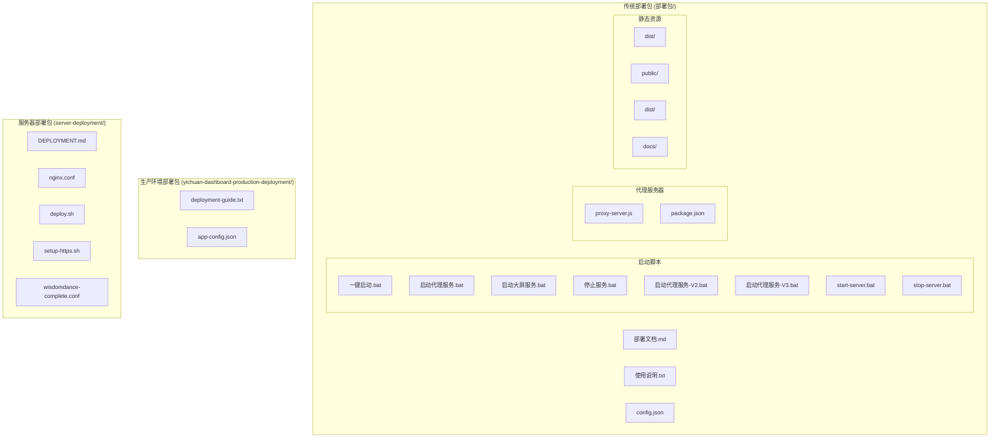
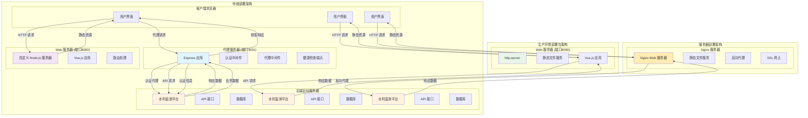
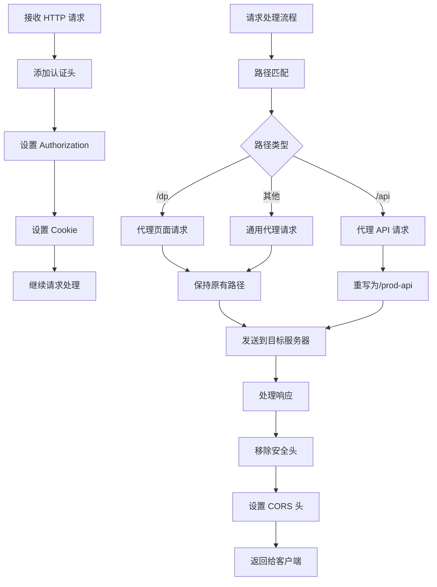
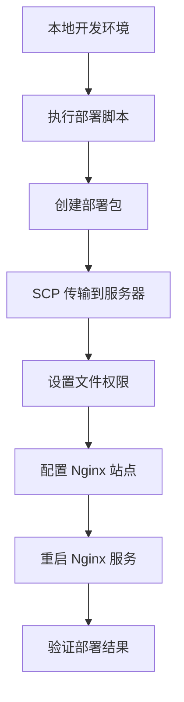
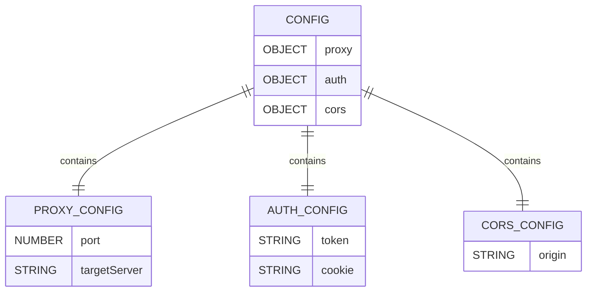
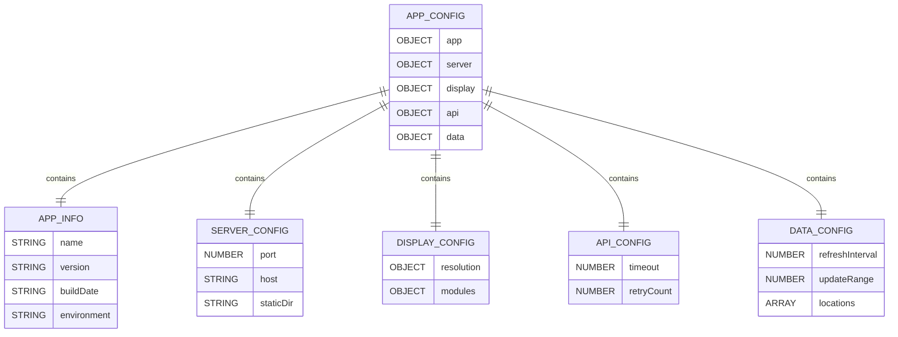
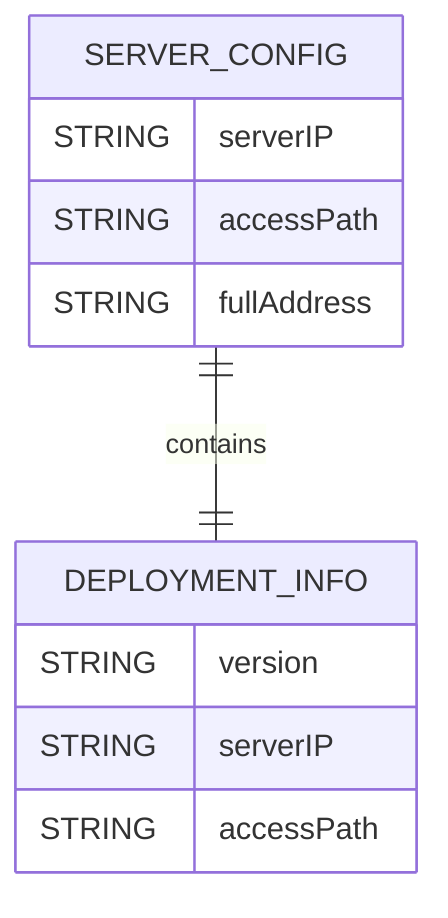
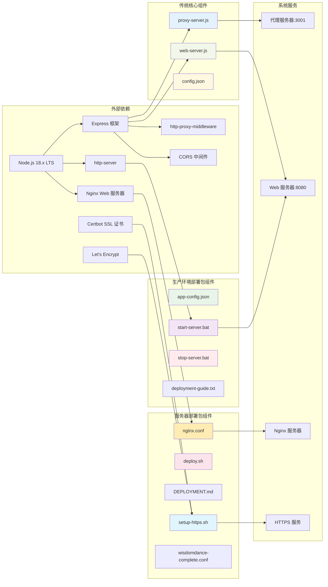

# 生产环境部署

<cite>
**本文档引用的文件**
- [部署文档.md](file://部署包/部署文档.md)
- [config.json](file://部署包/config.json)
- [使用说明.txt](file://部署包/使用说明.txt)
- [一键启动.bat](file://部署包/一键启动.bat)
- [启动大屏服务.bat](file://部署包/启动大屏服务.bat)
- [停止服务.bat](file://部署包/停止服务.bat)
- [proxy-server.js](file://proxy-server.js)
- [package.json](file://package.json)
- [启动代理服务-V2.bat](file://部署包/启动代理服务-V2.bat)
- [启动代理服务-V3.bat](file://部署包/启动代理服务-V3.bat)
- [deployment-guide.txt](file://yichuan-dashboard-production-deployment/docs/deployment-guide.txt)
- [app-config.json](file://yichuan-dashboard-production-deployment/config/app-config.json)
- [start-server.bat](file://yichuan-dashboard-production-deployment/scripts/start-server.bat)
- [stop-server.bat](file://yichuan-dashboard-production-deployment/scripts/stop-server.bat)
- [DEPLOYMENT.md](file://server-deployment/DEPLOYMENT.md)
- [nginx.conf](file://server-deployment/nginx.conf)
- [deploy.sh](file://server-deployment/deploy.sh)
- [setup-https.sh](file://server-deployment/setup-https.sh)
- [wisdomdance-complete.conf](file://server-deployment/wisdomdance-complete.conf)
</cite>

## 更新摘要
**变更内容**
- 新增生产环境部署包章节，介绍 yichuan-dashboard-production-deployment 的完整结构
- 添加新的配置文件 app-config.json 的详细说明
- 更新部署脚本部分，包含 start-server.bat 和 stop-server.bat 的使用指南
- 扩展架构概览，展示三种不同的部署模式
- 增加新部署包的技术规格和功能模块说明
- 新增 http-server 替代自定义 web-server.js 的说明
- 新增服务器部署文档，包含 Linux 环境下的 Nginx 部署流程
- 新增服务器部署包的完整技术规范和部署脚本分析
- 新增 HTTPS 配置和 SSL 证书部署说明
- 更新版本信息，反映最新的 v2.5.2 版本

## 目录
1. [简介](#简介)
2. [项目结构](#项目结构)
3. [核心组件](#核心组件)
4. [架构概览](#架构概览)
5. [详细组件分析](#详细组件分析)
6. [生产环境部署包](#生产环境部署包)
7. [服务器部署方案](#服务器部署方案)
8. [HTTPS 配置方案](#https-配置方案)
9. [依赖关系分析](#依赖关系分析)
10. [性能考虑](#性能考虑)
11. [故障排除指南](#故障排除指南)
12. [结论](#结论)

## 简介

宜川县域监测体系整合平台是一个基于 Node.js 开发的生产环境部署解决方案。该系统采用多架构部署模式，通过代理服务器和 Web 服务器协同工作，为用户提供完整的水利监测大屏展示功能。

**更新** 新增了 yichuan-dashboard-production-deployment 目录，提供了一种更简洁的单服务器部署方案，使用 http-server 替代自定义的 web-server.js，简化了部署流程并提高了易用性。同时新增了服务器部署方案，支持 Linux 环境下的 Nginx 部署，并提供了完整的自动化部署脚本。系统现已升级至 v2.5.2 版本，支持更高的分辨率和更丰富的功能模块。

本部署包专为 Windows 环境设计，无需额外的 Web 服务器软件（如 Nginx），通过纯 Node.js 实现完整的生产环境部署。系统支持视频监控、视频会议、气象与水利监测、土壤墒情监测等多个功能模块，适用于大规模监控场景。

## 项目结构

部署包采用清晰的分层组织结构，主要包含以下核心目录：



**图表来源**
- [部署文档.md:10-40](file://部署包/部署文档.md#L10-L40)
- [使用说明.txt:27-41](file://使用说明.txt#L27-L41)
- [deployment-guide.txt:38-52](file://yichuan-dashboard-production-deployment/docs/deployment-guide.txt#L38-L52)
- [DEPLOYMENT.md:9-17](file://server-deployment/DEPLOYMENT.md#L9-L17)

**章节来源**
- [部署文档.md:10-40](file://部署包/部署文档.md#L10-L40)
- [使用说明.txt:27-41](file://使用说明.txt#L27-L41)
- [deployment-guide.txt:38-52](file://yichuan-dashboard-production-deployment/docs/deployment-guide.txt#L38-L52)
- [DEPLOYMENT.md:9-17](file://server-deployment/DEPLOYMENT.md#L9-L17)

## 核心组件

### 传统代理服务器组件

代理服务器是整个系统的认证中心，负责处理所有后端 API 请求的转发和认证。其核心功能包括：

- **认证代理**: 通过 Bearer Token 和 Cookie 进行身份验证
- **跨域处理**: 解决 CORS 和 iframe 嵌入限制
- **路径重写**: 将前端请求映射到正确的后端 API 路径
- **健康检查**: 提供服务状态监控接口

### Web 服务器组件

Web 服务器提供静态文件服务，专门用于托管 Vue.js 构建的前端应用：

- **静态文件服务**: 提供 index.html、CSS、JavaScript 等静态资源
- **路由支持**: 支持 Vue Router 的 history 模式
- **端口配置**: 默认监听 8080 端口

### 生产环境部署包组件

**新增** 新部署包采用了更简洁的架构设计：

- **单一服务器架构**: 使用 http-server 替代自定义 web-server.js
- **集中配置管理**: 通过 app-config.json 统一管理所有配置参数
- **简化的启动脚本**: 提供一键启动和停止功能
- **完整的文档支持**: 包含详细的部署说明和技术规格

### 服务器部署组件

**新增** 服务器部署包支持 Linux 环境下的 Nginx 部署：

- **自动部署脚本**: 通过 deploy.sh 实现一键部署
- **Nginx 配置**: 提供完整的 Nginx 配置文件
- **远程部署**: 支持 SSH 远程文件传输
- **权限管理**: 自动设置文件权限和所有权
- **HTTPS 支持**: 提供 SSL 证书配置脚本

### 配置管理系统

系统采用集中式配置管理，通过 config.json 文件统一管理所有配置参数：

- **代理配置**: 端口号和目标服务器地址
- **认证配置**: Bearer Token 和 Cookie 信息
- **跨域配置**: 允许访问的来源域名

**章节来源**
- [proxy-server.js:1-128](file://proxy-server.js#L1-L128)
- [config.json:1-14](file://部署包/config.json#L1-L14)
- [app-config.json:1-53](file://yichuan-dashboard-production-deployment/config/app-config.json#L1-L53)
- [DEPLOYMENT.md:19-48](file://server-deployment/DEPLOYMENT.md#L19-L48)

## 架构概览

系统采用多架构部署模式，通过代理服务器实现前后端分离和认证管理。**更新** 新增了生产环境部署包和服务器部署的架构对比：



**图表来源**
- [proxy-server.js:36-95](file://proxy-server.js#L36-L95)
- [使用说明.txt:44-49](file://使用说明.txt#L44-L49)
- [start-server.bat:43](file://yichuan-dashboard-production-deployment/scripts/start-server.bat#L43)
- [DEPLOYMENT.md:19-48](file://server-deployment/DEPLOYMENT.md#L19-L48)

## 详细组件分析

### 传统代理服务器详细分析

代理服务器采用 Express 框架构建，实现了完整的认证代理功能：

#### 认证中间件设计



**图表来源**
- [proxy-server.js:24-62](file://proxy-server.js#L24-L62)
- [proxy-server.js:64-95](file://proxy-server.js#L64-L95)

#### 路由配置策略

代理服务器实现了三种不同的路由处理策略：

1. **页面代理路由** (`/dp`): 直接代理目标服务器的页面内容
2. **API 代理路由** (`/api`): 将 API 请求重写为 `/prod-api` 路径
3. **通用代理路由** (`/`): 代理所有其他请求

#### 错误处理机制

系统内置了完善的错误处理机制，能够捕获和处理各种代理过程中的异常情况：

- **网络错误**: 捕获连接超时、目标服务器不可达等问题
- **认证失败**: 处理 Token 过期、Cookie 失效等认证相关错误
- **响应处理**: 统一格式化错误响应，便于前端处理

**章节来源**
- [proxy-server.js:24-62](file://proxy-server.js#L24-L62)
- [proxy-server.js:64-95](file://proxy-server.js#L64-L95)

### Web 服务器详细分析

Web 服务器采用纯 Node.js 实现，提供了高效的静态文件服务能力：

#### 静态文件服务配置

Web 服务器专注于提供 Vue.js 应用的静态文件服务，支持以下特性：

- **文件缓存**: 优化静态资源的加载性能
- **压缩支持**: 减少传输数据量
- **路由回退**: 支持 Vue Router 的 history 模式

#### 启动脚本自动化

系统提供了多种启动方式，满足不同场景的需求：

1. **一键启动**: 同时启动代理服务器和 Web 服务器
2. **分别启动**: 独立控制每个服务的启停
3. **命令行启动**: 通过 npm 脚本进行开发模式启动

**章节来源**
- [一键启动.bat:1-64](file://部署包/一键启动.bat#L1-L64)
- [启动大屏服务.bat:1-40](file://部署包/启动大屏服务.bat#L1-L40)
- [package.json:6-9](file://package.json#L6-L9)

### 生产环境部署包详细分析

**新增** 新部署包采用了更现代化的架构设计：

#### 单一服务器架构

新部署包使用 http-server 作为静态文件服务器，替代了传统的自定义 web-server.js：

- **简化部署**: 无需编写自定义服务器代码
- **稳定可靠**: http-server 是经过广泛测试的成熟工具
- **配置简单**: 通过命令行参数即可完成服务器配置

#### 集中配置管理

app-config.json 提供了完整的系统配置：

- **应用信息**: 名称、版本、构建日期、环境信息
- **服务器配置**: 端口、主机地址、静态文件目录
- **显示配置**: 分辨率、模块宽度、标题信息
- **API 配置**: 超时时间、重试次数
- **数据配置**: 刷新间隔、更新范围、监测点位

#### 自动化启动脚本

start-server.bat 提供了完整的自动化部署功能：

- **环境检测**: 自动检查 Node.js 安装状态
- **依赖安装**: 自动安装 http-server 依赖
- **服务器启动**: 使用 http-server 启动静态文件服务
- **端口配置**: 默认监听 8080 端口，支持 CORS

**章节来源**
- [app-config.json:1-53](file://yichuan-dashboard-production-deployment/config/app-config.json#L1-L53)
- [start-server.bat:1-45](file://yichuan-dashboard-production-deployment/scripts/start-server.bat#L1-L45)
- [stop-server.bat:1-28](file://yichuan-dashboard-production-deployment/scripts/stop-server.bat#L1-L28)

### 服务器部署详细分析

**新增** 服务器部署包支持 Linux 环境下的 Nginx 部署：

#### 自动部署脚本

deploy.sh 提供了完整的自动化部署功能：

- **远程部署**: 支持 SSH 远程文件传输
- **权限设置**: 自动设置文件所有权和权限
- **Nginx 配置**: 自动配置和启用站点
- **服务重启**: 自动重启 Nginx 服务

#### Nginx 配置管理

nginx.conf 提供了完整的 Nginx 配置：

- **虚拟主机**: 支持多站点配置
- **静态文件服务**: 提供静态资源访问
- **反向代理**: 配置后端服务器代理
- **SSL 支持**: 支持 HTTPS 配置

#### 远程部署流程



**图表来源**
- [DEPLOYMENT.md:21-48](file://server-deployment/DEPLOYMENT.md#L21-L48)

**章节来源**
- [DEPLOYMENT.md:19-48](file://server-deployment/DEPLOYMENT.md#L19-L48)

### 配置管理系统分析

配置管理系统采用 JSON 格式存储，提供了灵活的配置管理能力：

#### 传统配置文件结构



**图表来源**
- [config.json:1-14](file://部署包/config.json#L1-L14)

#### 新部署包配置文件结构

**更新** 新部署包的配置更加全面和结构化：



**图表来源**
- [app-config.json:1-53](file://yichuan-dashboard-production-deployment/config/app-config.json#L1-L53)

#### 服务器配置文件结构

**新增** 服务器部署包的配置更加简洁：



**图表来源**
- [DEPLOYMENT.md:3-7](file://server-deployment/DEPLOYMENT.md#L3-L7)

#### 配置更新机制

系统支持动态配置更新，用户可以通过以下方式更新认证信息：

1. **Cookie 更新**: 通过浏览器开发者工具获取最新 Cookie
2. **Token 更新**: 支持 Bearer Token 的轮换
3. **端口调整**: 可根据需要调整代理服务器端口
4. **显示配置**: 可以调整模块宽度和分辨率设置

**章节来源**
- [config.json:1-14](file://部署包/config.json#L1-L14)
- [app-config.json:1-53](file://yichuan-dashboard-production-deployment/config/app-config.json#L1-L53)
- [DEPLOYMENT.md:3-7](file://server-deployment/DEPLOYMENT.md#L3-L7)
- [部署文档.md:258-270](file://部署包/部署文档.md#L258-L270)

## 生产环境部署包

**新增章节** 详细介绍新的生产环境部署包结构和使用方法：

### 目录结构

新部署包采用了更加清晰和现代化的目录结构：

```
yichuan-dashboard-production-deployment/
├── dist/                 # 前端静态文件
│   ├── index.html       # 主页面
│   ├── js/             # JavaScript 文件
│   └── images/         # 图片资源
├── config/              # 配置文件
│   └── app-config.json # 应用配置
├── scripts/             # 启动脚本
│   ├── start-server.bat # 启动脚本
│   └── stop-server.bat  # 停止脚本
└── docs/               # 文档目录
    └── deployment-guide.txt # 部署说明
```

### 技术规格

新部署包提供了完整的技术规格说明：

- **系统版本**: v2.5.2
- **构建日期**: 2026-03-12
- **目标分辨率**: 6720 × 1260 像素
- **硬件要求**: 
  - CPU: Intel i5 或同等性能以上
  - 内存: 8GB RAM 或以上
  - 显卡: 支持 4K 显示的显卡
  - 存储: 至少 2GB 可用空间
- **软件要求**:
  - 操作系统: Windows 10/11 64 位
  - Node.js: LTS 版本 (建议 18.x 或 20.x)
  - 浏览器: Chrome 90+ 或 Edge 90+

### 功能模块

新部署包支持四个主要功能模块，每个模块都有特定的宽度占比：

1. **视频监控墙 (26% 宽度)**: 实时视频监控展示和地图点位标注
2. **应急资源分布 (26% 宽度)**: 应急物资储备情况和救援队伍分布
3. **气象与水利监测 (26% 宽度)**: 实时气象数据和河流水库水位监测
4. **土壤墒情监测 (14% 宽度)**: 土壤湿度数据和传感器状态监控

### 配置选项

新部署包提供了丰富的配置选项：

- **分辨率配置**: 支持 6720×1260 像素的推荐分辨率，支持自适应缩放
- **数据刷新**: 自动刷新间隔 10 秒，数值变动范围 ±2%，支持动画过渡效果
- **模块布局**: 可调整各模块的宽度百分比和标题信息
- **API 设置**: 可配置超时时间和重试次数

### 启动和停止

新部署包提供了简化的启动和停止流程：

#### 启动系统

1. **环境准备**: 检查 Node.js 安装状态
2. **依赖安装**: 自动安装 http-server 依赖
3. **服务器启动**: 使用 http-server 启动静态文件服务
4. **访问系统**: 在浏览器中访问 http://localhost:8080

#### 停止系统

1. **进程查找**: 自动查找运行中的 http-server 进程
2. **进程终止**: 终止 Node.js 进程
3. **状态确认**: 确认服务器已停止

**章节来源**
- [deployment-guide.txt:1-108](file://yichuan-dashboard-production-deployment/docs/deployment-guide.txt#L1-L108)
- [app-config.json:1-53](file://yichuan-dashboard-production-deployment/config/app-config.json#L1-L53)
- [start-server.bat:1-45](file://yichuan-dashboard-production-deployment/scripts/start-server.bat#L1-L45)
- [stop-server.bat:1-28](file://yichuan-dashboard-production-deployment/scripts/stop-server.bat#L1-L28)

## 服务器部署方案

**新增章节** 详细介绍 Linux 环境下的服务器部署方案：

### 部署包内容

服务器部署包包含了完整的部署文件：

```
server-deployment/
├── index.html          # 主页面文件
├── js/                # JavaScript 文件
├── images/            # 图片资源
├── nginx.conf         # Nginx 配置文件
├── deploy.sh          # 自动部署脚本
├── DEPLOYMENT.md      # 部署说明文档
└── setup-https.sh     # HTTPS 配置脚本
```

### 部署方式

系统提供了两种部署方式：

#### 自动部署（推荐）

使用 deploy.sh 脚本实现一键部署：

```bash
# 在本地执行自动部署脚本
cd server-deployment
./deploy.sh
```

#### 手动部署

支持手动部署方式：

1. **上传部署包到服务器**：
```bash
scp -r server-deployment/* root@43.153.213.134:/var/www/html/ycjctx/
```

2. **设置文件权限**：
```bash
ssh root@43.153.213.134
cd /var/www/html/ycjctx
chown -R www-data:www-data .
chmod -R 755 .
```

3. **配置 Nginx**：
```bash
# 复制 nginx 配置
cp nginx.conf /etc/nginx/sites-available/ycjctx
ln -s /etc/nginx/sites-available/ycjctx /etc/nginx/sites-enabled/
nginx -t && systemctl reload nginx
```

### 访问验证

部署完成后，可通过以下地址访问：

- **主访问地址**: http://43.153.213.134/ycjctx/
- **备用访问地址**: http://43.153.213.134/ycjctx/index.html

### 注意事项

1. **确保服务器已安装 Nginx**
2. **确保服务器防火墙开放 80 端口**
3. **如有 SSL 证书，可配置 HTTPS 访问**
4. **部署脚本会自动备份现有文件**

**章节来源**
- [DEPLOYMENT.md:19-65](file://server-deployment/DEPLOYMENT.md#L19-L65)

## HTTPS 配置方案

**新增章节** 详细介绍 HTTPS 配置和 SSL 证书部署：

### SSL 证书配置

系统支持通过 Certbot 自动获取和配置 SSL 证书：

#### 完整 Nginx 配置

wisdomdance-complete.conf 提供了完整的 HTTPS 配置示例：

```nginx
server {
    server_name wisdomdance.cn www.wisdomdance.cn;
    root /var/www/wisdomdance/dist;
    index index.html;
    
    # 宜川县域监测体系整合平台
    location /ycjctx/ {
        alias /var/www/html/ycjctx/;
        index index.html;
        try_files $uri $uri/ /ycjctx/index.html;
        
        # 静态资源配置
        location ~* \.(js|css|png|jpg|jpeg|gif|ico|svg|woff|woff2|ttf|eot)$ {
            expires 1y;
            add_header Cache-Control "public, immutable";
            add_header Access-Control-Allow-Origin "*";
        }
    }
    
    location /weather-api/ {
        proxy_pass http://d1.weather.com.cn/;
        proxy_set_header Referer http://www.weather.com.cn/;
        proxy_set_header Host d1.weather.com.cn;
        proxy_set_header Accept-Encoding "";
        add_header Access-Control-Allow-Origin *;
        add_header Cache-Control "max-age=600";
    }

    location / {
        try_files $uri $uri/ =404;
    }

    listen 443 ssl; # managed by Certbot
    ssl_certificate /etc/letsencrypt/live/wisdomdance.cn/fullchain.pem; # managed by Certbot
    ssl_certificate_key /etc/letsencrypt/live/wisdomdance.cn/privkey.pem; # managed by Certbot
    include /etc/letsencrypt/options-ssl-nginx.conf; # managed by Certbot
    ssl_dhparam /etc/letsencrypt/ssl-dhparams.pem; # managed by Certbot
}

server {
    if ($host = www.wisdomdance.cn) {
        return 301 https://$host$request_uri;
    }

    if ($host = wisdomdance.cn) {
        return 301 https://$host$request_uri;
    }

    listen 80;
    server_name wisdomdance.cn www.wisdomdance.cn;
    return 404;
}
```

#### 自动 HTTPS 部署脚本

setup-https.sh 提供了完整的 HTTPS 配置自动化：

- **配置备份**: 自动备份原始 Nginx 配置
- **路径添加**: 在现有配置中添加 /ycjctx/ 路径
- **静态资源优化**: 配置静态文件缓存和跨域头
- **配置测试**: 自动测试 Nginx 配置语法
- **服务重启**: 配置成功后自动重启 Nginx

### 配置验证

部署完成后，可通过以下方式进行验证：

1. **HTTPS 访问测试**:
```bash
curl -I https://www.wisdomdance.cn/ycjctx/
```

2. **证书状态检查**:
```bash
openssl s_client -connect www.wisdomdance.cn:443 -servername www.wisdomdance.cn
```

3. **配置语法检查**:
```bash
sudo nginx -t
```

**章节来源**
- [setup-https.sh:1-45](file://server-deployment/setup-https.sh#L1-L45)
- [wisdomdance-complete.conf:1-58](file://server-deployment/wisdomdance-complete.conf#L1-L58)

## 依赖关系分析

系统各组件之间的依赖关系清晰明确，形成了稳定的生产环境架构：



**图表来源**
- [package.json:10-17](file://package.json#L10-L17)
- [使用说明.txt:30-32](file://使用说明.txt#L30-L32)
- [start-server.bat:26-36](file://yichuan-dashboard-production-deployment/scripts/start-server.bat#L26-L36)
- [DEPLOYMENT.md:19-48](file://server-deployment/DEPLOYMENT.md#L19-L48)

### 外部依赖管理

系统对外部依赖进行了精心选择和管理：

- **Express**: 提供轻量级 Web 应用框架
- **http-proxy-middleware**: 实现高性能的反向代理功能
- **cors**: 处理跨域资源共享问题
- **http-server**: 提供简单可靠的静态文件服务
- **Nginx**: 提供高性能的 Web 服务器和反向代理
- **Certbot**: 自动获取和管理 SSL 证书
- **Let's Encrypt**: 免费的 SSL 证书颁发机构

### 内部组件耦合

各内部组件之间保持松耦合的设计原则：

- **配置独立**: 配置文件与业务逻辑分离
- **职责明确**: 每个组件都有明确的功能边界
- **接口简单**: 组件间通信通过简单的 HTTP 协议

**章节来源**
- [package.json:10-17](file://package.json#L10-L17)
- [使用说明.txt:30-32](file://使用说明.txt#L30-L32)
- [DEPLOYMENT.md:19-48](file://server-deployment/DEPLOYMENT.md#L19-L48)

## 性能考虑

### 端口配置优化

系统采用多端口设计，避免了端口冲突问题：

- **代理服务器**: 端口 3001，专门处理认证和代理请求
- **Web 服务器**: 端口 8080，专门提供静态文件服务
- **服务器部署**: Nginx 默认监听 80 端口，提供静态文件服务

### 缓存策略

系统实现了多层缓存策略以提升性能：

1. **静态资源缓存**: 浏览器端缓存 CSS、JavaScript、图片等静态资源
2. **代理响应缓存**: 对频繁访问的数据进行短期缓存
3. **配置缓存**: 配置文件的内存缓存减少磁盘 IO

### 并发处理

系统具备良好的并发处理能力：

- **异步处理**: 所有网络请求采用异步非阻塞模式
- **连接池**: 合理管理与后端服务器的连接
- **负载均衡**: 支持多个后端实例的负载分担

**更新** 新部署包的性能特点：

- **启动速度快**: http-server 启动时间短，响应迅速
- **内存占用低**: 相比自定义服务器，内存占用更少
- **稳定性高**: 经过广泛测试的成熟工具，故障率低

**更新** 服务器部署的性能特点：

- **Nginx 优化**: 利用 Nginx 的高性能特性和缓存机制
- **静态文件加速**: Nginx 对静态文件的高效处理
- **反向代理优化**: Nginx 的反向代理功能优化了请求转发
- **SPA 路由支持**: Nginx 配置支持 Vue Router 的 history 模式
- **SSL 加速**: Nginx 的 SSL 终止功能提升 HTTPS 性能

**更新** HTTPS 配置的性能优化：

- **证书缓存**: Let's Encrypt 证书的自动缓存和续期
- **HTTP/2 支持**: Nginx 配置支持 HTTP/2 协议
- **压缩优化**: Gzip 压缩和 Brotli 压缩的智能选择
- **CDN 集成**: 支持 CDN 缓存和全球加速

## 故障排除指南

### 常见问题诊断

#### 环境问题

**问题**: 启动时提示"未检测到 Node.js"
**解决方案**: 
1. 检查 Node.js 是否正确安装
2. 验证 Node.js 版本是否符合要求（18.x LTS）
3. 确认 Node.js 已添加到系统 PATH 环境变量

#### 端口冲突问题

**问题**: 端口被占用导致服务启动失败
**解决方案**:
```cmd
# 检查端口占用情况
netstat -ano | findstr :3001
netstat -ano | findstr :8080

# 停止占用端口的进程
taskkill /F /PID <进程ID>
```

#### 认证问题

**问题**: iframe 模块无数据显示
**解决方案**:
1. 检查 config.json 中的 Cookie 是否有效
2. 验证 Bearer Token 的正确性
3. 通过代理测试端点验证认证状态

#### 依赖安装问题

**问题**: npm install 执行失败
**解决方案**:
```cmd
# 清理 npm 缓存
npm cache clean --force

# 重新安装依赖
rm -rf node_modules
npm install

# 或者手动安装所需依赖
npm install express http-proxy-middleware cors
```

**更新** 新部署包的故障排除：

#### 依赖安装问题

**问题**: http-server 安装失败
**解决方案**:
```cmd
# 检查 npm 权限
npm config get registry

# 更换 npm 镜像源
npm config set registry https://registry.npmjs.org/

# 重新安装
npm install -g http-server

# 或者使用 cnpm
npm install -g cnpm --registry=https://registry.taobao.org/
```

#### 服务器启动问题

**问题**: http-server 启动失败
**解决方案**:
```cmd
# 检查端口占用
netstat -ano | findstr :8080

# 检查静态文件目录
dir dist

# 检查配置文件
type config\app-config.json

# 以管理员权限运行
runas /user:Administrator "start-server.bat"
```

**更新** 服务器部署的故障排除：

#### Nginx 部署问题

**问题**: Nginx 配置错误导致服务启动失败
**解决方案**:
```bash
# 检查 Nginx 配置语法
nginx -t

# 查看错误日志
tail -f /var/log/nginx/error.log

# 重启 Nginx 服务
systemctl restart nginx

# 检查防火墙设置
ufw status
```

#### 远程部署问题

**问题**: SCP 传输失败
**解决方案**:
```bash
# 检查 SSH 连接
ssh root@43.153.213.134

# 检查磁盘空间
df -h

# 检查权限
ls -la /var/www/html/

# 重新执行部署
./deploy.sh
```

**更新** HTTPS 配置的故障排除：

#### SSL 证书问题

**问题**: HTTPS 配置失败或证书无效
**解决方案**:
```bash
# 检查证书状态
sudo openssl s_client -connect www.wisdomdance.cn:443 -servername www.wisdomdance.cn

# 检查 Certbot 配置
sudo certbot certificates

# 重新获取证书
sudo certbot --nginx

# 检查 Nginx 配置
sudo nginx -t && sudo systemctl reload nginx
```

#### 证书续期问题

**问题**: Let's Encrypt 证书自动续期失败
**解决方案**:
```bash
# 手动测试续期
sudo certbot renew --dry-run

# 检查 cron 任务
sudo crontab -l

# 手动续期
sudo certbot renew

# 检查系统时间
timedatectl
```

### 日志分析

系统提供了详细的日志输出，便于问题诊断：

- **代理服务器日志**: 包含请求路径、响应状态、错误信息
- **Web 服务器日志**: 包含静态文件访问记录
- **启动脚本日志**: 包含服务启动和停止的详细信息
- **新部署包日志**: 包含 http-server 的启动和运行信息
- **服务器部署日志**: 包含 Nginx 配置和部署过程的日志
- **HTTPS 配置日志**: 包含 SSL 证书获取和配置的日志

### 性能监控

建议定期监控以下指标：

1. **响应时间**: 代理请求的平均响应时间
2. **错误率**: 5xx 错误的比例
3. **并发连接数**: 同时处理的请求数量
4. **内存使用**: 服务器的内存占用情况
5. **CPU 使用率**: 服务器的处理器占用情况
6. **磁盘空间**: 服务器的存储空间使用情况
7. **网络带宽**: 服务器的网络流量使用情况
8. **SSL 证书状态**: 证书的有效期和状态
9. **Nginx 性能**: 请求处理时间和连接状态

**章节来源**
- [部署文档.md:219-255](file://部署包/部署文档.md#L219-L255)
- [停止服务.bat:12-34](file://部署包/停止服务.bat#L12-L34)
- [DEPLOYMENT.md:55-59](file://server-deployment/DEPLOYMENT.md#L55-L59)

## 结论

宜川县域监测体系整合平台提供了一个完整、可靠的生产环境部署解决方案。**更新** 新增的 yichuan-dashboard-production-deployment 目录和服务器部署包进一步丰富了部署选项，为用户提供了更简洁、更可靠的部署方案。系统现已升级至 v2.5.2 版本，支持更高的分辨率和更丰富的功能模块。

### 主要优势

1. **部署简便**: 无需额外的 Web 服务器软件，纯 Node.js 实现
2. **功能完整**: 支持视频监控、视频会议、气象监测等多种功能
3. **性能优异**: 多端口设计和多层缓存策略确保高效运行
4. **易于维护**: 清晰的组件分离和完善的日志系统
5. **架构现代化**: 新部署包采用 http-server，简化了部署流程
6. **配置集中化**: 通过 app-config.json 统一管理所有配置参数
7. **自动化程度高**: 提供完整的启动和停止脚本
8. **多平台支持**: 同时支持 Windows 和 Linux 环境部署
9. **服务器优化**: Nginx 部署方案提供高性能的生产环境
10. **远程部署**: 支持一键远程部署到服务器
11. **HTTPS 支持**: 完整的 SSL 证书配置和管理
12. **版本管理**: 详细的版本历史和更新记录

### 最佳实践建议

1. **定期更新认证信息**: 建议每 3 个月更新一次 Bearer Token 和 Cookie
2. **监控系统健康**: 建立定期的健康检查和性能监控机制
3. **备份配置文件**: 定期备份 config.json 文件以防意外丢失
4. **文档维护**: 保持部署文档的及时更新
5. **选择合适的部署包**: 根据需求选择传统部署包、新部署包或服务器部署包
6. **定期更新系统**: 保持 Node.js 和相关依赖的最新版本
7. **服务器监控**: 对生产服务器进行持续监控和维护
8. **SSL 证书管理**: 定期检查和续期 SSL 证书
9. **性能优化**: 根据实际使用情况进行性能调优
10. **安全加固**: 定期更新安全配置和防护措施

### 部署包选择建议

- **选择传统部署包** 当需要复杂的代理功能、自定义服务器逻辑或需要与现有系统深度集成时
- **选择新部署包** 当需要快速部署、简化维护或希望使用成熟的静态文件服务器时
- **选择服务器部署包** 当需要在 Linux 环境下部署、使用 Nginx 优化性能或需要远程部署时
- **选择 HTTPS 部署** 当需要安全的 HTTPS 访问和完整的 SSL 证书管理时

该部署方案为类似的大屏监控系统提供了优秀的参考模板，具有很强的实用价值和推广意义。通过提供多种部署选项和完善的配置管理，系统能够满足不同规模和需求的部署场景，为用户提供稳定可靠的服务体验。