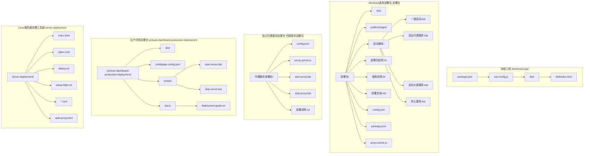
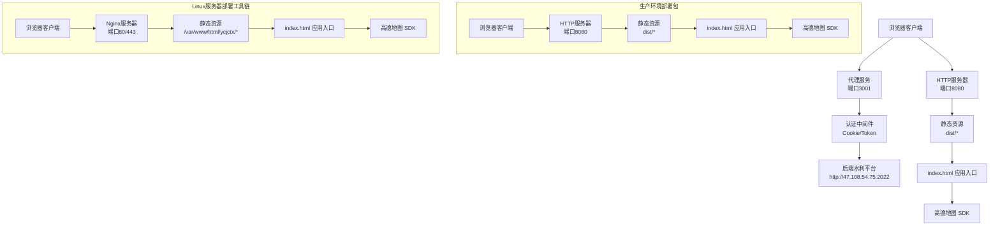
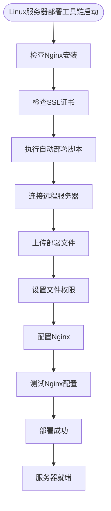
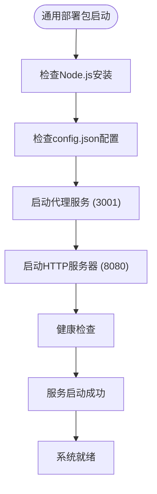
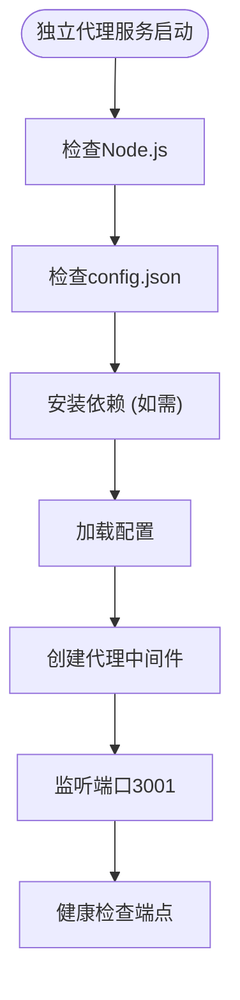
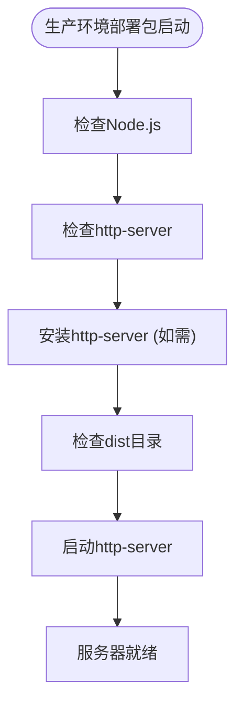
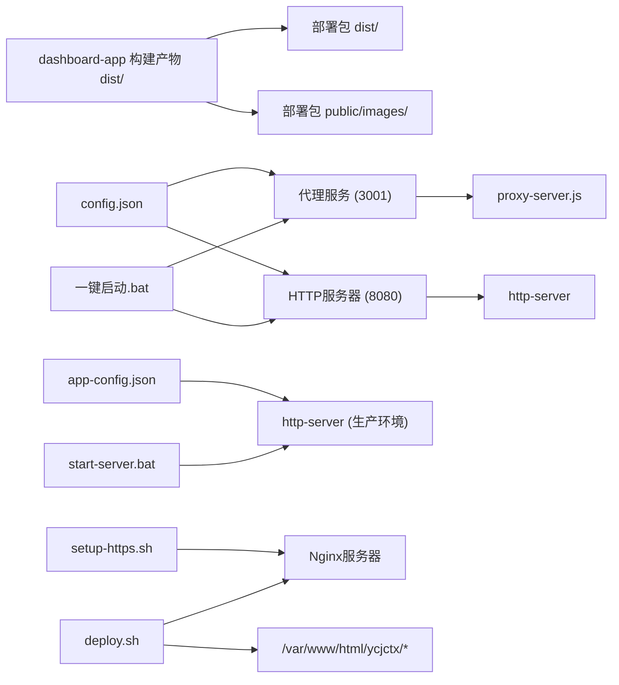

# 部署和运维

<cite>
**本文引用的文件**
- [server-deployment/DEPLOYMENT.md](file://server-deployment/DEPLOYMENT.md)
- [server-deployment/nginx.conf](file://server-deployment/nginx.conf)
- [server-deployment/nginx-domain.conf](file://server-deployment/nginx-domain.conf)
- [server-deployment/nginx-ssl.conf](file://server-deployment/nginx-ssl.conf)
- [server-deployment/setup-https.sh](file://server-deployment/setup-https.sh)
- [server-deployment/deploy.sh](file://server-deployment/deploy.sh)
- [server-deployment/auth-proxy.html](file://server-deployment/auth-proxy.html)
- [yichuan-dashboard-production-deployment/docs/deployment-guide.txt](file://yichuan-dashboard-production-deployment/docs/deployment-guide.txt)
- [yichuan-dashboard-production-deployment/config/app-config.json](file://yichuan-dashboard-production-deployment/config/app-config.json)
- [yichuan-dashboard-production-deployment/scripts/start-server.bat](file://yichuan-dashboard-production-deployment/scripts/start-server.bat)
- [代理服务部署包/部署说明.txt](file://代理服务部署包/部署说明.txt)
- [代理服务部署包/config.json](file://代理服务部署包/config.json)
- [代理服务部署包/proxy-server.js](file://代理服务部署包/proxy-server.js)
- [部署包/部署包说明.txt](file://部署包/部署包说明.txt)
- [部署包/使用说明.txt](file://部署包/使用说明.txt)
- [部署包/一键启动.bat](file://部署包/一键启动.bat)
- [dashboard-app/package.json](file://dashboard-app/package.json)
- [dashboard-app/vue.config.js](file://dashboard-app/vue.config.js)
</cite>

## 更新摘要
**所做更改**
- 新增完整的Linux服务器部署工具链：包含Nginx配置模板、HTTPS设置脚本、自动部署脚本
- 更新部署包结构说明，反映新增的server-deployment目录和完整的服务器部署方案
- 补充Linux环境下的Nginx配置示例和HTTPS证书配置指南
- 增加自动部署脚本的详细使用方法和注意事项
- 完善服务器端静态资源优化和缓存策略说明

## 目录
1. [简介](#简介)
2. [项目结构](#项目结构)
3. [核心组件](#核心组件)
4. [架构总览](#架构总览)
5. [详细组件分析](#详细组件分析)
6. [依赖关系分析](#依赖关系分析)
7. [性能考虑](#性能考虑)
8. [故障排查指南](#故障排查指南)
9. [结论](#结论)
10. [附录](#附录)

## 简介
本指南面向运维工程师，提供"宜川县域监测体系整合平台"的完整部署与运维手册。内容覆盖生产环境部署流程、服务器配置建议、Windows批处理脚本使用方法与注意事项、Linux服务器部署工具链、静态资源优化与缓存策略、SSL证书配置与安全加固、日志与监控告警设置、版本更新与回滚操作流程，以及日常维护要点。

**更新** 新增完整的Linux服务器部署工具链，包含server-deployment目录中的Nginx配置模板、HTTPS设置脚本、自动部署脚本等完整解决方案。现在包含四个主要部署方案：Windows通用部署包、独立代理服务部署包、生产环境部署包和Linux服务器部署工具链，每种都有特定的用途和配置要求。

## 项目结构
该仓库包含四个主要部署方案和前端工程：

- **前端工程（dashboard-app）**：基于 Vue 3 的单页应用，提供开发与构建能力；构建产物位于 dist 目录。
- **Windows通用部署包（部署包）**：包含生产环境可直接部署的静态资源、启动/停止脚本及部署说明文档，支持代理服务和HTTP服务器双服务架构。
- **独立代理服务部署包（代理服务部署包）**：专门用于代理访问后端水利平台的独立服务，包含独立的配置文件和启动脚本。
- **生产环境部署包（yichuan-dashboard-production-deployment）**：专为生产环境优化的完整部署包，包含完整的配置文件和简化的启动脚本。
- **Linux服务器部署工具链（server-deployment）**：完整的服务器端部署解决方案，包含Nginx配置、HTTPS设置脚本、自动部署脚本等。
- **根目录脚本**：与部署包中的启动/停止脚本逻辑一致，便于在不同位置直接运行。



**图表来源**
- [dashboard-app/package.json:1-23](file://dashboard-app/package.json#L1-L23)
- [dashboard-app/vue.config.js:1-19](file://dashboard-app/vue.config.js#L1-L19)
- [部署包/部署包说明.txt:1-120](file://部署包/部署包说明.txt#L1-L120)
- [代理服务部署包/部署说明.txt:1-112](file://代理服务部署包/部署说明.txt#L1-L112)
- [yichuan-dashboard-production-deployment/docs/deployment-guide.txt:1-108](file://yichuan-dashboard-production-deployment/docs/deployment-guide.txt#L1-L108)
- [server-deployment/DEPLOYMENT.md:1-65](file://server-deployment/DEPLOYMENT.md#L1-L65)

## 核心组件
- **构建与开发配置**
  - Vue CLI 服务配置定义了开发服务器主机、端口、热重载与 CSS 提取策略。
  - package.json 中声明了运行时依赖与构建脚本。
- **部署产物**
  - dist 目录包含构建后的 HTML、JS、图片与图标等静态资源。
  - index.html 引入高德地图 SDK 并加载应用入口脚本。
- **双服务架构**
  - 代理服务（端口3001）：专门用于代理访问后端水利平台，自动添加认证Cookie和Token。
  - HTTP服务器（端口8080）：提供大屏前端静态文件服务。
- **独立代理服务**
  - 独立的代理服务器部署包，支持独立部署和管理。
  - 自动添加认证信息，解决跨域和iframe嵌入限制。
- **生产环境部署包**
  - 专为生产环境优化的完整部署包，包含简化的配置和启动脚本。
  - 提供完整的系统配置和模块布局说明。
- **Linux服务器部署工具链**
  - 完整的服务器端部署解决方案，包含Nginx配置模板、HTTPS设置脚本、自动部署脚本。
  - 支持子路径部署和静态资源缓存优化。
- **Windows 启停脚本**
  - 启动脚本负责检测 Node.js 安装、复制配置、启动服务并自动打开浏览器。
  - 停止脚本负责优雅停止与强制清理残留进程。
- **部署说明**
  - 明确最小化部署要求、技术规格与注意事项，指导 Web 服务器根目录与默认文档配置。

**章节来源**
- [dashboard-app/vue.config.js:1-19](file://dashboard-app/vue.config.js#L1-L19)
- [dashboard-app/package.json:1-23](file://dashboard-app/package.json#L1-L23)
- [部署包/部署包说明.txt:35-120](file://部署包/部署包说明.txt#L35-L120)
- [代理服务部署包/部署说明.txt:19-88](file://代理服务部署包/部署说明.txt#L19-L88)
- [yichuan-dashboard-production-deployment/docs/deployment-guide.txt:21-108](file://yichuan-dashboard-production-deployment/docs/deployment-guide.txt#L21-L108)
- [server-deployment/DEPLOYMENT.md:1-65](file://server-deployment/DEPLOYMENT.md#L1-L65)

## 架构总览
系统采用四种不同的部署架构，根据使用场景选择合适的部署方案：

- **Windows通用部署包**：双服务架构，前端应用通过浏览器直接加载静态资源，后端通过代理服务访问后端水利平台。
- **独立代理服务部署包**：专门的代理服务，用于独立代理访问后端平台。
- **生产环境部署包**：简化架构，仅提供HTTP服务器服务，适合生产环境部署。
- **Linux服务器部署工具链**：完整的服务器端部署解决方案，支持子路径部署和HTTPS访问。



**图表来源**
- [部署包/部署包说明.txt:90-101](file://部署包/部署包说明.txt#L90-L101)
- [代理服务部署包/proxy-server.js:46-92](file://代理服务部署包/proxy-server.js#L46-L92)
- [yichuan-dashboard-production-deployment/scripts/start-server.bat:38-43](file://yichuan-dashboard-production-deployment/scripts/start-server.bat#L38-L43)
- [server-deployment/nginx.conf:13-28](file://server-deployment/nginx.conf#L13-L28)

## 详细组件分析

### 组件一：Linux服务器部署工具链
- **功能概述**
  - Nginx配置模板：支持子路径部署、静态资源缓存、SPA路由支持。
  - HTTPS设置脚本：自动化配置SSL证书和安全头。
  - 自动部署脚本：一键部署到远程服务器，包含备份和权限设置。
  - 认证代理页面：模拟登录流程，设置认证信息。
- **关键流程**
  - 自动部署脚本启动 → 远程服务器连接 → 文件上传 → Nginx配置更新 → 服务重启。
- **错误处理**
  - SSH连接失败、文件传输错误、Nginx配置测试失败等场景均有明确提示与回滚机制。



**图表来源**
- [server-deployment/deploy.sh:29-80](file://server-deployment/deploy.sh#L29-L80)
- [server-deployment/setup-https.sh:30-45](file://server-deployment/setup-https.sh#L30-L45)

**章节来源**
- [server-deployment/DEPLOYMENT.md:19-65](file://server-deployment/DEPLOYMENT.md#L19-L65)
- [server-deployment/deploy.sh:1-87](file://server-deployment/deploy.sh#L1-L87)
- [server-deployment/setup-https.sh:1-45](file://server-deployment/setup-https.sh#L1-L45)

### 组件二：通用部署包架构
- **功能概述**
  - 代理服务：专门用于代理访问后端水利平台，自动添加认证信息。
  - HTTP服务器：提供大屏前端静态文件服务。
  - 健康检查：支持服务状态检查和错误处理。
- **关键流程**
  - 代理服务启动 → HTTP服务器启动 → 健康检查 → 服务就绪。
- **错误处理**
  - 端口冲突、配置错误、依赖缺失等场景均有明确提示与退出码返回。



**图表来源**
- [部署包/一键启动.bat:40-57](file://部署包/一键启动.bat#L40-L57)

**章节来源**
- [部署包/一键启动.bat:1-64](file://部署包/一键启动.bat#L1-L64)
- [部署包/使用说明.txt:80-101](file://部署包/使用说明.txt#L80-L101)

### 组件三：独立代理服务部署包
- **功能概述**
  - 专门用于代理访问后端水利平台，自动添加认证Cookie和Token。
  - 解决跨域和iframe嵌入限制，移除X-Frame-Options安全头。
  - 支持多种代理路径映射。
- **关键流程**
  - Node.js检查 → 依赖安装 → 配置加载 → 服务启动 → 健康检查。
- **代理路径**
  - `/dp/*` → 目标服务器/dp/*
  - `/api/*` → 目标服务器/prod-api/*
  - `/*` → 目标服务器/*



**图表来源**
- [代理服务部署包/部署说明.txt:54-59](file://代理服务部署包/部署说明.txt#L54-L59)
- [代理服务部署包/proxy-server.js:136-148](file://代理服务部署包/proxy-server.js#L136-L148)

**章节来源**
- [代理服务部署包/部署说明.txt:19-88](file://代理服务部署包/部署说明.txt#L19-L88)
- [代理服务部署包/config.json:1-14](file://代理服务部署包/config.json#L1-L14)
- [代理服务部署包/proxy-server.js:1-149](file://代理服务部署包/proxy-server.js#L1-L149)

### 组件四：生产环境部署包
- **功能概述**
  - 专为生产环境优化的完整部署包，包含简化的配置和启动脚本。
  - 提供完整的系统配置和模块布局说明。
  - 支持单一HTTP服务器服务，简化部署架构。
- **关键流程**
  - Node.js检查 → http-server安装 → dist目录检查 → 服务器启动。
- **配置选项**
  - 端口：8080
  - 根目录：./dist
  - 支持自定义分辨率配置



**图表来源**
- [yichuan-dashboard-production-deployment/scripts/start-server.bat:26-43](file://yichuan-dashboard-production-deployment/scripts/start-server.bat#L26-L43)

**章节来源**
- [yichuan-dashboard-production-deployment/docs/deployment-guide.txt:21-108](file://yichuan-dashboard-production-deployment/docs/deployment-guide.txt#L21-L108)
- [yichuan-dashboard-production-deployment/config/app-config.json:1-53](file://yichuan-dashboard-production-deployment/config/app-config.json#L1-L53)
- [yichuan-dashboard-production-deployment/scripts/start-server.bat:1-45](file://yichuan-dashboard-production-deployment/scripts/start-server.bat#L1-L45)

### 组件五：配置文件详解
- **通用部署包配置**
  - 端口：3001（代理服务）
  - 目标服务器：http://47.108.54.75:2022
  - CORS来源：http://localhost:8080
- **独立代理服务配置**
  - 端口：3001（代理服务）
  - 目标服务器：http://47.108.54.75:2022
  - CORS来源：http://localhost:8080
- **生产环境配置**
  - 端口：8080
  - 主机：0.0.0.0
  - 静态目录：./dist
  - 分辨率：6720×1260
- **Linux服务器配置**
  - 部署路径：/var/www/html/ycjctx
  - Nginx配置：支持子路径部署和静态资源缓存
  - HTTPS支持：SSL证书配置和安全头设置
- **认证配置**
  - Token：Bearer YOUR_TOKEN
  - Cookie：username=xxx; Admin-Token=xxx; ...
- **配置加载机制**
  - 优先使用配置文件，失败时使用默认配置
  - 支持动态配置更新

**章节来源**
- [部署包/部署包说明.txt:104-119](file://部署包/部署包说明.txt#L104-L119)
- [代理服务部署包/config.json:1-14](file://代理服务部署包/config.json#L1-L14)
- [yichuan-dashboard-production-deployment/config/app-config.json:1-53](file://yichuan-dashboard-production-deployment/config/app-config.json#L1-L53)
- [server-deployment/nginx.conf:13-28](file://server-deployment/nginx.conf#L13-L28)

### 组件六：构建与开发配置
- **开发服务器**
  - 主机与端口、自动打开浏览器、错误遮罩等配置便于本地调试。
- **CSS 提取**
  - 默认不提取 CSS，有利于开发阶段样式热更新与调试。
- **依赖与工具链**
  - Vue 3、Vue Router、ECharts、Element Plus、Axios 等用于可视化与交互。

**章节来源**
- [dashboard-app/vue.config.js:1-19](file://dashboard-app/vue.config.js#L1-L19)
- [dashboard-app/package.json:1-23](file://dashboard-app/package.json#L1-L23)

## 依赖关系分析
- **前端工程与部署包的关系**
  - dashboard-app 构建生成 dist，部署包内包含已构建的 dist 与 public/images，二者在结构上保持一致。
- **双服务架构依赖**
  - 代理服务依赖 Node.js 和 http-proxy-middleware
  - HTTP服务器依赖 http-server
  - 两者都依赖相同的配置文件格式
- **生产环境部署包依赖**
  - 仅依赖 http-server，简化了部署复杂度
  - 配置文件格式更加简洁
- **Linux服务器部署工具链依赖**
  - 依赖SSH连接、Nginx服务器、SSL证书
  - 支持自动备份和回滚机制
- **脚本与部署包的关系**
  - 启停脚本与部署包中的脚本逻辑一致，均可在部署包根目录或复制到任意位置运行。



**图表来源**
- [dashboard-app/package.json:1-23](file://dashboard-app/package.json#L1-L23)
- [部署包/一键启动.bat:40-49](file://部署包/一键启动.bat#L40-L49)
- [代理服务部署包/proxy-server.js:1-149](file://代理服务部署包/proxy-server.js#L1-L149)
- [yichuan-dashboard-production-deployment/scripts/start-server.bat:42-43](file://yichuan-dashboard-production-deployment/scripts/start-server.bat#L42-L43)
- [server-deployment/deploy.sh:29-80](file://server-deployment/deploy.sh#L29-L80)
- [server-deployment/setup-https.sh:30-45](file://server-deployment/setup-https.sh#L30-L45)

**章节来源**
- [dashboard-app/package.json:1-23](file://dashboard-app/package.json#L1-L23)

## 性能考虑
- **静态资源优化与缓存策略（建议）**
  - 启用浏览器缓存：对 JS/CSS/图片设置较长缓存时间，对 HTML 设置较短缓存或禁止缓存。
  - 启用 Gzip/Brotli 压缩：减少传输体积，提升首屏加载速度。
  - CDN 分发：将 dist 与 public/images 放置于 CDN，降低源站压力。
  - 资源合并与拆分：按需加载第三方库，避免一次性加载过多资源。
  - 图片优化：使用 WebP/JPEG2000 等现代格式，按分辨率裁剪与压缩。
- **服务器性能**
  - 代理服务：合理配置并发连接数，启用请求超时处理。
  - HTTP服务器：启用 keepalive、合理 worker 连接数与缓冲区大小。
  - Node.js：使用PM2等进程管理器进行进程守护。
  - Linux服务器：Nginx启用gzip压缩、静态资源缓存、keepalive连接。
- **地图与网络**
  - 高德地图 SDK 为外部资源，建议在部署包中保留网络访问以便加载。
- **日志与监控**
  - 启用访问/错误日志，结合 Nginx/IIS 日志轮转策略，定期归档与分析。
  - 配置健康检查接口与告警规则，监控 5xx 比例、响应时间与并发连接数。

## 故障排查指南
- **启动失败**
  - 检查 Node.js 安装路径与版本是否符合要求。
  - 确认 config.json 配置文件格式正确。
  - 查看脚本输出与系统事件日志，定位具体错误。
- **端口冲突**
  - 使用 netstat 检查端口占用情况。
  - 修改配置文件中的端口号或释放被占用端口。
- **代理服务问题**
  - 检查目标服务器可达性。
  - 验证认证信息的有效性。
  - 查看代理服务日志输出。
- **HTTP服务器问题**
  - 确认 dist 目录存在且包含 index.html。
  - 检查 http-server 安装状态。
- **Linux服务器部署问题**
  - 检查SSH连接是否正常，用户名密码是否正确。
  - 验证Nginx配置语法，查看配置测试结果。
  - 确认SSL证书路径和权限设置。
- **进程残留**
  - 使用停止脚本的强制清理逻辑，必要时手动结束进程。
- **浏览器兼容性**
  - 按部署包说明使用 Chrome/Edge/Firefox 等现代浏览器。
- **地图资源加载失败**
  - 确保服务器具备外网访问能力，检查高德地图 SDK 加载状态。

**章节来源**
- [部署包/使用说明.txt:80-101](file://部署包/使用说明.txt#L80-L101)
- [代理服务部署包/部署说明.txt:90-106](file://代理服务部署包/部署说明.txt#L90-L106)
- [server-deployment/deploy.sh:70-80](file://server-deployment/deploy.sh#L70-L80)

## 结论
本指南基于仓库现有文件，给出了从部署到运维的全流程实践建议。对于生产环境，建议结合企业标准完善 SSL/TLS、WAF、CDN、日志与监控体系，并制定标准化的发布与回滚流程，确保系统的稳定性与安全性。新的部署工具链提供了更好的灵活性，建议根据实际需求选择合适的部署方案类型。

## 附录

### A. Linux服务器部署流程（步骤化）
- **Linux服务器部署包部署流程**
  - 准备阶段：获取server-deployment目录，确认包含index.html、nginx.conf、deploy.sh等文件。
  - 服务器准备：安装Nginx、配置SSL证书、确保80和443端口可用。
  - 部署步骤：运行deploy.sh脚本，自动完成文件上传、权限设置、Nginx配置。
  - 验证与收尾：检查Nginx配置测试结果，访问部署地址验证系统运行。

- **独立代理服务部署流程**
  - 准备阶段：获取独立代理服务部署包，确认包含 config.json、proxy-server.js 和启动脚本。
  - 服务器准备：安装 Node.js v18.x LTS 或更高版本，确保 3001 端口可用。
  - 部署步骤：编辑 config.json 文件，配置认证信息，运行启动脚本。
  - 验证与收尾：验证健康检查接口和代理页面。

- **生产环境部署包部署流程**
  - 准备阶段：获取生产环境部署包，确认包含 dist、config、scripts 和文档。
  - 服务器准备：安装 Node.js v18.x LTS 或更高版本，确保 8080 端口可用。
  - 部署步骤：编辑 app-config.json 文件，配置系统参数，运行启动脚本。
  - 验证与收尾：访问 http://localhost:8080 验证系统运行。

**章节来源**
- [server-deployment/DEPLOYMENT.md:19-65](file://server-deployment/DEPLOYMENT.md#L19-L65)
- [server-deployment/deploy.sh:29-80](file://server-deployment/deploy.sh#L29-L80)
- [代理服务部署包/部署说明.txt:24-64](file://代理服务部署包/部署说明.txt#L24-L64)
- [yichuan-dashboard-production-deployment/docs/deployment-guide.txt:21-36](file://yichuan-dashboard-production-deployment/docs/deployment-guide.txt#L21-L36)

### B. Windows批处理脚本使用方法与注意事项
- **通用部署包脚本使用**
  - 使用方法：在部署包根目录双击运行启动/停止脚本。
  - 注意事项：建议以管理员身份运行，避免权限不足导致的配置复制失败。
  - 双服务架构：可以使用一键启动脚本同时启动两个服务。

- **独立代理服务脚本使用**
  - 使用方法：在代理服务部署包根目录运行 start-proxy.bat。
  - 注意事项：确保 config.json 配置正确，首次运行会自动安装依赖。
  - 停止方法：运行 stop-proxy.bat 或手动结束进程。

- **生产环境脚本使用**
  - 使用方法：在生产环境部署包根目录运行 scripts/start-server.bat。
  - 注意事项：脚本会自动安装 http-server，支持 CORS 配置。
  - 停止方法：运行 scripts/stop-server.bat。

**章节来源**
- [部署包/一键启动.bat:1-64](file://部署包/一键启动.bat#L1-L64)
- [代理服务部署包/部署说明.txt:66-71](file://代理服务部署包/部署说明.txt#L66-L71)
- [yichuan-dashboard-production-deployment/scripts/start-server.bat:1-45](file://yichuan-dashboard-production-deployment/scripts/start-server.bat#L1-L45)

### C. Linux服务器Nginx配置示例
- **基础Nginx配置**
  - 监听80端口，支持子路径部署 /ycjctx/
  - 静态资源缓存：JS/CSS/PNG/JPG等设置1年缓存
  - SPA路由支持：重写到index.html
  - 错误页面配置：404/50x页面

- **域名绑定配置**
  - 支持多域名：wisdomdance.cn、www.wisdomdance.cn、IP地址
  - HTTP到HTTPS重定向（可选）
  - 静态资源CORS头设置

- **HTTPS配置**
  - SSL证书配置：certificate和private.key路径
  - SSL安全配置：TLSv1.2+、加密套件、会话缓存
  - 安全头：X-Frame-Options、X-Content-Type-Options、Strict-Transport-Security
  - API代理：可选的localhost:3000代理配置

- **完整站点配置**
  - 主站点：wisdomdance.cn + www.wisdomdance.cn
  - 子路径：/ycjctx/ 独立部署
  - 天气API代理：/weather-api/ 代理到d1.weather.com.cn
  - 其他路径：/ycsl/ 等静态资源

**章节来源**
- [server-deployment/nginx.conf:1-37](file://server-deployment/nginx.conf#L1-L37)
- [server-deployment/nginx-domain.conf:1-61](file://server-deployment/nginx-domain.conf#L1-L61)
- [server-deployment/nginx-ssl.conf:1-63](file://server-deployment/nginx-ssl.conf#L1-L63)

### D. SSL证书配置与安全加固（建议）
- **SSL/TLS**
  - 申请并部署证书，启用 TLS 1.2+。
  - 强制 HTTPS 重定向，禁用弱密码套件与协议。
  - 使用Let's Encrypt免费证书或商业证书。
- **安全头**
  - 配置 HSTS、CSP、X-Frame-Options、X-Content-Type-Options。
  - 设置严格的Content Security Policy。
- **访问控制**
  - 限制管理端口访问范围，启用WAF。
  - 配置防火墙规则，只开放必要端口。
- **日志与审计**
  - 启用详细访问与错误日志，定期备份与分析。
  - 配置日志轮转，保留30天以上。

### E. 日志管理与监控告警（建议）
- **日志**
  - Web 服务器访问/错误日志轮转，保留周期与归档策略。
  - 前端错误可通过浏览器控制台与服务端日志交叉分析。
  - Linux部署：Nginx日志、系统日志、应用日志分离存储。
- **监控**
  - 指标：请求量、错误率、响应时间、并发连接数、磁盘空间。
  - 告警：阈值触发、多级通知、自动化恢复预案。
- **可视化**
  - 使用Prometheus/Grafana或云监控平台进行可视化展示。
  - 集成Nginx状态模块监控。

### F. 版本更新与回滚（建议）
- **更新流程**
  - 预发布验证：在测试环境验证新版本。
  - 灰度发布：逐步替换部分实例，观察指标与日志。
  - 全量上线：确认稳定后完成全部替换。
- **回滚流程**
  - 快速回滚：恢复上一版本部署包，重启服务。
  - 数据回滚：如涉及数据库，按备份策略回滚。
  - 回滚验证：检查页面、功能与监控指标恢复正常。
- **变更记录**
  - 记录版本号、变更内容、负责人、时间与回滚预案。

### G. Linux服务器部署工具链详细指南
- **环境要求**
  - Nginx服务器（已安装）
  - SSH客户端（用于远程部署）
  - SSL证书（可选，用于HTTPS）
  - Ubuntu/Debian系统（deploy.sh脚本针对Ubuntu）
- **部署步骤**
  1. 复制server-deployment目录到本地任意位置
  2. 编辑deploy.sh中的服务器IP和密码配置
  3. 运行./deploy.sh脚本执行自动部署
  4. 验证Nginx配置测试结果
  5. 访问http://服务器IP/ycjctx/验证系统运行
- **配置说明**
  - deploy.sh：自动部署脚本，包含SSH连接、文件上传、权限设置
  - setup-https.sh：HTTPS配置脚本，支持SSL证书集成
  - nginx.conf：基础Nginx配置，支持子路径部署
  - nginx-domain.conf：域名绑定配置，支持多域名
  - nginx-ssl.conf：HTTPS配置模板
  - auth-proxy.html：认证代理页面

**章节来源**
- [server-deployment/DEPLOYMENT.md:1-65](file://server-deployment/DEPLOYMENT.md#L1-L65)
- [server-deployment/deploy.sh:1-87](file://server-deployment/deploy.sh#L1-L87)
- [server-deployment/setup-https.sh:1-45](file://server-deployment/setup-https.sh#L1-L45)

### H. 认证代理页面使用指南
- **功能概述**
  - 模拟登录流程，自动设置认证Cookie和Token
  - 支持localStorage认证信息设置
  - 通过target参数指定跳转目标URL
- **使用方法**
  1. 访问认证代理页面：http://localhost:3001/auth-proxy.html?target=目标URL
  2. 页面自动设置认证信息
  3. 延迟后跳转到目标URL
- **配置说明**
  - Cookie设置：username、password、Admin-Token等
  - Token设置：Authorization头
  - 目标URL：通过URL参数传递

**章节来源**
- [server-deployment/auth-proxy.html:1-60](file://server-deployment/auth-proxy.html#L1-L60)

### I. 部署包结构对比与迁移指南
- **通用部署包 vs 独立代理服务部署包**
  - 通用部署包：包含完整的双服务架构和启动脚本
  - 独立代理服务部署包：仅包含代理服务，适合单独部署
- **通用部署包 vs 生产环境部署包**
  - 通用部署包：复杂的双服务架构，适合开发和测试
  - 生产环境部署包：简化的单一服务架构，适合生产环境
- **通用部署包 vs Linux服务器部署工具链**
  - 通用部署包：Windows环境下的完整解决方案
  - Linux服务器部署工具链：Linux环境下的服务器端部署方案
- **迁移建议**
  - 从通用部署包迁移到生产环境部署包：保留 dist 目录，替换配置文件
  - 从独立代理服务部署包迁移到通用部署包：添加 HTTP 服务器配置
  - 从Windows部署迁移到Linux服务器：使用server-deployment工具链

**章节来源**
- [部署包/部署包说明.txt:1-33](file://部署包/部署包说明.txt#L1-L33)
- [代理服务部署包/部署说明.txt:1-17](file://代理服务部署包/部署说明.txt#L1-L17)
- [yichuan-dashboard-production-deployment/docs/deployment-guide.txt:38-52](file://yichuan-dashboard-production-deployment/docs/deployment-guide.txt#L38-L52)
- [server-deployment/DEPLOYMENT.md:9-17](file://server-deployment/DEPLOYMENT.md#L9-L17)

### J. Linux服务器部署完整使用指南
- **部署包内容清单**
  - index.html：主页面文件，包含高德地图SDK
  - js/：JavaScript文件，包含chunk-vendors和app脚本
  - images/：图片资源文件
  - nginx.conf：基础Nginx配置文件
  - deploy.sh：自动部署脚本
  - setup-https.sh：HTTPS设置脚本
  - *.conf：各种Nginx配置模板
  - auth-proxy.html：认证代理页面
  - DEPLOYMENT.md：部署说明文档

- **环境要求**
  - Nginx服务器（已安装）
  - SSH客户端（用于远程部署）
  - SSL证书（可选，用于HTTPS）
  - Ubuntu/Debian系统（deploy.sh脚本针对Ubuntu）

- **部署步骤**
  1. 复制server-deployment目录到本地任意位置
  2. 编辑deploy.sh脚本中的服务器IP和密码配置
  3. 运行./deploy.sh脚本执行自动部署
  4. 验证Nginx配置测试结果
  5. 访问http://服务器IP/ycjctx/验证系统运行

- **停止服务**
  - 通过Nginx管理命令停止服务
  - 或手动结束相关进程

- **最小化部署要求**
  - 仅需复制index.html、js、images目录
  - 目标环境已安装Nginx
  - 确保80端口可用

**章节来源**
- [server-deployment/DEPLOYMENT.md:9-17](file://server-deployment/DEPLOYMENT.md#L9-L17)
- [server-deployment/DEPLOYMENT.md:21-48](file://server-deployment/DEPLOYMENT.md#L21-L48)
- [server-deployment/deploy.sh:14-87](file://server-deployment/deploy.sh#L14-L87)

### K. 配置文件详细说明
- **config.json 格式**
  ```json
  {
    "proxy": {
      "port": 3001,
      "targetServer": "http://47.108.54.75:2022"
    },
    "auth": {
      "token": "Bearer YOUR_TOKEN",
      "cookie": "username=xxx; Admin-Token=xxx; ..."
    },
    "cors": {
      "origin": "http://localhost:8080"
    }
  }
  ```

- **app-config.json 格式**
  ```json
  {
    "app": {
      "name": "宜川县域监测体系整合平台",
      "version": "2.5.2",
      "buildDate": "2026-03-12",
      "environment": "production"
    },
    "server": {
      "port": 8080,
      "host": "0.0.0.0",
      "staticDir": "./dist"
    },
    "display": {
      "resolution": {
        "width": 6720,
        "height": 1260
      },
      "modules": {
        "videoWall": {
          "widthPercent": 26,
          "title": "视频监控墙"
        },
        "resourceDistribution": {
          "widthPercent": 26,
          "title": "应急资源分布"
        },
        "weatherHydrology": {
          "widthPercent": 26,
          "title": "气象与水利监测"
        },
        "soilMoisture": {
          "widthPercent": 14,
          "title": "土壤墒情监测"
        }
      }
    },
    "api": {
      "timeout": 5000,
      "retryCount": 3
    },
    "data": {
      "refreshInterval": 10000,
      "updateRange": 0.02,
      "locations": [
        "云岩镇阁楼社区白窑科村",
        "壶口镇高柏新村",
        "英旺乡崾崄村",
        "交里乡太山崾村",
        "秋林镇辛户村",
        "丹州街道办南关社区"
      ]
    }
  }
  ```

- **Nginx配置文件格式**
  ```nginx
  server {
      listen 80;
      server_name 43.153.213.134;
      
      # 宜川监测大屏子路径
      location /ycjctx/ {
          alias /var/www/html/ycjctx/;
          index index.html;
          try_files $uri $uri/ @ycjctx_fallback;
          
          # 静态资源配置
          location ~* \.(js|css|png|jpg|jpeg|gif|ico|svg)$ {
              expires 1y;
              add_header Cache-Control "public, immutable";
          }
          
          # SPA路由支持
          location @ycjctx_fallback {
              rewrite ^/ycjctx/(.*)$ /ycjctx/index.html last;
          }
      }
  }
  ```

**章节来源**
- [部署包/部署包说明.txt:104-119](file://部署包/部署包说明.txt#L104-L119)
- [yichuan-dashboard-production-deployment/config/app-config.json:1-53](file://yichuan-dashboard-production-deployment/config/app-config.json#L1-L53)
- [server-deployment/nginx.conf:13-28](file://server-deployment/nginx.conf#L13-L28)

### L. 常见问题解答
- **Q1: 启动时提示"未检测到Node.js"**
  - A: 安装Node.js并重启计算机
  - 检查Node.js版本：`node -v`

- **Q2: 端口被占用**
  - A: 运行停止服务.bat 或手动结束进程
  - 查看端口占用：`netstat -ano | findstr :3001`

- **Q3: iframe模块无数据**
  - A: 检查config.json中的Cookie是否有效
  - 访问 http://localhost:3001/dp/#/ 测试代理服务

- **Q4: 如何更新Cookie**
  - A: 编辑config.json，更新token和cookie字段，重启代理服务

- **Q5: http-server安装失败**
  - A: 手动安装：`npm install -g http-server`

- **Q6: Linux部署SSH连接失败**
  - A: 检查服务器IP、用户名、密码是否正确
  - 确认SSH服务已启动，端口22可访问

- **Q7: Nginx配置测试失败**
  - A: 检查nginx.conf语法，查看详细错误信息
  - 确认配置文件路径和权限正确

- **Q8: HTTPS证书配置错误**
  - A: 检查证书文件路径和权限
  - 确认证书和私钥匹配，证书链完整

**章节来源**
- [部署包/使用说明.txt:80-101](file://部署包/使用说明.txt#L80-L101)
- [代理服务部署包/部署说明.txt:90-106](file://代理服务部署包/部署说明.txt#L90-L106)
- [server-deployment/deploy.sh:70-80](file://server-deployment/deploy.sh#L70-L80)
- [server-deployment/setup-https.sh:42-45](file://server-deployment/setup-https.sh#L42-L45)