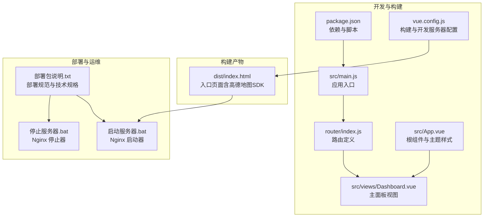
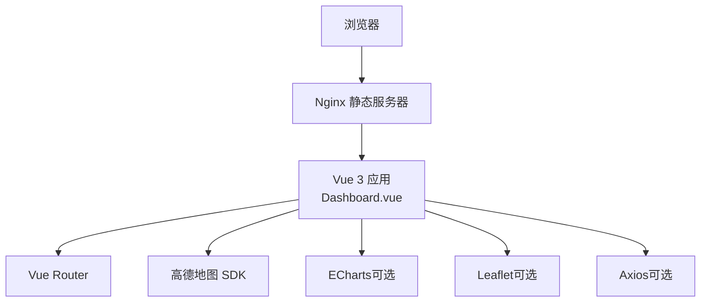
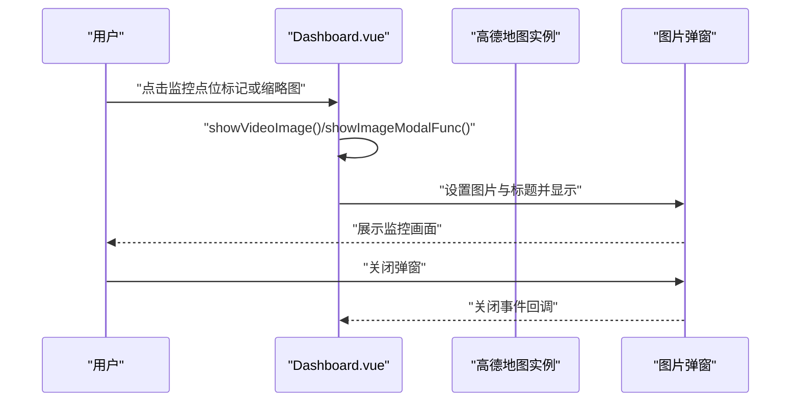
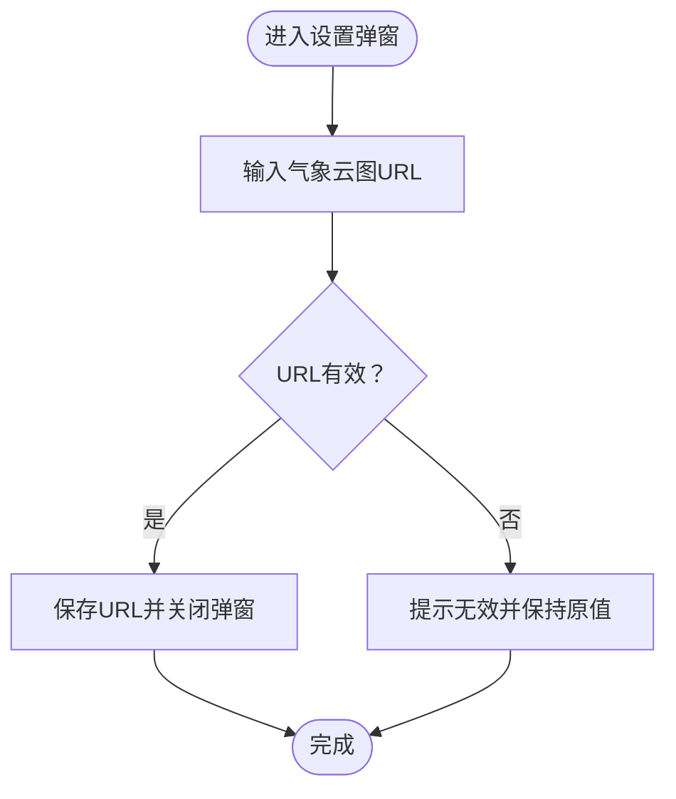
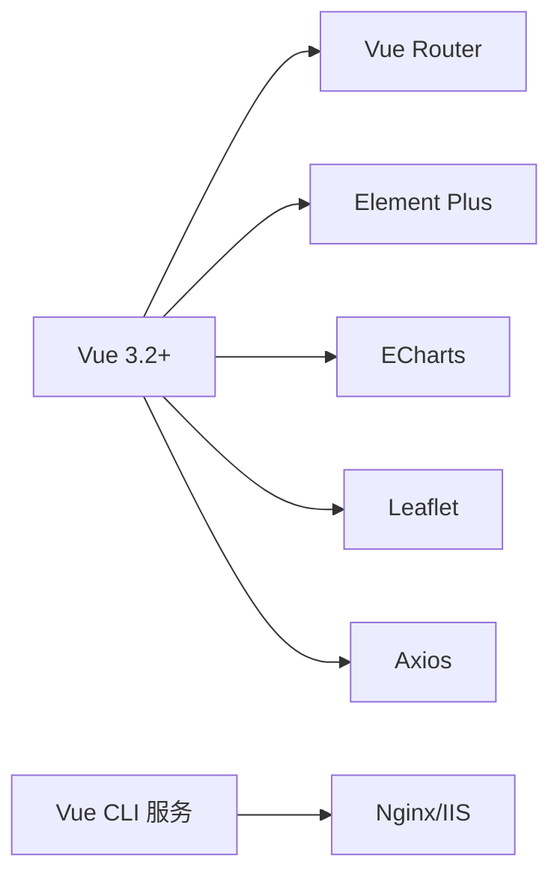

# 项目概述

<cite>
**本文引用的文件**
- [package.json](file://dashboard-app/package.json)
- [main.js](file://dashboard-app/src/main.js)
- [App.vue](file://dashboard-app/src/App.vue)
- [Dashboard.vue](file://dashboard-app/src/views/Dashboard.vue)
- [router/index.js](file://dashboard-app/src/router/index.js)
- [vue.config.js](file://dashboard-app/vue.config.js)
- [dist/index.html](file://dashboard-app/dist/index.html)
- [部署包说明.txt](file://部署包说明.txt)
- [启动服务器.bat](file://启动服务器.bat)
- [停止服务器.bat](file://停止服务器.bat)
</cite>

## 目录
1. [引言](#引言)
2. [项目结构](#项目结构)
3. [核心组件](#核心组件)
4. [架构总览](#架构总览)
5. [详细组件分析](#详细组件分析)
6. [依赖关系分析](#依赖关系分析)
7. [性能考虑](#性能考虑)
8. [故障排查指南](#故障排查指南)
9. [结论](#结论)
10. [附录](#附录)

## 引言
本项目是“宜川县域监测体系整合平台”，面向大屏展示场景，整合视频监控、视频会议、气象云图、应急资源分布与土壤墒情监测五大功能模块，统一在一个可视化仪表盘中呈现。平台强调科技蓝主题风格、4K超宽屏适配、实时数据更新与交互体验，并采用现代化前端技术栈实现高可维护性与可扩展性。

## 项目结构
项目采用 Vue 3 单页应用（SPA）架构，核心代码位于 dashboard-app 目录，包含源码、构建产物与部署包。生产环境通过静态 Web 服务器（如 Nginx）发布，配合批处理脚本实现一键启动/停止服务。

图表来源
- [package.json](file://dashboard-app/package.json#L1-L23)
- [main.js](file://dashboard-app/src/main.js#L1-L5)
- [router/index.js](file://dashboard-app/src/router/index.js#L1-L17)
- [App.vue](file://dashboard-app/src/App.vue#L1-L40)
- [Dashboard.vue](file://dashboard-app/src/views/Dashboard.vue#L1-L175)
- [vue.config.js](file://dashboard-app/vue.config.js#L1-L19)
- [dist/index.html](file://dashboard-app/dist/index.html#L1-L6)
- [部署包说明.txt](file://部署包说明.txt#L1-L61)
- [启动服务器.bat](file://启动服务器.bat#L1-L82)
- [停止服务器.bat](file://停止服务器.bat#L1-L52)

章节来源
- [package.json](file://dashboard-app/package.json#L1-L23)
- [vue.config.js](file://dashboard-app/vue.config.js#L1-L19)
- [部署包说明.txt](file://部署包说明.txt#L1-L61)

## 核心组件
- 应用入口与路由
  - 应用通过入口文件挂载根组件并注册路由；路由指向主面板视图。
- 根组件与主题样式
  - 根组件负责全局样式与科技蓝主题变量注入，奠定视觉基调。
- 主面板视图
  - 负责四大核心模块的布局与交互：视频监控墙、视频会议、气象云图、土壤墒情监测。
  - 内置时间显示、弹窗控制、地图初始化与数据模拟。

章节来源
- [main.js](file://dashboard-app/src/main.js#L1-L5)
- [router/index.js](file://dashboard-app/src/router/index.js#L1-L17)
- [App.vue](file://dashboard-app/src/App.vue#L13-L40)
- [Dashboard.vue](file://dashboard-app/src/views/Dashboard.vue#L1-L175)

## 架构总览
平台采用前后端分离的静态站点架构：前端使用 Vue 3 + Vue Router 构建 SPA，通过高德地图 SDK 实现地理可视化，借助 ECharts 与 Leaflet 进行图表与地图扩展（在当前代码中体现为高德地图集成），Element Plus 提供基础 UI 组件生态，axios 用于数据请求（当前示例中以静态数据为主）。构建阶段由 Vue CLI 驱动，开发服务器默认监听本地端口，生产构建输出至 dist 目录，配合 Nginx 部署。

图表来源
- [Dashboard.vue](file://dashboard-app/src/views/Dashboard.vue#L278-L420)
- [package.json](file://dashboard-app/package.json#L14-L22)
- [dist/index.html](file://dashboard-app/dist/index.html#L1-L6)

## 详细组件分析

### 视频监控墙模块
- 功能要点
  - 地图展示：基于高德地图初始化地图实例，添加县域边界、河流、水库与乡镇标注。
  - 标记交互：为监控点位添加标记，点击标记或缩略图可弹出监控画面。
  - 布局适配：固定模块宽度与横向滚动容器，适配 4K 超宽屏。
- 数据与状态
  - 模拟监控点位列表与地图标记数组，支持点击事件绑定与弹窗展示。
- 交互流程
  - 组件挂载时初始化地图与边界；用户点击标记或缩略图触发弹窗。

图表来源
- [Dashboard.vue](file://dashboard-app/src/views/Dashboard.vue#L267-L276)
- [Dashboard.vue](file://dashboard-app/src/views/Dashboard.vue#L422-L434)
- [Dashboard.vue](file://dashboard-app/src/views/Dashboard.vue#L283-L343)

章节来源
- [Dashboard.vue](file://dashboard-app/src/views/Dashboard.vue#L37-L51)
- [Dashboard.vue](file://dashboard-app/src/views/Dashboard.vue#L278-L420)

### 视频会议模块
- 功能要点
  - 主视频展示区占位图。
  - 参会单位滚动展示区：将单位列表按 3 行 × 2 列布局，实现横向滚动与分组展示。
- 交互与布局
  - 使用计算属性将一维列表转为二维网格，提升可读性与空间利用率。

章节来源
- [Dashboard.vue](file://dashboard-app/src/views/Dashboard.vue#L53-L72)
- [Dashboard.vue](file://dashboard-app/src/views/Dashboard.vue#L240-L254)

### 气象云图模块
- 功能要点
  - 支持嵌入外部气象云图链接（iframe），并提供设置弹窗进行 URL 配置。
  - 展示当前温度、湿度、风力、降雨与预警等基础数据。
- 安全与校验
  - 对输入的 URL 进行有效性校验，避免非法链接导致页面异常。

图表来源
- [Dashboard.vue](file://dashboard-app/src/views/Dashboard.vue#L452-L472)
- [Dashboard.vue](file://dashboard-app/src/views/Dashboard.vue#L80-L92)

章节来源
- [Dashboard.vue](file://dashboard-app/src/views/Dashboard.vue#L74-L92)
- [Dashboard.vue](file://dashboard-app/src/views/Dashboard.vue#L452-L482)

### 土壤墒情监测模块
- 功能要点
  - 提供地点选择器，支持切换不同乡镇的数据视图。
  - 展示多项指标卡片：氮、磷、钾、pH、电导率、土壤水分与温度。
  - 显示数据更新时间戳，体现实时性。
- 数据组织
  - 使用对象结构管理各项指标的数值与单位，便于统一渲染与扩展。

章节来源
- [Dashboard.vue](file://dashboard-app/src/views/Dashboard.vue#L94-L140)
- [Dashboard.vue](file://dashboard-app/src/views/Dashboard.vue#L218-L228)

### 主题与布局
- 科技蓝主题
  - 通过 CSS 变量定义主色调、背景、文字与边框颜色，统一全局视觉风格。
- 响应式与大屏适配
  - 页面采用固定模块宽度与横向滚动容器，适配 4K 超宽屏；滚动条样式与阴影增强沉浸感。
- 时间与状态
  - 顶部标题栏展示当前日期与天气信息，右侧提供“实时”“预警”“设置”等控制项。

章节来源
- [App.vue](file://dashboard-app/src/App.vue#L13-L40)
- [Dashboard.vue](file://dashboard-app/src/views/Dashboard.vue#L1-L32)
- [Dashboard.vue](file://dashboard-app/src/views/Dashboard.vue#L498-L727)

## 依赖关系分析
- 前端框架与生态
  - Vue 3.2+：提供响应式与组合式 API，支撑复杂交互逻辑。
  - Vue Router：实现单页路由导航，承载主面板视图。
  - Element Plus：提供常用 UI 组件，降低界面开发成本。
  - ECharts：用于图表渲染（当前代码中以地图为主，图表可扩展接入）。
  - Leaflet：地图库（当前代码中以高德地图为主，可替换或并行使用）。
  - Axios：HTTP 请求工具（当前示例以静态数据为主，可替换为真实接口）。
- 构建与开发
  - Vue CLI 服务：提供开发服务器、热重载与打包能力。
  - 开发服务器配置：端口、自动打开浏览器、覆盖警告/错误覆盖等。
- 部署与运维
  - 部署包包含 dist 与 public/images，支持 Nginx/IIS 静态托管。
  - 批处理脚本封装 Nginx 启停流程，便于运维操作。

图表来源
- [package.json](file://dashboard-app/package.json#L14-L22)
- [vue.config.js](file://dashboard-app/vue.config.js#L1-L19)

章节来源
- [package.json](file://dashboard-app/package.json#L1-L23)
- [vue.config.js](file://dashboard-app/vue.config.js#L1-L19)

## 性能考虑
- 大屏性能优化建议
  - 地图与 iframe 的懒加载策略，减少首屏渲染压力。
  - 模块横向滚动容器使用虚拟滚动（如第三方库）以降低 DOM 数量。
  - 图片资源压缩与 CDN 加速，缩短加载时间。
- 交互流畅性
  - 避免在 mounted 中执行大量同步计算；将耗时任务拆分为异步微任务。
  - 合理使用计算属性与缓存，减少重复渲染。
- 构建优化
  - 启用代码分割与按需加载，减小初始包体。
  - CSS 提取与内联策略根据实际运行环境调整。

## 故障排查指南
- 启动失败
  - 检查 Nginx 是否正确安装与配置；确认端口未被占用。
  - 确认 dist 与 public/images 目录完整，且路径一致。
- 地图无法显示
  - 检查网络连通性；确认高德地图 SDK 已正确引入。
  - 若更换地图服务，需同步修改地图初始化参数与标记样式。
- 气象云图不显示
  - 确认设置的 URL 有效且允许跨域；检查 iframe 安全策略。
- 数据不更新
  - 当前示例为静态数据；若接入真实后端，需实现轮询或 WebSocket 推送机制。
- 停止服务
  - 使用停止脚本优雅关闭 Nginx；若仍有残留进程，可手动结束。

章节来源
- [启动服务器.bat](file://启动服务器.bat#L20-L30)
- [停止服务器.bat](file://停止服务器.bat#L11-L21)
- [部署包说明.txt](file://部署包说明.txt#L46-L61)

## 结论
本项目以 Vue 3 为核心，结合高德地图、ECharts 与 Element Plus，构建了面向大屏的综合监测平台。通过科技蓝主题与 4K 超宽屏适配，满足县域治理对可视化与实时性的需求。当前版本聚焦于模块化布局与交互体验，后续可在数据接入、地图扩展与图表丰富度方面持续演进。

## 附录
- 部署与运维
  - 使用 Nginx/IIS 部署 dist 目录，确保默认文档为 index.html。
  - 通过启动/停止脚本快速管理服务生命周期。
- 浏览器与分辨率
  - 推荐 Chrome 90+/Edge 90+/Firefox 88+；支持 7680×1080（4K 超宽屏）自适应。

章节来源
- [部署包说明.txt](file://部署包说明.txt#L27-L61)
- [dist/index.html](file://dashboard-app/dist/index.html#L1-L6)