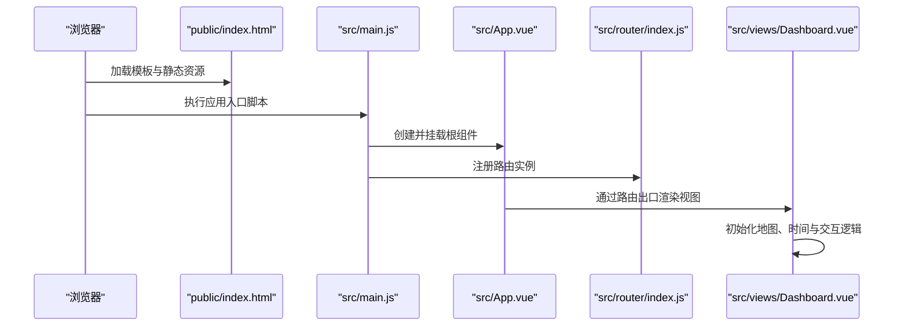
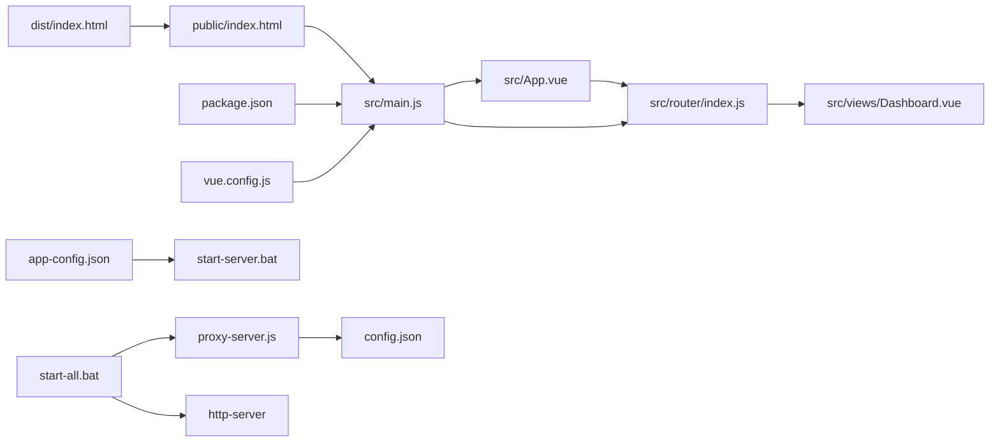
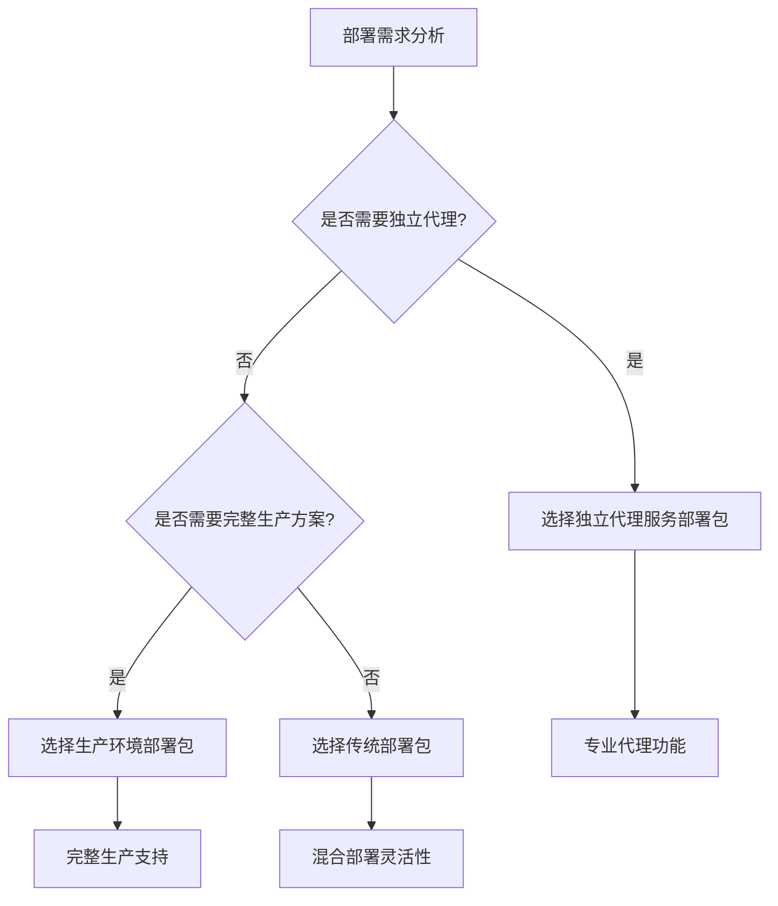

# 项目结构详解

<cite>
**本文档引用的文件**
- [package.json](file://dashboard-app/package.json)
- [vue.config.js](file://dashboard-app/vue.config.js)
- [main.js](file://dashboard-app/src/main.js)
- [App.vue](file://dashboard-app/src/App.vue)
- [router/index.js](file://dashboard-app/src/router/index.js)
- [views/Dashboard.vue](file://dashboard-app/src/views/Dashboard.vue)
- [public/index.html](file://dashboard-app/public/index.html)
- [dist/index.html](file://dashboard-app/dist/index.html)
- [代理服务部署包/部署说明.txt](file://代理服务部署包/部署说明.txt)
- [代理服务部署包/config.json](file://代理服务部署包/config.json)
- [代理服务部署包/proxy-server.js](file://代理服务部署包/proxy-server.js)
- [yichuan-dashboard-production-deployment/docs/deployment-guide.txt](file://yichuan-dashboard-production-deployment/docs/deployment-guide.txt)
- [yichuan-dashboard-production-deployment/config/app-config.json](file://yichuan-dashboard-production-deployment/config/app-config.json)
- [部署包/部署包说明.txt](file://部署包/部署包说明.txt)
- [部署包/部署文档.md](file://部署包/部署文档.md)
- [部署包/config.json](file://部署包/config.json)
- [部署包/启动脚本/start-all.bat](file://部署包/启动脚本/start-all.bat)
- [yichuan-dashboard-production-deployment/scripts/start-server.bat](file://yichuan-dashboard-production-deployment/scripts/start-server.bat)
</cite>

## 更新摘要
**变更内容**
- 新增独立代理服务部署包的详细说明和架构分析
- 新增生产环境部署包的完整部署指南
- 新增三种不同部署包的对比分析和选择指导
- 更新部署流程图以反映新的模块化部署架构
- 新增代理服务器的技术实现细节和配置说明

## 目录
1. [简介](#简介)
2. [项目结构概览](#项目结构概览)
3. [核心组件分析](#核心组件分析)
4. [架构总览](#架构总览)
5. [部署包架构分析](#部署包架构分析)
6. [详细组件分析](#详细组件分析)
7. [依赖关系分析](#依赖关系分析)
8. [部署包对比与选择](#部署包对比与选择)
9. [性能考虑](#性能考虑)
10. [故障排除指南](#故障排除指南)
11. [结论](#结论)

## 简介
本文件面向开发者与运维人员，系统性解析"宜川县域监测体系整合平台"的完整项目结构，重点聚焦 dashboard-app 目录下的组织方式与实现原理。随着项目的演进，现已形成三种不同的部署包架构：独立代理服务部署包、生产环境部署包和传统部署包。文档从目录职责、核心文件功能、构建配置到模块化组织原则进行逐层拆解，并提供可视化图表帮助快速定位关键流程与依赖关系。

## 项目结构概览
项目现已发展为多层次的部署架构，包含三个主要部署包：
- **dashboard-app**：Vue 3 单页应用源代码，采用 Vue CLI 构建工具链
- **代理服务部署包**：独立的 Node.js 代理服务器，专门处理认证和跨域问题
- **生产环境部署包**：完整的生产级部署解决方案，包含静态资源和启动脚本

```mermaid
graph TB
subgraph "核心应用层"
DASHBOARD_APP["dashboard-app<br/>Vue 3 应用"]
ENDPOINT["public/index.html<br/>静态模板"]
ASSETS["src/assets<br/>资源文件"]
COMPONENTS["src/components<br/>通用组件"]
VIEWS["src/views<br/>页面视图"]
ROUTER["src/router<br/>路由配置"]
END
subgraph "代理服务层"
PROXY_PKG["代理服务部署包<br/>独立代理服务器"]
PROXY_CONFIG["config.json<br/>认证配置"]
PROXY_SERVER["proxy-server.js<br/>代理逻辑"]
END
subgraph "生产部署层"
PRODUCTION_PKG["生产环境部署包<br/>完整部署方案"]
START_SCRIPTS["scripts/<br/>启动脚本"]
DIST_FILES["dist/<br/>静态资源"]
APP_CONFIG["config/app-config.json<br/>应用配置"]
END
subgraph "传统部署包"
TRADITIONAL_PKG["部署包<br/>混合部署方案"]
ALL_SCRIPTS["启动脚本/<br/>一键启动"]
END
```

**图表来源**
- [dashboard-app/package.json:1-23](file://dashboard-app/package.json#L1-L23)
- [代理服务部署包/部署说明.txt:1-112](file://代理服务部署包/部署说明.txt#L1-L112)
- [yichuan-dashboard-production-deployment/docs/deployment-guide.txt:1-108](file://yichuan-dashboard-production-deployment/docs/deployment-guide.txt#L1-L108)

## 核心组件分析
本节聚焦于应用启动与路由层面的关键文件，阐明它们如何协同完成页面渲染与导航。

- **应用入口 main.js**
  - 负责创建 Vue 应用实例，挂载根组件 App.vue，并注册路由
  - 作为运行时控制流的起点，串联起后续的组件树与路由匹配
  - 参考路径：[应用入口:1-5](file://dashboard-app/src/main.js#L1-L5)

- **根组件 App.vue**
  - 顶层容器，内部仅包含路由出口，用于承载各视图组件
  - 定义科技蓝主题的 CSS 变量与全局样式，统一界面风格
  - 参考路径：[根组件:1-40](file://dashboard-app/src/App.vue#L1-L40)

- **路由配置 router/index.js**
  - 使用 History 模式定义默认路由 '/'，指向 Dashboard 视图
  - 为后续扩展多页面提供清晰的路由基线
  - 参考路径：[路由配置:1-17](file://dashboard-app/src/router/index.js#L1-L17)

- **视图组件 views/Dashboard.vue**
  - 主面板视图，包含标题栏、模块化区域（视频监控墙、视频会议、气象云图、土壤墒情监测等）
  - 内置地图初始化、时间同步、弹窗交互与设置功能
  - 参考路径：[主面板视图:1-1309](file://dashboard-app/src/views/Dashboard.vue#L1-L1309)

**章节来源**
- [main.js:1-5](file://dashboard-app/src/main.js#L1-L5)
- [App.vue:1-40](file://dashboard-app/src/App.vue#L1-L40)
- [router/index.js:1-17](file://dashboard-app/src/router/index.js#L1-L17)
- [views/Dashboard.vue:1-1309](file://dashboard-app/src/views/Dashboard.vue#L1-L1309)

## 架构总览
下图展示了从浏览器加载到页面渲染的关键调用序列，体现入口、路由与视图之间的协作关系：



**图表来源**
- [public/index.html:1-27](file://dashboard-app/public/index.html#L1-L27)
- [main.js:1-5](file://dashboard-app/src/main.js#L1-L5)
- [App.vue:1-40](file://dashboard-app/src/App.vue#L1-L40)
- [router/index.js:1-17](file://dashboard-app/src/router/index.js#L1-L17)
- [views/Dashboard.vue:1-1309](file://dashboard-app/src/views/Dashboard.vue#L1-L1309)

## 部署包架构分析

### 独立代理服务部署包
**新增** 独立代理服务部署包提供了专门的认证代理功能，解决了跨域和认证问题。

- **核心功能**
  - 代理访问后端水利平台，自动添加认证Cookie和Token
  - 解决跨域和iframe嵌入限制
  - 移除X-Frame-Options安全头，支持嵌入式访问
  - 提供健康检查和代理页面访问

- **技术实现**
  - 基于 Express.js 和 http-proxy-middleware
  - 支持多种代理路径映射
  - 配置文件驱动的灵活部署

- **部署优势**
  - 与主应用完全解耦
  - 可独立升级和维护
  - 更好的安全隔离

**章节来源**
- [代理服务部署包/部署说明.txt:1-112](file://代理服务部署包/部署说明.txt#L1-L112)
- [代理服务部署包/proxy-server.js:1-149](file://代理服务部署包/proxy-server.js#L1-L149)

### 生产环境部署包
**新增** 生产环境部署包提供了完整的生产级部署解决方案。

- **系统配置**
  - 支持6720×1260像素超高清分辨率
  - 预配置的模块布局和显示参数
  - 优化的性能配置和刷新机制

- **部署特点**
  - 包含完整的静态资源和配置文件
  - 提供一键启动脚本
  - 详细的部署文档和技术支持

**章节来源**
- [yichuan-dashboard-production-deployment/docs/deployment-guide.txt:1-108](file://yichuan-dashboard-production-deployment/docs/deployment-guide.txt#L1-L108)
- [yichuan-dashboard-production-deployment/config/app-config.json:1-53](file://yichuan-dashboard-production-deployment/config/app-config.json#L1-L53)

### 传统部署包
**更新** 传统部署包现在作为混合部署方案，同时包含代理服务和静态资源。

- **混合架构**
  - 同时提供代理服务器和HTTP服务器
  - 支持一键启动所有服务
  - 最小化部署要求

- **部署灵活性**
  - 支持分别启动代理和HTTP服务
  - 提供多种启动方式
  - 适配不同的部署场景

**章节来源**
- [部署包/部署包说明.txt:1-120](file://部署包/部署包说明.txt#L1-L120)
- [部署包/部署文档.md:1-300](file://部署包/部署文档.md#L1-L300)

## 详细组件分析

### 构建配置 vue.config.js
该文件定义了开发服务器、CSS 提取策略与依赖编译选项，直接影响本地调试体验与生产构建行为：
- **transpileDependencies: true**
  - 允许对第三方依赖进行转译，提升兼容性
- **devServer配置**
  - host: 'localhost'
  - port: 8080
  - open: true
  - client.overlay: 显示错误覆盖层，便于快速定位问题
- **css.extract: false**
  - 生产环境不单独提取 CSS，内联到 JS 中，减少请求开销但可能影响缓存粒度

参考路径：[构建配置:1-19](file://dashboard-app/vue.config.js#L1-L19)

**章节来源**
- [vue.config.js:1-19](file://dashboard-app/vue.config.js#L1-L19)

### 依赖与脚本 package.json
- **scripts**
  - serve: 启动开发服务器
  - build: 打包生产版本
  - lint: 代码质量检查
- **依赖**
  - vue: 框架核心
  - vue-router: 路由管理
  - @vue/cli-service: 构建服务
  - echarts: 图表库
  - leaflet: 地图库（与高德地图并存，可按需取舍）
  - axios: HTTP 请求
  - element-plus: UI 组件库

参考路径：[依赖与脚本:1-23](file://dashboard-app/package.json#L1-L23)

**章节来源**
- [package.json:1-23](file://dashboard-app/package.json#L1-L23)

### 静态模板 public/index.html
- 作为构建注入的模板，负责注入构建产物与全局样式
- 引入高德地图 SDK 并设置基础样式，保证地图容器可用
- 包含 noscript 提示，强调应用对 JavaScript 的依赖

参考路径：[静态模板:1-27](file://dashboard-app/public/index.html#L1-L27)

**章节来源**
- [public/index.html:1-27](file://dashboard-app/public/index.html#L1-L27)

### 构建产物 dist/index.html
- 由构建工具生成，自动注入 vendor 与 app 脚本
- 与 public/index.html 结构一致，但已内联资源路径

参考路径：[构建产物:1-6](file://dashboard-app/dist/index.html#L1-L6)

**章节来源**
- [dist/index.html:1-6](file://dashboard-app/dist/index.html#L1-L6)

### 视图组件 views/Dashboard.vue
- **页面结构**
  - 顶部标题栏：包含日期天气、平台标题与系统控制项
  - 四大模块区域：视频监控墙、视频会议、气象云图、土壤墒情监测
  - 弹窗与设置：图片预览弹窗、气象云图 URL 设置弹窗
- **交互与状态**
  - 地图初始化与标记添加（高德地图）
  - 实时时间更新与定时器清理
  - 下拉选择器与数据展示网格
- **样式组织**
  - 使用 scoped 样式隔离模块边界
  - 通过 CSS 变量与渐变背景统一视觉风格

参考路径：[主面板视图:1-1309](file://dashboard-app/src/views/Dashboard.vue#L1-L1309)

**章节来源**
- [views/Dashboard.vue:1-1309](file://dashboard-app/src/views/Dashboard.vue#L1-L1309)

### 路由与导航
- 默认路由 '/' 直接映射到 Dashboard 视图
- History 模式提供更干净的 URL，适合单页应用场景
- 可扩展性：新增页面只需在路由中注册新条目并创建对应视图

参考路径：[路由配置:1-17](file://dashboard-app/src/router/index.js#L1-L17)

**章节来源**
- [router/index.js:1-17](file://dashboard-app/src/router/index.js#L1-L17)

### 根组件与应用入口
- App.vue 仅包含一个路由出口，保持顶层简洁
- main.js 负责实例化应用、注册路由并挂载到 DOM

参考路径：
- [根组件:1-40](file://dashboard-app/src/App.vue#L1-L40)
- [应用入口:1-5](file://dashboard-app/src/main.js#L1-L5)

**章节来源**
- [App.vue:1-40](file://dashboard-app/src/App.vue#L1-L40)
- [main.js:1-5](file://dashboard-app/src/main.js#L1-L5)

### 代理服务器技术实现
**新增** 代理服务器是独立部署包的核心组件，提供专业的认证和跨域解决方案。

- **核心功能**
  - 自动添加认证头：Authorization 和 Cookie
  - 路径重写：/dp/* → 目标服务器/dp/*，/api/* → 目标服务器/prod-api/*
  - CORS配置：允许指定来源的跨域访问
  - iframe支持：移除X-Frame-Options和Content-Security-Policy限制

- **配置管理**
  - 动态加载config.json配置文件
  - 支持默认配置回退机制
  - 灵活的目标服务器和端口配置

- **错误处理**
  - 完善的代理错误捕获和日志记录
  - 健康检查端点提供服务状态监控
  - 详细的请求响应日志

**章节来源**
- [代理服务部署包/proxy-server.js:1-149](file://代理服务部署包/proxy-server.js#L1-L149)
- [代理服务部署包/config.json:1-14](file://代理服务部署包/config.json#L1-L14)

## 依赖关系分析
下图展示关键文件间的依赖关系与调用方向，帮助理解模块耦合与职责边界：



**图表来源**
- [main.js:1-5](file://dashboard-app/src/main.js#L1-L5)
- [App.vue:1-40](file://dashboard-app/src/App.vue#L1-L40)
- [router/index.js:1-17](file://dashboard-app/src/router/index.js#L1-L17)
- [views/Dashboard.vue:1-1309](file://dashboard-app/src/views/Dashboard.vue#L1-L1309)
- [public/index.html:1-27](file://dashboard-app/public/index.html#L1-L27)
- [dist/index.html:1-6](file://dashboard-app/dist/index.html#L1-L6)
- [package.json:1-23](file://dashboard-app/package.json#L1-L23)
- [vue.config.js:1-19](file://dashboard-app/vue.config.js#L1-L19)
- [代理服务部署包/proxy-server.js:1-149](file://代理服务部署包/proxy-server.js#L1-L149)
- [yichuan-dashboard-production-deployment/config/app-config.json:1-53](file://yichuan-dashboard-production-deployment/config/app-config.json#L1-L53)

**章节来源**
- [main.js:1-5](file://dashboard-app/src/main.js#L1-L5)
- [router/index.js:1-17](file://dashboard-app/src/router/index.js#L1-L17)
- [views/Dashboard.vue:1-1309](file://dashboard-app/src/views/Dashboard.vue#L1-L1309)
- [public/index.html:1-27](file://dashboard-app/public/index.html#L1-L27)
- [dist/index.html:1-6](file://dashboard-app/dist/index.html#L1-L6)
- [package.json:1-23](file://dashboard-app/package.json#L1-L23)
- [vue.config.js:1-19](file://dashboard-app/vue.config.js#L1-L19)

## 部署包对比与选择

### 三种部署包的详细对比

| 特性 | 独立代理服务部署包 | 生产环境部署包 | 传统部署包 |
|------|-------------------|----------------|------------|
| **架构** | 独立代理服务器 | 完整生产方案 | 混合部署 |
| **端口** | 3001 | 8080 | 3001/8080 |
| **认证** | 专业代理 | 静态资源 | 代理+静态 |
| **跨域** | 完全解决 | 服务器支持 | 代理解决 |
| **iframe** | 支持嵌入 | 服务器支持 | 代理支持 |
| **配置** | config.json | app-config.json | config.json |
| **启动** | start-proxy.bat | start-server.bat | start-all.bat |
| **适用场景** | 需要独立代理 | 生产环境部署 | 开发测试 |

### 部署包选择指导

**选择独立代理服务部署包当**：
- 需要专门的认证代理功能
- 要求与主应用完全解耦
- 需要更好的安全隔离
- 预计未来需要独立升级

**选择生产环境部署包当**：
- 需要完整的生产级部署
- 要求超高清分辨率支持
- 需要预配置的模块布局
- 希望获得完整的技术支持

**选择传统部署包当**：
- 需要混合部署方案
- 希望使用一键启动
- 需要灵活的部署方式
- 要求最小化部署要求



**图表来源**
- [代理服务部署包/部署说明.txt:1-112](file://代理服务部署包/部署说明.txt#L1-L112)
- [yichuan-dashboard-production-deployment/docs/deployment-guide.txt:1-108](file://yichuan-dashboard-production-deployment/docs/deployment-guide.txt#L1-L108)
- [部署包/部署包说明.txt:1-120](file://部署包/部署包说明.txt#L1-L120)

## 性能考虑
- **构建配置**
  - css.extract: false 可减少网络请求数，但会降低 CSS 缓存命中率；如需更强缓存可考虑开启提取
  - devServer.overlay 仅在开发阶段启用，避免生产环境干扰
- **资源加载**
  - 高德地图 SDK 在模板中直接引入，建议在生产环境评估按需加载或 CDN 优化
- **组件渲染**
  - Dashboard 模块较多且包含地图初始化，建议在 mounted 生命周期中进行必要的节流与懒加载
- **依赖体积**
  - element-plus、echarts、leaflet 等库较大，建议结合实际功能按需裁剪或动态导入
- **代理服务器性能**
  - 代理服务器应配置适当的超时和重试机制
  - 建议监控代理服务器的内存使用和并发连接数
- **生产环境优化**
  - 生产环境部署包针对6720×1260分辨率进行了优化
  - 建议在实际硬件上测试性能表现

## 故障排除指南
- **开发服务器无法访问**
  - 检查 devServer.host/port 是否被占用，确认端口开放
  - 查看 overlay 错误提示，定位具体报错位置
- **地图不显示**
  - 确认高德地图密钥有效与网络可达
  - 检查地图容器尺寸与初始化参数
- **路由跳转无效**
  - 确认路由配置正确，History 模式下服务器需支持前端回退
- **构建产物异常**
  - 检查 public/index.html 是否被意外修改
  - 确认 vue.config.js 中的路径与资源引用一致
- **代理服务器问题**
  - 检查config.json配置是否正确
  - 确认目标服务器可达性和认证信息有效
  - 查看代理服务器日志输出
- **生产环境问题**
  - 检查分辨率配置是否匹配实际硬件
  - 确认静态资源路径和权限设置
  - 验证模块布局配置的合理性

## 结论
项目现已发展为成熟的多层次部署架构，提供了灵活的选择方案以满足不同的部署需求。独立代理服务部署包、生产环境部署包和传统部署包各有特色，开发者可以根据具体需求选择最适合的部署方案。

dashboard-app 采用清晰的三层结构（入口、路由、视图）与标准的 Vue 3 生态，配合高德地图与 UI 组件库实现了县域监测的可视化需求。通过合理的构建配置与模块化组织，项目具备良好的可维护性与扩展性。

**新增的部署包架构**进一步提升了系统的灵活性和可维护性：
- 独立代理服务部署包提供了专业的认证代理功能
- 生产环境部署包确保了完整的生产级支持
- 传统部署包保持了部署的灵活性和便捷性

建议在后续迭代中进一步细化样式与资源管理策略，以获得更优的性能与用户体验。同时，根据实际部署场景选择合适的部署包，以最大化发挥系统的功能和性能优势。